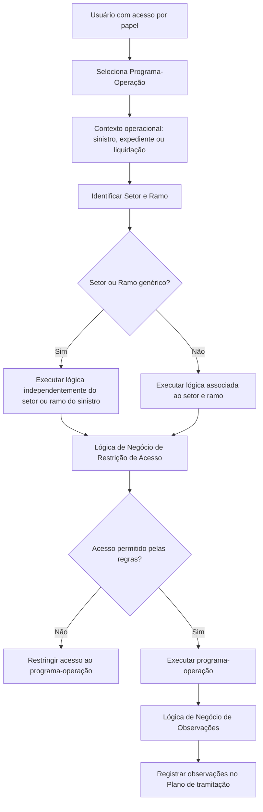

# Definição de Restrições e Observações do Plano por Programa

## 1. Metadados do Documento
- **Arquivo de Origem:** Não identificado no conteúdo extraído
- **Tipo de Documento:** Especificação Técnica / Procedimento Funcional
- **Domínio / Sistema:** Plano de tramitação, sinistro e expediente
- **Público-Alvo:** Desenvolvedores, analistas funcionais e equipes de operação/tramitação
- **Data/Versão Identificada:** Não identificada

---

## 2. Resumo Executivo & Contexto de Negócio

O documento descreve o mecanismo de **Restrições e Observações do Plano por Programa**, utilizado para controlar o acesso a programas ou operações por meio de lógica de negócio. O controle complementa a autorização baseada em papéis: mesmo que um usuário possua acesso a determinado programa em razão do seu papel, regras adicionais podem impedir a execução conforme os dados tratados.

As restrições podem ser associadas a combinações de **setor** e **ramo**, permitindo que a lógica de negócio seja aplicada especificamente ao contexto do sinistro. Alternativamente, podem ser usados valores genéricos de setor ou ramo para que as lógicas sejam executadas independentemente dessas classificações.

Além de restringir acessos, a funcionalidade permite registrar observações no **Plano de tramitação** sempre que um programa ou operação for executado. As observações também são definidas por uma lógica de negócio associada ao programa-operação e podem registrar indicações sobre as ações realizadas.

O exemplo funcional explicitamente apresentado é a restrição de liquidação de um expediente: somente o tramitador responsável pelo expediente pode liquidá-lo. O documento não detalha a interface de manutenção, os formatos das regras de negócio, contratos técnicos, mecanismos de persistência ou métodos de integração.

---

## 3. Arquitetura, Componentes & Tecnologias Envolvidas

### Componentes e conceitos identificados

| Componente / Conceito | Função identificada no documento |
| :--- | :--- |
| Manutenção de Restrições e Observações do Plano por Programa | Configuração de lógicas de negócio vinculadas a setor, ramo e programa-operação. |
| Setor | Chave usada para associar lógicas de negócio de acesso ou gravações no plano. |
| Ramo | Chave usada para associar lógicas de negócio de acesso ou gravações no plano. |
| Programa-Operação | Programa ou operação para o qual são definidas regras de acesso ou observações no Plano de tramitação. |
| Lógica de Negócio de Restrição de Acesso ao Programa | Regras executadas no acesso ao programa após o ingresso de informações como sinistro, sinistro e expediente, ou liquidação. |
| Lógica de Negócio de Observações no Plano de tramitação | Lógica que define observações registradas no Plano de tramitação quando o programa ou operação é executado. |
| Sinistro | Contexto de dados citado como entrada para a execução das regras de restrição. |
| Expediente | Entidade citada no contexto de acesso e liquidação. |
| Liquidação | Operação citada como programa-operação e como exemplo de acesso restrito. |
| Tramitador responsável | Perfil funcional citado como elegível para liquidar um expediente no exemplo apresentado. |



> **Nota de Análise:** O documento descreve relações funcionais entre programa-operação, setor, ramo, regras de acesso e observações. Não informa tecnologias, microsserviços, banco de dados, URLs, APIs, protocolos, versões ou ambientes.

---

## 4. Regras de Negócio, Especificações Funcionais & Processos

### 4.1 Finalidade das restrições de acesso

1. O acesso a programas pode ser restringido por lógica de negócio.
2. A restrição é aplicada quando o controle baseado somente no papel do usuário não é suficiente.
3. Um usuário pode possuir acesso a um programa por seu papel e, ainda assim, ter o acesso restrito devido aos dados que serão tratados.
4. A restrição pode variar conforme o setor e o ramo.
5. A lógica de restrição é executada ao acessar o programa depois do ingresso do contexto operacional, citado como sinistro, sinistro e expediente, liquidação ou situações equivalentes indicadas por “etc.”.

### 4.2 Associação de lógica de negócio por setor

1. A propriedade **Setor** representa a chave do setor ao qual será associada uma lógica de negócio.
2. A lógica associada ao setor pode ser:
   - Uma lógica de negócio para acesso ao programa cadastrado.
   - Uma lógica de negócio para gravações no plano.
3. Pode ser utilizado o **setor genérico**.
4. O setor genérico determina que as lógicas sejam disparadas independentemente do setor do sinistro.

### 4.3 Associação de lógica de negócio por ramo

1. A propriedade **Ramo** representa a chave do ramo ao qual será associada uma lógica de negócio.
2. A lógica associada ao ramo pode ser:
   - Uma lógica de negócio para acesso ao programa cadastrado.
   - Uma lógica de negócio para gravações no plano.
3. Pode ser utilizado o **ramo genérico**.
4. O ramo genérico determina que as lógicas sejam disparadas independentemente do ramo do sinistro.

### 4.4 Programa-operação abrangido

A propriedade **Programa-Operação** identifica o programa ou a operação para os quais serão definidas:

- Regras de acesso ao programa.
- Lógica que cria observações no Plano de tramitação a cada execução.

Exemplos de programa-operação citados:

- Plano de tramitação.
- Valoração do expediente.
- Mudança de valoração.
- Liquidação.

### 4.5 Lógica de negócio para restrição de acesso

1. A lógica de negócio de restrição contém regras executadas no momento de acesso ao programa.
2. A execução ocorre após o ingresso de informações do contexto operacional.
3. A finalidade é restringir o acesso ao programa-operação de acordo com as regras definidas.
4. Exemplo apresentado: somente o tramitador responsável pelo expediente poderá liquidar o expediente.

### 4.6 Lógica de negócio para observações no Plano de tramitação

1. A lógica de negócio de observações define quais observações devem ser registradas no Plano de tramitação.
2. As observações são registradas toda vez que o programa ou a operação configurada é executado.
3. As observações podem registrar indicações sobre o que foi realizado pelo programa.

> **Nota de Análise:** O documento não especifica a sintaxe da lógica de negócio, a precedência entre regras de setor e ramo, o comportamento quando uma regra falha, nem os campos exatos que compõem uma observação no Plano de tramitação.

---

## 5. Tabelas de Parâmetros, Ambientes e Estruturas de Dados

| Item / Parâmetro | Descrição / Função | Tipo / Valores / Formato | Ambiente / Observações |
| :--- | :--- | :--- | :--- |
| Setor | Chave do setor associada à lógica de negócio de acesso ao programa ou de gravações no plano. | Chave de setor; setor genérico também é permitido. | O setor genérico executa lógicas independentemente do setor do sinistro. |
| Ramo | Chave do ramo associada à lógica de negócio de acesso ao programa ou de gravações no plano. | Chave de ramo; ramo genérico também é permitido. | O ramo genérico executa lógicas independentemente do ramo do sinistro. |
| Programa-Operação | Programa ou operação alvo das regras de acesso ou da criação de observações. | Exemplos: Plano de tramitação, Valoração do expediente, Mudança de valoração, Liquidação. | O documento também usa “etc.”, sem enumerar todas as operações disponíveis. |
| Lógica de Negócio de Restrição de Acesso ao Programa | Define as regras executadas para controlar acesso ao programa. | Lógica de negócio; formato não detalhado. | Executada após o ingresso de contexto como sinistro, sinistro e expediente ou liquidação. |
| Lógica de Negócio de Observações no Plano de tramitação | Define observações a registrar quando o programa-operação é executado. | Lógica de negócio; formato não detalhado. | Registra observações no Plano de tramitação. |
| Sinistro | Dado de contexto citado para execução das regras. | Não detalhado. | Pode determinar a aplicação de lógicas associadas a setor e ramo. |
| Expediente | Entidade de negócio citada em operações e no exemplo de liquidação. | Não detalhado. | O tramitador responsável pelo expediente é citado como condição de autorização para liquidação. |
| Tramitador responsável | Responsável pelo expediente no exemplo de regra de liquidação. | Papel funcional; critérios de atribuição não detalhados. | Apenas o tramitador responsável pode liquidar o expediente, conforme o exemplo. |

> **Nota de Análise:** O conteúdo não apresenta servidores, ambientes, rotas de logs, URLs, credenciais, variáveis de configuração, portas, APIs ou estruturas JSON/XML.

---

## 6. Bateria de Perguntas & Respostas para RAG (FAQ Sintético)

### P1: Qual é a finalidade das Restrições e Observações do Plano por Programa?
**R:** A funcionalidade permite restringir o acesso a programas por lógica de negócio e definir observações a serem registradas no Plano de tramitação quando um programa ou operação é executado.

### P2: Quando uma restrição de acesso deve ser utilizada além do controle por papel?
**R:** A restrição deve ser utilizada quando o papel do usuário concede acesso ao programa, mas é necessário limitar esse acesso devido aos dados que serão tratados.

### P3: As regras de acesso podem variar por contexto de negócio?
**R:** Sim. O documento informa que a restrição pode ser diferente por setor e por ramo.

### P4: O que representa a propriedade Setor?
**R:** Setor representa a chave do setor à qual será associada uma lógica de negócio para acesso ao programa cadastrado ou para gravações no Plano de tramitação.

### P5: O que acontece ao utilizar o setor genérico?
**R:** O setor genérico determina que as lógicas associadas sejam executadas independentemente do setor do sinistro.

### P6: O que representa a propriedade Ramo?
**R:** Ramo representa a chave do ramo à qual será associada uma lógica de negócio para controlar o acesso ao programa ou para registrar gravações no plano.

### P7: O que acontece ao utilizar o ramo genérico?
**R:** O ramo genérico determina que as lógicas sejam executadas independentemente do ramo do sinistro.

### P8: Quais operações podem ser configuradas na propriedade Programa-Operação?
**R:** O documento cita como exemplos o Plano de tramitação, a Valoração do expediente, a Mudança de valoração e a Liquidação. A lista não é declarada como exaustiva.

### P9: Quando a lógica de negócio de restrição de acesso é executada?
**R:** A lógica é executada quando o usuário acessa o programa, após o ingresso de dados de contexto como sinistro, sinistro e expediente, liquidação ou outros contextos indicados no documento.

### P10: Qual é o exemplo de regra de restrição apresentado para liquidação?
**R:** O exemplo estabelece que somente o tramitador responsável pelo expediente poderá liquidar esse expediente.

### P11: Qual é a finalidade da lógica de negócio de observações?
**R:** A lógica de negócio de observações define quais observações devem ser registradas no Plano de tramitação cada vez que o programa ou operação configurada for executado.

### P12: O documento informa os métodos HTTP ou contratos de API dos programas?
**R:** Não. O documento apresenta uma descrição funcional de regras de acesso e observações, mas não detalha métodos HTTP, contratos JSON, endpoints, serviços, tecnologias ou integrações técnicas.

---

## 7. Glossário de Termos, Siglas & Conceitos-Chave

- **Plano de tramitação:** Plano no qual podem ser gravadas observações quando um programa ou operação é executado.
- **Programa-Operação:** Propriedade que identifica o programa ou a operação para a qual serão configuradas restrições de acesso ou observações.
- **Setor:** Chave de classificação utilizada para associar lógicas de negócio.
- **Setor genérico:** Opção que permite executar lógicas independentemente do setor do sinistro.
- **Ramo:** Chave de classificação utilizada para associar lógicas de negócio.
- **Ramo genérico:** Opção que permite executar lógicas independentemente do ramo do sinistro.
- **Lógica de Negócio de Restrição de Acesso ao Programa:** Regras executadas para controlar o acesso a um programa-operação.
- **Lógica de Negócio de Observações no Plano de tramitação:** Regras que definem observações registradas no Plano de tramitação após a execução de um programa-operação.
- **Sinistro:** Contexto operacional citado para a aplicação de regras.
- **Expediente:** Entidade citada nos processos de valoração e liquidação.
- **Liquidação:** Operação citada como possível programa-operação e como exemplo de acesso restrito.
- **Tramitador responsável:** Responsável pelo expediente, citado como autorizado a liquidá-lo no exemplo apresentado.

---

## 8. Notas Críticas, Riscos & Limitações

- O documento não informa o nome do arquivo de origem, data, versão, autoria ou sistema corporativo específico.
- Não há detalhamento do formato, da linguagem, da modelagem ou do mecanismo de execução das lógicas de negócio.
- Não são definidos critérios de precedência quando existirem regras simultâneas de setor, ramo, setor genérico e ramo genérico.
- O documento não especifica o comportamento em caso de ausência de regra, erro de execução da lógica ou conflito entre regras.
- Não são apresentados mecanismos de auditoria, rastreabilidade, logs, perfis, permissões técnicas ou trilhas de aprovação.
- Não há contratos de integração, endpoints, APIs, métodos HTTP, estruturas de dados, tecnologias, ambientes ou URLs.
- A palavra “observaciones” é apresentada como informação a registrar no Plano de tramitação, mas sua estrutura, campos, persistência e regras de atualização não são detalhadas.

---

## 9. Conteúdo Bruto Estruturado (Referência Fiel)

```text
--- [PÁGINA 1 DE 3] ---

DEFINICIÓN Restricciones y Observaciones del
plan por programa
Objetivo
La finalidad de este documento, es explicar como poder acotar el acceso a los programas mediante
una lógica de Negocio y como definir mediante lógica de negocio las observaciones que se quieren
incluir en el plan cada vez que se ejecute el Programa.
El restringir el acceso se utiliza cuando no es suficiente con el rol, el usuario por su rol, tiene acceso
al programa, pero se quiere restringir dicho acceso por los datos que se van a tratar.
Esta restricción puede ser diferente por sector y por ramo.
También se va a poder determinar mediante una lógica de Negocio, si al ejecutar el programa desde
el Plan de tramitación se quiere dejar en las observaciones, unas indicaciones de lo que ha realizado
dicho programa.
Imagen del Mantenimiento Restricciones y Observaciones del plan por programa:
Ejemplo:
 /
 CF
Home Solutions APIs Documentation Zeus
EN


--- [PÁGINA 2 DE 3] ---

Propiedades
Sector
Esta propiedad indica la clave del Sector al que se le va asociar una lógica de Negocio para acceder
al programa que estamos dando de alta o una Lógica de Negocio para sus grabaciones en el plan.
Puede utilizarse el sector genérico que indicará que las lógicas serán lanzadas independientemente
del sector del siniestro.
Ramo
Esta propiedad indica la clave del Ramo al que se le va asociar una lógica de Negocio para acceder
al programa que estamos dando de alta o una Lógica de Negocio para sus grabaciones en el plan.
Puede utilizarse el ramo genérico que indicará que las lógicas serán lanzadas independientemente
del ramo del siniestro.
Programa-Operación
Esta propiedad contendrá el programa o la operación (Plan de tramitación, Valoración del expediente,
Cambio de valoración, Liquidación... etc) a la que queremos definir unas reglas de acceso a dichos
programas o una lógica que cree unas observaciones en el plan de tramitación, cada vez que se
ejecute dicho programa.
Lógica de Negocio de Restricción de Acceso al Programa
En esta lógica de negocio se definirán las reglas que serán ejecutadas cuando se acceda al
programa una vez se ingrese el siniestro, el siniestro y expediente, la liquidación.. etc.


--- [PÁGINA 3 DE 3] ---

Servirá para restringir el acceso, por ejemplo sólo podrá liquidar el expediente, el tramitador
responsable del expediente.
Lógica de Negocio observaciones en el Plan de tramitación
En esta lógica de negocio se definirán las observaciones ue se quieren registrar en el Plan de
tramitación cada vez que se ejecute el programa, la operación que estamos definiendo.
Preguntas frecuentes
Ejemplo:
```
