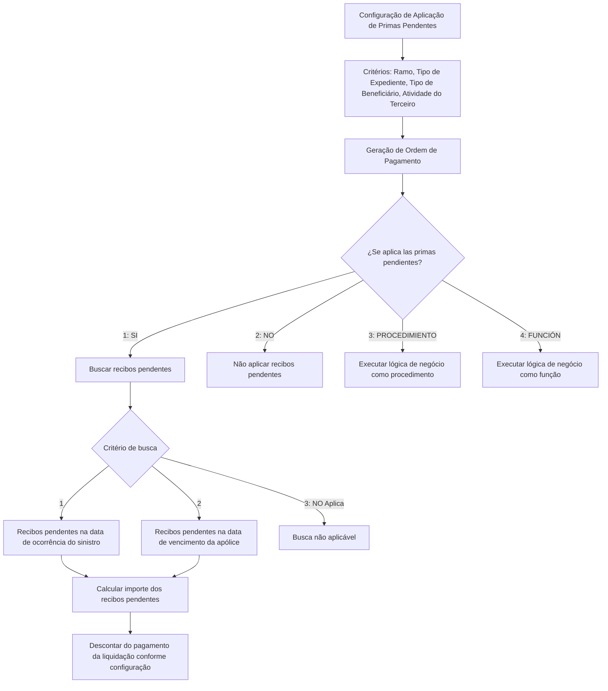

# Definição da Aplicação de Prêmios Pendentes em Liquidações

## 1. Metadados do Documento
- **Arquivo de Origem:** `Não identificado`
- **Tipo de Documento:** `Especificação Técnica`
- **Domínio / Sistema:** `Aplicação de Primas Pendentes em liquidações`
- **Público-Alvo:** `Negócio, analistas funcionais, desenvolvedores e operação`
- **Data/Versão Identificada:** `Não identificada`

---

## 2. Resumo Executivo & Contexto de Negócio

O documento define a configuração para aplicação de prêmios ou recibos pendentes durante a geração de uma ordem de pagamento de liquidação. A configuração é estabelecida por combinação de ramo, tipo de expediente ou tipo de dano, tipo de beneficiário e atividade do terceiro.

A finalidade é determinar se recibos pendentes devem ser verificados para uma liquidação e, quando existentes, se os respectivos valores devem ser descontados do pagamento. A regra também permite que a decisão seja delegada a uma lógica de negócio implementada como procedimento ou função.

A identificação dos recibos pendentes pode considerar a data de ocorrência do sinistro ou a data de vencimento da apólice. O registro de configuração possui uma data de validade e um indicador de habilitação para determinar se pode ser utilizado nas liquidações.

O texto apresenta propriedades funcionais e valores de domínio, mas não detalha interfaces, métodos HTTP, contratos JSON, persistência, telas além da menção a uma imagem de manutenção, nem a implementação da lógica de negócio.

---

## 3. Arquitetura, Componentes & Tecnologias Envolvidas

Os componentes conceituais identificados são:

- **Manutenção de Aplicação de Primas Pendentes:** mecanismo ou cadastro mencionado para definir regras de aplicação e desconto.
- **Geração de ordem de pagamento:** momento operacional em que a regra é avaliada.
- **Liquidação:** processo de pagamento ao beneficiário.
- **Recibos pendentes:** registros verificados e potencialmente descontados do pagamento.
- **Lógica de Negócio:** função ou procedimento aplicável quando o campo “¿Se aplica las primas pendientes?” possuir valor `3` ou `4`.
- **Apólice:** referência usada quando a busca de recibos pendentes é realizada pela data de vencimento.
- **Expediente / sinistro:** referência usada quando a busca é realizada pela data de ocorrência do sinistro.



**Nota de Análise:** O documento não identifica tecnologias, linguagens, bancos de dados, servidores, URLs, integrações, APIs ou ambientes de execução.

---

## 4. Regras de Negócio, Especificações Funcionais & Processos

1. A configuração é definida por produto e para cada tipo de expediente, identificado também como tipo de dano.
2. A configuração define o tipo de beneficiário que receberá a liquidação e o código ou atividade aplicável.
3. Ao gerar uma ordem de pagamento, deve-se verificar se existem recibos pendentes conforme a configuração aplicável.
4. Caso existam recibos pendentes, a configuração determina se esses recibos serão descontados do pagamento da liquidação e como o desconto será tratado.
5. O campo **Ramo** informa a chave do ramo para o qual será definida a maneira de aplicar ou descontar prêmios pendentes.
6. O campo **Ramo** admite ramo genérico, aplicável a todos os ramos.
7. O campo **Tipo de Expediente** informa a chave do tipo de expediente para o qual será definida a maneira de aplicar ou descontar prêmios pendentes.
8. Os tipos de expediente devem estar previamente associados ao ramo.
9. O campo **Tipo de Expediente** admite tipo de expediente genérico, aplicável a todos os tipos de expediente.
10. O campo **Tipo de Beneficiário** identifica o possível tipo de beneficiário da liquidação ao qual serão descontados os prêmios pendentes.
11. O tipo de beneficiário representa como a pessoa física ou jurídica atua na apólice.
12. Os valores de tipo de beneficiário são predefinidos pelo sistema.
13. O campo **Actividad del Tercero** identifica a atividade da pessoa física ou jurídica beneficiária da liquidação à qual serão descontados prêmios pendentes.
14. A atividade do terceiro representa como a pessoa física ou jurídica intervém na companhia.
15. O campo **¿Se aplica las primas pendientes?** possui os valores:
    - `1: SI`
    - `2: NO`
    - `3: PROCEDIMIENTO`
    - `4: FUNCIÓN`
16. Quando o valor de aplicação for `3: PROCEDIMIENTO` ou `4: FUNCIÓN`, a propriedade **Lógica de Negocio que determina si aplica los recibos pendientes en las liquidaciones** deve conter lógica de negócio correspondente, respectivamente, a procedimento ou função.
17. A lógica de negócio somente é utilizada quando o campo de aplicação possuir valor `3` ou `4`.
18. A busca e o cálculo do importe de recibos pendentes podem usar os critérios:
    - `1`: recibos pendentes na data de ocorrência do sinistro;
    - `2`: recibos pendentes na data de vencimento da apólice;
    - `3`: não aplicável.
19. A **Fecha de Validez** determina a data de validade do registro.
20. O atributo **Inhabilitado** indica se o registro está habilitado ou não para utilização nas liquidações.

---

## 5. Tabelas de Parâmetros, Ambientes e Estruturas de Dados

| Item / Parâmetro | Descrição / Função | Tipo / Valores / Formato | Ambiente / Observações |
| :--- | :--- | :--- | :--- |
| Ramo | Chave do ramo para o qual se define a maneira de aplicar ou descontar prêmios pendentes. | Chave de ramo; admite ramo genérico. | O ramo genérico é aplicável a todos os ramos. |
| Tipo de Expediente | Chave do tipo de expediente para o qual se define a maneira de aplicar ou descontar prêmios pendentes. | Chave de tipo de expediente; admite tipo genérico. | O tipo de expediente deve estar previamente associado ao ramo. |
| Tipo de Beneficiário | Tipo de beneficiário da liquidação ao qual poderão ser descontados prêmios pendentes. | Valores predefinidos pelo sistema. | Representa como uma pessoa física ou jurídica atua na apólice. |
| Actividad del Tercero | Atividade do beneficiário da liquidação que poderá sofrer desconto de prêmios pendentes. | Atividade de pessoa física ou jurídica. | Representa como a pessoa intervém na companhia. |
| ¿Se aplica las primas pendientes? | Determina se recibos pendentes são aplicados. | `1: SI`; `2: NO`; `3: PROCEDIMIENTO`; `4: FUNCIÓN`. | Valores `3` e `4` exigem lógica de negócio. |
| Lógica de Negocio que determina si aplica los recibos pendientes en las liquidaciones | Lógica que determina a aplicação de recibos pendentes em liquidações. | Função ou procedimento. | Preenchimento aplicável somente quando o campo de aplicação for `3` ou `4`. |
| ¿Cómo se busca la prima de los recibos pendientes? | Define como recibos pendentes são buscados e como o importe será calculado. | `1`: data de ocorrência do sinistro; `2`: data de vencimento da apólice; `3`: NO Aplica. | Não há detalhamento do algoritmo de cálculo. |
| Fecha de Validez | Data de validade do registro de configuração. | Data. | O documento não especifica formato. |
| Inhabilitado | Indica se o registro pode ser utilizado nas liquidações. | Indicador de habilitação. | O documento não apresenta valores técnicos possíveis. |

---

## 6. Bateria de Perguntas & Respostas para RAG (FAQ Sintético)

### P1: Qual é a finalidade da Aplicação de Primas Pendentes?
**R:** A finalidade é definir, por produto, tipo de expediente ou tipo de dano, tipo de beneficiário e código ou atividade, se durante a geração de uma ordem de pagamento devem ser revisados recibos pendentes e, caso existam, se devem ser descontados do pagamento da liquidação e como isso será feito.

### P2: Em que momento os recibos pendentes são avaliados?
**R:** Os recibos pendentes são avaliados quando uma ordem de pagamento será gerada para uma liquidação.

### P3: O que representa o campo Ramo?
**R:** O campo Ramo indica a chave do ramo para o qual será definida a maneira de aplicar ou descontar prêmios pendentes. O campo aceita um ramo genérico aplicável a todos os ramos.

### P4: Existe uma pré-condição para usar um Tipo de Expediente na configuração?
**R:** Sim. Os tipos de expediente devem estar previamente associados ao ramo. O campo também pode receber um tipo de expediente genérico aplicável a todos os tipos de expediente.

### P5: O que é o Tipo de Beneficiário no contexto da regra?
**R:** O Tipo de Beneficiário identifica o possível beneficiário da liquidação ao qual serão descontados prêmios pendentes. Esse tipo representa como a pessoa física ou jurídica atua na apólice, e seus valores são predefinidos pelo sistema.

### P6: Quais valores são permitidos para “¿Se aplica las primas pendientes?”?
**R:** Os valores permitidos são `1: SI`, `2: NO`, `3: PROCEDIMIENTO` e `4: FUNCIÓN`. Os dois últimos delegam a decisão para uma lógica de negócio.

### P7: Quando a lógica de negócio para aplicação de recibos pendentes deve ser informada?
**R:** A lógica de negócio deve ser informada somente quando “¿Se aplica las primas pendientes?” possuir valor `3: PROCEDIMIENTO` ou `4: FUNCIÓN`. A lógica deverá ser, respectivamente, um procedimento ou uma função.

### P8: Como podem ser localizados os recibos pendentes?
**R:** Os recibos pendentes podem ser buscados considerando a data de ocorrência do sinistro (`1`) ou a data de vencimento da apólice (`2`). O valor `3: NO Aplica` indica que esse critério de busca não se aplica.

### P9: O documento explica como calcular o valor dos recibos pendentes?
**R:** O documento informa que a propriedade de busca define como os recibos pendentes serão buscados e como será calculado o importe desses recibos, mas não descreve a fórmula, o algoritmo ou regras de cálculo detalhadas.

### P10: Para que serve a Fecha de Validez?
**R:** A Fecha de Validez informa a data de validade do registro de configuração.

### P11: Qual é a função do campo Inhabilitado?
**R:** O campo Inhabilitado indica se o registro está habilitado ou não para ser utilizado nas liquidações.

---

## 7. Glossário de Termos, Siglas & Conceitos-Chave

- **Apólice:** referência contratual cuja data de vencimento pode ser usada para buscar recibos pendentes.
- **Actividad del Tercero:** atividade da pessoa física ou jurídica beneficiária da liquidação; representa como essa pessoa intervém na companhia.
- **Beneficiário:** pessoa física ou jurídica que receberá a liquidação.
- **Expediente:** tipo de expediente associado a um ramo; o texto o relaciona ao tipo de dano.
- **Fecha de Validez:** data de validade de um registro de configuração.
- **FUNCIÓN:** valor `4` para indicar que a lógica de negócio aplicável é uma função.
- **Inhabilitado:** propriedade que informa se o registro está ou não habilitado para uso em liquidações.
- **Lógica de Negocio:** função ou procedimento que determina a aplicação de recibos pendentes quando configurada.
- **Liquidação:** contexto de pagamento no qual recibos pendentes podem ser aplicados ou descontados.
- **PROCEDIMIENTO:** valor `3` para indicar que a lógica de negócio aplicável é um procedimento.
- **Ramo:** chave de classificação para a qual pode ser definida a regra de aplicação ou desconto de prêmios pendentes.
- **Recibos Pendientes:** recibos pendentes que podem ser verificados, buscados, calculados e descontados no pagamento da liquidação.

---

## 8. Notas Críticas, Riscos & Limitações

- O documento não identifica o nome do sistema, arquivo de origem, autor, data, versão ou responsável pela configuração.
- O documento menciona uma imagem do “Mantenimiento de Aplicación de Primas Pendientes”, mas a imagem não está presente no conteúdo bruto fornecido.
- Não há detalhamento da prioridade entre configurações específicas e configurações genéricas de ramo ou tipo de expediente.
- Não há definição sobre o comportamento quando mais de uma configuração atende à mesma liquidação.
- Não há contrato técnico para a função ou procedimento de lógica de negócio: assinatura, parâmetros, retorno, tratamento de erro e localização não são informados.
- Não há fórmula para cálculo do importe dos recibos pendentes.
- Não há especificação sobre a efetivação do desconto, arredondamento, moeda, contabilização, reversão ou tratamento de saldo insuficiente.
- Não são apresentadas tecnologias, APIs, ambientes, logs, permissões, integrações ou requisitos não funcionais.

---

## 9. Conteúdo Bruto Estruturado (Referência Fiel)

```text
--- [PÁGINA 1 DE 2] ---

Definición Aplicación Primas Pendientes
Objetivo
La finalidad es definir por producto y para cada tipo de Expediente (tipo de daño), tipo de beneficiario al que se le va a liquidar y código de actividad, si
cuando vayamos a generar una orden de pago, se revisa si tiene recibos pendientes, y si existen recibos si se descuenta del pago de la liquidación y cómo.
Imagen del Mantenimiento de Aplicación de Primas Pendientes.:
Propiedades
Ramo
Esta propiedad indica la clave del Ramo al que se le va a definir la manera de aplicar, descontar las primas pendientes. Esta propiedad admite el ramo
genérico, para todos los ramos.
Tipo de Expediente
Esta propiedad será la clave del Tipo de Expediente al que se le va a definir la manera de aplicar, descontar las primas pendientes. Los tipos de Expedientes
tienen que estar asociados al Ramo previamente. Esta propiedad admite el tipo de expediente genérico, para todos los tipos de expedientes.
Tipo de Beneficiario
Esta propiedad contiene el posible tipo beneficiario de la liquidación al que se le va a descontar las primas pendientes. El tipo de Beneficiario es como actúa
la persona física o jurídica en la póliza. Los valores que puede contener este atributo están prefijados por el sistema.
Activad del Tercero
Esta propiedad contiene la actividad de la persona física o jurídica que será el beneficiario de la liquidación, al que se le va a descontar las primas
pendientes. Esta actividad es como interviene esa persona en la compañía,.....
¿Se aplica las primas pendientes?
Si se aplica el o los recibos pendientes o no se aplica. Este campo puede tener los siguientes valores.
1: SI
2: NO
3: PROCEDIMIENTO
Ejemplo:
 /
 CF
Search Home Solutions Architectures APIs Events Components Cloud Documentation Zeus Reef Help News
EN

--- [PÁGINA 2 DE 2] ---

4: FUNCIÓN
Lógica de Negocio que determina si aplica los recibos pendientes en las liquidaciones
Esta propiedad contendrá Lógica de Negocio, será Función o Procedimiento dependiendo del campo anterior, sólo si es 3 o 4.
¿Cómo se busca la prima de los recibos pendientes?
Esta propiedad contiene como se van a buscar los recibos pendientes y se calculará el importe de los recibos pendientes:
1: Se aplicará a los recibos Pendientes a la Fecha de ocurrencia del siniestro
2: Se aplicará a los recibos Pendientes a la fecha de vencimiento de la póliza
3: NO Aplica
Fecha de Validez
Fecha de validez del registro.
Inhabilitado
Esta propiedad indica si el registro está o no habilitado para ser utilizado en las liquidaciones.
```
