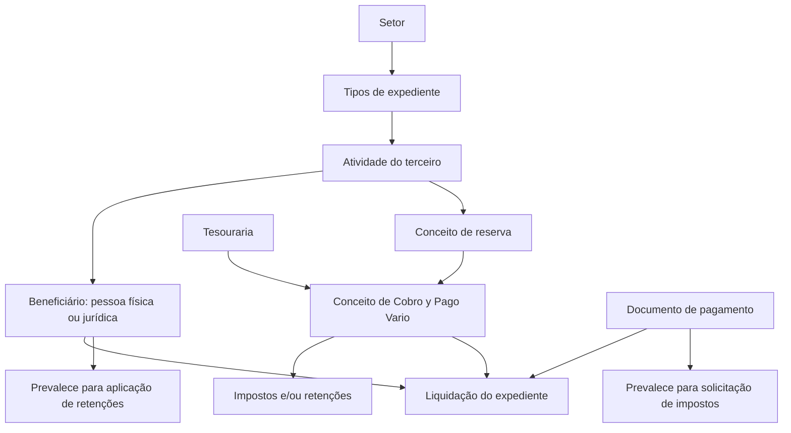

# Definição de Conceitos de Pagamento por Atividade de Terceiro para Liquidações de Sinistros

## 1. Metadados do Documento
- **Arquivo de Origem:** Não identificado no conteúdo fornecido
- **Tipo de Documento:** Especificação Funcional / Procedimento
- **Domínio / Sistema:** Módulo de sinistros, liquidações, tesouraria e pagamentos a terceiros
- **Público-Alvo:** Analistas funcionais, desenvolvedores, equipes de operação de sinistros e tesouraria
- **Data/Versão Identificada:** Não identificada

---

## 2. Resumo Executivo & Contexto de Negócio

O documento descreve a manutenção das definições de **Conceitos de Cobro y Pago Vario por Actividad**, utilizada para viabilizar a geração de ordens de pagamento associadas à liquidação de expedientes no módulo de sinistros. A configuração determina quais conceitos de cobrança e pagamento podem ser aplicados a afetados, beneficiários ou fornecedores que tenham participado de um expediente.

A definição relaciona tipos de expediente pertencentes a um setor com as atividades exercidas por terceiros e com os conceitos de reserva e de cobrança/pagamento aplicáveis. Dessa forma, o processo controla quais tipos de pagamento ou cobrança podem ser utilizados em uma liquidação, conforme a forma pela qual uma pessoa física ou jurídica participa da companhia, como segurado, oficina ou perito.

Os conceitos de cobrança e pagamento utilizados em sinistros são definidos em tesouraria. Cada conceito de cobrança e pagamento pode possuir impostos e/ou retenções associados. Entretanto, a aplicação efetiva dessas regras depende também do documento de pagamento e da configuração do terceiro beneficiário.

O documento estabelece regras de precedência para impostos e retenções. Para impostos, a definição do documento de pagamento prevalece sobre a definição do conceito de cobrança e pagamento. Para retenções, a configuração do terceiro prevalece sobre a configuração do conceito de cobrança e pagamento.

---

## 3. Arquitetura, Componentes & Tecnologias Envolvidas

Os componentes e domínios funcionais explicitamente citados são:

- **Módulo de sinistros:** módulo no qual são realizadas liquidações de expedientes e utilizado para efetuar pagamentos ou cobranças.
- **Tesouraria:** domínio responsável pela definição dos conceitos de cobrança e pagamento que podem ser utilizados em sinistros.
- **Liquidações:** processo que gera ordens de pagamento para beneficiários.
- **Expedientes:** entidades associadas aos tipos de expediente, setor, atividades de terceiros e liquidações.
- **Documento de pagamento:** configuração que pode determinar se impostos devem ou não ser solicitados.
- **Terceiro / beneficiário:** pessoa física ou jurídica que recebe o pagamento e cuja configuração influencia a aplicação de retenções.
- **Conceito de reserva:** conceito ao qual são associados os conceitos de cobrança e pagamento variável.
- **Conceito de Cobro y Pago Vario:** detalhamento do motivo pelo qual o beneficiário recebe o pagamento.



**Nota de Análise:** o conteúdo fornecido não detalha tecnologias, protocolos, APIs, bancos de dados, métodos HTTP, contratos JSON, URLs de ambiente, servidores ou integrações técnicas entre sistemas.

---

## 4. Regras de Negócio, Especificações Funcionais & Processos

### Objetivo da configuração

Para gerar ordens de pagamento, ou liquidações de expedientes, é necessário definir quais conceitos de cobrança e pagamento variável podem ser utilizados para pagar afetados ou fornecedores que tenham participado do expediente.

A finalidade da manutenção é definir:

1. Quais atividades podem receber pagamentos ou cobranças a partir do módulo de sinistros.
2. Quais conceitos de reserva podem ser utilizados.
3. Quais conceitos de cobrança e pagamento podem ser utilizados para pagar ou cobrar do beneficiário da liquidação.

### Propriedade: Setor

A propriedade **Setor** informa a chave do setor ao qual pertencem os tipos de expediente. Esses tipos de expediente serão associados às atividades e aos conceitos de reserva e de cobrança/pagamento variável permitidos nas liquidações.

### Propriedade: Tipo de Beneficiário

A propriedade **Tipo de Beneficiário** é opcional. A informação somente deve ser preenchida quando a atividade para a qual os conceitos estão sendo definidos corresponder a uma pessoa física ou jurídica que intervenha na apólice.

Os valores possíveis para essa propriedade são predefinidos pelo sistema.

### Propriedade: Atividade do Terceiro

A propriedade **Atividade do Terceiro** contém a atividade dos possíveis beneficiários da liquidação. A atividade representa a forma pela qual a pessoa física ou jurídica participa da companhia.

Exemplos expressamente citados:

- Segurado;
- Oficina;
- Perito.

### Propriedade: Conceito de Reserva

A propriedade **Conceito de Reserva** contém a chave do conceito de reserva ao qual serão associados os diferentes conceitos de cobrança e pagamento variável.

O documento apresenta as seguintes associações usuais:

- Segurados e beneficiários normalmente recebem pagamentos por conceitos de **indenização**.
- Fornecedores normalmente recebem pagamentos por conceitos de **honorários e gastos**, relacionados à atividade desenvolvida para a companhia.

### Propriedade: Conceito de Cobro y Pago Vario

Os conceitos de cobrança e pagamento variável representam o detalhamento pelo qual o beneficiário da liquidação será pago.

Regras associadas:

1. Os conceitos utilizáveis em sinistros são definidos em tesouraria.
2. Aos conceitos de cobrança e pagamento variável também são associados impostos e/ou retenções.
3. A solicitação de impostos e/ou retenções considera:
   - o conceito de cobrança e pagamento variável;
   - o documento que está sendo pago;
   - o destinatário do pagamento.

### Regra de reutilização de conceitos

O mesmo conceito de pagamento pode ser associado a diversas atividades.

### Regra de precedência para impostos

Quando um conceito possui imposto definido, mas o documento de pagamento está configurado para não solicitar imposto, prevalece a definição do documento de pagamento.

Exemplo fornecido:

- Um conceito possui imposto definido.
- O documento utilizado é um documento de pagamento do tipo **`RE` — Reembolso**.
- A tabela de documentos de pagamento define que o documento não solicita imposto.
- Resultado: o imposto não é solicitado.

### Regra de precedência para retenções

Quando um conceito de pagamento possui retenções definidas, a retenção é aplicada conforme a configuração do terceiro.

A definição do terceiro prevalece sobre a definição do conceito de cobrança e pagamento variável.

### Propriedade: Inabilitado

A propriedade **Inhabilitado** indica se o registro está habilitado ou não para ser utilizado em liquidações.

---

## 5. Tabelas de Parâmetros, Ambientes e Estruturas de Dados

| Item / Parâmetro | Descrição / Função | Tipo / Valores / Formato | Ambiente / Observações |
| :--- | :--- | :--- | :--- |
| Setor | Indica a chave do setor ao qual pertencem os tipos de expediente. | Chave de setor; formato não detalhado. | Associado a tipos de expediente, atividades e conceitos utilizados em liquidações. |
| Tipo de Beneficiário | Identifica o tipo de pessoa que intervém na apólice quando aplicável à atividade configurada. | Opcional; valores predefinidos pelo sistema. | Preenchido apenas para pessoa física ou jurídica que intervenha na apólice. |
| Atividade do Terceiro | Identifica a forma pela qual o beneficiário participa da companhia. | Atividade; exemplos: segurado, oficina, perito. | Determina o contexto de associação com conceitos de reserva e pagamento. |
| Conceito de Reserva | Informa a chave do conceito de reserva associado aos conceitos de cobrança e pagamento variável. | Chave de conceito de reserva; formato não detalhado. | Segurados e beneficiários normalmente utilizam indenização; fornecedores normalmente utilizam honorários e gastos. |
| Conceito de Cobro y Pago Vario | Detalha o conceito pelo qual o beneficiário será pago na liquidação. | Conceito definido em tesouraria. | Pode possuir impostos e/ou retenções associados. |
| Impostos | Tributos associados ao conceito de cobrança e pagamento variável. | Não detalhado. | A aplicação depende do conceito, documento pago e destinatário; o documento de pagamento prevalece. |
| Retenções | Retenções associadas ao conceito de cobrança e pagamento variável. | Não detalhado. | A configuração do terceiro prevalece sobre a configuração do conceito. |
| Documento de pagamento | Documento utilizado para processar o pagamento. | Exemplo: `RE` — Reembolso. | Pode definir que impostos não sejam solicitados. |
| Terceiro | Beneficiário ou participante relacionado à liquidação. | Pessoa física ou jurídica; demais atributos não detalhados. | Sua configuração determina a aplicação de retenções. |
| Inhabilitado | Indica a disponibilidade do registro para utilização em liquidações. | Indicador de habilitado ou não habilitado; formato não detalhado. | Registro não habilitado não pode ser utilizado em liquidações. |
| Tesouraria | Área ou módulo responsável pela definição dos conceitos utilizáveis em sinistros. | Componente funcional. | Não há detalhamento de telas, integrações ou responsabilidades adicionais. |

---

## 6. Bateria de Perguntas & Respostas para RAG (FAQ Sintético)

### P1: Qual é o objetivo da definição de conceitos de cobrança e pagamento variável por atividade de terceiro?
**R:** O objetivo é permitir a geração de ordens de pagamento, ou liquidações de expedientes, definindo quais conceitos de cobrança e pagamento variável podem ser utilizados para pagar afetados ou fornecedores que tenham participado do expediente.

### P2: Para que serve a propriedade Setor na configuração de conceitos por atividade?
**R:** A propriedade Setor indica a chave do setor ao qual pertencem os tipos de expediente. Esses tipos de expediente serão associados às atividades e aos conceitos de reserva e de cobrança e pagamento variável que poderão ser utilizados nas liquidações.

### P3: Quando o Tipo de Beneficiário deve ser preenchido?
**R:** O Tipo de Beneficiário é opcional e somente deve receber informação quando a atividade para a qual os conceitos estão sendo definidos corresponder a uma pessoa física ou jurídica que intervenha na apólice. Os valores permitidos são predefinidos pelo sistema.

### P4: O que representa a Atividade do Terceiro?
**R:** A Atividade do Terceiro representa a forma pela qual uma pessoa física ou jurídica intervém na companhia e identifica a atividade dos possíveis beneficiários da liquidação. O documento cita como exemplos segurado, oficina e perito.

### P5: Qual é a relação entre o Conceito de Reserva e os conceitos de cobrança e pagamento variável?
**R:** O Conceito de Reserva contém a chave do conceito de reserva à qual serão associados os diferentes conceitos de cobrança e pagamento variável. Normalmente, segurados e beneficiários recebem por conceitos de indenização, enquanto fornecedores recebem por conceitos de honorários e gastos vinculados à atividade realizada para a companhia.

### P6: Onde são definidos os conceitos de cobrança e pagamento variável que podem ser utilizados em sinistros?
**R:** Os conceitos de cobrança e pagamento variável que podem ser utilizados em sinistros são definidos em tesouraria.

### P7: Um mesmo conceito de pagamento pode ser associado a mais de uma atividade?
**R:** Sim. O documento informa expressamente que o mesmo conceito pode ser associado a várias atividades.

### P8: Se um conceito possui imposto definido, mas o documento de pagamento não solicita imposto, qual configuração prevalece?
**R:** Prevalece a definição do documento de pagamento. Portanto, se o documento de pagamento estiver configurado para não solicitar imposto, o imposto não será solicitado, mesmo que o conceito de cobrança e pagamento possua imposto definido.

### P9: Como funciona o exemplo do documento de pagamento `RE` — Reembolso em relação ao imposto?
**R:** Se for utilizado um conceito que possui imposto definido, mas o documento de pagamento utilizado for `RE` — Reembolso e estiver configurado na tabela de documentos de pagamento para não solicitar imposto, o imposto não será solicitado.

### P10: Uma retenção definida no conceito de pagamento sempre será aplicada?
**R:** Não necessariamente. Embora o conceito de pagamento possua retenções definidas, a aplicação depende da definição existente para o terceiro. A configuração do terceiro prevalece sobre a definição do conceito de cobrança e pagamento variável.

### P11: Qual é a função da propriedade Inhabilitado?
**R:** A propriedade Inhabilitado indica se o registro está habilitado ou não para ser utilizado nas liquidações.

### P12: O documento define o formato técnico das chaves de setor, conceito de reserva ou conceito de pagamento?
**R:** Não. O conteúdo fornecido informa a finalidade funcional dessas chaves, mas não detalha formatos, tamanhos, domínios de valores, validações técnicas ou estruturas de dados.

---

## 7. Glossário de Termos, Siglas & Conceitos-Chave

- **Atividade do Terceiro:** forma pela qual uma pessoa física ou jurídica participa da companhia, como segurado, oficina ou perito.
- **Beneficiário da Liquidação:** pessoa ou entidade que receberá o pagamento associado à liquidação.
- **Cobro y Pago Vario:** conceito de cobrança e pagamento variável que detalha o motivo pelo qual o beneficiário será pago.
- **Conceito de Reserva:** conceito de reserva associado aos conceitos de cobrança e pagamento variável.
- **Documento de Pagamento:** documento utilizado no processamento do pagamento e que pode definir se impostos devem ser solicitados.
- **Expediente:** entidade relacionada ao processo de sinistro e à geração de liquidações.
- **Imposto:** tributo associado a um conceito de cobrança e pagamento variável; sua solicitação pode ser condicionada pelo documento de pagamento.
- **Inhabilitado:** indicador de que um registro não está habilitado para utilização em liquidações.
- **Liquidação:** processo de geração de uma ordem de pagamento vinculada a um expediente.
- **`RE`:** Reembolso, citado como exemplo de documento de pagamento.
- **Retenção:** retenção associada a um conceito de pagamento, cuja aplicação depende da configuração do terceiro.
- **Setor:** chave que agrupa os tipos de expediente associados às atividades e conceitos permitidos.
- **Tesouraria:** área ou módulo no qual são definidos os conceitos de cobrança e pagamento utilizáveis em sinistros.
- **Tipo de Beneficiário:** propriedade opcional, com valores predefinidos pelo sistema, aplicável quando a atividade corresponde a pessoa física ou jurídica interveniente na apólice.

---

## 8. Notas Críticas, Riscos & Limitações

- O documento não identifica o nome do arquivo, autor, data, versão ou sistema corporativo específico.
- O conteúdo não detalha a interface de manutenção, os campos obrigatórios, o formato das chaves, os domínios completos de valores nem regras de validação técnica.
- Não há especificação de APIs, endpoints, contratos de integração, bancos de dados, servidores, URLs, portas ou ambientes.
- A configuração de impostos depende do conceito de cobrança e pagamento variável, do documento pago e do destinatário. A precedência do documento de pagamento deve ser respeitada para evitar a solicitação indevida de impostos.
- A configuração de retenções deve considerar a definição do terceiro, pois ela prevalece sobre a definição existente no conceito de cobrança e pagamento variável.
- Registros marcados como **Inhabilitado** não devem ser utilizados em liquidações.
- **Nota de Análise:** o conteúdo fornecido termina após a palavra “Ejemplo:” referente à pergunta sobre retenções. Não foi disponibilizado o exemplo completo nem conteúdo posterior.

---

## 9. Conteúdo Bruto Estruturado (Referência Fiel)

```text
--- [PÁGINA 1 DE 3] ---

Definición Conceptos de Pago por Actividad de
Tercero
Objetivo
Para poder generar órdenes de pago (liquidaciones de expedientes) , se tiene que definir qué
Conceptos de Cobro y Pago Vario va a poder utilizarse para pagar a afectados o proveedores que
hayan intervenido en el expediente.
La finalidad es definir a qué actividades se pueden pagar o cobrar desde el módulo de siniestros y
qué conceptos de reserva y Conceptos de Cobro y Pago se pueden utilizar para pagar o cobrar al
beneficiario de la liquidación.
Imagen del Mantenimiento Definiciones de Concepto de Cobro y Pago Vario por Actividad:
Ejemplo:
 / 
 CF
Home Solutions APIs Documentation Zeus
EN


--- [PÁGINA 2 DE 3] ---

Propiedades
Sector
Esta propiedad indica la clave del Sector al que pertenecen los tipos de expedientes, a los que se les
va a asociar las actividades y los conceptos de Reserva y Cobro y Pago Vario que se van a poder
utilizar en las liquidaciones.
Tipo de Beneficiario
Esta propiedad es opcional, sólo se introducirá información en el caso de que la actividad a la que se
le están definiendo conceptos, sea una persona física o jurídica que intervenga en la póliza. Los
valores que puede contener esta propiedad están prefijados por el sistema.
Actividad del tercero
Esta propiedad contendrá la actividad de los posibles beneficiarios de la liquidación, es la forma en la
que interviene la persona física o jurídica en la compañía, como asegurado, como taller, como perito,
etc.
Concepto de reserva


--- [PÁGINA 3 DE 3] ---

Esta propiedad contendrá la clave del concepto de reserva al que se va a asociar los distintos
conceptos de cobro y pago vario. Normalmente a los asegurados y beneficiarios se les va a pagar
por conceptos de indemnización, a los proveedores se les va a pagar por conceptos de honorarios y
gastos, es decir por la actividad que ha desarrollado para la compañía.
Concepto de Cobro y Pago Vario
Los conceptos de cobro y pago vario son el detalle por el que se le va a pagar al beneficiario de la
liquidación. Los conceptos que se pueden utilizar en siniestros, se definen en tesorería. A estos
conceptos de cobro y pago vario, también se le asocian los impuestos y/o retenciones. Los
impuestos y/o retenciones se van a pedir en función del concepto de cobro y pago vario, en función
del documento que se esté pagando y en función de a quién se le esté pagando.
Inhabilitado
Esta propiedad indica si el registro está o no habilitado para ser utilizado en las liquidaciones.
Preguntas frecuentes
¿Se le puede asociar un concepto pago a varias actividades?
R/ Si, se puede asociar el mismo concepto a varias actividades.
¿Si un concepto tiene definido impuestos y el documento de pago está definido que no pide
impuestos, que es lo que prima?
R/ En este caso prima el documento de pago.
Ejemplo:
Si se usa un concepto que tiene definido impuesto y el documento que se utiliza, por ejemplo, es
un 'RE'-Reembolso y está definido en la tabla de documentos de Pago que no se pide el
Impuesto, no se pide.
¿Si un concepto tiene definido retenciones se van a aplicar aunque el tercero tiene definido que
no se le retenga?
R/ Aunque el concepto de pago tenga definido retenciones, esta se va a aplicar dependiendo de
lo que tenga definido el tercero. Prima la definición del tercero, por encima del concepto de cobro
y pago vario.
Ejemplo:
```
