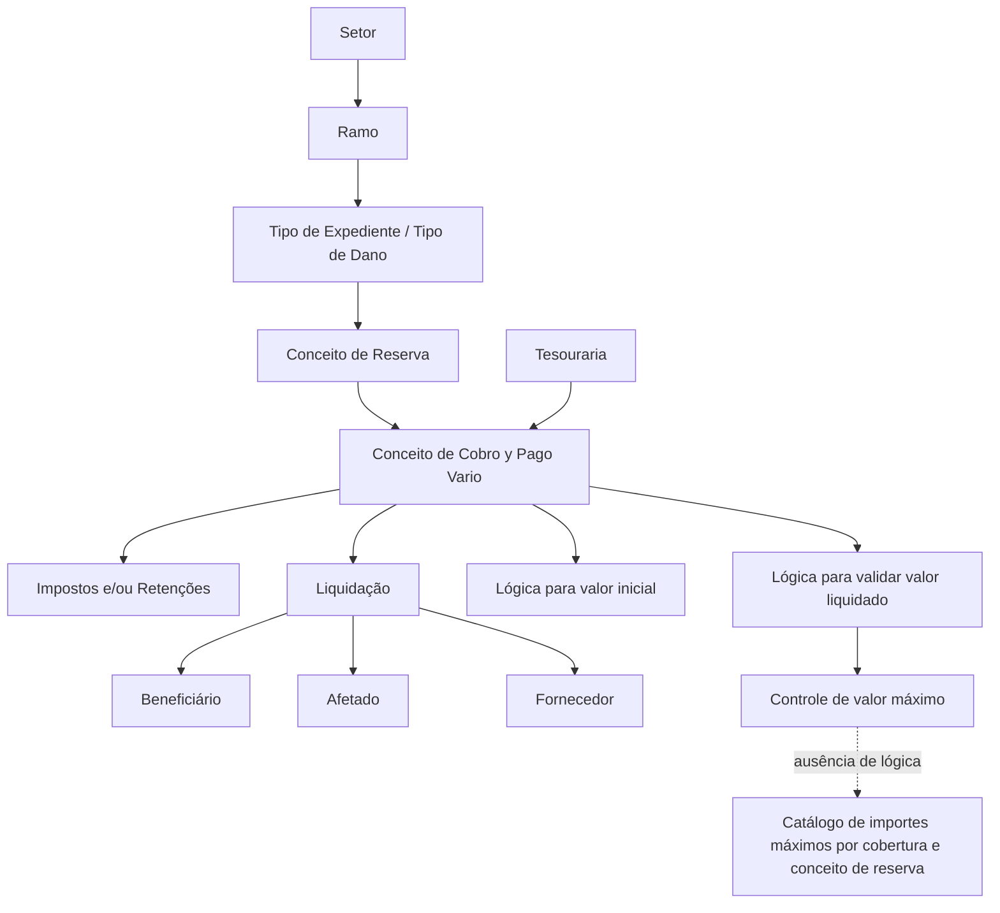

# Definição de Conceitos de Cobro e Pago Vario por Tipo de Expediente

## 1. Metadados do Documento
- **Arquivo de Origem:** Não identificado no conteúdo fornecido
- **Tipo de Documento:** Manual Operacional / Especificação Funcional
- **Domínio / Sistema:** Gestão de sinistros, liquidações, tesouraria, tipos de expediente, coberturas e reservas
- **Público-Alvo:** Analistas funcionais, desenvolvedores, operação de sinistros, tesouraria
- **Data/Versão Identificada:** Não identificada

---

## 2. Resumo Executivo & Contexto de Negócio

O documento descreve a definição de conceitos de cobrança e de pagamento diverso (*Conceptos de Cobro y Pago Vario*) aplicáveis a tipos de expediente, também referidos como tipos de dano. Essa configuração permite determinar quais conceitos podem ser usados para gerar liquidações relacionadas a um tipo de dano específico.

O processo depende de pré-requisitos de configuração: os tipos de expediente precisam estar associados a um ramo; as coberturas e os conceitos de reserva precisam ter sido definidos; e o conceito de reserva precisa estar previamente associado ao tipo de expediente. Após essas associações, podem ser vinculados um ou mais conceitos de cobrança e pagamento diverso.

Os conceitos de cobrança e pagamento diverso representam o detalhe pelo qual um beneficiário recebe uma liquidação. Os conceitos usados em sinistros são definidos pela tesouraria. Cada conceito também pode ter impostos e/ou retenções associados, cuja solicitação depende do conceito utilizado, do documento que está sendo pago e do destinatário do pagamento.

O documento também descreve controles técnicos para valores: uma lógica de negócio pode obter o valor inicial de um conceito e outra pode validar que o valor liquidado não ultrapasse um limite máximo. Quando não houver lógica de validação configurada no próprio conceito, deve-se consultar o catálogo de valores máximos por cobertura e conceito de reserva.

---

## 3. Arquitetura, Componentes & Tecnologias Envolvidas

Os elementos funcionais identificados são:

- **Setor:** chave do setor ao qual pertencem os tipos de expediente.
- **Ramo:** chave do ramo ao qual pertencem os tipos de expediente.
- **Tipo de Expediente:** tipo de dano ao qual são associados conceitos de cobrança e pagamento diverso.
- **Conceito de Reserva:** conceito previamente associado ao tipo de expediente e usado como contexto para os conceitos de cobrança e pagamento.
- **Conceito de Cobro y Pago Vario:** detalhe de cobrança ou pagamento utilizado em liquidações para beneficiários ou fornecedores.
- **Tesouraria:** área responsável por definir os conceitos utilizados em sinistros.
- **Catálogo de Importes Máximos por Cobertura e Conceito de Reserva:** fonte alternativa de lógica de validação aplicável às liquidações.
- **Liquidações:** processo no qual os conceitos configurados são utilizados para pagar afetados, fornecedores ou realizar cobranças.
- **Impostos e/ou Retenções:** associações aplicáveis aos conceitos de cobrança e pagamento diverso.



**Nota de Análise:** o conteúdo não informa tecnologia de implementação, APIs, métodos HTTP, contratos JSON, banco de dados, ambientes, URLs, versões ou mecanismos de persistência.

---

## 4. Regras de Negócio, Especificações Funcionais & Processos

### 4.1 Finalidade da configuração

1. Os tipos de expediente devem estar associados a um ramo.
2. As coberturas e os conceitos de reserva devem estar definidos.
3. Para gerar liquidações para um tipo de dano, devem ser definidos os conceitos de cobrança e pagamento diverso que poderão ser utilizados.
4. Devem ser definidos todos os conceitos de pagamento necessários para pagar afetados ou fornecedores que tenham participado do expediente.
5. Devem ser definidos os conceitos de cobrança necessários para permitir cobranças.
6. A configuração é realizada para cada combinação de tipo de expediente e conceito de reserva.

### 4.2 Associação entre entidades

1. O setor identifica a chave do setor ao qual pertencem os tipos de expediente.
2. O ramo identifica a chave do ramo ao qual pertencem os tipos de expediente.
3. O tipo de expediente é a chave do tipo de expediente que receberá um ou mais conceitos de cobrança e pagamento diverso.
4. Um tipo de expediente deve estar previamente associado ao ramo.
5. O conceito de reserva é a chave do conceito de reserva que receberá a associação dos conceitos de cobrança e pagamento diverso.
6. O conceito de reserva deve estar previamente associado ao tipo de expediente.
7. Um conceito de cobrança e pagamento diverso pode ser associado de **1 a N** tipos de expediente.

### 4.3 Regras para conceitos de cobrança e pagamento diverso

1. Os conceitos de cobrança e pagamento diverso correspondem ao detalhe pelo qual o beneficiário de uma liquidação será pago.
2. Os conceitos que podem ser utilizados em sinistros são definidos pela tesouraria.
3. Impostos e/ou retenções são associados aos conceitos de cobrança e pagamento diverso.
4. A solicitação de impostos e/ou retenções depende simultaneamente:
   - do conceito de cobrança e pagamento diverso;
   - do documento que está sendo pago;
   - da pessoa ou entidade que receberá o pagamento.

### 4.4 Regras de valor inicial e validação de valor liquidado

1. A propriedade de lógica de negócio para valor inicial contém a lógica que obtém o valor do importe inicial do conceito de cobrança e pagamento diverso, quando o conceito tiver importe inicial.
2. A propriedade de lógica de negócio para validação do importe liquidado contém a lógica que assegura que o valor liquidado não ultrapasse um limite.
3. A validação controla o valor máximo que pode ser liquidado.
4. Se não houver lógica de negócio na propriedade de validação do importe liquidado, deve-se consultar o catálogo de importes máximos por cobertura e conceito de reserva.
5. A consulta ao catálogo verifica se há uma lógica de negócio aplicável às liquidações.

### 4.5 Habilitação de registros

A propriedade **Inhabilitado** indica se o registro está ou não habilitado para utilização nas liquidações.

---

## 5. Tabelas de Parâmetros, Ambientes e Estruturas de Dados

| Item / Parâmetro | Descrição / Função | Tipo / Valores / Formato | Ambiente / Observações |
| :--- | :--- | :--- | :--- |
| Setor | Indica a chave do setor ao qual pertencem os tipos de expediente associados a conceitos de cobrança e pagamento diverso. | Chave de setor | Não detalhado |
| Ramo | Indica a chave do ramo ao qual pertencem os tipos de expediente associados a conceitos de cobrança e pagamento diverso. | Chave de ramo | O tipo de expediente deve estar previamente associado ao ramo. |
| Tipo de Expediente | Identifica o tipo de expediente ou tipo de dano ao qual serão associados um ou mais conceitos de cobrança e pagamento diverso. | Chave de tipo de expediente | Deve estar associado previamente ao ramo. |
| Conceito de Reserva | Identifica o conceito de reserva ao qual serão associados conceitos de cobrança e pagamento diverso. | Chave de conceito de reserva | Deve estar associado previamente ao tipo de expediente. |
| Conceito de Cobro y Pago Vario | Define o detalhe pelo qual o beneficiário de uma liquidação será pago; também suporta conceitos de cobrança. | Um ou mais conceitos por tipo de expediente | Definido pela tesouraria para utilização em sinistros. Pode ser associado de 1 a N tipos de expediente. |
| Impostos e/ou Retenções | Valores associados a conceitos de cobrança e pagamento diverso. | Não detalhado | Solicitados conforme conceito, documento pago e destinatário do pagamento. |
| Lógica de negócio para valor inicial | Obtém o valor do importe inicial do conceito de cobrança e pagamento diverso. | Lógica de negócio técnica | Aplicável quando o conceito possuir importe inicial. |
| Lógica de negócio para validar importe liquidado | Valida que o importe liquidado não ultrapasse um limite. | Lógica de negócio técnica | Controla o importe máximo liquidável. |
| Catálogo de importes máximos por cobertura e conceito de reserva | Fonte alternativa para verificar lógica de negócio de validação de liquidações. | Catálogo | Deve ser consultado quando não houver lógica configurada na propriedade de validação do importe liquidado. |
| Inhabilitado | Indica se o registro pode ser utilizado nas liquidações. | Indicador de habilitação | O documento não informa valores técnicos possíveis, como `true` ou `false`. |

---

## 6. Bateria de Perguntas & Respostas para RAG (FAQ Sintético)

### P1: Qual é o objetivo da definição de conceitos de cobrança e pagamento diverso por tipo de expediente?
**R:** O objetivo é definir, para cada tipo de expediente ou tipo de dano e para seus conceitos de reserva, quais conceitos de cobrança e pagamento diverso podem ser usados nas liquidações. Esses conceitos permitem pagar afetados ou fornecedores envolvidos no expediente e realizar cobranças quando necessário.

### P2: Quais pré-requisitos devem existir antes de associar conceitos de cobrança e pagamento diverso?
**R:** Os tipos de expediente devem estar previamente associados a um ramo. Além disso, o conceito de reserva deve estar previamente associado ao tipo de expediente. O documento também informa que coberturas e conceitos de reserva devem ter sido definidos antes da geração de liquidações.

### P3: O que representa um conceito de cobrança e pagamento diverso em uma liquidação?
**R:** Um conceito de cobrança e pagamento diverso representa o detalhe pelo qual será efetuado o pagamento ao beneficiário da liquidação. Ele pode ser usado para pagar afetados ou fornecedores que tenham participado do expediente e também para suportar cobranças.

### P4: Quem define os conceitos que podem ser usados em sinistros?
**R:** Os conceitos que podem ser utilizados em sinistros são definidos pela tesouraria.

### P5: Um conceito de cobrança e pagamento diverso pode ser associado a mais de um tipo de expediente?
**R:** Sim. O documento estabelece que os conceitos de cobrança e pagamento diverso podem ser atribuídos de 1 a N tipos de expediente.

### P6: Como são determinados os impostos e as retenções de um pagamento?
**R:** Impostos e/ou retenções são associados aos conceitos de cobrança e pagamento diverso. A solicitação desses impostos e retenções depende do conceito utilizado, do documento que está sendo pago e de quem receberá o pagamento.

### P7: Qual é a função da lógica de negócio para valor inicial?
**R:** A lógica de negócio para valor inicial é usada para obter o valor do importe inicial do conceito de cobrança e pagamento diverso, quando esse conceito possuir importe inicial.

### P8: Como o sistema controla o valor máximo que pode ser liquidado?
**R:** A lógica de negócio para validar o importe liquidado verifica se o valor liquidado não ultrapassa um limite e, portanto, controla o importe máximo que pode ser liquidado.

### P9: O que deve acontecer quando não há lógica de validação do importe liquidado no conceito?
**R:** Quando não houver lógica de negócio configurada na propriedade de validação do importe liquidado, deve-se consultar o catálogo de importes máximos por cobertura e conceito de reserva para verificar se existe uma lógica de negócio aplicável às liquidações.

### P10: Qual é a função da propriedade Inhabilitado?
**R:** A propriedade Inhabilitado informa se o registro está habilitado ou não para ser utilizado nas liquidações.

### P11: Qual é a diferença entre tipo de expediente e conceito de reserva na configuração?
**R:** O tipo de expediente é o tipo de dano que receberá um ou mais conceitos de cobrança e pagamento diverso. O conceito de reserva é a chave de reserva, previamente associada ao tipo de expediente, à qual também serão associados os conceitos de cobrança e pagamento diverso.

---

## 7. Glossário de Termos, Siglas & Conceitos-Chave

- **Setor:** chave do setor ao qual pertencem os tipos de expediente.
- **Ramo:** chave do ramo ao qual pertencem os tipos de expediente.
- **Tipo de Expediente:** tipo de dano ao qual são associados conceitos de cobrança e pagamento diverso.
- **Conceito de Reserva:** conceito de reserva previamente associado ao tipo de expediente.
- **Conceito de Cobro y Pago Vario:** detalhe de cobrança ou pagamento usado para liquidar valores a beneficiários; pode possuir impostos e/ou retenções associados.
- **Liquidação:** processo no qual são utilizados conceitos de cobrança e pagamento para pagar afetados ou fornecedores, ou para realizar cobranças.
- **Beneficiário:** destinatário do pagamento da liquidação.
- **Afetado:** pessoa que pode receber pagamento no contexto de um expediente.
- **Fornecedor:** participante do expediente que pode receber pagamento.
- **Tesouraria:** área que define os conceitos que podem ser usados em sinistros.
- **Importe Inicial:** valor inicial de um conceito de cobrança e pagamento diverso, quando existente.
- **Importe Liquidado:** valor efetivamente submetido à liquidação e sujeito a validação de limite máximo.
- **Inhabilitado:** indicador de que um registro está ou não disponível para uso em liquidações.

---

## 8. Notas Críticas, Riscos & Limitações

- O documento não identifica o nome do sistema, versão, data, proprietário, ambiente, URL ou mecanismo técnico de implementação.
- O documento não informa valores técnicos, formatos, obrigatoriedade de campos, regras de persistência ou mensagens de erro.
- O documento menciona uma imagem do manutenção de definições de conceito de cobrança e pagamento diverso por tipo de expediente, mas a imagem não está presente no conteúdo bruto fornecido.
- O documento cita “CF”, “Home Solutions”, “APIs Documentation” e “Zeus”, mas não fornece contexto funcional ou técnico suficiente para definir essas referências.
- Não há detalhamento sobre como a lógica de negócio é implementada, executada, versionada ou associada ao catálogo de importes máximos.
- Não são especificados os critérios de prioridade caso exista lógica configurada no conceito e também no catálogo de importes máximos.
- Não são apresentados exemplos preenchidos para as associações entre setor, ramo, tipo de expediente, conceito de reserva e conceito de cobrança e pagamento diverso.

---

## 9. Conteúdo Bruto Estruturado (Referência Fiel)

```text
--- [PÁGINA 1 DE 3] ---

Definición Conceptos de Pago por Tipo de
Expediente
Objetivo
Una vez que se han asociado los Tipos de Expediente al Ramo y se han definido las Coberturas y los
conceptos de reserva, si se quiere generar liquidaciones a ese Tipo de Daño, se tiene que definir qué
Conceptos de Cobro y Pago Vario se van a utilizar. Se tienen que definir todos aquellos conceptos
de pago necesarios, para pagar a afectados o proveedores que hayan intervenido en el expediente y
los conceptos de cobro para poder cobrar.
La finalidad es definir para cada Tipo de Expediente (tipo de daño) y conceptos de reserva, los
Conceptos de Cobro y Pago que se pueden utilizar para pagar.
Imagen del Mantenimiento Definiciones de Concepto de Cobro y Pago Vario por Tipo de
Expediente:
Ejemplo:
 / 
 CF
Home Solutions APIs Documentation Zeus
EN


--- [PÁGINA 2 DE 3] ---

Propiedades
Sector
Esta propiedad indica la clave del Sector al que pertenecen los tipos de expedientes, a los que se les
va a asociar los Conceptos de Cobro y Pago Vario.
Ramo
Esta propiedad indica la clave del Ramo al que pertenecen los tipos de expedientes, a los que se les
va a asociar los Conceptos de Cobro y Pago Vario.
Tipo de Expediente
Esta propiedad será la clave del Tipo de Expediente al que se le va a asociar uno o varios conceptos
de cobro y pago vario.
Los tipos de Expedientes tienen que estar asociados al Ramo previamente.
Concepto de reserva
Esta propiedad será la clave de Concepto de reserva a la que se le van a asociar los distintos
conceptos de cobro y pago vario. Este concepto de reserva tiene que estar asociado previamente al


--- [PÁGINA 3 DE 3] ---

tipo de expediente.
Concepto de Cobro y Pago Vario
Los conceptos de cobro y pago vario son el detalle por el que se le va a pagar al beneficiario de la
liquidación. Los conceptos que se pueden utilizar en siniestros, se definen en tesorería. A estos
conceptos de cobro y pago vario, también se le asocian los impuestos y/o retenciones. Los
impuestos y/o retenciones se van a pedir en función del concepto de cobro y pago vario, en función
del documento que se esté pagando y en función de a quién se le esté pagando.
Lógica de negocio para traer valor del importe inicial (visión técnica)
En esta propiedad se ubicará la lógica de negocio para traer el valor del importe inicial del concepto
de cobro y pago vario, si este tuviera importe inicial.
Lógica de negocio para validar importe liquidado (visión técnica)
En esta propiedad se ubica la Lógica de Negocio que validará que el importe liquidado no sobrepase
un límite, es decir controla el importe máximo que se puede a liquidar.
Si no hay una lógica de Negocio en esta propiedad, se tendrá que ir al catálogo de importes máximos
por cobertura y concepto de reserva para ver si existe alguna lógica de negocio que aplique a las
liquidaciones (visión técnica)
Inhabilitado
Esta propiedad indica si el registro está o no habilitado para ser utilizado en las liquidaciones.
Preguntas frecuentes
¿Un concepto de cobro y pago vario puede estar definido en varios tipos de expediente.?
R/ Si los conceptos de cobro y pago vario pueden asignarse de 1 a n tipos de expedientes.
Ejemplo:
Ejemplo:
```
