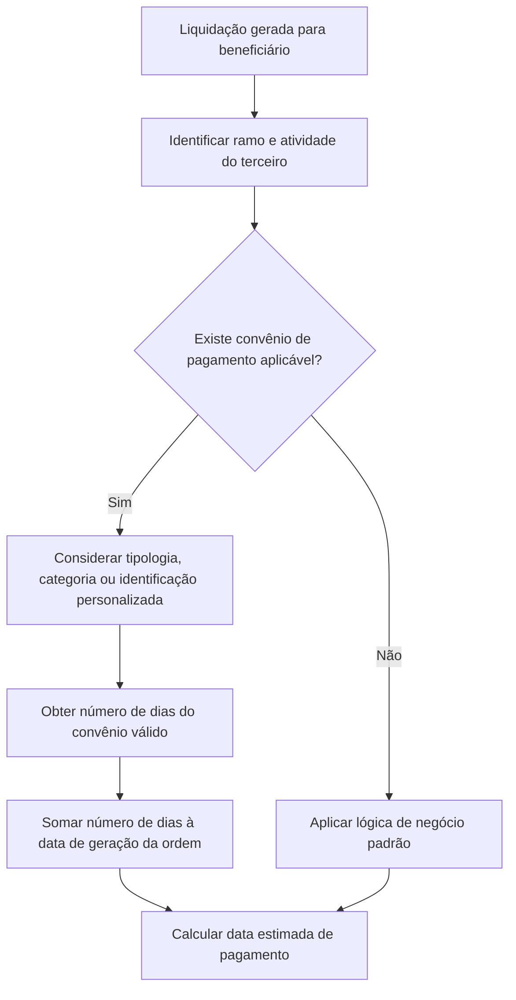

# Definição de Convênios de Pagamento por Ramo, Atividade e/ou Terceiro

## 1. Metadados do Documento
- **Arquivo de Origem:** `Não identificado`
- **Tipo de Documento:** Manual Operacional
- **Domínio / Sistema:** Convênios de pagamento para fornecedores
- **Público-Alvo:** Negócio, Operação, Analistas Funcionais e Desenvolvedores
- **Data/Versão Identificada:** Não identificada

---

## 2. Resumo Executivo & Contexto de Negócio

O documento define o catálogo de **convênios de pagamento por ramo, atividade e/ou terceiro**. O catálogo permite registrar condições de pagamento acordadas pela companhia com pessoas físicas ou jurídicas que possuam relação de fornecedor com a organização.

Os convênios podem ser definidos para uma atividade inteira — por exemplo, todos os talleres da atividade 17 —, para uma tipologia de atividade, para uma categoria específica ou para um fornecedor individualizado. A individualização do fornecedor pode usar tipo e código de documento e, quando aplicável, código interno do terceiro.

A finalidade operacional do catálogo é calcular a **data estimada de pagamento** de uma liquidação. Quando uma liquidação é gerada para um beneficiário compatível com uma atividade, tipologia, categoria ou convênio personalizado, o sistema soma o número de dias definido no convênio à data de geração da ordem.

O cadastro não é obrigatório. Caso a companhia não possua convênios para determinadas atividades ou fornecedores, a data estimada de pagamento seguirá a regra padrão: poderá ser a data do dia ou outra lógica de negócio aplicável à propriedade de data estimada de pagamento.

---

## 3. Arquitetura, Componentes & Tecnologias Envolvidas

O documento descreve um catálogo de manutenção de definições de convênios de pagamento. Não há detalhamento de arquitetura técnica, APIs, bancos de dados, métodos HTTP, contratos JSON, URLs operacionais ou tecnologias de implementação.

Componentes funcionais identificados:

- Catálogo de definições de convênios de pagamento.
- Ramo associado aos tipos de expediente.
- Atividade do terceiro beneficiário.
- Tipologia e categoria da atividade do terceiro.
- Identificação personalizada do terceiro por documento.
- Código interno do terceiro, quando a atividade permitir esse identificador.
- Ordem gerada para cálculo da data estimada de pagamento.
- Liquidação associada ao beneficiário.



> **Nota de Análise:** O documento menciona “Home Solutions APIs Documentation Zeus”, mas não detalha a relação desse elemento com o catálogo, nem fornece interfaces, endpoints ou contratos técnicos.

---

## 4. Regras de Negócio, Especificações Funcionais & Processos

1. O catálogo de convênios de pagamento é destinado a condições acordadas entre a companhia e fornecedores, sejam pessoas físicas ou jurídicas.

2. Um convênio pode ser definido para:
   - Uma atividade completa.
   - Todas as entidades de uma tipologia de atividade.
   - Todas as entidades de uma categoria específica.
   - Um terceiro específico com convênio personalizado.

3. Um exemplo citado é a definição de convênio para todos os talleres da atividade 17.

4. O cálculo da data estimada de pagamento ocorre quando uma liquidação é gerada para um beneficiário que possua atividade, tipologia de atividade, categoria ou identificação de documento compatível com uma definição de convênio.

5. A data estimada de pagamento é calculada somando-se o **Número de dias** à data em que a ordem é gerada.

6. A propriedade **Ramo** identifica a chave do ramo ao qual pertencem os tipos de expediente que receberão associação com o convênio de pagamento por atividade.

7. A propriedade **Atividade do terceiro** representa a relação entre uma pessoa física ou jurídica e a companhia.

8. O **Tipo de Documento do terceiro** identifica o tipo de documento de uma pessoa física ou jurídica. Essa propriedade possui conteúdo quando existir um terceiro sem convênio genérico de atividade, mas com convênio personalizado.

9. O **Código de Documento do terceiro** contém a codificação associada ao tipo de documento. A validação do código depende do tipo de documento.

10. O **Código interno do terceiro** é uma chave interna atribuída manual ou automaticamente a uma pessoa física ou jurídica. Somente atividades previamente definidas como possuidoras de código interno podem utilizar essa propriedade.

11. A **Tipologia do terceiro** representa a tipologia da atividade do beneficiário. O convênio pode ser genérico para todas as tipologias de uma atividade.

12. A **Categoria do terceiro** representa a categoria da atividade do beneficiário. Cada tipologia pode possuir de uma a várias categorias. O convênio pode ser genérico para todas as categorias da atividade.

13. A **Data de Validez** determina a data em que uma definição de convênio é válida.

14. O catálogo é opcional. Quando não houver convênio aplicável, a data estimada de pagamento será definida pelo dia corrente ou pela lógica de negócio aplicável à propriedade.

---

## 5. Tabelas de Parâmetros, Ambientes e Estruturas de Dados

| Item / Parâmetro | Descrição / Função | Tipo / Valores / Formato | Ambiente / Observações |
| :--- | :--- | :--- | :--- |
| Ramo | Indica a chave do ramo ao qual pertencem os tipos de expediente associados ao convênio de pagamento por atividade. | Chave de ramo; formato não detalhado. | Associado aos tipos de expediente. |
| Atividade do terceiro | Define a atividade para a qual serão configurados convênios de pagamento. | Atividade; valores não detalhados. | Representa a relação do terceiro físico ou jurídico com a companhia. |
| Tipo de Documento do terceiro | Contém o tipo de documento identificador de pessoa física ou jurídica. | Tipo de documento; valores não detalhados. | Preenchido quando há convênio personalizado para um terceiro sem convênio de atividade. |
| Código de Documento do terceiro | Contém a codificação correspondente ao tipo de documento. | Número ou codificação; validação dependente do tipo de documento. | A regra específica de validação não é detalhada. |
| Código interno do terceiro | Chave interna atribuída a pessoa física ou jurídica. | Chave interna; formato não detalhado. | Pode ser atribuída manual ou automaticamente; disponível somente para atividades configuradas com código interno. |
| Tipologia do terceiro | Indica a tipologia da atividade do beneficiário. | Tipologia; valores não detalhados. | Pode ser genérica para todas as tipologias da atividade. |
| Categoria do terceiro | Indica a categoria da atividade do beneficiário. | Categoria; cada tipologia pode possuir de 1 a n categorias. | Pode ser genérica para todas as categorias da atividade. |
| Número de dias | Quantidade de dias adicionada à data de geração da ordem para calcular a data estimada de pagamento. | Número de dias; formato numérico implícito. | Parâmetro central para cálculo do pagamento. |
| Fecha de Validez | Data em que a definição de convênio é válida. | Data; formato não detalhado. | Controla a vigência da definição. |
| Data de geração da ordem | Data-base utilizada no cálculo da data estimada de pagamento. | Data; formato não detalhado. | Recebe a soma do número de dias do convênio. |
| Data estimada de pagamento | Resultado do cálculo de pagamento para uma liquidação. | Data; formato não detalhado. | Sem convênio, segue o dia corrente ou a lógica de negócio aplicável. |

---

## 6. Bateria de Perguntas & Respostas para RAG (FAQ Sintético)

### P1: Qual é o objetivo do catálogo de convênios de pagamento por ramo, atividade e/ou terceiro?
**R:** O catálogo registra os convênios de pagamento acordados pela companhia com fornecedores, incluindo pessoas físicas e jurídicas. Esses convênios são usados para determinar como calcular a data estimada de pagamento de uma liquidação.

### P2: O catálogo de definições de convênios de pagamento é obrigatório?
**R:** Não. O documento afirma que o catálogo somente é utilizado quando a companhia possui convênios com atividades ou fornecedores. Na ausência de um convênio, a data estimada de pagamento seguirá a data do dia ou a lógica de negócio aplicável.

### P3: Como é calculada a data estimada de pagamento?
**R:** A data estimada de pagamento é calculada adicionando o número de dias definido no convênio à data em que a ordem é gerada.

### P4: Um convênio pode ser aplicado a todos os fornecedores de uma atividade?
**R:** Sim. O documento informa que um convênio pode ser definido para uma atividade inteira, citando como exemplo todos os talleres da atividade 17.

### P5: Para que serve o campo Ramo?
**R:** O campo Ramo indica a chave do ramo ao qual pertencem os tipos de expediente que receberão associação com o convênio de pagamento por atividade.

### P6: Quando o Tipo de Documento do terceiro deve ser utilizado?
**R:** O Tipo de Documento do terceiro é utilizado quando um terceiro não possui o convênio genérico de sua atividade, mas possui um convênio personalizado. O campo contém somente o tipo de documento identificador do terceiro.

### P7: Como o Código de Documento do terceiro é validado?
**R:** O Código de Documento contém a codificação do tipo de documento. O documento determina que o número ou a codificação possui validação distinta conforme o tipo de documento, mas não descreve as regras específicas de validação.

### P8: Em quais situações o Código interno do terceiro pode ser informado?
**R:** O Código interno do terceiro somente pode ser usado para atividades definidas como atividades que possuem código interno. Essa chave pode ser atribuída manual ou automaticamente a uma pessoa física ou jurídica.

### P9: O que representa a Tipologia do terceiro em um convênio?
**R:** A Tipologia do terceiro representa a tipologia da atividade do beneficiário. Uma definição de convênio pode ser genérica e abranger todas as tipologias da atividade.

### P10: Como a Categoria do terceiro se relaciona com a Tipologia do terceiro?
**R:** A Categoria do terceiro representa uma categoria da atividade do beneficiário. Cada tipologia pode possuir de uma a várias categorias, e um convênio pode ser genérico para todas as categorias da atividade.

### P11: Qual é a finalidade da Fecha de Validez?
**R:** A Fecha de Validez indica a data em que uma definição de convênio é válida.

### P12: O documento detalha APIs ou contratos técnicos para manutenção dos convênios?
**R:** Não. Embora haja referência textual a “Home Solutions APIs Documentation Zeus”, o conteúdo fornecido não apresenta endpoints, métodos HTTP, payloads, contratos JSON, autenticação ou detalhes de integração.

---

## 7. Glossário de Termos, Siglas & Conceitos-Chave

- **Atividade do terceiro:** Relação que uma pessoa física ou jurídica possui com a companhia.
- **Beneficiário:** Terceiro para o qual uma liquidação é gerada.
- **Categoria do terceiro:** Categoria vinculada à atividade do beneficiário; cada tipologia pode possuir de uma a várias categorias.
- **Código de Documento do terceiro:** Número ou codificação do documento identificador, validado conforme o tipo de documento.
- **Código interno do terceiro:** Chave interna atribuída manual ou automaticamente a uma pessoa física ou jurídica.
- **Convênio de pagamento:** Definição de condição de pagamento usada para calcular a data estimada de pagamento.
- **Fecha de Validez:** Data de vigência ou validade da definição de convênio.
- **Liquidação:** Evento para o qual é calculada uma data estimada de pagamento.
- **Número de dias:** Quantidade de dias acrescida à data de geração da ordem.
- **Ramo:** Chave que identifica o ramo relacionado aos tipos de expediente associados ao convênio.
- **Tercero:** Pessoa física ou jurídica que possui relação com a companhia.
- **Tipologia do terceiro:** Tipologia associada à atividade do beneficiário.

---

## 8. Notas Críticas, Riscos & Limitações

- O documento não informa o nome do arquivo, a data, a versão, o sistema responsável pelo catálogo ou a equipe proprietária.
- Não há especificação de prioridade entre convênios genéricos por atividade, tipologia, categoria e convênios personalizados por terceiro.
- Não são descritas as regras de conflito entre múltiplas definições potencialmente aplicáveis ao mesmo beneficiário.
- Não há formatos, domínios permitidos ou regras detalhadas de validação para ramo, atividade, documentos, tipologias, categorias e datas.
- A regra padrão aplicável quando não há convênio é citada de forma genérica: “data estimada de pagamento do dia” ou lógica de negócio da propriedade, sem detalhamento adicional.
- Não há detalhamento técnico de persistência, integração, segurança, auditoria, APIs ou tratamento de erros.

---

## 9. Conteúdo Bruto Estruturado (Referência Fiel)

```text
--- [PÁGINA 1 DE 3] ---

Definición CONVENIOS de PAGO por RAMO,
ACTIVIDAD y/o TERCERO
Objetivo
Definir los convenios de pago que la compañía haya acordado con las diferentes actividades de
Personas físicas y jurídicas que tengan relación con la compañía y sean Proveedores sabiendo que
estos convenios pueden ser para una actividad, por ejemplo con todos los talleres (actividad 17), o
para todos los talleres de una Tipología o de una categoría específica.
La finalidad es definir cuando se genere una liquidación para un beneficiario que tiene la actividad o
la actividad tipo y código de documento, cómo se va a calcular la fecha estimada de pago, según el
número de días definido en este catálogo.
Imagen del Mantenimiento Definiciones de Convenios de Pago por actividad:
Ejemplo:
 / 
 CF
Home Solutions APIs Documentation Zeus
EN


--- [PÁGINA 2 DE 3] ---

Propiedades
Ramo
Esta propiedad indica la clave del Ramo al que pertenece los tipos de expedientes, a los que se les
va a asociar el convenio de pago por actividad.
Actividad del tercero
Este campo contiene la actividad a la que se la va a definir los convenios de pago. La actividad es la
relación que tiene un tercero físico o jurídico con la compañía.
Tipo de Documento del tercero
El tipo documento es el documento identificador de la persona física o jurídica. Esta propiedad sólo
contiene el tipo de documento, esta propiedad tendrá contenido, si hay un tercero que no tiene el
convenio de su actividad, si no que tiene un convenio personalizado.
Código de Documento del tercero
Ejemplo:


--- [PÁGINA 3 DE 3] ---

Esta propiedad contiene la codificación del tipo de documento. Según el tipo de documento el
número o codificación tendrá una validación distinta
Código interno del tercero
Contiene la clave interna que se asigna manual o automáticamente a una persona física o jurídica.
Esta propiedad sólo lo podrán tener las actividades que se hayan definido que tienen un código
interno.
Tipología del tercero
Esta propiedad contiene la tipología de la actividad del beneficiario. Puede ser genérica para todas
las tipologías de la actividad.
Categoría del tercero
Esta propiedad contiene la categoría de la actividad del beneficiario. Cada tipología puede tener de 1
a n categorías. Puede ser genérica para todas las categorías de la actividad.
Número de días
Esta propiedad contiene el número de días que hay que sumar a la fecha en la que se genera la
orden, para calcular la fecha estimada de pago.
Fecha de Validez
Fecha en la que es válida la definición del convenio.
Preguntas frecuentes
¿Es obligatorio definir este catálogo?
R/No, no es obligatorio, es sólo cuando se tiene en la compañía convenios con algunas
actividades o con algún proveedor, si no saldrá con la fecha estimada de pago del día o de lo
que indique la lógica de negocio de esta propiedad.
Ejemplo:
Ejemplo:
```
