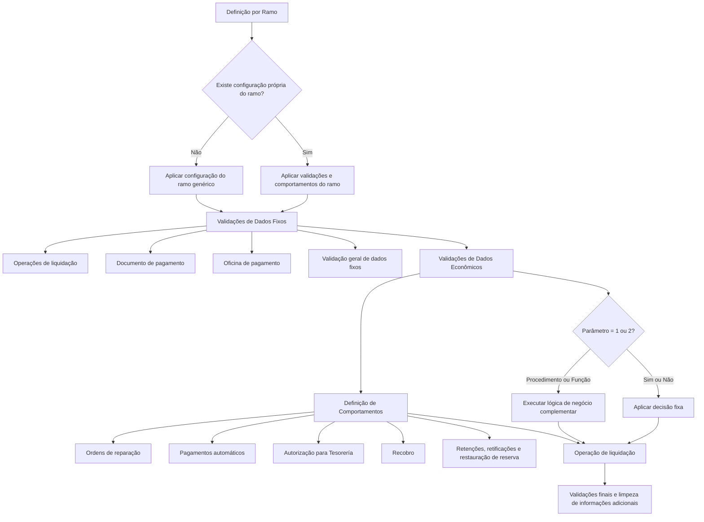

# Definición de Validaciones en la Liquidación — Configuração de Validações e Comportamentos de Liquidações

## 1. Metadados do Documento
- **Arquivo de Origem:** Não identificado no conteúdo fornecido
- **Tipo de Documento:** Especificação Técnica / Manual Funcional
- **Domínio / Sistema:** Reef.core — Liquidações de sinistros, reservas, ordens de pagamento, impostos e recobros
- **Público-Alvo:** Desenvolvedores, Arquitetos, Analistas Funcionais, Operação e Tesouraria
- **Data/Versão Identificada:** Não identificada

---

## 2. Resumo Executivo & Contexto de Negócio

O documento descreve as propriedades configuráveis que controlam validações, cálculos e comportamentos do processo de liquidação no contexto de **Reef.core**. Essas propriedades permitem estabelecer definições distintas por ramo, incluindo a utilização de um ramo genérico quando não existir configuração específica para determinado ramo.

As configurações estão organizadas em três grandes áreas: **Validações de Dados Fixos da Liquidação**, **Validações de Dados Econômicos da Liquidação** e **Definição de Comportamentos**. O objetivo é possibilitar que cada instalação implemente lógica de negócio própria para validar atributos da liquidação, condicionar cálculos tributários, restringir pagamentos, gerir reservas e definir fluxos relacionados a ordens de pagamento.

Diversas propriedades aceitam valores codificados: `1: Si`, `2: No`, `3: Procedimiento` e `4: Función`. Quando uma propriedade recebe `3` ou `4`, uma propriedade complementar deve conter a lógica de negócio que decide dinamicamente o comportamento aplicável. Essa abordagem permite substituir decisões fixas por procedimentos ou funções dependentes de múltiplos fatores.

O documento também explicita comportamentos padrão do core em alguns cenários. Entre eles, Reef.core valida que uma oficina de pagamento seja de nível 3, utiliza por padrão a rotina de cálculo de impostos do próprio core e, em determinadas decisões relacionadas à reserva e à exclusão de pagamento automático, retorna `N`. Para retificação de liquidações de meses anteriores, o core retorna `S`.

A especificação não detalha contratos técnicos, assinaturas, métodos HTTP, persistência, nomes de procedimentos, nem implementações das lógicas de negócio citadas. As propriedades são descritas no nível funcional e configuracional.

---

## 3. Arquitetura, Componentes & Tecnologias Envolvidas

### Componentes e conceitos identificados

| Componente / Conceito | Papel descrito |
| :--- | :--- |
| **Reef.core** | Core que executa operações de liquidação, realiza controles padrão e fornece comportamentos default para determinadas propriedades. |
| **Liquidações** | Operações de geração, alteração, anulação e liquidação de expedientes terminados. |
| **Ramo** | Chave usada para definir validações extras de atributos e comportamentos das liquidações. |
| **Ramo genérico** | Configuração aplicável a ramos que não possuem definição própria. |
| **Expediente** | Entidade associada à liquidação, à reserva, à valoração e aos conceitos de reserva. |
| **Reserva** | Valor remanescente do expediente, afetado por liquidações parciais, anulação de ordem de pagamento e ajustes de valoração. |
| **Cobertura** | Elemento cuja valoração é considerada para decidir se um conceito de reserva pode ser liquidado quando possui valor zero. |
| **Conceito de reserva** | Conceito liquidável associado a uma cobertura e à reserva de um expediente. |
| **Documento de pagamento** | Documento sujeito a validações de identificador, data, moeda, oficina de pagamento e tipo de documento do emissor. |
| **Ordem de pagamento** | Ordem gerada por liquidações de sinistros; pode seguir pagamento automático, autorização para Tesorería, anulação e registro no Livro de Compras. |
| **Impostos e retenções** | Valores cujo cálculo, ajuste, rotina e simulação podem ser configurados. |
| **Liquidações Batch** | Liquidações executadas em diferido, com rotina específica configurável para cálculo de impostos. |
| **Ordens de reparação** | Ordens pendentes que podem condicionar a realização de outras liquidações. |
| **Recobro** | Processo cuja abertura pode ser consultada quando o expediente possui possibilidade de associação e ainda não há recobro aberto. |
| **Tesorería** | Área que pode ser responsável por autorizar ordens de pagamento de sinistros. |
| **Livro de Compras** | Registro de impostos que pode conter ordens de pagamento e exigir anulação de registros quando uma ordem é anulada. |
| **`clo_pym_typ_prd_nam`** | Termo listado no documento, sem explicação adicional. |
| **pago cobro dinamico** | Termo listado no documento, sem explicação adicional. |

### Fluxo funcional de configuração e execução



> **Nota de Análise:** O documento não apresenta arquitetura de infraestrutura, endpoints, contratos JSON, bancos de dados, filas, protocolos ou integrações técnicas. O diagrama representa exclusivamente as relações funcionais explicitadas.

---

## 4. Regras de Negócio, Especificações Funcionais & Processos

### 4.1 Aplicação de definições por ramo

1. A propriedade **Ramo** contém a chave do ramo para o qual são definidas validações extras de atributos e/ou comportamentos de liquidações.
2. Pode ser utilizado um **ramo genérico**.
3. A definição genérica é aplicada a todos os ramos que não possuem definição própria.

### 4.2 Validações de dados fixos da liquidação

#### Validação de operações de liquidação

A propriedade **Valida operaciones liquidación** contém lógica de negócio capaz de realizar validações quando são selecionadas as seguintes operações:

1. Gerar Liquidação.
2. Modificar Liquidação.
3. Gerar Liquidação para expediente terminado.
4. Anular Liquidação.

#### Validação do identificador do documento de pagamento

A propriedade **Validación del identificador del Documento de Pago** contém lógica de negócio para validar o identificador ou número do documento de pagamento.

#### Validação da data do documento de pagamento

A propriedade **Validación de la Fecha del Documento de Pago** contém lógica de negócio para validar a data do documento de pagamento.

#### Validação da moeda do documento de pagamento

A propriedade **Validación de la moneda del Documento de Pago** contém lógica de negócio para executar validações adicionais sobre a moeda do documento de pagamento.

- As operações de liquidação já controlam que a moeda exista.
- A propriedade permite adicionar validações além da existência da moeda.

#### Validação da oficina de pagamento

A propriedade **Validación de la oficina de pago** contém a lógica de negócio necessária para validar a oficina de pagamento.

- Reef.core valida que a oficina seja uma **oficina de pagamento de nível 3**.

#### Validação do tipo de documento do emissor

A propriedade **Validación del tipo de documento del emisor** permite executar validações adicionais sobre o tipo de documento do emissor do documento de pagamento.

- As operações de liquidação já controlam que o tipo de documento exista.

#### Validação geral de dados fixos

A propriedade **Validación General de los Datos Fijos de la Liquidación** permite validar qualquer dado fixo da liquidação.

- A validação é disparada no último atributo existente antes da obtenção dos valores econômicos da liquidação.

### 4.3 Validações de dados econômicos da liquidação

#### Chamada ao cálculo de impostos

A propriedade **¿Se llama al cálculo de impuestos?** informa às operações de liquidação se o cálculo de impostos será realizado.

| Valor | Significado |
| :--- | :--- |
| `1` | Sim |
| `2` | Não |
| `3` | Procedimento |
| `4` | Função |

Quando o valor é `3` ou `4`, a propriedade **Lógica que determina si se calculan impuestos** deve conter a lógica de negócio que determina se os impostos são calculados.

Essa decisão não é necessariamente sempre “Sim” ou “Não”; pode depender de vários fatores.

#### Ajuste de imposto

A propriedade **Lógica de Negocio que determina si se permite un ajuste del impuesto** define se é permitido ajustar o imposto calculado, isto é, se será possível modificar o imposto após o cálculo.

#### Rotina de cálculo de impostos e/ou retenções

A propriedade **Lógica que devolverá qué rutina va a calcular los impuestos y/o retenciones** retorna o programa encarregado de calcular impostos.

- Por padrão, a propriedade retorna a rotina de Reef.core.

A propriedade **Lógica que devolverá qué rutina va a calcular los impuestos y/o retenciones en las liquidaciones Batch** retorna a rotina de cálculo de impostos aplicável a liquidações Batch executadas em diferido.

- Por padrão, a propriedade retorna a rotina de Reef.core.

#### Liquidação quando valoração de cobertura e conceito de reserva é zero

A propriedade **¿Se permite liquidar cuando la valoración de la cobertura y el concepto de reserva es 0?** define se um conceito de reserva pode ser liquidado quando sua valoração é zero.

| Valor | Significado |
| :--- | :--- |
| `1` | Sim |
| `2` | Não |
| `3` | Procedimento |
| `4` | Função |

Quando o valor é `3` ou `4`, a propriedade **Lógica que determina si se puede liquidar cuando la valoración de la cobertura y el concepto de reserva es 0** deve decidir se é possível liquidar a cobertura e o conceito de reserva com valoração zero.

- Se a liquidação não for permitida e for necessária, deve ser realizado previamente um **cambio de valoración**.

#### Reserva do expediente igual a zero

A propriedade **¿Se permite dejar la reserva del expediente a 0?** define se, em uma liquidação parcial, o valor valorado e o valor liquidado podem ficar iguais, deixando a reserva do expediente em zero.

| Valor | Significado |
| :--- | :--- |
| `1` | Sim |
| `2` | Não |
| `3` | Procedimento |
| `4` | Função |

Quando o valor é `3` ou `4`, a propriedade **Lógica de Negocio que devuelve si se va a permitir o no, que la reserva del expediente quede 0 en un Expediente Pendiente** deve retornar à operação de liquidações se é permitido deixar a reserva em zero durante uma liquidação parcial.

- O core retorna `N`.

#### Liquidação acima do valor valorado

A propriedade **¿Se permite liquidar por un importe superior al importe valorado?** determina se é permitido liquidar um valor superior ao valor estimado.

- A liquidação realiza ajuste automático da valoração quando o valor liquidado é superior.
- A propriedade existe porque algumas companhias exigem que seja feita uma alteração de valoração antes de liquidar.

| Valor | Significado |
| :--- | :--- |
| `1` | Sim |
| `2` | Não |
| `3` | Procedimento |
| `4` | Função |

Quando o valor é `3` ou `4`, a propriedade **Lógica de Negocio que devuelve si se va a permitir o no, que se liquide un importe superior al importe valorado del expediente** deve informar à operação de liquidações se a liquidação acima do valor valorado é permitida.

- O documento afirma que o core retorna `N` para essa lógica.
- **Nota de Análise:** A descrição dessa propriedade menciona novamente permitir que a reserva fique em zero em liquidação parcial, embora o título trate da liquidação acima do valor valorado. A inconsistência foi preservada por fidelidade ao texto-fonte.

### 4.4 Definição de comportamentos

#### Outras liquidações com ordens de reparação pendentes

A propriedade **¿Se puede realizar otras liquidaciones si se tienen órdenes de reparación pendientes?** define se podem ser realizadas outras liquidações quando existem ordens de reparação pendentes.

| Valor | Significado |
| :--- | :--- |
| `1` | Sim |
| `2` | Não |
| `3` | Procedimento |
| `4` | Função |

Quando o valor é `3` ou `4`, a propriedade **Lógica que determina si se puede realizar otras liquidaciones si se tienen órdenes de reparación pendientes** determina se é possível realizar outras liquidações enquanto há ordens de reparação pendentes sem liquidar.

#### Exclusão de ordem de pagamento do processo automático

As ordens de pagamento de sinistros são geradas com indicação de pagamento automático na data estimada de pagamento. A propriedade **¿Se va a excluir la orden de pago del proceso de pagos automático?** permite alterar esse comportamento.

| Valor | Significado |
| :--- | :--- |
| `1` | Sim |
| `2` | Não |
| `3` | Procedimento |
| `4` | Função |

Quando o valor é `3` ou `4`, a propriedade **Lógica de negocio que va a excluir la orden de pago de siniestros, del proceso de pagos automático** determina se a ordem de pagamento será excluída do processo automático de pagamentos.

- O core retorna `N`.

#### Liquidação de honorários e gastos com indenização retida

A propriedade **Lógica que determina si se puede liquidar honorarios y gastos aunque esté retenido indemnización por control técnico** informa se é permitido liquidar honorários e/ou gastos quando o expediente está retido pelo conceito de indenização.

#### Autorização de ordem de pagamento para Tesorería

As ordens de pagamento de sinistros normalmente saem autorizadas para pagamento. A propriedade **¿Autorizo la orden de pago para Tesorería?** indica se uma ordem sai autorizada ou se deve ser aplicada uma lógica de negócio.

| Valor | Significado |
| :--- | :--- |
| `1` | Sim |
| `2` | Não |
| `3` | Procedimento |
| `4` | Função |

Quando o valor é `3` ou `4`, a propriedade **Lógica que determina si la orden de pago de siniestros sale autorizada** define se a ordem de pagamento sai autorizada.

#### Consulta sobre abertura de recobro

A propriedade **Pregunta si necesario abrir un recobro** pergunta, durante as liquidações, se é necessário abrir um recobro quando:

1. O expediente possui possibilidade de associação a um recobro.
2. O recobro ainda não está aberto.

| Valor | Significado |
| :--- | :--- |
| `1` | Sim |
| `2` | Não |
| `3` | Procedimento |
| `4` | Função |

Quando o valor é `3` ou `4`, a propriedade **Lógica que indica si se pregunta si es necesario abrir un recobro** determina se deve ser solicitada confirmação para abrir um recobro.

#### Validações ao final da liquidação

A propriedade **Lógica de Negocio para realizar validaciones al final de la liquidación** permite:

- Executar validações próprias.
- Gravar informações próprias da instalação.

#### Exclusão de informação adicional da instalação

A propriedade **Lógica de negocio para borrado de información adicional propia de la instalación** permite excluir informações próprias da instalação:

- Quando a operação não chega ao final.
- Para excluir tabelas transitórias próprias.

#### Simulação do cálculo de retenção

A propriedade **Se simula el cálculo de la retención** determina se o cálculo da retenção é simulado.

| Valor | Significado |
| :--- | :--- |
| `1` | Sim |
| `2` | Não |
| `3` | Procedimento |
| `4` | Função |

As propriedades relacionadas determinam se a retenção é simulada:

1. Na tela de valores.
2. Ao finalizar a liquidação.

#### Retificação de liquidações de meses anteriores

A propriedade **¿Se puede rectificar liquidaciones de meses anteriores?** define se liquidações de meses anteriores podem ser retificadas.

| Valor | Significado |
| :--- | :--- |
| `1` | Sim |
| `2` | Não |
| `3` | Procedimento |
| `4` | Função |

Quando o valor é `3` ou `4`, a propriedade **Lógica de Negocio que determina si se puede rectificar o no una Liquidación de meses anteriores** determina se a retificação é permitida.

- O core retorna `S`.
- Para países que registram ordens de pagamento no Livro de Compras, a legislação define o prazo máximo para modificar uma ordem já informada no registro de impostos.

#### Restauração de reserva na anulação de ordem de pagamento

A propriedade **¿ Se restaura la reserva si se anula la orden de pago?** define se a reserva é restaurada quando uma ordem de pagamento é anulada.

| Valor | Significado |
| :--- | :--- |
| `1` | Sim |
| `2` | Não |
| `3` | Procedimento |
| `4` | Função |

Quando o valor é `3` ou `4`, a propriedade **Lógica de Negocio que determina si al anularse la orden de pago se restaura la reserva** deve determinar se, ao anular uma liquidação, a reserva é restaurada pelo valor da liquidação anulada.

Exemplo funcional declarado:

- Se uma liquidação de `100` em moeda local for anulada, a lógica determina se a valoração é aumentada pelos `100` anulados.

#### Anulação no Livro de Compras

A propriedade **Lógica de Negocio que anula la orden del libro de compras** é responsável por anular, no Livro de Compras, os registros correspondentes a uma ordem de pagamento anulada, caso a ordem tenha sido registrada anteriormente.

---

## 5. Tabelas de Parâmetros, Ambientes e Estruturas de Dados

### Valores padronizados de propriedades condicionais

| Item / Parâmetro | Descrição / Função | Tipo / Valores / Formato | Ambiente / Observações |
| :--- | :--- | :--- | :--- |
| Valor de configuração | Determina comportamento diretamente ou por lógica configurada. | `1: Si`; `2: No`; `3: Procedimiento`; `4: Función` | Aplicável às propriedades que explicitam esses valores. |
| Procedimiento | Indica que a decisão depende de lógica de negócio em procedimento. | Valor `3` | Requer propriedade de lógica complementar. |
| Función | Indica que a decisão depende de lógica de negócio em função. | Valor `4` | Requer propriedade de lógica complementar. |

### Propriedades de validação de dados fixos

| Item / Parâmetro | Descrição / Função | Tipo / Valores / Formato | Ambiente / Observações |
| :--- | :--- | :--- | :--- |
| Ramo | Chave do ramo para o qual são definidas validações extras de atributos e comportamentos. | Chave de ramo | Pode usar ramo genérico para ramos sem definição própria. |
| Valida operaciones liquidación | Valida operações de gerar, modificar, gerar para expediente terminado e anular liquidação. | Lógica de negócio | Não são detalhadas regras específicas. |
| Validación del identificador del Documento de Pago | Valida o identificador ou número do documento de pagamento. | Lógica de negócio | Não detalha formato do identificador. |
| Validación de la Fecha del Documento de Pago | Valida a data do documento de pagamento. | Lógica de negócio | Não detalha formato ou limites de data. |
| Validación de la moneda del Documento de Pago | Executa validações extras da moeda do documento de pagamento. | Lógica de negócio | A existência da moeda já é controlada pelas operações de liquidação. |
| Validación de la oficina de pago | Valida a oficina de pagamento. | Lógica de negócio | Reef.core valida oficina de pagamento de nível 3. |
| Validación del tipo de documento del emisor | Executa validações extras do tipo de documento do emissor. | Lógica de negócio | A existência do tipo de documento já é controlada pelas operações de liquidação. |
| Validación General de los Datos Fijos de la Liquidación | Valida qualquer dado fixo da liquidação. | Lógica de negócio | Executada no último atributo antes da obtenção dos importes econômicos. |

### Propriedades de dados econômicos

| Item / Parâmetro | Descrição / Função | Tipo / Valores / Formato | Ambiente / Observações |
| :--- | :--- | :--- | :--- |
| ¿Se llama al cálculo de impuestos? | Define se as operações de liquidação calculam impostos. | `1`, `2`, `3` ou `4` | Para `3` ou `4`, utiliza lógica complementar. |
| Lógica que determina si se calculan impuestos | Determina dinamicamente se impostos são calculados. | Lógica de negócio | Aplicável se a propriedade anterior for `3` ou `4`; pode depender de vários fatores. |
| Lógica de Negocio que determina si se permite un ajuste del impuesto | Define se o imposto calculado pode ser modificado. | Lógica de negócio | Não são descritos critérios. |
| Lógica que devolverá qué rutina va a calcular los impuestos y/o retenciones | Retorna a rotina ou programa de cálculo de impostos e/ou retenções. | Lógica de negócio | Por padrão, retorna a rotina de Reef.core. |
| Lógica que devolverá qué rutina va a calcular los impuestos y/o retenciones en las liquidaciones Batch | Retorna rotina para cálculo de impostos em liquidações Batch em diferido. | Lógica de negócio | Por padrão, retorna a rotina de Reef.core. |
| ¿Se permite liquidar cuando la valoración de la cobertura y el concepto de reserva es 0? | Define se conceito de reserva com valoração zero pode ser liquidado. | `1`, `2`, `3` ou `4` | Para `3` ou `4`, utiliza lógica complementar. |
| Lógica que determina si se puede liquidar cuando la valoración de la cobertura y el concepto de reserva es 0 | Define dinamicamente se cobertura e conceito de reserva com valoração zero podem ser liquidados. | Lógica de negócio | Caso não seja permitido, é necessário cambio de valoración prévio. |
| ¿Se permite dejar la reserva del expediente a 0? | Define se a reserva pode ficar em zero após liquidação parcial. | `1`, `2`, `3` ou `4` | Ocorre quando valor valorado e liquidado ficam iguais. |
| Lógica de Negocio que devuelve si se va a permitir o no, que la reserva del expediente quede 0 en un Expediente Pendiente | Decide se a reserva de expediente pendente pode ficar em zero. | Lógica de negócio | Aplicável para `3` ou `4`; core retorna `N`. |
| ¿Se permite liquidar por un importe superior al importe valorado? | Define se é permitido liquidar acima do valor estimado. | `1`, `2`, `3` ou `4` | A liquidação faz ajuste automático da valoração se o valor liquidado for maior. |
| Lógica de Negocio que devuelve si se va a permitir o no, que se liquide un importe superior al importe valorado del expediente | Decide se liquidação acima do valor valorado é permitida. | Lógica de negócio | Aplicável para `3` ou `4`; documento declara core `N`. |

### Propriedades de comportamento

| Item / Parâmetro | Descrição / Função | Tipo / Valores / Formato | Ambiente / Observações |
| :--- | :--- | :--- | :--- |
| ¿Se puede realizar otras liquidaciones si se tienen órdenes de reparación pendientes? | Define se outras liquidações podem ser realizadas com ordens de reparação pendentes. | `1`, `2`, `3` ou `4` | Pode depender de lógica complementar. |
| Lógica que determina si se puede realizar otras liquidaciones si se tienen órdenes de reparación pendientes | Decide a realização de outras liquidações com ordens pendentes sem liquidar. | Lógica de negócio | Aplicável para `3` ou `4`. |
| ¿Se va a excluir la orden de pago del proceso de pagos automático? | Define se uma ordem de pagamento é excluída do pagamento automático. | `1`, `2`, `3` ou `4` | Ordens são geradas para pagamento automático na data estimada, salvo alteração de comportamento. |
| Lógica de negocio que va a excluir la orden de pago de siniestros, del proceso de pagos automático | Decide exclusão da ordem de pagamento de sinistros do processo automático. | Lógica de negócio | Aplicável para `3` ou `4`; core retorna `N`. |
| Lógica que determina si se puede liquidar honorarios y gastos aunque esté retenido indemnización por control técnico | Define se honorários e gastos podem ser liquidados com indenização retida. | Lógica de negócio | Não são descritos critérios adicionais. |
| ¿Autorizo la orden de pago para Tesorería? | Define se ordem de pagamento sai autorizada ou depende de lógica. | `1`, `2`, `3` ou `4` | Ordens de sinistros normalmente saem autorizadas para pagamento. |
| Lógica que determina si la orden de pago de siniestros sale autorizada | Decide se a ordem de pagamento sai autorizada. | Lógica de negócio | Aplicável para `3` ou `4`. |
| Pregunta si necesario abrir un recobro | Define se deve perguntar sobre abertura de recobro. | `1`, `2`, `3` ou `4` | Aplicável quando há possibilidade de recobro e ele não está aberto. |
| Lógica que indica si se pregunta si es necesario abrir un recobro | Decide se deve haver solicitação de confirmação para abrir recobro. | Lógica de negócio | Aplicável para `3` ou `4`. |
| Lógica de Negocio para realizar validaciones al final de la liquidación | Executa validações próprias ou grava dados próprios da instalação ao fim da liquidação. | Lógica de negócio | Não são detalhados os dados gravados. |
| Lógica de negocio para borrado de información adicional propia de la instalación | Remove dados próprios ou tabelas transitórias quando a operação não finaliza. | Lógica de negócio | Aplicável a informações próprias da instalação. |
| Se simula el cálculo de la retención | Define se a retenção é simulada. | `1`, `2`, `3` ou `4` | Relacionada à tela de importes e à finalização da liquidação. |
| ¿Se puede rectificar liquidaciones de meses anteriores? | Define se liquidações de meses anteriores podem ser retificadas. | `1`, `2`, `3` ou `4` | Core retorna `S`; legislação pode limitar alteração em países com Livro de Compras. |
| Lógica de Negocio que determina si se puede rectificar o no una Liquidación de meses anteriores | Decide se a retificação de meses anteriores é permitida. | Lógica de negócio | Aplicável para `3` ou `4`. |
| ¿ Se restaura la reserva si se anula la orden de pago? | Define se reserva é restaurada ao anular ordem de pagamento. | `1`, `2`, `3` ou `4` | Aplicável a anulação de liquidação. |
| Lógica de Negocio que determina si al anularse la orden de pago se restaura la reserva | Decide se reserva/valoração aumenta pelo importe anulado. | Lógica de negócio | Aplicável para `3` ou `4`. |
| Lógica de Negocio que anula la orden del libro de compras | Anula registros do Livro de Compras de ordem de pagamento já registrada e anulada. | Lógica de negócio | Depende de registro prévio da ordem no Livro de Compras. |

### Ambientes, URLs, servidores e rotas de log

| Item / Parâmetro | Descrição / Função | Tipo / Valores / Formato | Ambiente / Observações |
| :--- | :--- | :--- | :--- |
| Ambientes | Não identificados. | Não informado | O texto não lista ambientes. |
| URLs | Não identificadas. | Não informado | O trecho “Home Solutions APIs Documentation Zeus” não apresenta URL ou contexto técnico suficiente. |
| Servidores | Não identificados. | Não informado | Não há mapeamento de servidores. |
| Rotas de log | Não identificadas. | Não informado | Não há caminhos, arquivos ou variáveis de log. |

---

## 6. Bateria de Perguntas & Respostas para RAG (FAQ Sintético)

### P1: Como as validações de liquidação são aplicadas quando um ramo não possui configuração específica?
**R:** Quando não existe uma definição própria para o ramo, pode ser utilizado um ramo genérico. A definição configurada para o ramo genérico aplica-se a todos os ramos que não tenham uma definição própria de validações extras de atributos e/ou comportamentos de liquidação.

### P2: Quais operações podem ser validadas pela propriedade “Valida operaciones liquidación”?
**R:** A propriedade pode executar validações de negócio nas operações de gerar liquidação, modificar liquidação, gerar liquidação para expediente terminado e anular liquidação.

### P3: O Reef.core já verifica se a moeda e o tipo de documento do emissor existem?
**R:** Sim. As operações de liquidação já controlam que a moeda do documento de pagamento exista e que o tipo de documento do emissor exista. As respectivas propriedades de validação permitem acrescentar validações extras além desses controles existentes.

### P4: O que significam os valores 1, 2, 3 e 4 nas propriedades de comportamento e validação?
**R:** Os valores significam `1: Si`, `2: No`, `3: Procedimiento` e `4: Función`. Quando a propriedade recebe `3` ou `4`, uma lógica de negócio complementar deve determinar dinamicamente a decisão aplicável.

### P5: Como é decidido se o cálculo de impostos será executado na liquidação?
**R:** A propriedade “¿Se llama al cálculo de impuestos?” pode indicar diretamente Sim ou Não, ou pode apontar para Procedimento ou Função. Quando o valor é `3` ou `4`, a lógica “Lógica que determina si se calculan impuestos” decide se os impostos serão calculados, considerando que a decisão pode depender de vários fatores.

### P6: Qual rotina calcula impostos e retenções por padrão?
**R:** Tanto para liquidações usuais quanto para liquidações Batch em diferido, a rotina retornada por padrão para calcular impostos e/ou retenções é a rotina de Reef.core.

### P7: É possível liquidar um conceito de reserva quando a valoração da cobertura e do conceito de reserva é zero?
**R:** Sim, não, ou condicionalmente por procedimento ou função, conforme o valor da propriedade “¿Se permite liquidar cuando la valoración de la cobertura y el concepto de reserva es 0?”. Se a decisão depender de lógica, a propriedade complementar avalia o caso. Caso a liquidação não seja permitida, deve ser realizado previamente um cambio de valoración.

### P8: O que acontece quando se tenta liquidar acima do importe valorado?
**R:** A liquidação realiza automaticamente um ajuste da valoração quando o importe liquidado é superior ao importe valorado. Contudo, a configuração pode impedir essa liquidação e exigir que a companhia realize uma mudança de valoração antes de liquidar. Quando a decisão é controlada por lógica de negócio, o documento informa que o core retorna `N`.

### P9: Como o sistema trata ordens de pagamento no processo automático de pagamentos?
**R:** As ordens de pagamento de sinistros são geradas para pagamento automático na data estimada de pagamento. A propriedade de exclusão permite alterar esse comportamento. Quando configurada como procedimento ou função, a lógica complementar determina se a ordem será excluída; o core retorna `N`.

### P10: Quando uma ordem de pagamento de sinistro precisa de autorização para Tesorería?
**R:** As ordens de pagamento de sinistros normalmente saem autorizadas para pagamento. A propriedade “¿Autorizo la orden de pago para Tesorería?” pode determinar Sim, Não, Procedimento ou Função. Se o valor for `3` ou `4`, uma lógica de negócio define se a ordem de pagamento sai autorizada.

### P11: Em que situação o sistema pergunta se é necessário abrir um recobro?
**R:** O parâmetro pergunta se é necessário abrir um recobro quando o expediente tem possibilidade de associação a um recobro e esse recobro ainda não está aberto. A decisão pode ser fixa ou determinada por lógica de negócio complementar.

### P12: A reserva pode ser restaurada ao anular uma ordem de pagamento?
**R:** Sim, dependendo da configuração. A propriedade correspondente pode ser Sim, Não, Procedimento ou Função. Quando controlada por lógica de negócio, essa lógica determina se a anulação da liquidação restaura a reserva pelo valor liquidado e anulado; o exemplo dado é uma liquidação de 100 em moeda local.

### P13: É permitido retificar liquidações de meses anteriores?
**R:** A permissão é configurável por Sim, Não, Procedimento ou Função. O core retorna `S`. Porém, em países que registram ordens de pagamento no Livro de Compras, a legislação estabelece o tempo limite para alterar uma ordem já informada no registro de impostos.

---

## 7. Glossário de Termos, Siglas & Conceitos-Chave

- **Reef.core:** Core citado como responsável por controles padrão e rotinas default no processo de liquidações.
- **Liquidação:** Operação que pode ser gerada, modificada, criada para expediente terminado ou anulada.
- **Ramo:** Chave de segmentação para definir validações extras de atributos e comportamentos das liquidações.
- **Ramo genérico:** Definição aplicável a ramos sem configuração própria.
- **Expediente:** Entidade relacionada a reservas, valoração, liquidações, recobros e ordens de pagamento.
- **Reserva:** Valor do expediente que pode chegar a zero em liquidação parcial ou ser restaurado após anulação.
- **Valoração:** Valor estimado associado à cobertura e ao conceito de reserva; pode exigir alteração antes de certas liquidações.
- **Cobertura:** Elemento cuja valoração é considerada com o conceito de reserva no processo de liquidação.
- **Conceito de reserva:** Conceito associado à reserva que pode ser objeto de liquidação.
- **Documento de pagamento:** Documento sujeito a validações de identificador, data, moeda, oficina de pagamento e tipo de documento do emissor.
- **Oficina de pagamento nível 3:** Nível de oficina validado por Reef.core para pagamento.
- **Liquidações Batch:** Operações de liquidação executadas em diferido.
- **Retenção:** Valor cujo cálculo pode ser simulado na tela de importes e ao finalizar a liquidação.
- **Ordem de pagamento:** Ordem gerada por liquidações de sinistros, sujeita a pagamento automático, autorização, anulação e possível registro no Livro de Compras.
- **Tesorería:** Área para a qual a autorização de uma ordem de pagamento pode ser configurada.
- **Ordens de reparação:** Ordens pendentes que podem condicionar a execução de outras liquidações.
- **Recobro:** Processo que pode ser aberto para um expediente quando existe possibilidade de associação.
- **Livro de Compras:** Registro de impostos que pode receber ordens de pagamento e requerer anulação de registros quando a ordem é anulada.
- **Procedimiento:** Valor `3` para indicar que uma decisão depende de lógica de negócio em procedimento.
- **Función:** Valor `4` para indicar que uma decisão depende de lógica de negócio em função.
- **`clo_pym_typ_prd_nam`:** Termo presente no documento sem definição funcional adicional.
- **pago cobro dinamico:** Termo presente no documento sem definição funcional adicional.

---

## 8. Notas Críticas, Riscos & Limitações

- O documento não identifica arquivo-fonte, autor, versão, data, ambiente, servidor, URL, porta, tecnologia de implementação ou mecanismo de persistência.
- Não são fornecidos nomes de procedimentos, funções, programas, tabelas, contratos de integração ou estruturas de dados das lógicas de negócio mencionadas.
- O texto cita exemplos, mas os exemplos não foram apresentados em conteúdo legível ou detalhado.
- A propriedade sobre liquidação acima do valor valorado possui descrição que menciona deixar a reserva em zero em liquidação parcial, tema diferente do título da propriedade. Essa possível inconsistência deve ser validada com os responsáveis funcionais.
- O core retorna `N` para determinadas decisões sobre reserva em zero, liquidação acima do valor valorado e exclusão do processo automático de pagamentos; o documento não define explicitamente o significado textual de `N`.
- O core retorna `S` para retificação de liquidações de meses anteriores; o documento não define explicitamente o significado textual de `S`.
- A retificação de liquidações de meses anteriores pode estar sujeita à legislação local nos países que registram ordens de pagamento no Livro de Compras.
- A validação da oficina de pagamento em Reef.core é explicitamente limitada à condição de oficina de pagamento nível 3; não são informados critérios adicionais.
- Os termos `clo_pym_typ_prd_nam` e `pago cobro dinamico` não possuem contextualização suficiente no conteúdo disponibilizado.
- **Nota de Análise:** O documento lista propriedades e comportamentos funcionais, mas não detalha métodos HTTP, contratos JSON, esquemas de banco, APIs, eventos ou mecanismos técnicos de execução dessas configurações.

---

## 9. Conteúdo Bruto Estruturado (Referência Fiel)

```text
--- [PÁGINA 1 DE 8] ---

DEFINICIÓN de Validaciones en la Liquidación
Objetivo
La finalidad de este documento es conocer que funcionalidades de las liquidaciones se pueden variar
o condicionar. Estas propiedades permiten definiciones diferentes por ramo y validaciones extras por
ramo.
Propiedades
Validaciones Datos Fijos Liquidación
Validaciones Datos Económicos Liquidación
Definición Comportamientos Liquidaciones
Imagen del Mantenimiento Definiciones de las Liquidaciones:
Ejemplo:
 / 
 CF
Home Solutions APIs Documentation Zeus
EN


--- [PÁGINA 2 DE 8] ---

Ramo
Esta propiedad contiene la Clave del ramo para el que se están definiendo las validaciones extras de
los atributos y / o comportamientos de las liquidaciones. Se puede utilizar el ramo genérico que indica
que la definición aplica a todos los ramos, que no tengan definición propia.
Validaciones Datos Fijos Liquidación
Valida operaciones liquidación
Esta propiedad contiene una lógica de negocio que puede realizar validaciones cuando se elige las
diferentes operaciones de liquidación:
Generar Liquidación
Modificar Liquidación
Generar Liquidación a expediente Terminado
Anular Liquidación
Validación del identificador del Documento de Pago
Esta propiedad contiene una lógica de negocio si se quiere validar el identificador del documento de
pago (número de documento)
Ejemplo:
Ejemplo:


--- [PÁGINA 3 DE 8] ---

Validación de la Fecha del Documento de Pago
Esta propiedad contiene una lógica de negocio si se quiere validar la fecha del Documento de Pago.
Validación de la moneda del Documento de Pago
Esta propiedad contiene una lógica de negocio para poder realizar validaciones extras de la moneda
del documento de pago. Las operaciones de liquidaciones ya controlan que la moneda exista.
Validación de la oficina de pago
Esta propiedad, contendrá la lógica de Negocio que se necesite para validar la oficina de pago. En
Reef.core, se valida que sea una oficina de pago nivel 3.
Validación del tipo de documento del emisor
Esta propiedad contiene una lógica de negocio para poder realizar validaciones extras del tipo de
documento del emisor del documento de pago. Las operaciones de liquidaciones ya controlan que el
tipo de documento ya exista.
Validación General de los Datos Fijos de la Liquidación
Esta propiedad, contendrá la lógica de Negocio que se necesite para validar cualquier dato fijo de la
liquidación, ya que esta se lanza en el último atributo que existe antes de recoger los importes
económicos de la liquidación.
Validaciones Datos Económicos Liquidación
¿Se llama al cálculo de impuestos?
Esta propiedad indica a las operaciones de liquidaciones, si se va a realizar el cálculo de impuestos.
1: Si
2: No
3: Procedimiento
4: Función
Ejemplo:
Ejemplo:
Ejemplo:


--- [PÁGINA 4 DE 8] ---

Lógica que determina si se calculan impuestos
Esta propiedad contendrá la lógica de Negocio si la propiedad anterior contiene 3 ó 4. Esta
determinará si se calculan impuestos, pero no es siempre Si o No depende de varios factores.
Lógica de Negocio que determina si se permite un ajuste del impuesto
Esta propiedad contiene si se permite un ajuste impuesto, es decir si se va a permitir modificar el
impuesto calculado.
Lógica que devolverá qué rutina va a calcular los impuestos y/o retenciones
Lógica que devolverá cual es el programa que se va a encargar de calcular los impuestos. Por
defecto devuelve la de Reef.core
Lógica que devolverá qué rutina va a calcular los impuestos y/o retenciones en
las liquidaciones Batch
Lógica que devolverá la rutina que se va a encargar de calcular los impuestos cuando se realicen las
operaciones de liquidaciones Batch, en diferido. Por defecto devuelve la de Reef.core.
¿Se permite liquidar cuando la valoración de la cobertura y el concepto de
reserva es 0?
Si se permite liquidar un concepto de reserva, si su valoración es 0.
1: Si
2: No
3: Procedimiento
4: Función
Lógica que determina si se puede liquidar cuando la valoración de la cobertura
y el concepto de reserva es 0
Si la propiedad anterior contiene un 3 ó 4, esta propiedadcontendrá una lógica de negocio que
determinará si se puede liquidar una cobertura concepto de reserva si la valoración es 0. Si no se
deja liquidar y se quiere, tendrán que realizar previamente un cambio de valoración.
clo_pym_typ_prd_nam
pago cobro dinamico
¿Se permite dejar la reserva del expediente a 0?
¿Se va permitir cuando se realice una liquidación parcial en un expediente, que el importe valorado y
el importe liquidado queden igual, dejando la reserva del expediente a 0.?


--- [PÁGINA 5 DE 8] ---

1: Si
2: No
3: Procedimiento
4: Función
Lógica de Negocio que devuelve si se va a permitir o no, que la reserva del
expediente quede 0 en un Expediente Pendiente
Esta propiedad contendrá una lógica de Negocio si el parámetro anterior contiene un 3, ó 4. Y
devolverá a la operación de liquidaciones si se permite dejar la reserva a 0 cuando se realiza una
liquidación Parcial. El core devuelve que 'N'.
¿Se permite liquidar por un importe superior al importe valorado?
¿Se va a permitir liquidar por encima de lo que está estimado? La liquidación siempre va a realizar
una ajuste automático de la valoración si esta es superior. Esto se pregunta porque hay compañías
que quieren obligar a realizar un cambio de valoración antes de liquidar.
1: Si
2: No
3: Procedimiento
4: Función
Lógica de Negocio que devuelve si se va a permitir o no, que se liquide un
importe superior al importe valorado del expediente
Esta propiedad contendrá una lógica de Negocio si el parámetro anterior contiene un 3, ó 4. Y
devolverá a la operación de liquidaciones si se permite dejar la reserva a 0 cuando se realiza una
liquidación Parcial. El core devuelve que 'N'.
Definición de Comportamientos
¿Se puede realizar otras liquidaciones si se tienen órdenes de reparación
pendientes?
Esta propiedad contendrá un los siguientes valores:
1: Si
2: No
3: Procedimiento
4: Función


--- [PÁGINA 6 DE 8] ---

Lógica que determina si se puede realizar otras liquidaciones si se tienen
órdenes de reparación pendientes
Esta propiedad contiene una lógica de Negocio si la propiedad anterior contiene un 3 ó 4, y sirve para
determinar si puedo realizar otras liquidaciones, teniendo órdenes de reparación pendientes sin
liquidar.
¿Se va a excluir la orden de pago del proceso de pagos automático?
Las órdenes de pago de siniestros, se generan indicando que se paguen automáticamente cuando
llegue la fecha estimada de pago. Pero se puede querer variar este comportamiento.
1: Si
2: No
3: Procedimiento
4: Función
Lógica de negocio que va a excluir la orden de pago de siniestros, del proceso
de pagos automático
Esta propiedad contendrá una lógica de Negocio si el parámetro anterior contiene un 3, ó 4. Y
devolverá a la operación de liquidaciones si se excluye o no del proceso automático de pagos. El
core devuelve que 'N'.
Lógica que determina si se puede liquidar honorarios y gastos aunque esté
retenido indemnización por control técnico
Esta lógica de Negocio indica si se puede realizar una liquidación de honorarios y/ o gastos cuando
el expediente esté retenido por el concepto de indemnización.
¿Autorizo la orden de pago para Tesorería?
Las órdenes de pago de siniestros siempre salen autorizadas para ser pagadas, pero puede ser que
algunas se quieran autorizar por Tesorería. Esta propiedad indica si salen o no autorizadas o si se
lanza una lógica de Negocio
1: Si
2: No
3: Procedimiento
4: Función
Lógica que determina si la orden de pago de siniestros sale autorizada
Ejemplo:


--- [PÁGINA 7 DE 8] ---

Cuando la propiedad anterior contiene un 3, o un 4 en esta propiedadhabrá una lógica de negocio
que determinará si la orden sale autorizada.
Pregunta si necesario abrir un recobro
Este parámetro pregunta en las liquidaciones, si es necesario abrir un recobro cuando el expediente
tiene posibilidad de que se le asocie un recobro y no está abierto este.
1: Si
2: No
3: Procedimiento
4: Función
Lógica que indica si se pregunta si es necesario abrir un recobro
Cuando la propiedad anterior contiene un 3, 4 esta propiedadcontendrá la lógica de negocio que
determinará si se pide o no comprobación si se quiere o no abrir un recobro.
Lógica de Negocio para realizar validaciones al final de la liquidación
En esta propiedadse puede colocar una lógica que realice validaciones propias o se grabe
información propia de la instalación.
Lógica de negocio para borrado de información adicional propia de la
instalación
En esta propiedadse colocará una lógica de negocio que podrá borrar información propia de la
instalación si la operación no llega al final o para borrar tablas transitorias propias.
Se simula el cálculo de la retención
1: Si
2: No
3: Procedimiento
4: Función
Lógica de Negocio que determina si se simula o no el cálculo de la retención en
la pantalla de importes
Lógica que determina si se simula o no la retención al finalizar la liquidación.
¿Se puede rectificar liquidaciones de meses anteriores?
1: Si


--- [PÁGINA 8 DE 8] ---

2: No
3: Procedimiento
4: Función
Lógica de Negocio que determina si se puede rectificar o no una Liquidación de
meses anteriores
Si la propiedad anterior contiene un 3 o un 4, esta propiedad contendrá una lógica de Negocio que
devolverá si se va a permitir rectificar liquidaciones de meses anteriores.
??? Example "Ejemplo:"_
Core devolverá una 'S'. En el caso de que haya países que registran sus órdenes de pago en el Libro
de Compras, la legislación del país marca cuando el el tiempo límite para poder modificar una orden
que ha sido informada en el libro de Compras, registro de impuestos.
¿ Se restaura la reserva si se anula la orden de pago?
1: Si
2: No
3: Procedimiento
4: Función
Lógica de Negocio que determina si al anularse la orden de pago se restaura la
reserva
Esta propiedad deberá contener una lógica de Negocio si la anterior propiedad contiene un 3 o un 4.
La lógica de Negocio tendrá que determinar si al anular una liquidación, se restaura la reserva por el
importe de la liquidación anulada. Es decir si yo anulo una liquidación de 100 moneda local, si
aumento la valoración por esos 100 anulados o no.
Lógica de Negocio que anula la orden del libro de compras
Lógica de negocio que se encarga de anular del libro de compras los registros correspondientes a
una orden de pago que ha sido anulada, en el caso de que la orden haya sido registrada
previamente.
```
