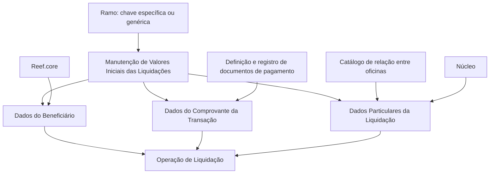

# Definição de Valores Iniciais das Liquidações — Regras de Valores por Defeito

## 1. Metadados do Documento
- **Arquivo de Origem:** Não informado
- **Tipo de Documento:** Especificação Técnica
- **Domínio / Sistema:** Liquidaciones / Reef.core
- **Público-Alvo:** Desenvolvedores, Arquitetos, Operação e Negócio
- **Data/Versão Identificada:** Não identificada

---

## 2. Resumo Executivo & Contexto de Negócio

O documento descreve a definição de valores iniciais ou valores por defeito para atributos utilizados na geração de uma liquidação. O objetivo declarado é tornar a criação de liquidações mais eficiente, evitando que determinados dados precisem ser preenchidos manualmente em cada operação.

A configuração está organizada em três grupos funcionais: dados do beneficiário da liquidação, dados do comprovante da transação e dados particulares da liquidação. Para cada grupo, o documento relaciona propriedades de lógica de negócio que devem fornecer valores iniciais à operação de liquidação.

A propriedade **Ramo** determina o contexto de aplicação dos valores por defeito. A definição pode ser específica para uma chave de ramo ou utilizar um ramo genérico, aplicável aos ramos que não possuam definição própria.

O documento menciona o núcleo como fornecedor de determinados valores iniciais, incluindo a oficina de pagamento, a oficina de envio e o valor `Exento` de I.V.A. Contudo, o material não detalha implementações, métodos HTTP, contratos JSON, nomes técnicos das lógicas de negócio, estruturas de persistência ou mecanismos de prioridade entre valores configurados.

---

## 3. Arquitetura, Componentes & Tecnologias Envolvidas

Os componentes e conceitos identificados são:

| Componente / Conceito | Papel descrito no documento |
| :--- | :--- |
| Operação de liquidação | Operação que recebe valores iniciais ou valores por defeito definidos pelas lógicas de negócio. |
| Manutenção de Valores Iniciais das Liquidações | Área ou funcionalidade indicada como local de configuração dos valores iniciais das liquidações. |
| Ramo | Chave de contexto para a definição de valores por defeito. Pode haver ramo específico ou ramo genérico. |
| Beneficiário da liquidação | Entidade para a qual são definidos valores iniciais, como tipo, atividade, código de terceiro e documento. |
| Comprovante da transação | Grupo de informações relativas ao documento de pagamento, incluindo tipo/documento, datas e moeda. |
| Documentos de pagamento | Documentos definidos pela companhia e utilizáveis em sinistros. |
| Registro de documentos de pagamento | Fonte possível para informações quando um documento de pagamento está definido para registro prévio à liquidação. |
| Núcleo | Componente mencionado como responsável por devolver valores iniciais para determinadas propriedades. |
| Reef.core | Sistema citado como referência para atividades definidas/codificadas, usualmente associadas a fornecedores, tramitadores e agentes. |
| Catálogo de relação entre oficinas | Catálogo que relaciona oficinas geradoras de ordens de pagamento à oficina pagadora correspondente. |



**Nota de Análise:** o documento descreve a aplicação de lógicas de negócio à operação de liquidação, mas não especifica interfaces, APIs, contratos de dados, mecanismos de execução, tecnologias de implementação ou ordem de avaliação dessas lógicas.

---

## 4. Regras de Negócio, Especificações Funcionais & Processos

### 4.1. Objetivo da definição de valores iniciais

A finalidade da manutenção de valores iniciais é identificar quais atributos das liquidações podem receber valores iniciais ou valores por defeito. Esses valores existem para aumentar a eficiência no momento de geração de uma liquidação.

### 4.2. Regra de aplicação por ramo

- O atributo **Ramo** contém a chave do ramo para o qual estão sendo definidos valores por defeito dos atributos das liquidações.
- Pode ser utilizado um **ramo genérico**.
- A definição genérica aplica-se a todos os ramos que não possuam uma definição própria.
- O documento não informa a forma de identificação do ramo genérico, nem detalha a regra de precedência caso coexistam definições específicas e genéricas.

### 4.3. Dados do beneficiário da liquidação

As lógicas de negócio associadas ao beneficiário devem fornecer valores iniciais para a operação de liquidação:

1. **Tipo de beneficiário inicial**
   - Fornece o valor por defeito do tipo de beneficiário da liquidação.

2. **Atividade do beneficiário inicial**
   - Fornece o valor inicial da atividade do beneficiário da liquidação.

3. **Código de terceiro inicial**
   - Fornece o valor inicial do código de terceiro do beneficiário.
   - Essa lógica aplica-se desde que a atividade esteja definida/codificada em Reef.core.
   - O documento indica que essas atividades normalmente correspondem a fornecedores, tramitadores e agentes.

4. **Tipo de documento inicial**
   - Fornece o valor inicial do tipo de documento do beneficiário da liquidação.

5. **Código do documento do terceiro inicial**
   - Fornece o código do documento do terceiro.
   - O documento não fornece regras adicionais de validação, formato ou origem do código.

### 4.4. Dados do comprovante da transação

As lógicas de negócio associadas ao comprovante da transação definem informações iniciais do documento de pagamento:

1. **Documento de pagamento inicial**
   - Deve devolver um dos diferentes documentos de pagamento definidos pela companhia.
   - Os documentos retornados podem ser utilizados em sinistros.

2. **Data do documento de pagamento**
   - Deve devolver a data do documento de pagamento.
   - Exemplos citados: data da fatura e data do documento de indenização.

3. **Data de recepção do documento de pagamento**
   - Deve devolver a data em que a companhia recebeu a fatura.
   - Quando o documento de pagamento estiver definido pela companhia como um documento registrado previamente à realização da liquidação, essa data pode ser obtida do registro de documentos de pagamento.

4. **Data estimada de pagamento**
   - Deve devolver a data prevista para pagamento da liquidação.
   - A data pode ser devolvida em função dos convênios de pagamento quando o beneficiário for um profissional.

5. **Moeda do documento**
   - Deve devolver a moeda do documento de pagamento, da fatura, do documento de indenização ou de documento equivalente.
   - Quando o documento estiver definido na companhia como documento registrado antes da liquidação, a moeda pode ser obtida no registro de documentos de pagamento.
   - Quando o documento não for registrado, pode ser utilizada por defeito a moeda do país.

### 4.5. Dados particulares da liquidação

1. **Oficina de pagamento inicial**
   - A propriedade contém a lógica de negócio que devolve a oficina de pagamento para as liquidações.
   - O núcleo devolve a oficina de pagamento correspondente à oficina do usuário.
   - A correspondência deve estar definida no catálogo de relação entre as oficinas que geram ordens de pagamento e a oficina pagadora correspondente.

2. **Oficina de envio inicial**
   - A propriedade contém a lógica de negócio que devolve a oficina de envio do cheque ou da documentação das liquidações, incluindo finiquitos.
   - O núcleo devolve a oficina do usuário.

3. **Tipo de IVA inicial**
   - A propriedade contém a lógica de negócio que devolve o tipo de IVA do documento oficial das liquidações como valor inicial.
   - O núcleo devolve `Exento` de I.V.A.

4. **Tipo de IVA ou retenção do terceiro**
   - A propriedade contém a lógica de negócio que devolve o tipo de IVA ou de retenção aplicável ao terceiro que receberá a liquidação.
   - O núcleo devolve `Exento` de I.V.A.

---

## 5. Tabelas de Parâmetros, Ambientes e Estruturas de Dados

| Item / Parâmetro | Descrição / Função | Tipo / Valores / Formato | Ambiente / Observações |
| :--- | :--- | :--- | :--- |
| Ramo | Identifica a chave do ramo para o qual são definidos valores por defeito. | Chave de ramo; também pode assumir ramo genérico. | O ramo genérico aplica-se a ramos sem definição própria. |
| Tipo de beneficiário inicial | Fornece o valor por defeito do tipo de beneficiário da liquidação. | Não especificado. | Dados do beneficiário da liquidação. |
| Atividade do beneficiário inicial | Fornece a atividade inicial do beneficiário da liquidação. | Não especificado. | Dados do beneficiário da liquidação. |
| Código de terceiro inicial | Fornece o código inicial do terceiro beneficiário. | Não especificado. | Aplicável quando a atividade estiver definida/codificada em Reef.core; exemplos citados: fornecedores, tramitadores e agentes. |
| Tipo de documento inicial | Fornece o tipo de documento inicial do beneficiário. | Não especificado. | Dados do beneficiário da liquidação. |
| Código do documento do terceiro inicial | Fornece o código do documento do terceiro. | Não especificado. | Dados do beneficiário da liquidação. |
| Documento de pagamento inicial | Devolve um documento de pagamento definido pela companhia e utilizável em sinistros. | Um dos documentos de pagamento definidos pela companhia. | Dados do comprovante da transação. |
| Data do documento de pagamento | Devolve a data associada ao documento de pagamento. | Data; exemplos: data da fatura ou do documento de indenização. | Dados do comprovante da transação. |
| Data de recepção do documento de pagamento | Devolve a data em que a companhia recebeu a fatura. | Data. | Pode ser obtida do registro de documentos de pagamento se houver registro prévio à liquidação. |
| Data estimada de pagamento | Devolve a data prevista de pagamento da liquidação. | Data. | Pode considerar convênios de pagamento quando o beneficiário for profissional. |
| Moeda do documento | Devolve a moeda do documento de pagamento. | Moeda não especificada. | Pode ser obtida do registro do documento; sem registro, pode ser usada a moeda do país. |
| Oficina de pagamento inicial | Devolve a oficina responsável pelo pagamento das liquidações. | Oficina não especificada. | O núcleo utiliza a oficina do usuário e o catálogo de relação entre oficinas geradoras de ordens e oficinas pagadoras. |
| Oficina de envio inicial | Devolve a oficina de envio de cheque ou documentação da liquidação. | Oficina não especificada. | O núcleo devolve a oficina do usuário. |
| Tipo de IVA inicial | Devolve o tipo de IVA do documento oficial da liquidação. | `Exento` de I.V.A. | Valor devolvido pelo núcleo. |
| Tipo de IVA ou retenção do terceiro | Devolve o tipo de IVA ou retenção aplicável ao terceiro beneficiário. | `Exento` de I.V.A. | Valor devolvido pelo núcleo. |

---

## 6. Bateria de Perguntas & Respostas para RAG (FAQ Sintético)

### P1: Qual é a finalidade da definição de valores iniciais das liquidações?
**R:** A finalidade é definir valores iniciais ou valores por defeito para atributos das liquidações, aumentando a eficiência durante a geração de uma liquidação.

### P2: Como o atributo Ramo influencia os valores por defeito de uma liquidação?
**R:** O atributo Ramo contém a chave do ramo para o qual os valores por defeito dos atributos da liquidação são definidos. Também pode ser utilizado um ramo genérico, aplicável aos ramos que não tenham uma definição própria.

### P3: Quais valores iniciais podem ser definidos para o beneficiário de uma liquidação?
**R:** O documento identifica lógicas de negócio para devolver o tipo de beneficiário inicial, a atividade inicial do beneficiário, o código de terceiro inicial, o tipo de documento inicial do beneficiário e o código do documento do terceiro.

### P4: Em que condição a lógica de código de terceiro inicial pode fornecer um valor?
**R:** A lógica pode fornecer o código inicial do terceiro beneficiário desde que a atividade esteja definida/codificada em Reef.core. O documento cita como exemplos usuais fornecedores, tramitadores e agentes.

### P5: Como é definido o documento de pagamento inicial?
**R:** A lógica de negócio deve devolver um dos diferentes documentos de pagamento definidos pela companhia que possam ser utilizados em sinistros.

### P6: De onde pode vir a data de recepção do documento de pagamento?
**R:** A data de recepção representa a data em que a companhia recebeu a fatura. Quando o documento estiver definido pela companhia como registrado antes da realização da liquidação, a data pode ser obtida do registro de documentos de pagamento.

### P7: Como pode ser determinada a data estimada de pagamento de uma liquidação?
**R:** A lógica de negócio deve devolver a data prevista para pagamento da liquidação. O documento estabelece que essa data pode ser devolvida segundo os convênios de pagamento quando o beneficiário for um profissional.

### P8: Qual é a regra para a moeda do documento de pagamento quando não existe registro prévio?
**R:** Se o documento de pagamento não for registrado, a lógica pode utilizar por defeito a moeda do país. Se houver registro prévio do documento, a moeda pode ser obtida do registro de documentos de pagamento.

### P9: Como o núcleo determina a oficina de pagamento inicial?
**R:** O núcleo devolve a oficina de pagamento correspondente à oficina do usuário. Essa correspondência deve estar definida no catálogo de relação entre as oficinas que geram ordens de pagamento e a oficina pagadora correspondente.

### P10: Qual oficina é devolvida pelo núcleo como oficina de envio inicial?
**R:** Para a oficina de envio do cheque ou da documentação das liquidações, incluindo finiquitos, o núcleo devolve a oficina do usuário.

### P11: Qual é o tipo de IVA inicial devolvido pelo núcleo para o documento oficial de uma liquidação?
**R:** O núcleo devolve `Exento` de I.V.A. como tipo de IVA inicial do documento oficial das liquidações.

### P12: Qual valor o núcleo devolve para o tipo de IVA ou retenção do terceiro?
**R:** Para o terceiro ao qual será realizada a liquidação, o núcleo devolve `Exento` de I.V.A. como tipo de IVA ou retenção.

---

## 7. Glossário de Termos, Siglas & Conceitos-Chave

- **Beneficiário da liquidação:** Terceiro ou entidade associada à liquidação, para o qual podem ser definidos dados iniciais como tipo, atividade, código de terceiro e documento.
- **Comprovante da transação:** Grupo de dados da liquidação relacionado ao documento de pagamento, incluindo documento, datas e moeda.
- **Documento de pagamento:** Documento definido pela companhia e que pode ser utilizado em sinistros; o texto cita fatura e documento de indenização como exemplos de documentos associados.
- **Finiquito:** Termo citado como documentação relacionada a liquidações; o documento não apresenta definição adicional.
- **IVA:** Imposto citado nas propriedades de tipo de IVA do documento oficial e do terceiro. O texto informa o valor `Exento` de I.V.A., sem expandir a sigla.
- **Núcleo:** Componente referido como fornecedor de valores iniciais para oficinas e tipos de IVA.
- **Oficina de envio:** Oficina que devolve o local de envio do cheque ou da documentação das liquidações.
- **Oficina de pagamento:** Oficina correspondente ao pagamento das liquidações.
- **Ramo:** Chave utilizada para contextualizar definições de valores por defeito das liquidações.
- **Reef.core:** Sistema citado como referência para atividades definidas/codificadas, como atividades de fornecedores, tramitadores e agentes.
- **Retenção:** Tipo de valor tributário mencionado como alternativa ao tipo de IVA aplicável ao terceiro.

---

## 8. Notas Críticas, Riscos & Limitações

- O documento não identifica o arquivo de origem, data, versão, autor ou responsáveis pela manutenção das configurações.
- Não são apresentados nomes técnicos, identificadores, assinaturas, APIs, métodos HTTP, contratos JSON, estruturas de banco de dados ou telas detalhadas das lógicas de negócio.
- Os exemplos anunciados ao longo das páginas não estão presentes no conteúdo bruto fornecido.
- A regra de precedência entre definição de ramo específico e ramo genérico é sugerida pela aplicação do ramo genérico a ramos sem definição própria, mas não é detalhada tecnicamente.
- O documento não informa validações, mensagens de erro, obrigatoriedade, formatos de datas, códigos de moeda ou regras de fallback além das explicitamente citadas.
- A dependência de Reef.core está limitada à informação de que certas atividades devem estar definidas/codificadas nesse sistema.
- A dependência do catálogo de relação entre oficinas é crítica para a determinação da oficina de pagamento correspondente à oficina do usuário.
- A obtenção de data de recepção e moeda a partir do registro de documentos de pagamento depende de o documento estar definido pela companhia como registrado antes da liquidação.

---

## 9. Conteúdo Bruto Estruturado (Referência Fiel)

```text
--- [PÁGINA 1 DE 5] ---

DEFINICIÓN de Valores Iniciales de Las
Liquidaciones

Objetivo

La finalidad de este documento es conocer qué atributos de la liquidaciones se les puede definir
valores iniciales, valores por defecto, con la finalidad de ser más eficaces cuando se genera una
liquidación.

Datos del Beneficiario de la liquidación

Datos Comprobante de la transacción

Datos Particulares de la liquidación

Imagen del Mantenimiento Valores Iniciales de las Liquidaciones:

 /
 CF
Home Solutions APIs Documentation Zeus
EN


--- [PÁGINA 2 DE 5] ---

Propiedades

Ramo

Este Atributo contiene la Clave del ramo para el que se están definiendo los valores por defecto de
los atributos de las liquidaciones. Se puede utilizar el ramo genérico que indica que la definición
aplica a todos los ramos, que no tengan definición propia.

Datos del Beneficiario de la liquidación

Lógica de Negocio tipo beneficiario inicial (visión técnica)

Lógica de negocio que proporcionará a la operación de liquidación el valor por defecto del tipo de
beneficiario de la liquidación.

Lógica de Negocio que devuelve la actividad del beneficiario inicial (visión
técnica)

Lógica de negocio que proporcionará a la operación de liquidación el valor inicial de la actividad del
beneficiario de la liquidación.

Lógica de Negocio código que devuelve el código de tercero inicial (visión
técnica)

Ejemplo:

Ejemplo:


--- [PÁGINA 3 DE 5] ---

Lógica de negocio que proporcionará a la operación de liquidación el valor inicial del Código de
tercero del beneficiario de la liquidación, siempre y cuando sea una actividad que esté definida
como se codifica en Reef.core, que suelen ser los proveedores, tramitadores, agentes...

Lógica de Negocio que devuelve el tipo de documento inicial (visión técnica)

Lógica de negocio que proporcionará a la operación de liquidación el valor inicial del Tipo de
documento del beneficiario, beneficiario de la liquidación.

Lógica de Negocio que devuelve el código de documento del tercero inicial
(visión técnica)

Lógica de Negocio que devuelve el Código del documento del tercero.

Datos Comprobante de la transacción

Lógica de Negocio que devuelve el documento de pago inicial (visión técnica)

Esta lógica de Negocio devolverá uno de los diferentes documentos de pago definidos en la
compañía, que pueden ser utilizados en siniestros.

Lógica de Negocio para devolver la fecha del documento de pago (visión
técnica)

Esta lógica de Negocio devolverá la fecha del documento de pago, es decir la fecha de la factura,
la fecha del documento de indemnización, etc.

Lógica de Negocio para devolver fecha de recepción del documento de pago
(visión técnica)

Esta lógica de Negocio devolverá la fecha de recepción del documento de pago, es decir la fecha
en la que la compañía recibió la factura. Si el documento, en la definición de los documentos de pago

Ejemplo:

Ejemplo:

Ejemplo:

Ejemplos de documentos de pago para siniestros

Ejemplo:


--- [PÁGINA 4 DE 5] ---

de la compañía, está definido como que se registra, previamente a realizarse la liquidación, se puede
obtener del registro de documentos de pago.

Lógica de Negocio para devolver la fecha estimada de pago (visión técnica)

Esta lógica de Negocio devolverá la fecha estimada de pago es decir la fecha en la que se prevé que
va a ser pagada la liquidación. Se puede devolver la fecha en función de los convenios de pago, en
el caso de que el beneficiario sea un profesional.

Lógica de Negocio que devuelve la moneda del documento (visión técnica)

Esta lógica de Negocio devolverá la moneda del documento de pago, la moneda del documento de
la factura, de la indemnización, etc. Si el documento, en la definición de los documentos de pago de
la compañía, está definido como que se registra, previamente a realizarse la liquidación, se puede
obtener del registro de documentos de pago. Si el documento no se registra se puede poner por
defecto la moneda del país.

Datos Particulares de la Liquidación

Lógica de Negocio para devolver la oficina de pago Inicial (visión técnica)

Esta propiedadcontiene la Lógica de Negocio que devuelve la oficina pago a las liquidaciones. Lo
que devuelve núcleo es la oficina de pago que corresponde a la oficina del usuario y que está
definida en el catálogo de "relación entre las oficinas que generan las órdenes de pago y la oficina
Pagadora que le corresponde."

Lógica de Negocio para devolver la oficina de envío Inicial (visión técnica)

Esta propiedadcontiene la Lógica de Negocio que devuelve la oficina de envío del cheque o de
documentación de las liquidaciones, finiquito..... Lo que devuelve núcleo es la oficina del usuario.

Lógica de Negocio para devolver el tipo de iva (visión técnica)

Esta propiedadcontiene la Lógica de Negocio que devuelve el tipo de iva que tiene el documento
oficial a las liquidaciones, como valor inicial. Núcleo devuelve 'Exento' de I.V.A.

Lógica para devolver el tipo de iva del tercero (visión técnica)

Esta propiedadcontiene la Lógica de Negocio que devuelve el tipo de iva o de retención que va a
tener el tercero al que se le va a liquidar. Núcleo devuelve 'Exento' de I.V.A.

Ejemplo:

Ejemplo:


--- [PÁGINA 5 DE 5] ---

[Página em branco ou apenas elementos visuais/imagem]
```
