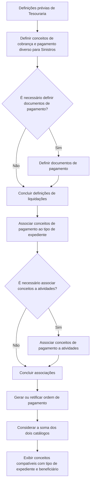

# Definição de Liquidações no REEF Core: Catálogos, Ordens de Pagamento e Configurações Prévias

## 1. Metadados do Documento
- **Arquivo de Origem:** `Não identificado`
- **Tipo de Documento:** `Procedimento`
- **Domínio / Sistema:** `REEF Core — Tesouraria e módulo de Sinistros`
- **Público-Alvo:** `Usuários responsáveis pela configuração do sistema, Operação, Negócio e Analistas Funcionais`
- **Data/Versão Identificada:** `Não identificada`

---

## 2. Resumo Executivo & Contexto de Negócio

O documento descreve as definições necessárias no REEF Core para gerar liquidações de expedientes, também referidas como ordens de pagamento. O funcionamento da liquidação depende de uma configuração prévia do sistema, definida pelo usuário de acordo com o comportamento desejado.

A geração de uma liquidação permite indicar quem receberá o pagamento, como o pagamento será realizado, o que será pago e qual será o valor pago. Para executar essa operação, o REEF Core utiliza catálogos obrigatórios e outros catálogos opcionais.

No contexto do módulo de Sinistros, a definição de conceitos de cobrança e pagamento é organizada em duas possíveis associações: conceitos de pagamento vinculados a tipos de expediente e conceitos de pagamento vinculados a atividades. A associação a atividades é aplicável quando essa necessidade é identificada no processo de configuração.

Após a definição dos catálogos, a geração ou retificação de uma ordem de pagamento considera a soma dos dois catálogos de conceitos. O sistema apresenta exclusivamente os conceitos de cobrança, pagamento diverso e reserva que correspondam simultaneamente ao tipo de expediente em liquidação e ao beneficiário da liquidação.

O documento também lista outros temas relacionados a liquidações, incluindo estruturas de informação, convênios de pagamento por atividade, aplicação de prêmios pendentes, valores iniciais de atributos, validações e comportamento. Contudo, não apresenta detalhamento adicional para esses tópicos.

---

## 3. Arquitetura, Componentes & Tecnologias Envolvidas

Os elementos funcionais identificados no documento são:

- **REEF Core:** sistema que requer configuração prévia para o funcionamento das liquidações.
- **Tesouraria:** área na qual são realizadas as definições prévias para liquidações.
- **Módulo de Sinistros:** módulo relacionado à definição de conceitos de cobrança e pagamento.
- **Liquidações:** operação de definição e geração de pagamentos de expedientes.
- **Ordens de Pagamento:** resultado da geração de uma liquidação.
- **Retificação de ordem de pagamento:** operação que também utiliza os catálogos definidos.
- **Conceitos de Cobrança e Pagamento Diverso para Sinistros:** catálogo citado como definição necessária.
- **Documentos de Pagamento:** catálogo sujeito à decisão de necessidade no processo.
- **Conceitos de Pagamento por Tipo de Expediente:** associação aplicável ao módulo de Sinistros.
- **Conceitos de Pagamento por Atividade:** associação aplicável quando houver necessidade de vinculação a atividades.
- **Conceitos de Reserva:** conceitos considerados na geração ou retificação, conforme o tipo de expediente e o beneficiário.



> **Nota de Análise:** O documento não descreve interfaces, métodos HTTP, contratos JSON, bancos de dados, versões de tecnologia, integrações externas ou infraestrutura técnica do REEF Core.

---

## 4. Regras de Negócio, Especificações Funcionais & Processos

### 4.1 Objetivo da configuração de liquidações

Para o funcionamento do REEF Core, o usuário deve realizar uma configuração prévia do sistema. A configuração estabelece o comportamento desejado para a geração de liquidações de expedientes.

Ao gerar uma liquidação, o sistema deve receber ou determinar:

1. A quem será efetuado o pagamento.
2. Como será efetuado o pagamento.
3. O que será pago.
4. Quanto será pago.

### 4.2 Catálogos de liquidações

A operação de liquidação possui catálogos obrigatórios para o funcionamento e outros catálogos opcionais. O documento não identifica explicitamente quais catálogos são obrigatórios ou opcionais além do fluxo apresentado.

O fluxo de definições prévias de Tesouraria estabelece as seguintes ações:

1. Definir conceitos de cobrança e pagamento diverso para Sinistros.
2. Avaliar se é necessário definir documentos de pagamento.
3. Quando necessário, definir documentos de pagamento.
4. Finalizar as definições de liquidações.

### 4.3 Associação de conceitos de pagamento no módulo de Sinistros

Para o módulo de Sinistros, devem ser realizadas definições relacionadas a conceitos de cobrança e pagamento:

1. Associar conceitos de pagamento a tipos de expediente.
2. Avaliar se há necessidade de associar conceitos a atividades.
3. Quando houver necessidade, associar conceitos de pagamento a atividades.
4. Finalizar o processo de associação.

### 4.4 Regra de seleção de conceitos na geração ou retificação

Após a definição dos catálogos, a geração de uma ordem de pagamento ou a retificação de uma ordem de pagamento deve considerar a soma de dois catálogos:

- Catálogo de conceitos de pagamento associados ao tipo de expediente.
- Catálogo de conceitos de pagamento associados às atividades, quando aplicável.

A apresentação de conceitos deve ser restrita aos itens que atendam aos seguintes critérios:

- Serem conceitos de cobrança e pagamento diverso ou conceitos de reserva.
- Corresponderem ao tipo de expediente que será liquidado.
- Corresponderem ao beneficiário da liquidação.

### 4.5 Outros tópicos de liquidações listados

O documento lista os seguintes tópicos, sem especificar regras, campos, fluxos ou parâmetros adicionais:

- Estruturas de informação das liquidações.
- Convênios de pagamento por atividade.
- Aplicação de prêmios pendentes nas liquidações.
- Valores iniciais de atributos das liquidações.
- Validações das liquidações e comportamento.

> **Nota de Análise:** O documento menciona os tópicos adicionais de liquidações, mas não detalha suas regras de negócio, critérios de validação, estruturas de dados ou comportamento operacional.

---

## 5. Tabelas de Parâmetros, Ambientes e Estruturas de Dados

| Item / Parâmetro | Descrição / Função | Tipo / Valores / Formato | Ambiente / Observações |
| :--- | :--- | :--- | :--- |
| REEF Core | Sistema que requer configuração prévia para gerar liquidações de expedientes. | Sistema | Não são informados versão, URL, servidor ou tecnologia. |
| Liquidação de expediente | Operação que determina destinatário, forma, conteúdo e valor de um pagamento. | Processo funcional | Também relacionada à geração de ordem de pagamento. |
| Ordem de pagamento | Resultado da geração de uma liquidação. | Operação / documento de pagamento | Pode ser gerada ou retificada. |
| Beneficiário | Entidade para a qual a liquidação será realizada. | Critério de seleção | Utilizado para filtrar os conceitos exibidos. |
| Tipo de expediente | Classificação do expediente a ser liquidado. | Critério de seleção | Utilizado para associar e filtrar conceitos de pagamento. |
| Conceitos de cobrança e pagamento diverso para Sinistros | Catálogo que deve ser definido no processo prévio de Tesouraria. | Catálogo | Relacionado ao módulo de Sinistros. |
| Documentos de pagamento | Definição avaliada no fluxo de configurações de liquidações. | Catálogo / definição | Deve ser definido quando a necessidade for confirmada. |
| Conceitos de pagamento por tipo de expediente | Conceitos de pagamento associados aos tipos de expediente. | Catálogo / associação | Um dos dois catálogos considerados na geração ou retificação. |
| Conceitos de pagamento por atividade | Conceitos de pagamento associados às atividades. | Catálogo / associação | Aplicável quando houver necessidade de associação a atividades. |
| Conceitos de reserva | Conceitos considerados na geração ou retificação de ordem de pagamento. | Conceito funcional | Exibidos somente quando correspondem ao tipo de expediente e ao beneficiário. |
| Estruturas de informação das liquidações | Tópico listado entre outras definições de liquidações. | Não detalhado | Não há estrutura, campos ou formato especificados. |
| Convênios de pagamento por atividade | Tópico listado entre outras definições de liquidações. | Não detalhado | Não há regras ou parâmetros especificados. |
| Aplicação de prêmios pendentes | Tópico listado para liquidações. | Não detalhado | O documento não explica a aplicação. |
| Valores iniciais de atributos | Tópico listado para liquidações. | Não detalhado | O documento não informa atributos ou valores. |
| Validações e comportamento | Tópico listado para liquidações. | Não detalhado | O documento não apresenta validações específicas. |

---

## 6. Bateria de Perguntas & Respostas para RAG (FAQ Sintético)

### P1: Qual é o objetivo das definições de liquidações no REEF Core?
**R:** O objetivo é configurar previamente o REEF Core para permitir a geração de liquidações de expedientes, também chamadas de ordens de pagamento. A configuração é definida pelo usuário conforme o comportamento desejado para o sistema.

### P2: Quais informações uma liquidação permite indicar no REEF Core?
**R:** Uma liquidação permite indicar a quem será pago, como será pago, o que será pago e quanto será pago.

### P3: Quais definições prévias de Tesouraria são apresentadas para liquidações?
**R:** O fluxo apresentado determina a definição de conceitos de cobrança e pagamento diverso para Sinistros e, quando necessário, a definição de documentos de pagamento.

### P4: Os documentos de pagamento sempre precisam ser definidos?
**R:** Não. O fluxo do documento apresenta uma decisão sobre a necessidade de definir documentos de pagamento. Quando a resposta for positiva, os documentos de pagamento devem ser definidos; quando negativa, o processo segue para o fim das definições.

### P5: Como os conceitos de pagamento são associados no módulo de Sinistros?
**R:** Os conceitos de pagamento são associados a tipos de expediente. O documento também prevê uma decisão sobre associar conceitos a atividades; quando essa associação for necessária, os conceitos de pagamento devem ser vinculados às atividades.

### P6: Quais catálogos são considerados ao gerar ou retificar uma ordem de pagamento?
**R:** A geração ou retificação considera a soma dos dois catálogos definidos no fluxo do módulo de Sinistros: os conceitos de pagamento associados ao tipo de expediente e os conceitos de pagamento associados às atividades, quando a associação a atividades for aplicável.

### P7: Quais conceitos podem ser exibidos durante a geração ou retificação de uma liquidação?
**R:** O sistema mostra apenas conceitos de cobrança e pagamento diverso e conceitos de reserva que correspondam ao tipo de expediente a ser liquidado e ao beneficiário da liquidação.

### P8: Qual é o papel do beneficiário na seleção de conceitos para liquidação?
**R:** O beneficiário é um critério de correspondência para a apresentação dos conceitos. Um conceito de cobrança, pagamento diverso ou reserva somente é exibido quando também corresponde ao beneficiário da liquidação.

### P9: O documento especifica os campos das estruturas de informação das liquidações?
**R:** Não. O documento lista “Estruturas de Informação de las Liquidaciones” como um tópico adicional, mas não detalha campos, formatos, atributos ou regras de uso.

### P10: O documento apresenta regras detalhadas para prêmios pendentes nas liquidações?
**R:** Não. “Aplicación de Primas Pendientes en las liquidaciones” é listado como uma definição adicional, sem explicação sobre condições, cálculos, eventos ou comportamento.

### P11: Existem validações de liquidação documentadas?
**R:** O documento cita “Validaciones de las liquidaciones y Comportamiento”, mas não informa quais validações existem, quais condições causam erro ou qual é o comportamento esperado em cada cenário.

### P12: O documento informa tecnologias, APIs ou URLs do REEF Core?
**R:** Não. O conteúdo não apresenta URLs, APIs, métodos HTTP, contratos de integração, servidores, portas, bancos de dados ou versões tecnológicas.

---

## 7. Glossário de Termos, Siglas & Conceitos-Chave

- **REEF Core:** Sistema citado como dependente de uma configuração prévia para o funcionamento das liquidações.
- **Liquidação:** Operação para determinar destinatário, forma, conteúdo e valor de um pagamento.
- **Expediente:** Elemento que será liquidado e cujo tipo é utilizado na seleção dos conceitos aplicáveis.
- **Ordem de Pagamento:** Resultado gerado a partir de uma liquidação de expediente.
- **Retificação:** Operação aplicada a uma ordem de pagamento já gerada, que também considera os catálogos definidos.
- **Tesouraria:** Contexto das definições prévias relacionadas às liquidações.
- **Sinistros:** Módulo no qual são definidos e associados conceitos de cobrança e pagamento.
- **Conceitos de Cobrança:** Conceitos considerados na apresentação durante a geração ou retificação, quando correspondem ao tipo de expediente e ao beneficiário.
- **Pagamento Diverso:** Tipo de conceito de pagamento mencionado na configuração para Sinistros e na seleção de conceitos de liquidação.
- **Conceitos de Reserva:** Conceitos que podem ser mostrados na liquidação quando correspondem ao tipo de expediente e ao beneficiário.
- **Beneficiário:** Entidade relacionada à liquidação, usada como critério para determinar os conceitos que podem ser exibidos.
- **Atividade:** Elemento ao qual conceitos de pagamento podem ser associados quando necessário.
- **CF:** Sigla exibida no rodapé do conteúdo extraído, sem expansão ou definição no documento.

---

## 8. Notas Críticas, Riscos & Limitações

- O documento não informa o nome do arquivo, autor, data, versão ou aprovação.
- Não há distinção explícita entre todos os catálogos obrigatórios e todos os catálogos opcionais; apenas o fluxo de documentos de pagamento apresenta uma decisão explícita de necessidade.
- Não são detalhadas as condições que determinam se documentos de pagamento devem ser definidos.
- Não são detalhadas as condições que determinam se conceitos devem ser associados a atividades.
- Não são fornecidos exemplos de tipos de expediente, beneficiários, conceitos de cobrança, pagamentos diversos ou conceitos de reserva.
- Não há descrição dos dados, campos, formatos ou regras das estruturas de informação das liquidações.
- Não há detalhamento sobre convênios de pagamento por atividade, aplicação de prêmios pendentes, valores iniciais de atributos ou validações de liquidações.
- O documento não apresenta ambientes, URLs, rotas de log, credenciais, servidores, tecnologias, integrações ou contratos técnicos.
- Os fluxos parecem ser diagramas funcionais extraídos de material visual; a reconstrução Mermaid representa somente as decisões e etapas explicitamente identificadas no texto.

---

## 9. Conteúdo Bruto Estruturado (Referência Fiel)

```text
--- [PÁGINA 1 DE 2] ---

DEFINICIÓN Liquidaciones
¿En que consiste?
El Reef.core necesita para su funcionamiento una configuración previa del sistema. El Usuario será el que defina como quiere que se comporte. En este
caso se va a documentar como definir todos los catálogos necesarios para poder generar liquidaciones de expedientes (órdenes de pago).
Objetivo
La finalidad de este documento es conocer qué se necesita definir para poder realizar Liquidaciones de expedientes.
Al generar una liquidación, le vamos a indicar al sistema a quien vamos a pagar, cómo le vamos a pagar, qué le vamos a pagar y cuánto le vamos a pagar.
Para realizar esta operación hay catálogos obligatorios para su funcionamiento y otros opcionales.
Proceso para Definir los catálogos de las Liquidaciones
Definiciones de Tesorería Previas
SI
NODEFINIR
Conceptos de Cobro
Pago para
Siniestros
(1)
¿Hay que
definir
Documentos
de Pago? DEFINIR
Documentos de
Pago(2)
FIN
1. DEFINIR Conceptos de Cobro y Pago Vario para Siniestros
2. DEFINIR Documentos de Pago
Definiciones de Conceptos de Cobro y Pago para el módulo de Siniestros
SI
NOAsociar
Cptos. Pago
Tipo
Expediente
(1)
¿Asociar Conceptos
a actividades?
ASOCIAR
Cptos. Pago
Actividades (2)
FIN
1. ASOCIAR Conceptos de Pago a Tipo Expedientes
2. ASOCIAR Conceptos de Pago a Actividades
Una vez que se han definido los catálogos a la hora de realizar la generación de una orden de pago o la rectificación se tendrán en cuenta la suma de estos
dos catálogos, mostrando únicamente los conceptos de cobro y pago vario y conceptos de reserva que se correspondan con el tipo de expediente que se va
a liquidar y el Beneficiario de dicha liquidación.
 / 
 CF
Search Home Solutions Architectures APIs Events Components Cloud Documentation Zeus Reef Help News
EN


--- [PÁGINA 2 DE 2] ---

Otras Definiciones de las liquidaciones
Estructuras de Información de las Liquidaciones
Convenios de Pago por Actividad
Aplicación de Primas Pendientes en las liquidaciones
Valores Iniciales de atributos de las Liquidaciones
Validaciones de las liquidaciones y Comportamiento
Ejemplo:
```
