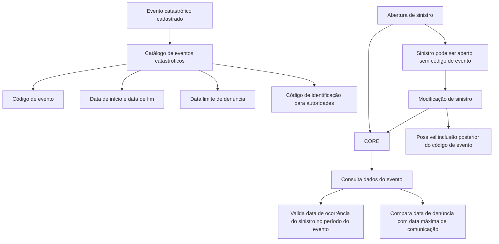

# Definição e Manutenção de Eventos Catastróficos para Agrupamento de Sinistros

## 1. Metadados do Documento
- **Arquivo de Origem:** Não informado
- **Tipo de Documento:** Especificação Funcional
- **Domínio / Sistema:** CORE / Gestão de Sinistros / Eventos Catastróficos
- **Público-Alvo:** Analistas funcionais, desenvolvedores, operação e usuários de sinistros
- **Data/Versão Identificada:** Não identificada

---

## 2. Resumo Executivo & Contexto de Negócio

O documento define o cadastro e a utilização de códigos de eventos catastróficos para agrupar sinistros que ocorreram em decorrência de um mesmo evento determinado. Exemplos de natureza de evento citados incluem terremoto e furacão.

O catálogo de eventos catastróficos contém atributos de identificação, classificação, período de ocorrência, prazo máximo de denúncia e descrição. Esses atributos permitem identificar um evento, registrar sua natureza e controlar sua relação temporal com sinistros.

O sistema CORE realiza validações na abertura e na modificação de sinistros. A data de ocorrência do sinistro é comparada ao período de início do evento catastrófico para validar se o sinistro está incluído no período do evento.

O sistema CORE também compara a data de denúncia do sinistro com a data máxima de comunicação definida para o evento catastrófico. O sinistro pode ser aberto sem código de evento quando o evento ainda não estiver registrado; posteriormente, o código pode ser incluído por modificação do sinistro.

---

## 3. Arquitetura, Componentes & Tecnologias Envolvidas

Os elementos funcionais identificados são:

- **Catálogo de eventos catastróficos:** mantém códigos e propriedades de eventos que podem originar sinistros.
- **CORE:** realiza validações durante a abertura e a modificação de sinistros.
- **Sinistro:** registro que pode ser associado a um código de evento catastrófico.
- **Evento catastrófico:** ocorrência identificada por código, nome, tipo, período e prazo de denúncia.
- **Autoridades:** podem exigir o código de identificação do evento em alguns casos.
- **Home Solutions APIs Documentation Zeus:** texto presente no conteúdo bruto, sem descrição de integração, responsabilidade técnica ou relação operacional detalhada.



> **Nota de Análise:** O documento não detalha tecnologias, protocolos, métodos HTTP, contratos JSON, bases de dados, URLs operacionais, ambientes ou integrações técnicas entre o CORE e o catálogo.

---

## 4. Regras de Negócio, Especificações Funcionais & Processos

### 4.1 Objetivo funcional

O objetivo é definir diferentes códigos de eventos catastróficos para agrupar sinistros ocorridos em função de um evento determinado.

### 4.2 Identificação e classificação do evento

1. Cada evento catastrófico possui um **código de evento**.
2. O código de evento é a chave utilizada para identificar diferentes eventos catastróficos que podem originar um sinistro.
3. Cada evento possui um **nome do evento catastrófico**.
4. Cada evento possui um **tipo de evento**, que representa a natureza do evento catastrófico.
5. São citados como exemplos de tipos de evento: terremoto e furacão.

### 4.3 Regras temporais do evento

1. A **data de início do evento** indica quando o evento catastrófico começou.
2. A data de início é importante para controlar a relação entre o evento e a data de ocorrência do sinistro.
3. A **hora de início do evento** informa o horário de início e é opcional.
4. A **data de fim do evento** informa quando o evento catastrófico terminou e é opcional.
5. A **hora final do evento** informa o horário em que o evento terminou.
6. A **data de denúncia do evento** é a data limite para denunciar um sinistro produzido pelo evento catastrófico.

### 4.4 Validação de ocorrência do sinistro

1. Na abertura do sinistro, o CORE consulta a data de início do evento catastrófico.
2. Na modificação do sinistro, o CORE também consulta a data de início do evento catastrófico.
3. O CORE valida que a data de ocorrência do sinistro esteja incluída no período do evento catastrófico.
4. A finalidade da validação é identificar se o sinistro é decorrente ou não do evento catastrófico.

### 4.5 Validação do prazo de denúncia

1. Na abertura do sinistro, o CORE consulta a data máxima de comunicação do sinistro para o evento.
2. Na modificação do sinistro, o CORE também consulta a data máxima de comunicação do sinistro para o evento.
3. O CORE compara a data máxima de comunicação com a data de denúncia informada ou modificada no sinistro.
4. A regra controla se o sinistro não foi comunicado após a data máxima de denúncia definida no catálogo.

### 4.6 Associação tardia de código de evento

1. Um sinistro pode ser aberto sem código de evento caso o evento ainda não tenha sido registrado.
2. Após a abertura, o sinistro pode ser modificado para incluir o código de evento.

### 4.7 Código de identificação para autoridades

O evento pode possuir um código de identificação que, em determinadas situações, deve ser informado às autoridades.

> **Nota de Análise:** O documento não especifica obrigatoriedade, formato ou regra de validação para o código de identificação do evento. Também não detalha como o CORE trata uma validação temporal inválida.

---

## 5. Tabelas de Parâmetros, Ambientes e Estruturas de Dados

| Item / Parâmetro | Descrição / Função | Tipo / Valores / Formato | Ambiente / Observações |
| :--- | :--- | :--- | :--- |
| Código de evento | Chave para identificar eventos catastróficos que podem originar um sinistro. | Não especificado. | Pode ser incluído posteriormente em um sinistro já aberto. |
| Nome do evento | Nome do evento catastrófico. | Não especificado. | Não há regras de preenchimento detalhadas. |
| Tipo de evento | Define a natureza do evento catastrófico. | Exemplos: terremoto, furacão. | O documento não apresenta catálogo completo de tipos. |
| Data de início do evento | Indica a data de início do evento catastrófico. | Data; formato não especificado. | Utilizada pelo CORE para validar a data de ocorrência do sinistro. |
| Hora de início do evento | Informa o horário em que o evento se iniciou. | Hora; formato não especificado. | Campo opcional. |
| Data de fim do evento | Indica a data em que o evento catastrófico terminou. | Data; formato não especificado. | Campo opcional. |
| Hora final do evento | Informa o horário em que o evento terminou. | Hora; formato não especificado. | O documento não declara se é opcional. |
| Data de denúncia do evento | Define a data limite para denunciar um sinistro produzido pelo evento. | Data; formato não especificado. | Também chamada de data máxima de comunicação do sinistro. |
| Código de identificação do evento | Código identificador que pode precisar ser informado às autoridades. | Não especificado. | Aplicável em situações não detalhadas. |
| Descrição do evento | Descrição textual do evento. | Texto; formato não especificado. | O conteúdo original repete a expressão “Descrição do evento”. |
| Data de ocorrência do sinistro | Data do sinistro usada na validação contra o período do evento. | Data; formato não especificado. | Validada pelo CORE na abertura e modificação. |
| Data de denúncia do sinistro | Data informada ou alterada para comunicar o sinistro. | Data; formato não especificado. | Comparada com a data máxima de comunicação do evento. |
| CORE | Sistema que executa validações para abertura e modificação de sinistros. | Sistema; tecnologia não especificada. | Não há detalhes de arquitetura técnica. |

---

## 6. Bateria de Perguntas & Respostas para RAG (FAQ Sintético)

### P1: Qual é o objetivo dos códigos de eventos catastróficos?
**R:** Os códigos de eventos catastróficos permitem agrupar sinistros que ocorreram por um evento determinado. O código de evento funciona como a chave de identificação dos diferentes eventos catastróficos que podem originar um sinistro.

### P2: Quais propriedades são definidas para um evento catastrófico?
**R:** O documento lista código de evento, nome do evento, tipo de evento, data de início, hora de início, data de fim, hora final, data de denúncia do evento, código de identificação do evento e descrição do evento.

### P3: Quais exemplos de tipo de evento catastrófico são apresentados?
**R:** O documento cita terremoto e furacão como exemplos de natureza ou tipo de evento catastrófico. Não apresenta uma lista completa de tipos permitidos.

### P4: É possível abrir um sinistro quando o evento catastrófico ainda não foi registrado?
**R:** Sim. O sinistro pode ser aberto sem o código de evento quando o evento ainda não estiver registrado. Posteriormente, o sinistro pode ser modificado para incluir o código de evento.

### P5: O CORE valida a data de ocorrência do sinistro contra o evento catastrófico?
**R:** Sim. Na abertura e na modificação do sinistro, o CORE consulta a data de início em que o evento catastrófico ocorreu e valida que a data de ocorrência do sinistro esteja incluída no período do evento.

### P6: Em quais momentos o CORE executa as validações relacionadas ao evento catastrófico?
**R:** O CORE executa as validações durante a abertura do sinistro e durante a modificação do sinistro.

### P7: Para que serve a data de início do evento catastrófico?
**R:** A data de início indica quando o evento começou. Ela é importante para realizar controles com a data de ocorrência do sinistro e verificar se o sinistro é resultado ou não do evento catastrófico.

### P8: A hora de início do evento é obrigatória?
**R:** Não. O documento declara expressamente que a hora de início do evento é opcional.

### P9: A data de fim do evento é obrigatória?
**R:** Não. O documento declara que a data de fim do evento catastrófico é opcional.

### P10: Como o CORE controla o prazo máximo para denunciar um sinistro associado a um evento?
**R:** Na abertura e na modificação do sinistro, o CORE consulta a data máxima de comunicação do sinistro definida para o evento e a compara com a data de denúncia introduzida ou modificada no sinistro.

### P11: O que representa a data de denúncia do evento?
**R:** A data de denúncia do evento é a data limite para denunciar um sinistro produzido por aquele evento catastrófico.

### P12: Para que serve o código de identificação do evento?
**R:** O código de identificação do evento é um identificador que, em alguns casos, deve ser informado às autoridades. O documento não detalha quais são esses casos.

---

## 7. Glossário de Termos, Siglas & Conceitos-Chave

- **CORE:** Sistema mencionado como responsável por validar datas de ocorrência e de denúncia durante a abertura e a modificação de sinistros. A expansão da sigla não é informada.
- **Evento catastrófico:** Evento que pode originar sinistros e que é identificado e classificado no catálogo.
- **Código de evento:** Chave usada para identificar um evento catastrófico e associá-lo a sinistros.
- **Sinistro:** Registro cuja ocorrência pode ser vinculada a um evento catastrófico.
- **Data de ocorrência do sinistro:** Data utilizada pelo CORE para verificar se o sinistro está incluído no período do evento.
- **Data de denúncia do sinistro:** Data comunicada ou alterada no sinistro, comparada ao prazo máximo de comunicação do evento.
- **Data máxima de comunicação:** Prazo máximo para comunicar um sinistro associado a um evento; no documento, corresponde à data de denúncia do evento.
- **Home Solutions APIs Documentation Zeus:** Termo exibido no conteúdo bruto, sem definição ou contexto técnico adicional.

---

## 8. Notas Críticas, Riscos & Limitações

- O documento não informa o nome do arquivo de origem, data, versão, autor ou responsável pelo documento.
- Não há detalhamento de tecnologias, integrações, endpoints, métodos HTTP, contratos JSON, banco de dados, logs ou ambientes.
- Não é especificado o formato de códigos, datas, horas ou campos textuais.
- O documento não descreve o comportamento do CORE quando a data de ocorrência do sinistro estiver fora do período do evento.
- O documento não esclarece se a hora final do evento é obrigatória.
- Não há definição dos casos nos quais o código de identificação do evento deve ser enviado às autoridades.
- A regra temporal menciona consulta à data de início e validação de inclusão em “esse período”; entretanto, não detalha formalmente como a data de fim opcional participa da validação.
- Não são apresentados critérios de permissão, auditoria, rastreabilidade de alterações ou responsáveis pela manutenção do catálogo.

---

## 9. Conteúdo Bruto Estruturado (Referência Fiel)

```text
--- [PÁGINA 1 DE 4] ---

DEFINICIÓN de Eventos Catastróficos
Objetivo
Definir los diferentes códigos de eventos catastróficos, para poder agrupar siniestros que hayan
ocurrido por un evento determinado.
Imagen Mantenimiento Eventos Catrastróficos:
 / 
 CF
Home Solutions APIs Documentation Zeus
EN


--- [PÁGINA 2 DE 4] ---

Propiedades
Código de evento
Esta propiedad contendrá la clave por la que se va a identificar los distintos eventos catastróficos
que pueden originar un siniestro.
Nombre del evento
Esta propiedad contendrá el nombre del evento catastrófico.
Tipo de evento
Esta propiedad contiene la naturaleza de evento catastrófico, si es terremoto, huracán, etc. Tipos de
eventos
Fecha de inicio del evento
Ejemplo:


--- [PÁGINA 3 DE 4] ---

Esta propiedad indica la fecha en la que se inició el evento . catastrófico. Esta fecha es importante ya
que se podrá realizar controles con la fecha de ocurrencia del siniestro, para saber si el siniestro es
fruto o no del evento
Hora de inicio del evento
Contiene a qué hora se inició el evento. Es opcional
Fecha fin del evento
Esta propiedad contiene la fecha en la que finalizó el evento catastrófico opcional
Hora final del evento
Contiene la hora en la que finalizó el evento.
Fecha de denuncia del evento
Esta propiedad contiene la fecha límite para denunciar un siniestro producido por este evento
catastrófico
Código de identificación del evento
Esta propiedad contiene un código identificador del evento por el que a veces hay que informar a las
autoridades.
Descripción del evento
Descripción del evento del evento
Preguntas frecuentes
¿Qué pasa si cuando abro el siniestro no se ha registrado el evento?
R/ Se puede abrir el siniestro sin el código de evento y modificarlo luego para incluir el código de
evento.
¿Se controla en CORE que el evento se haya producido dentro de la fecha de ocurrencia del
siniestro?
R/Si, en la apertura del siniestro y en la modificación se consulta la fecha de inicio en la que se
produjo el evento catastrófico y se valida que la fecha de ocurrencia esté incluida en ese periodo.
¿Se controla en CORE que el siniestro no se notifique después de la fecha de denuncia máxima
definida en el catálogo?


--- [PÁGINA 4 DE 4] ---

R/Si, en la apertura del siniestro y en la modificación del siniestro se consulta la fecha máxima de
comunicación del siniestro para ese evento y se compara con la fecha de denuncia introducida o
modificada del siniestro.
```
