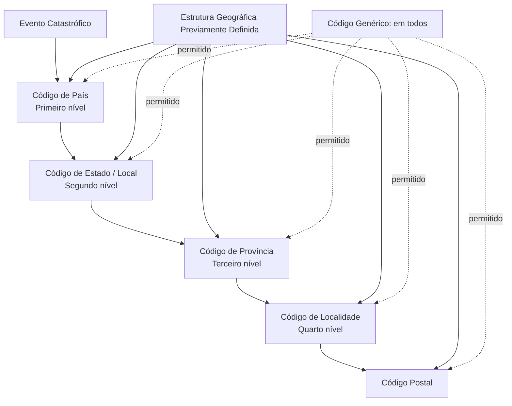

# Definição de Localizações de Eventos Catastróficos

## 1. Metadados do Documento
- **Arquivo de Origem:** Não identificado no conteúdo fornecido
- **Tipo de Documento:** Especificação Técnica
- **Domínio / Sistema:** CORE — Eventos Catastróficos / Estrutura Geográfica
- **Público-Alvo:** Desenvolvedores, Arquitetos, Analistas Funcionais e Operação
- **Data/Versão Identificada:** Não identificada

---

## 2. Resumo Executivo & Contexto de Negócio

O documento define a manutenção de localizações geográficas associadas a eventos catastróficos que podem originar um sinistro. O objetivo declarado é registrar as localizações nas quais os eventos ocorreram.

A localização é estruturada em níveis geográficos previamente definidos. O primeiro nível é o país, seguido por estado/local, província, localidade e código postal. O documento estabelece que códigos genéricos, com o significado de “em todos”, são permitidos em todos os níveis da estrutura geográfica.

Cada definição de localização de evento catastrófico possui uma chave de identificação do evento, um código identificador do evento, atributos geográficos e uma marca de habilitação. A marca determina se a definição pode ou não ser utilizada.

O conteúdo também esclarece que o CORE não controla se o evento ocorreu efetivamente no local da ocorrência do sinistro. Caso seja necessária essa validação, o documento indica que ela poderia ser implementada na estrutura do local do sinistro, quando o sinistro estiver associado a um evento, ou por meio de um controle técnico.

---

## 3. Arquitetura, Componentes & Tecnologias Envolvidas

### Componentes e conceitos identificados

| Componente / Conceito | Papel descrito no documento |
| :--- | :--- |
| Eventos catastróficos | Eventos que podem originar um sinistro. |
| Definição de localizações de eventos | Registro das localizações geográficas em que eventos catastróficos ocorreram. |
| Estrutura geográfica | Hierarquia de níveis geográficos que deve estar definida previamente. |
| CORE | Sistema no qual não existe controle descrito para confirmar que o evento ocorreu no local do sinistro. |
| Sinistro | Entidade que pode ser associada a um evento catastrófico. |
| Controle técnico | Possível local para implementar validação do local de ocorrência do evento. |

### Hierarquia geográfica



> **Nota de Análise:** O documento não descreve tecnologias, métodos HTTP, contratos JSON, bancos de dados, interfaces ou integrações técnicas para a manutenção das localizações de eventos catastróficos.

---

## 4. Regras de Negócio, Especificações Funcionais & Processos

1. A funcionalidade tem como objetivo definir as localizações geográficas nas quais ocorreram eventos catastróficos.
2. Eventos catastróficos podem originar um sinistro.
3. A estrutura geográfica deve estar definida previamente antes da definição das localizações de eventos.
4. São admitidos códigos genéricos em todos os níveis da estrutura geográfica.
5. O significado dos códigos genéricos é “em todos”.
6. A definição deve conter uma chave para identificar os diferentes eventos catastróficos que podem originar um sinistro.
7. A definição deve conter um código identificador do evento.
8. O código de país representa o primeiro nível da estrutura geográfica.
9. O código de estado ou local representa o segundo nível da estrutura geográfica e pode ser um código genérico.
10. O código de província representa o terceiro nível da estrutura geográfica e pode ser um código genérico.
11. O código de localidade representa o quarto nível da estrutura geográfica e pode ser um código genérico.
12. O código postal pode ser um código genérico.
13. A marca de inabilitação determina se a definição está habilitada ou inabilitada para uso.
14. O CORE não controla se o evento ocorreu no local de ocorrência do sinistro.
15. Uma validação de local de ocorrência poderia ser implementada na estrutura do local do sinistro quando o sinistro estiver associado a um evento.
16. Como alternativa, a validação poderia ser implementada em um controle técnico.

---

## 5. Tabelas de Parâmetros, Ambientes e Estruturas de Dados

| Item / Parâmetro | Descrição / Função | Tipo / Valores / Formato | Ambiente / Observações |
| :--- | :--- | :--- | :--- |
| Código de evento | Chave usada para identificar os diferentes eventos catastróficos que podem originar um sinistro. | Código; formato não detalhado. | Associado à definição de localização de evento. |
| Código de identificação do evento | Código identificador do evento. | Código; formato não detalhado. | Não há detalhamento adicional. |
| Código de país | País correspondente ao primeiro nível da estrutura geográfica. | Código; admite código genérico. | Primeiro nível geográfico. |
| Código de estado | Local correspondente ao segundo nível da estrutura geográfica. | Código; pode ser código genérico. | O texto usa “estado” na propriedade e “local” na descrição. |
| Código de província | Terceiro nível da estrutura geográfica. | Código; pode ser código genérico. | Terceiro nível geográfico. |
| Código de localidade | Quarto nível da estrutura geográfica. | Código; pode ser código genérico. | Quarto nível geográfico. |
| Código postal | Código postal da localização. | Código; pode ser código genérico. | Não há detalhamento adicional. |
| Marca inabilitada | Indica se a definição está habilitada ou inabilitada para uso. | Indicador de habilitação/inabilitação; formato não detalhado. | Controla a possibilidade de uso da definição. |
| Código genérico | Representa o significado “em todos”. | Código; valor concreto não informado. | Admitido em todos os níveis geográficos. |
| Estrutura geográfica | Base hierárquica usada para definir as localizações dos eventos. | Hierarquia geográfica. | Deve estar definida previamente. |
| Validação de local de ocorrência | Possível verificação entre evento associado e local do sinistro. | Regra não implementada no CORE conforme o documento. | Pode ser colocada na estrutura do local do sinistro ou em controle técnico. |

---

## 6. Bateria de Perguntas & Respostas para RAG (FAQ Sintético)

### P1: Qual é o objetivo da definição de localizações de eventos catastróficos?
**R:** O objetivo é definir as localizações geográficas em que ocorreram eventos catastróficos. Esses eventos podem originar um sinistro.

### P2: A estrutura geográfica precisa existir antes de cadastrar a localização de um evento?
**R:** Sim. O documento estabelece que a estrutura geográfica deve estar definida previamente para que as localizações de eventos catastróficos sejam definidas.

### P3: O que significa um código genérico na estrutura geográfica?
**R:** Um código genérico significa “em todos”. O documento informa que códigos genéricos são aceitos em todos os níveis da estrutura geográfica.

### P4: Quais são os níveis geográficos identificados no documento?
**R:** Os níveis identificados são: país como primeiro nível; estado ou local como segundo nível; província como terceiro nível; localidade como quarto nível; e código postal como atributo geográfico adicional.

### P5: O código de estado pode ser genérico?
**R:** Sim. O código de estado, descrito como local e segundo nível da estrutura geográfica, pode ser um código genérico.

### P6: Quais campos identificam um evento catastrófico?
**R:** A definição contém o código de evento, que é a chave para identificar diferentes eventos catastróficos que podem originar um sinistro, e o código de identificação do evento, que contém um código identificador do evento.

### P7: Para que serve a marca inabilitada?
**R:** A marca inabilitada indica se uma definição de localização de evento catastrófico está habilitada ou inabilitada para ser usada.

### P8: O CORE valida se o evento ocorreu no local do sinistro?
**R:** Não. O documento afirma explicitamente que o CORE não controla se o evento ocorreu no local de ocorrência do sinistro.

### P9: Onde poderia ser implementada a validação entre o evento e o local de ocorrência do sinistro?
**R:** A validação poderia ser implementada na estrutura do local do sinistro, se o sinistro estiver associado a um evento, ou em um controle técnico.

### P10: O documento detalha o formato dos códigos geográficos e do indicador de habilitação?
**R:** Não. O documento descreve a finalidade dos códigos de evento, país, estado, província, localidade e código postal, mas não informa formatos, tamanhos, valores concretos ou domínios permitidos.

---

## 7. Glossário de Termos, Siglas & Conceitos-Chave

- **CORE:** Sistema citado como não responsável pelo controle de que o evento ocorreu no local de ocorrência do sinistro.
- **Evento catastrófico:** Evento que pode originar um sinistro e para o qual podem ser definidas localizações geográficas.
- **Sinistro:** Entidade que pode ser originada por um evento catastrófico e associada a um evento.
- **Estrutura geográfica:** Hierarquia geográfica que deve estar previamente definida e contém os níveis utilizados pela definição de localização.
- **Código genérico:** Código permitido em todos os níveis da estrutura geográfica, com o significado de “em todos”.
- **Marca inabilitada:** Propriedade que determina se uma definição está habilitada ou inabilitada para uso.
- **Controle técnico:** Possível ponto de implementação para validar a relação entre um evento e o local de ocorrência do sinistro.

---

## 8. Notas Críticas, Riscos & Limitações

- O documento não especifica o valor concreto, formato, tamanho ou convenção dos códigos genéricos.
- O documento não detalha o formato dos códigos de evento, identificação de evento, país, estado, província, localidade ou código postal.
- O documento não define o formato técnico da marca inabilitada.
- O CORE não realiza o controle de que o evento ocorreu no local de ocorrência do sinistro.
- A validação entre evento e local do sinistro é apresentada apenas como possibilidade de implementação, sem detalhamento de regra, responsável, interface ou mecanismo técnico.
- Não há detalhes sobre interfaces de manutenção, persistência, integrações, permissões, auditoria, APIs ou contratos de dados.

---

## 9. Conteúdo Bruto Estruturado (Referência Fiel)

```text
--- [PÁGINA 1 DE 3] ---

DEFINICIÓN de Ubicaciones de Eventos
Objetivo
Definir las ubicaciones geográficas en las que han ocurrido los eventos. En todos los niveles de la
estructura geográfica se admiten códigos genéricos que significa "en todos". La estructura geográfica
tiene que estar definida previamente.
Imagen Mantenimiento Ubicaciones de Eventos Catrastróficos:
 /
 CF
Home Solutions APIs Documentation Zeus
EN


--- [PÁGINA 2 DE 3] ---

Propiedades
Código de evento
Esta propiedad contendrá la clave por la que se va a identificar los distintos eventos catrastróficos
que pueden originar un siniestro.
Código de identificación del evento
Esta propiedad contiene un código identificador del evento.
Código de país
Esta propiedad contiene el país, primer nivel de la estructura geográfica
Código de estado
Esta propiedad contiene el local,segundo nivel de la estructura geográfica. Puede ser código
genérico.
Código de provincia
Esta propiedad contiene el tercer nivel de la estructura geográfica. Puede ser código genérico.


--- [PÁGINA 3 DE 3] ---

Código de localidad
Esta propiedad contiene el cuarto nivel de la estructura geográfica. Puede ser código genérico.
Código de postal
Esta propiedad contiene el código postal. Puede ser código genérico.
marca inhabilitada
Esta propiedad indica si esta definición está inhabilitada o habilitada para ser usada.
Preguntas frecuentes
¿Se controla en CORE que el evento se haya ocurrido en el lugar de ocurrencia?
R/No, la información del lugar del siniestro no es CORE, se podría poner la validación en la
estructura del lugar del siniestro, si se ha asociado el siniestro a un evento, o en un control
técnico.
```
