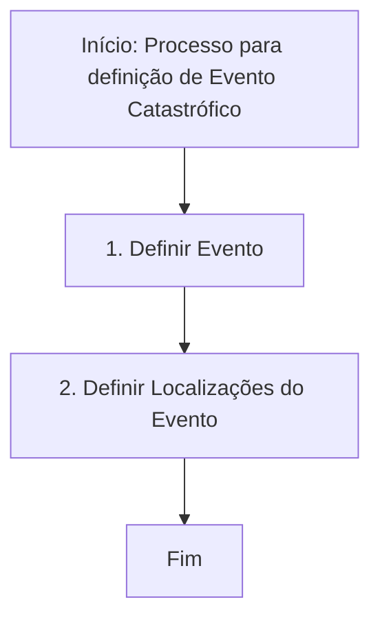

# Definição de Eventos Catastróficos — Processo de Definição e Localizações

## 1. Metadados do Documento
- **Arquivo de Origem:** Não identificado
- **Tipo de Documento:** Procedimento
- **Domínio / Sistema:** Eventos Catastróficos; Home Solutions; APIs; Documentation; Zeus
- **Público-Alvo:** Não identificado
- **Data/Versão Identificada:** Não identificada

---

## 2. Resumo Executivo & Contexto de Negócio

O documento descreve um procedimento para a definição de um **Evento Catastrófico**. O objetivo declarado é explicar os passos que devem ser seguidos para realizar essa definição.

O processo apresentado possui duas etapas sequenciais: primeiro, definir o evento; segundo, definir as localizações associadas ao evento. Após a conclusão dessas duas etapas, o processo é encerrado.

O conteúdo também referencia os termos **CF**, **Home Solutions**, **APIs**, **Documentation**, **Zeus** e **EN**, sem detalhar a função, integração ou responsabilidade de cada elemento no processo de definição de eventos catastróficos.

---

## 3. Arquitetura, Componentes & Tecnologias Envolvidas

O documento não apresenta uma arquitetura técnica detalhada, contratos de integração, tecnologias, URLs, métodos HTTP, ambientes ou interfaces entre sistemas. Os termos abaixo são apenas citados no conteúdo bruto.

| Componente / Termo | Informação sustentada pelo documento |
| :--- | :--- |
| Evento Catastrófico | Entidade que deve ser definida na primeira etapa do processo. |
| Localizações do Evento | Entidade que deve ser definida na segunda etapa do processo. |
| CF | Termo citado sem descrição adicional. |
| Home Solutions | Termo citado sem descrição adicional. |
| APIs | Termo citado sem descrição adicional. |
| Documentation | Termo citado sem descrição adicional. |
| Zeus | Termo citado sem descrição adicional. |
| EN | Termo citado sem descrição adicional. |



> **Nota de Análise:** O documento cita “Home Solutions”, “APIs”, “Documentation” e “Zeus”, porém não detalha a arquitetura, os serviços envolvidos, os métodos de integração ou os contratos expostos.

---

## 4. Regras de Negócio, Especificações Funcionais & Processos

### Processo para definição de um Evento Catastrófico

1. **Definir Evento**
   - O processo começa pela definição do evento.
   - O documento identifica esta etapa como **“DEFINIR Evento (1)”**.

2. **Definir Localizações do Evento**
   - Após a definição do evento, devem ser definidas as localizações do evento.
   - O documento identifica esta etapa como **“DEFINIR Ubicaciones Evento (2)”**.

3. **Fim**
   - O processo é encerrado após a definição das localizações do evento.

### Restrições e detalhamento disponível

- O documento não especifica campos obrigatórios para o Evento Catastrófico.
- O documento não especifica critérios de validação para a definição do evento.
- O documento não especifica o formato, a quantidade ou as regras de associação das localizações.
- O documento não descreve usuários responsáveis, aprovações, exceções, persistência de dados ou integrações técnicas.

---

## 5. Tabelas de Parâmetros, Ambientes e Estruturas de Dados

| Item / Parâmetro | Descrição / Função | Tipo / Valores / Formato | Ambiente / Observações |
| :--- | :--- | :--- | :--- |
| Evento | Elemento definido na primeira etapa do processo. | Não especificado | Referido como “Evento (1)”. |
| Localizações do Evento | Elemento definido após a definição do evento. | Não especificado | Referido como “Ubicaciones Evento (2)”. |
| CF | Termo citado no conteúdo. | Não especificado | Sem contexto adicional. |
| Home Solutions | Termo citado no conteúdo. | Não especificado | Sem contexto adicional. |
| APIs | Termo citado no conteúdo. | Não especificado | Não há APIs, endpoints ou contratos descritos. |
| Documentation | Termo citado no conteúdo. | Não especificado | Sem contexto adicional. |
| Zeus | Termo citado no conteúdo. | Não especificado | Sem contexto adicional. |
| EN | Termo citado no conteúdo. | Não especificado | Sem contexto adicional. |

---

## 6. Bateria de Perguntas & Respostas para RAG (FAQ Sintético)

### P1: Qual é o objetivo do documento sobre Eventos Catastróficos?
**R:** O objetivo é explicar os passos a seguir para definir um Evento Catastrófico.

### P2: Quais são as etapas do processo para definir um Evento Catastrófico?
**R:** O processo possui duas etapas: definir o evento e definir as localizações do evento. Após essas etapas, o processo termina.

### P3: Qual é a primeira etapa do processo de definição de Evento Catastrófico?
**R:** A primeira etapa é **“DEFINIR Evento (1)”**, isto é, definir o evento.

### P4: O que deve ser feito depois de definir o Evento Catastrófico?
**R:** Após definir o evento, deve-se definir as localizações associadas ao evento, na etapa identificada como **“DEFINIR Ubicaciones Evento (2)”**.

### P5: Quando o processo de definição de Evento Catastrófico é finalizado?
**R:** O processo é finalizado após a definição das localizações do evento.

### P6: O documento informa quais campos são obrigatórios para cadastrar ou definir um Evento Catastrófico?
**R:** Não. O documento apenas informa que o evento deve ser definido, sem apresentar campos, atributos ou regras de preenchimento.

### P7: O documento detalha como as localizações do evento devem ser definidas?
**R:** Não. O documento informa a etapa “DEFINIR Ubicaciones Evento (2)”, mas não descreve critérios, formatos, validações ou quantidade de localizações.

### P8: Quais termos técnicos ou sistemas são citados no conteúdo?
**R:** O conteúdo cita CF, Home Solutions, APIs, Documentation, Zeus e EN. O documento não explica o papel desses termos no processo.

### P9: Há endpoints, métodos HTTP ou contratos JSON de APIs no documento?
**R:** Não. Embora o termo “APIs” seja citado, não há endpoints, métodos HTTP, contratos JSON, autenticação ou detalhes de integração.

### P10: O documento apresenta uma arquitetura de software para o processo?
**R:** Não. O documento apresenta somente um fluxo processual de duas etapas: definir o evento e definir as localizações do evento.

---

## 7. Glossário de Termos, Siglas & Conceitos-Chave

- **Evento Catastrófico:** Entidade central do processo descrito; deve ser definida antes das localizações do evento.
- **Localizações do Evento / Ubicaciones Evento:** Elemento definido após a definição do Evento Catastrófico.
- **CF:** Termo citado sem significado definido no documento.
- **Home Solutions:** Termo citado sem significado definido no documento.
- **APIs:** Termo citado sem detalhamento de interfaces, serviços ou contratos.
- **Documentation:** Termo citado sem detalhamento adicional.
- **Zeus:** Termo citado sem significado definido no documento.
- **EN:** Termo citado sem significado definido no documento.

---

## 8. Notas Críticas, Riscos & Limitações

- O documento não identifica arquivo de origem, autor, data, versão ou público-alvo.
- Não há detalhamento técnico sobre sistemas, integrações, APIs, ambientes, URLs, autenticação ou observabilidade.
- Não há regras de validação, estrutura de dados, campos obrigatórios ou tratamento de exceções para a definição de eventos e localizações.
- Os termos CF, Home Solutions, APIs, Documentation, Zeus e EN não possuem explicação contextual.
- O fluxo é sequencial e simples, mas não informa responsáveis, aprovações, entradas, saídas ou critérios de conclusão de cada etapa.

---

## 9. Conteúdo Bruto Estruturado (Referência Fiel)

```text
--- [PÁGINA 1 DE 1] ---

DEFINICIÓN Eventos Catrastróficos
Objetivo
Explicar los pasos a seguir para definir un Evento catastrófico
Proceso para la definición de un Evento Catastrófico
DEFINIR
Evento (1)
DEFINIR
Ubicaciones
Evento(2)
FIN
1. DEFINIR Evento
2. DEFINIR Ubicaciones Evento
 / 
 CF
Home Solutions APIs Documentation Zeus
EN
```
