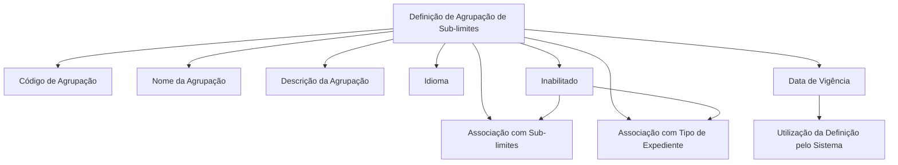
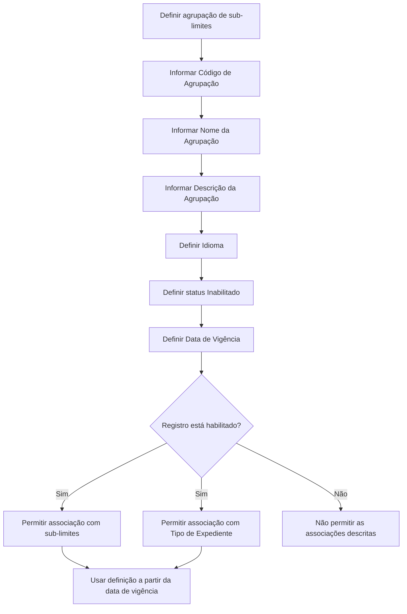

# Definição de Agrupações de Sub-limites

## 1. Metadados do Documento
- **Arquivo de Origem:** Não identificado
- **Tipo de Documento:** Especificação Técnica
- **Domínio / Sistema:** Home Solutions APIs Documentation Zeus
- **Público-Alvo:** Desenvolvedores, Analistas Funcionais e Operação
- **Data/Versão Identificada:** Não identificada

---

## 2. Resumo Executivo & Contexto de Negócio

O documento descreve a definição de agrupações de sub-limites. O objetivo declarado é explicar como criar agrupações que, posteriormente, receberão associações com sub-limites.

Uma agrupação de sub-limites é identificada por uma chave denominada Código de Agrupação. A definição também contém nome, descrição, idioma, indicador de inabilitação e data de vigência.

O indicador de inabilitação controla se o registro pode receber associações com sub-limites ou ser associado a um Tipo de Expediente. A data de vigência determina a partir de qual data a definição pode ser utilizada pelo sistema.

Não há detalhamento de métodos HTTP, contratos JSON, persistência de dados, regras de validação de formato, valores permitidos ou fluxos de aprovação.

---

## 3. Arquitetura, Componentes & Tecnologias Envolvidas

O documento cita o contexto **Home Solutions APIs Documentation Zeus**, mas não descreve componentes de software, microsserviços, integrações, tecnologias, ambientes ou interfaces técnicas.



> **Nota de Análise:** O documento não detalha a arquitetura técnica, os endpoints, os contratos de integração ou o mecanismo usado para persistir as agrupações de sub-limites.

---

## 4. Regras de Negócio, Especificações Funcionais & Processos

1. Uma agrupação deve possuir um **Código de Agrupação**, que representa a chave da agrupação de sub-limites.
2. Uma agrupação deve possuir um **Nome da Agrupação**, usado para nomear a chave de agrupação.
3. Uma agrupação pode possuir uma **Descrição da Agrupação**, utilizada para detalhar o que será associado à agrupação.
4. A propriedade **Idioma** contém o código do idioma no qual os textos da definição estão definidos.
5. Os idiomas mencionados são codificados, porém o documento não fornece a lista de códigos suportados.
6. A propriedade **Inabilitado** indica se o registro está habilitado ou não para:
   - receber associação com sub-limites; e
   - associar a agrupação a um Tipo de Expediente.
7. A **Data de Vigência** informa ao sistema a data em que a definição entra em vigor e pode ser utilizada.

### Fluxo funcional identificado



---

## 5. Tabelas de Parâmetros, Ambientes e Estruturas de Dados

| Item / Parâmetro | Descrição / Função | Tipo / Valores / Formato | Ambiente / Observações |
| :--- | :--- | :--- | :--- |
| Código de Agrupação | Contém a chave da agrupação de sub-limites. | Não especificado. | Identificador da agrupação. |
| Nome da Agrupação | Contém o nome atribuído à chave de agrupação. | Não especificado. | Associado ao Código de Agrupação. |
| Descrição da Agrupação | Contém uma descrição para detalhar o que será associado à agrupação. | Não especificado. | O conteúdo permitido não é detalhado. |
| Idioma | Contém o código do idioma no qual os textos estão definidos. | Código de idioma codificado. | A relação de códigos de idioma não é fornecida. |
| Inabilitado | Indica se o registro está habilitado para receber associações. | Não especificado. | Afeta a associação com sub-limites e Tipo de Expediente. |
| Data de Vigência | Informa quando a definição entra em vigor para uso pelo sistema. | Data; formato não especificado. | Controla o início de utilização da definição. |
| Sub-limites | Elementos que podem ser associados a uma agrupação. | Não especificado. | Não há estrutura ou regras adicionais. |
| Tipo de Expediente | Entidade à qual uma agrupação pode ser associada. | Não especificado. | A associação depende do status de habilitação. |
| Home Solutions APIs Documentation Zeus | Referência de sistema ou contexto documental apresentada no conteúdo bruto. | Não especificado. | Não há detalhamento adicional. |

---

## 6. Bateria de Perguntas & Respostas para RAG (FAQ Sintético)

### P1: Qual é o objetivo do documento de definição de agrupações de sub-limites?
**R:** O objetivo é explicar como definir agrupações às quais, posteriormente, serão associados sub-limites.

### P2: Qual propriedade identifica uma agrupação de sub-limites?
**R:** A propriedade **Código de Agrupação** contém a chave que identifica a agrupação de sub-limites.

### P3: Para que serve o Nome da Agrupação?
**R:** O **Nome da Agrupação** contém o nome que será atribuído à chave de agrupação.

### P4: Qual é a finalidade da Descrição da Agrupação?
**R:** A **Descrição da Agrupação** detalha o que será associado à agrupação de sub-limites.

### P5: O que representa a propriedade Idioma?
**R:** A propriedade **Idioma** contém o código do idioma no qual os textos da definição estão definidos. O documento informa que os idiomas são codificados, mas não apresenta os códigos disponíveis.

### P6: O que a propriedade Inabilitado controla?
**R:** A propriedade **Inabilitado** indica se o registro está habilitado para receber associações com sub-limites ou para associar a agrupação a um Tipo de Expediente.

### P7: Uma agrupação inabilitada pode ser associada a um Tipo de Expediente?
**R:** O documento estabelece que o status de habilitação determina se a agrupação pode ser associada a um Tipo de Expediente. Quando o registro não está habilitado, essa associação não deve ser permitida conforme a regra descrita.

### P8: Quando uma definição de agrupação passa a poder ser utilizada pelo sistema?
**R:** A definição passa a poder ser utilizada a partir da **Data de Vigência**, que informa ao sistema quando a definição entra em vigor.

### P9: O documento define os formatos dos campos Código de Agrupação e Data de Vigência?
**R:** Não. O documento descreve a finalidade desses campos, mas não informa formatos, tamanhos, tipos técnicos ou regras de validação.

### P10: O documento especifica APIs, métodos HTTP ou contratos JSON para as agrupações?
**R:** Não. Apesar de citar “Home Solutions APIs Documentation Zeus”, o conteúdo não detalha endpoints, métodos HTTP, payloads JSON, códigos de resposta ou contratos de integração.

---

## 7. Glossário de Termos, Siglas & Conceitos-Chave

- **Agrupação de Sub-limites:** Definição identificada por uma chave e destinada a receber associações com sub-limites.
- **Código de Agrupação:** Chave da agrupação de sub-limites.
- **Nome da Agrupação:** Nome atribuído à chave de agrupação.
- **Descrição da Agrupação:** Texto para detalhar o que será associado à agrupação.
- **Idioma:** Código do idioma em que os textos da definição estão definidos.
- **Inabilitado:** Propriedade que indica se a agrupação está habilitada para associações com sub-limites e Tipo de Expediente.
- **Data de Vigência:** Data a partir da qual a definição entra em vigor no sistema.
- **Tipo de Expediente:** Entidade citada como possível destino de associação para uma agrupação.
- **Home Solutions APIs Documentation Zeus:** Referência apresentada no conteúdo, sem detalhamento adicional sobre significado ou escopo.

---

## 8. Notas Críticas, Riscos & Limitações

- O documento não identifica arquivo de origem, versão, data de publicação ou autor.
- Não há definição dos formatos, obrigatoriedade, unicidade ou regras de validação dos campos.
- O documento não lista os códigos de idioma aceitos.
- O significado técnico dos valores possíveis para **Inabilitado** não é detalhado.
- Não há regras sobre alterações, exclusões, histórico ou sobreposição de datas de vigência.
- Não há descrição de APIs, telas, integração, persistência, permissões ou tratamento de erros.
- Não são apresentados detalhes adicionais sobre **Home Solutions APIs Documentation Zeus**.

---

## 9. Conteúdo Bruto Estruturado (Referência Fiel)

```text
--- [PÁGINA 1 DE 2] ---

DEFINICIÓN de agrupaciónes de Sub-límites
Objetivo
Este documento tiene como objetivo explicar como definir las agrupaciónes a las que posteriormente
se les va a asociar sub-límites
Propiedades
Código de Agrupación
Esta propiedad contiene la clave de la agrupación de sub-limites.
Nombre de la agrupación
Esta propiedad contendrá el nombre que se le va a dar a la clave de agrupación
Descripción de la Agrupación
Esta propiedad contiene una descripción de la agrupación, para detallar más que se va a asociar en
la agrupación
Idioma
Esta propiedad contiene el código del idioma en el que están definido los textos. Estos idiomas están
codificados.
Inhabilitado
 /
 CF
Home Solutions APIs Documentation Zeus
EN


--- [PÁGINA 2 DE 2] ---

Esta propiedad indica si el registro está o no habilitado para ser poder asociarle sub-límites o poder
asociar esta agrupación a un Tipo de Expediente.
Fecha Vigencia
Indica al sistema en qué fecha entra en vigor esta definición para ser utilizada
```
