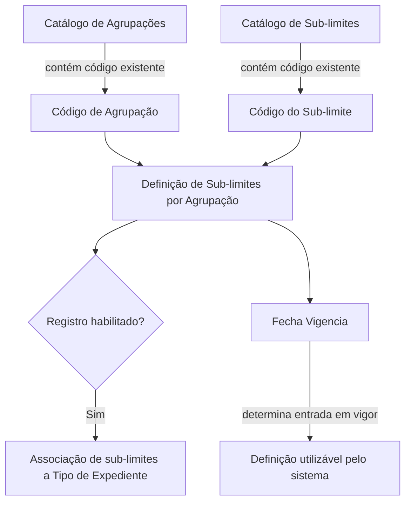
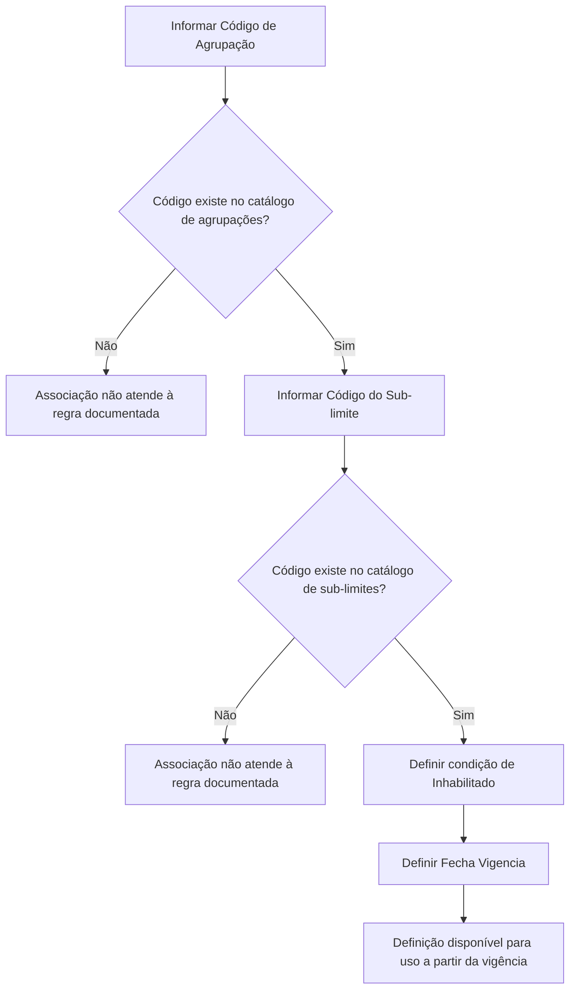

# Definição de Sub-limites por Agrupação

## 1. Metadados do Documento
- **Arquivo de Origem:** Não identificado
- **Tipo de Documento:** Especificação Técnica
- **Domínio / Sistema:** Home Solutions APIs Documentation Zeus / CF
- **Público-Alvo:** Desenvolvedores, Analistas Funcionais e Operação
- **Data/Versão Identificada:** Não identificada

---

## 2. Resumo Executivo & Contexto de Negócio

O documento descreve a definição de sub-limites por agrupação. O objetivo declarado é explicar como associar sub-limites às agrupações.

A associação depende da existência prévia tanto da chave de agrupação no catálogo de agrupações quanto da chave de sub-limite no catálogo de sub-limites. Portanto, os catálogos citados funcionam como referências obrigatórias para a criação da definição.

A definição possui controle de habilitação por meio da propriedade **Inhabilitado** e controle temporal por meio da propriedade **Fecha Vigencia**. A data de vigência determina quando uma definição passa a estar disponível para uso pelo sistema.

O documento também relaciona a habilitação do registro à possibilidade de associar sub-limites a um **Tipo de Expediente**. Não há detalhamento adicional sobre métodos HTTP, contratos JSON, persistência, autenticação ou interfaces expostas.

---

## 3. Arquitetura, Componentes & Tecnologias Envolvidas

Os componentes e conceitos explicitamente citados são:

- **Agrupação:** entidade identificada por um código existente no catálogo de agrupações.
- **Sub-limite:** entidade identificada por um código existente no catálogo de sub-limites.
- **Definição de sub-limites por agrupação:** registro que associa uma agrupação a um sub-limite.
- **Tipo de Expediente:** entidade para a qual sub-limites podem ser associados quando o registro estiver habilitado.
- **Home Solutions APIs Documentation Zeus:** referência documental presente no conteúdo bruto.
- **CF:** referência presente no rodapé do conteúdo original.



> **Nota de Análise:** O documento não detalha a implementação técnica dos catálogos, a persistência da definição, nem a forma de integração com o Tipo de Expediente.

---

## 4. Regras de Negócio, Especificações Funcionais & Processos

1. A definição de sub-limites por agrupação tem a finalidade de associar sub-limites às agrupações.
2. A propriedade **Código de Agrupação** contém a chave da agrupação à qual os sub-limites serão associados.
3. O código informado em **Código de Agrupação** deve existir no catálogo de agrupações.
4. A propriedade **Código do sub-límite** contém a chave do sub-limite que será associado à agrupação.
5. O código informado em **Código do sub-límite** deve existir no catálogo de sub-limites.
6. A propriedade **Inhabilitado** informa se o registro está habilitado ou não para permitir a associação de sub-limites a um Tipo de Expediente.
7. A propriedade **Fecha Vigencia** informa ao sistema a data em que a definição passa a vigorar e pode ser utilizada.
8. O documento não especifica o formato dos códigos, o formato da data de vigência, nem os valores aceitos pela propriedade **Inhabilitado**.

### Fluxo funcional identificado



---

## 5. Tabelas de Parâmetros, Ambientes e Estruturas de Dados

| Item / Parâmetro | Descrição / Função | Tipo / Valores / Formato | Ambiente / Observações |
| :--- | :--- | :--- | :--- |
| Código de Agrupação | Chave da agrupação à qual os sub-limites serão associados. | Não especificado. | Deve existir no catálogo de agrupações. |
| Código do sub-límite | Chave do sub-limite a associar à agrupação. | Não especificado. | Deve existir no catálogo de sub-limites. |
| Inhabilitado | Indica se o registro está habilitado ou não para associar sub-limites a um Tipo de Expediente. | Não especificado. | O documento não define valores possíveis nem comportamento detalhado. |
| Fecha Vigencia | Informa a data de entrada em vigor da definição para uso pelo sistema. | Data; formato não especificado. | Define quando a definição pode ser utilizada. |
| Catálogo de Agrupações | Repositório referencial das chaves de agrupação. | Não especificado. | A existência do código é pré-requisito para a definição. |
| Catálogo de Sub-limites | Repositório referencial das chaves de sub-limite. | Não especificado. | A existência do código é pré-requisito para a definição. |
| Tipo de Expediente | Entidade que pode receber associação de sub-limites. | Não especificado. | A associação depende da condição de habilitação do registro. |
| Home Solutions APIs Documentation Zeus | Referência documental exibida no conteúdo. | Não especificado. | Não há detalhes técnicos adicionais. |
| CF | Referência exibida no conteúdo. | Não especificado. | Significado não definido no documento. |

---

## 6. Bateria de Perguntas & Respostas para RAG (FAQ Sintético)

### P1: Qual é o objetivo da definição de sub-limites por agrupação?
**R:** O objetivo é explicar e suportar a associação de sub-limites às agrupações.

### P2: O que deve ser informado no Código de Agrupação?
**R:** O Código de Agrupação deve conter a chave da agrupação à qual os sub-limites serão associados. Essa chave deve existir previamente no catálogo de agrupações.

### P3: Qual validação é exigida para o Código do sub-límite?
**R:** O Código do sub-límite deve corresponder a uma chave existente no catálogo de sub-limites.

### P4: É possível associar um sub-limite usando um código de agrupação inexistente?
**R:** Não de acordo com a regra documentada. A chave informada no Código de Agrupação deve existir no catálogo de agrupações.

### P5: Qual é a finalidade da propriedade Inhabilitado?
**R:** A propriedade Inhabilitado indica se o registro está habilitado ou não para permitir a associação de sub-limites a um Tipo de Expediente.

### P6: O documento define quais valores podem ser usados em Inhabilitado?
**R:** Não. O documento descreve apenas a finalidade da propriedade, sem informar valores permitidos, formato ou comportamento específico para cada estado.

### P7: Quando uma definição de sub-limites por agrupação passa a poder ser usada?
**R:** A definição passa a poder ser utilizada pelo sistema na data informada na propriedade Fecha Vigencia.

### P8: Qual é a função da Fecha Vigencia?
**R:** A Fecha Vigencia indica ao sistema a data em que a definição entra em vigor para ser utilizada.

### P9: Quais catálogos são dependências da definição?
**R:** A definição depende do catálogo de agrupações, para validar o Código de Agrupação, e do catálogo de sub-limites, para validar o Código do sub-límite.

### P10: O documento descreve APIs, métodos HTTP ou contratos JSON para a associação?
**R:** Não. O conteúdo fornecido não detalha APIs, métodos HTTP, contratos JSON, formatos de requisição ou resposta, autenticação ou rotas técnicas.

---

## 7. Glossário de Termos, Siglas & Conceitos-Chave

- **Agrupação:** entidade identificada por uma chave no catálogo de agrupações e utilizada como destino da associação de sub-limites.
- **Sub-limite:** entidade identificada por uma chave no catálogo de sub-limites e associada a uma agrupação.
- **Código de Agrupação:** chave da agrupação à qual um ou mais sub-limites serão associados.
- **Código do sub-límite:** chave do sub-limite que será associado a uma agrupação.
- **Inhabilitado:** propriedade que indica a condição de habilitação do registro para associação de sub-limites a um Tipo de Expediente.
- **Fecha Vigencia:** propriedade que determina a data de entrada em vigor da definição.
- **Tipo de Expediente:** entidade citada como receptora da associação de sub-limites.
- **CF:** sigla ou referência presente no documento, sem significado definido no conteúdo.
- **Zeus:** termo presente em “Home Solutions APIs Documentation Zeus”, sem detalhamento adicional no conteúdo.

---

## 8. Notas Críticas, Riscos & Limitações

- O documento não identifica o arquivo de origem, data, versão ou autor.
- Não são informados formatos, tamanhos, padrões ou exemplos para Código de Agrupação e Código do sub-limite.
- Não há descrição dos valores possíveis, comportamento padrão ou impacto operacional da propriedade **Inhabilitado**.
- O formato aceito para **Fecha Vigencia** não é especificado.
- Não são documentados mecanismos de validação, mensagens de erro, persistência, auditoria ou aprovação.
- Não há detalhamento de APIs, métodos HTTP, contratos JSON, ambientes, URLs, credenciais, permissões ou integrações técnicas.
- O significado de **CF** e o papel técnico de **Home Solutions APIs Documentation Zeus** não são definidos.

---

## 9. Conteúdo Bruto Estruturado (Referência Fiel)

```text
--- [PÁGINA 1 DE 1] ---

DEFINICIÓN de Sub-límites por Agrupación
Objetivo
Este documento explica como asociar sub-límites a las agrupaciones
Propiedades
Código de Agrupación
Esta propiedadcontiene la clave de la agrupación a la que se le va a asociar los sublímites. La clave
tiene que existir en el catálogo de agrupaciones
Código del sub-límite
Esta propiedadcontendrá la clave del sub-límite que se quiere asociar a la agrupación. Tiene que
existir en el catálogo de sub-límites
Inhabilitado
Esta propiedadindica si el registro está o no habilitado para ser poder asociarle sub-límites a un Tipo
de Expediente.
Fecha Vigencia
Indica al sistema en qué fecha entra en vigor esta definición para ser utilizada
 / 
 CF
Home Solutions APIs Documentation Zeus
EN
```
