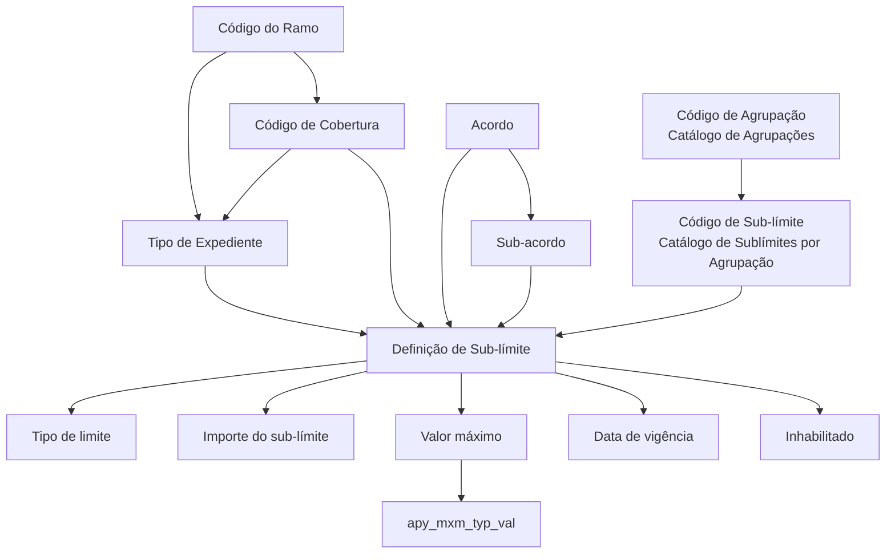

# Definição de Sublimites por Ramo, Tipo de Expediente e Cobertura

## 1. Metadados do Documento
- **Arquivo de Origem:** `Não identificado no conteúdo fornecido`
- **Tipo de Documento:** `Especificação Técnica`
- **Domínio / Sistema:** `Definição de sub-limites para ramos, tipos de expediente e coberturas`
- **Público-Alvo:** `Desenvolvedores, Arquitetos, Analistas Funcionais e Operação`
- **Data/Versão Identificada:** `Não identificada`

---

## 2. Resumo Executivo & Contexto de Negócio

O documento descreve como definir sub-limites para cada combinação de tipo de expediente, cobertura e ramo. A configuração relaciona entidades de catálogo, incluindo ramos, coberturas, tipos de expediente, agrupações e sub-limites.

A definição de sub-limites pode considerar acordo e sub-acordo. Segundo o documento, um acordo representa um pacto ou convênio entre a companhia e um terceiro, permitindo alterações em um ramo já definido. Essas alterações impactam determinados conceitos de negócio, sem necessariamente afetar todas as partes da apólice.

O sub-limite pode ser configurado como um valor fixo ou determinado por lógica de negócio. O documento prevê tipos de limite baseados em importe, percentuais sobre a soma assegurada da cobertura ou da cobertura principal, incluindo modalidades de percentual por mil.

Além do importe do sub-limite, a especificação prevê um valor máximo. Esse valor máximo pode ser expresso como importe, número ou dias, e pode ser aplicado em escopos de sinistro, expediente ou vigência por risco. A definição também inclui controle de habilitação e data de vigência.

---

## 3. Arquitetura, Componentes & Tecnologias Envolvidas

O conteúdo não detalha tecnologias de implementação, APIs, métodos HTTP, bancos de dados, ambientes, URLs, microsserviços ou ferramentas de desenvolvimento. O documento descreve exclusivamente o modelo funcional de configuração de sub-limites e as dependências entre catálogos de negócio.

### Componentes e conceitos identificados

- **Ramo:** chave do ramo associada ao tipo de expediente.
- **Cobertura:** cobertura vinculada ao ramo informado.
- **Tipo de Expediente:** tipo de expediente que deve possuir previamente a cobertura configurada.
- **Acordo:** pacto ou convênio entre a companhia e um terceiro.
- **Sub-acordo:** subcontrato que representa condições especiais dentro de um acordo.
- **Agrupação de Sublimites:** catálogo que deve conter o código de agrupação informado.
- **Sublímites por Agrupação:** catálogo que deve conter o código de sub-límite associado à agrupação.
- **Sub-límite:** definição configurável com tipo, importe, moeda, lógica de cálculo e valor máximo.
- **`apy_mxm_typ_val`:** atributo que determina o escopo sobre o qual o importe máximo é aplicado.



> **Nota de Análise:** O documento não descreve a estrutura técnica de persistência, os contratos de integração, os métodos HTTP, os formatos JSON, os responsáveis por cada catálogo ou a semântica completa da sigla `apy_mxm_typ_val`.

---

## 4. Regras de Negócio, Especificações Funcionais & Processos

### 4.1. Objetivo da configuração

A configuração tem como objetivo definir sub-limites para cada tipo de expediente e cobertura dentro de um ramo.

### 4.2. Pré-requisitos e validações entre catálogos

1. O **Código do Ramo** deve corresponder à chave do ramo do tipo de expediente para o qual serão definidos sub-limites.
2. O ramo deve estar definido no catálogo de **Tipos de expediente por Ramo**.
3. O **Código de Cobertura** deve existir para o código de ramo previamente informado.
4. O **Tipo de Expediente** deve possuir a cobertura previamente indicada no catálogo de **Coberturas por Tipo de Expediente**.
5. O **Código de Agrupação** deve existir no catálogo de **Agrupações**.
6. O **Código de Sub-límite** deve existir, para a agrupação previamente informada, no catálogo de **Sublímites por Agrupação**.

### 4.3. Regras de acordo e sub-acordo

- Um **Acordo** é a chave de um pacto ou convênio entre a companhia e um terceiro.
- Um acordo permite realizar alterações em um ramo já definido.
- As alterações do acordo afetam determinados conceitos de negócio, e não todas as partes da apólice.
- Dentro de um acordo podem existir sub-limites distintos por cobertura.
- Um **Sub-acordo** é a chave de um subcontrato.
- Um sub-acordo representa condições especiais dentro de um contrato.
- Dentro de um acordo e de um sub-acordo podem existir sub-limites distintos por cobertura.

### 4.4. Tipos de sub-limite permitidos

O atributo **Tipo de limite** pode conter os seguintes valores:

1. **Importe**
2. **% sobre a soma assegurada da cobertura**
3. **% sobre a soma assegurada da cobertura principal**
4. **(porcentagem por mil) sobre a soma assegurada da cobertura**
5. **(porcentagem por mil) sobre a soma assegurada da cobertura principal**

### 4.5. Cálculo e definição do sub-limite

- O atributo **Lógica que determina o tipo de sub-límite** deve conter a lógica de negócio para determinar o tipo de limite quando o tipo não for fixo e depender de diversos fatores ou condições.
- O atributo **Importe do sub-límite** contém o importe do sub-limite.
- O atributo **Moneda del importe** identifica a moeda do importe do sub-limite.
- O atributo **Lógica de Negocio que determina el importe del sub-límite** deve conter a lógica de negócio responsável por calcular o importe do sub-limite quando o importe precisar ser calculado.

### 4.6. Valor máximo

- O atributo **Tipo do valor máximo** pode assumir os valores:
  1. **Importe**
  2. **Numero**
  3. **Días**
- O atributo **Lógica que determina o tipo do importe máximo** deve conter a lógica de negócio usada quando o tipo do valor máximo não for fixo e depender de vários fatores.
- O atributo **Valor Máximo** contém o valor máximo.
- O atributo **Moneda del valor máximo** informa a moeda na qual o importe máximo está expresso.
- O atributo **Lógica de negócio que calcula o importe máximo** deve conter a lógica de negócio usada quando o tipo do valor máximo não for fixo e depender de vários fatores.

### 4.7. Escopo de aplicação do importe máximo

O atributo **`apy_mxm_typ_val`** define o tipo ou escopo sobre o qual o importe máximo será aplicado:

1. **Siniestro**
   - Deve-se somar o valor considerado naquele sub-limite em todos os expedientes do sinistro.
   - A soma não deve superar o valor máximo total.

2. **Expediente**
   - Deve-se considerar somente o expediente em questão.

3. **Vigencia por riesgo**
   - O documento lista este valor como uma opção possível.
   - O documento não detalha a regra de cálculo ou acumulação para este escopo.

### 4.8. Habilitação e vigência

- **Inhabilitado:** indica se o registro está ou não habilitado para utilização.
- **Fecha de vigencia:** data na qual a definição entra em vigor.

---

## 5. Tabelas de Parâmetros, Ambientes e Estruturas de Dados

| Item / Parâmetro | Descrição / Função | Tipo / Valores / Formato | Ambiente / Observações |
| :--- | :--- | :--- | :--- |
| Código del Ramo | Chave do ramo do tipo de expediente para o qual serão definidos sub-limites. | Código / chave de ramo | Deve estar definido no catálogo de Tipos de expediente por Ramo. |
| Código de Cobertura | Chave da cobertura à qual serão associados os sub-limites. | Código / chave de cobertura | A cobertura deve existir para o código do ramo informado previamente. |
| Tipo de Expediente | Chave do tipo de expediente que receberá a associação de sub-limite. | Código / chave de tipo de expediente | Deve possuir a cobertura indicada no catálogo de Coberturas por Tipo de Expediente. |
| Acuerdo | Chave de pacto ou convênio entre a companhia e um terceiro. | Código / chave de acordo | Pode permitir sub-limites diferentes por cobertura. |
| Sub-acuerdo | Chave de subcontrato representando condições especiais dentro de um contrato. | Código / chave de sub-acordo | Pode permitir sub-limites diferentes por cobertura dentro de acordo e sub-acordo. |
| Código de Agrupación | Código da agrupação de sub-limites. | Código / chave de agrupação | Deve existir no catálogo de Agrupaciones. |
| Sub-límite | Código do sub-limite. | Código / chave de sub-limite | Deve existir para a agrupação indicada no catálogo de Sublímites por Agrupación. |
| Tipo de límite | Define o tipo de sub-limite configurado. | Importe; % sobre soma assegurada da cobertura; % sobre soma assegurada da cobertura principal; porcentagem por mil sobre soma assegurada da cobertura; porcentagem por mil sobre soma assegurada da cobertura principal | Pode ser fixo ou determinado por lógica de negócio. |
| Lógica que determina el tipo de sub-límite | Lógica de negócio que determina o tipo de limite. | Lógica de negócio não especificada | Aplicável quando o tipo não for fixo e depender de fatores ou condições. |
| Importe del sub-límite | Valor do sub-limite. | Importe | O documento não informa formato numérico, precisão ou regras de arredondamento. |
| Moneda del importe | Moeda do importe do sub-limite. | Moeda | O documento não informa códigos de moeda permitidos. |
| Lógica de Negocio que determina el importe del sub-límite | Lógica usada para calcular o importe do sub-limite. | Lógica de negócio não especificada | Aplicável quando o importe precisar ser calculado. |
| Tipo del valor máximo | Tipo do valor máximo. | Importe; Numero; Días | Pode ser fixo ou depender de fatores. |
| Lógica que determina el tipo del importe máximo | Lógica que determina o tipo do valor máximo quando não for fixo. | Lógica de negócio não especificada | O texto usa a expressão “tipo del importe máximo”, embora o contexto seja o tipo do valor máximo. |
| Valor Máximo | Valor máximo configurado. | Valor não detalhado | Pode corresponder a importe, número ou dias, conforme o tipo do valor máximo. |
| Moneda del valor máximo | Moeda em que o importe máximo é expresso. | Moeda | Aplicável ao importe máximo; códigos permitidos não foram informados. |
| Lógica de negocio que calcula el importe máximo | Lógica de negócio para calcular o importe máximo. | Lógica de negócio não especificada | Aplicável quando o tipo do valor máximo não for fixo e depender de vários fatores. |
| `apy_mxm_typ_val` | Define o escopo sobre o qual o importe máximo será aplicado. | Siniestro; Expediente; Vigencia por riesgo | Para Siniestro, acumula valores em todos os expedientes do sinistro; para Expediente, considera somente o expediente. |
| Inhabilitado | Indica se o registro está habilitado para utilização. | Estado não detalhado | O documento não informa valores técnicos possíveis, como verdadeiro/falso ou S/N. |
| Fecha de vigencia | Data de entrada em vigor da definição. | Data | O documento não informa formato de data nem regra para fim de vigência. |

> **Nota de Análise:** O documento não contém informações de servidores, ambientes, rotas de log, URLs, credenciais, versões de software ou parâmetros de infraestrutura.

---

## 6. Bateria de Perguntas & Respostas para RAG (FAQ Sintético)

### P1: Qual é o objetivo da definição de sub-limites descrita no documento?
**R:** O objetivo é definir sub-limites para cada combinação de tipo de expediente e cobertura dentro de um ramo. A configuração usa referências a catálogos de ramo, cobertura, tipo de expediente, agrupação e sub-limite.

### P2: Qual validação deve ser realizada para o Código do Ramo?
**R:** O Código do Ramo deve conter a chave do ramo do tipo de expediente para o qual serão definidos os sub-limites. Esse ramo deve estar previamente definido no catálogo de Tipos de expediente por Ramo.

### P3: Quais são as condições para associar um Código de Cobertura a uma definição de sub-limite?
**R:** O Código de Cobertura deve existir para o Código do Ramo previamente informado. Além disso, o Tipo de Expediente deve ter a cobertura previamente definida no catálogo de Coberturas por Tipo de Expediente.

### P4: O que representa o Acordo na configuração de sub-limites?
**R:** O Acordo contém a chave de um pacto ou convênio entre a companhia e um terceiro. O acordo permite alterações em um ramo já definido, afetando determinados conceitos de negócio, sem afetar necessariamente todas as partes da apólice. Um acordo pode ter sub-limites distintos por cobertura.

### P5: Qual é a função do Sub-acordo?
**R:** O Sub-acordo contém a chave de um subcontrato e representa condições especiais dentro de um contrato. Dentro de um acordo e de um sub-acordo podem existir sub-limites distintos por cobertura.

### P6: Quais tipos de limite podem ser configurados para um sub-limite?
**R:** Os tipos permitidos são: importe; percentual sobre a soma assegurada da cobertura; percentual sobre a soma assegurada da cobertura principal; porcentagem por mil sobre a soma assegurada da cobertura; e porcentagem por mil sobre a soma assegurada da cobertura principal.

### P7: Quando deve ser utilizada a lógica que determina o tipo de sub-limite?
**R:** A lógica que determina o tipo de sub-limite deve ser utilizada quando o tipo de limite não for fixo e depender de vários fatores ou condições. O documento não especifica quais fatores, condições ou regras de implementação são permitidos.

### P8: Quais valores são aceitos para o tipo do valor máximo?
**R:** O tipo do valor máximo pode assumir três valores: Importe, Numero e Días. O documento não detalha formatos, unidades adicionais ou validações numéricas para esses valores.

### P9: Como funciona o valor `Siniestro` no atributo `apy_mxm_typ_val`?
**R:** Quando `apy_mxm_typ_val` for `Siniestro`, deve-se somar o valor considerado naquele sub-limite em todos os expedientes do sinistro. A soma total não deve superar o valor máximo configurado.

### P10: Como funciona o valor `Expediente` no atributo `apy_mxm_typ_val`?
**R:** Quando `apy_mxm_typ_val` for `Expediente`, somente o expediente em questão deve ser levado em conta para a aplicação do importe máximo.

### P11: O que o documento especifica para `Vigencia por riesgo` em `apy_mxm_typ_val`?
**R:** O documento lista `Vigencia por riesgo` como um dos valores possíveis para `apy_mxm_typ_val`. Entretanto, não detalha como o importe máximo deve ser acumulado, calculado ou validado nesse escopo.

### P12: Qual é a finalidade do campo Inhabilitado?
**R:** O campo Inhabilitado indica se o registro está ou não habilitado para ser utilizado. O documento não informa a codificação técnica dos valores possíveis.

---

## 7. Glossário de Termos, Siglas & Conceitos-Chave

- **Ramo:** entidade identificada por código e associada ao tipo de expediente para o qual são definidos sub-limites.
- **Cobertura:** entidade identificada por código e associada a um ramo; deve estar previamente configurada para o tipo de expediente.
- **Tipo de Expediente:** tipo de expediente ao qual um sub-limite será associado.
- **Expediente:** unidade de referência utilizada, entre outros contextos, na aplicação de valores máximos.
- **Sub-límite:** limite configurado para uma combinação de ramo, cobertura e tipo de expediente, podendo possuir importe, moeda, lógica de cálculo e valor máximo.
- **Agrupação:** agrupação de sub-limites cadastrada no catálogo de Agrupaciones.
- **Acordo:** pacto ou convênio entre a companhia e um terceiro que permite alterações em um ramo já definido.
- **Sub-acordo:** subcontrato que representa condições especiais dentro de um contrato.
- **Soma assegurada:** referência usada para calcular determinados tipos de sub-limite percentuais.
- **Cobertura principal:** cobertura principal cuja soma assegurada pode ser usada como base para determinados tipos de sub-limite.
- **Importe:** valor monetário ou valor informado para o sub-limite ou valor máximo, conforme o contexto.
- **Siniestro:** escopo no qual os valores de um sub-limite devem ser somados entre todos os expedientes do sinistro, sem superar o valor máximo.
- **Vigencia por riesgo:** valor possível para o escopo de aplicação do importe máximo; sem detalhamento operacional adicional no documento.
- **`apy_mxm_typ_val`:** atributo que contém o tipo ou escopo sobre o qual o importe máximo será aplicado.

---

## 8. Notas Críticas, Riscos & Limitações

- O documento não identifica nome do arquivo, autor, versão, data de emissão ou histórico de alterações.
- O documento não descreve sistemas, APIs, integrações, endpoints, tecnologias, ambientes, URLs, logs, bancos de dados ou mecanismos de persistência.
- O documento menciona lógica de negócio para determinar tipos e valores de sub-limite, mas não apresenta expressões, critérios, tabelas de decisão, pseudocódigo ou regras executáveis.
- O documento não informa os formatos técnicos dos códigos, moedas, datas, importes, percentuais ou valores máximos.
- O documento não define como tratar concorrência, arredondamento, moeda, conversão cambial, vigência final, retroatividade, substituição de regras ou conflitos entre acordo e sub-acordo.
- O comportamento de `apy_mxm_typ_val` é detalhado para `Siniestro` e `Expediente`, mas não é detalhado para `Vigencia por riesgo`.
- O texto apresenta exemplos após o campo “Importe del sub-límite”, mas nenhum conteúdo de exemplo é efetivamente fornecido na extração.
- O texto usa “Lógica que determina el tipo del importe máximo” em um contexto relacionado ao tipo do valor máximo; a nomenclatura pode exigir validação funcional para evitar ambiguidade.

---

## 9. Conteúdo Bruto Estruturado (Referência Fiel)

```text
--- [PÁGINA 1 DE 4] ---

DEFINICIÓN de Sub-límites por Ramo Tipo de
Expediente Cobertura
Objetivo
Este documento tiene como objetivo explicar como definir los sub-limites para cada tipo de
expediente, cobertura dentro de un ramo.
Propiedades
Código del Ramo
Esta propiedadcontendrá la clave del Ramo del tipo de expediente al que le vamos a definir sub-
límites. Tendrá que estar definido en el catálogo de Tipos de expediente por Ramo
Código de Cobertura
Esta propiedadtendrá la clave de la cobertura a la que se va a asociar los sub-límites. Esta cobertura
tendrá que existir para el código del ramo que se ha indicado previamente
Tipo de Expediente
Esta propiedad contendrá la clave del tipo de expediente al que se le va a asociar un sub-límite. Este
tipo de expediente tiene que tener definida la cobertura previamente indicada en el catálogo de
Coberturas por Tipo de Expediente
Acuerdo
 /
 CF
Home Solutions APIs Documentation Zeus
EN


--- [PÁGINA 2 DE 4] ---

Esta propiedadcontiene la clave del pacto o convenio, entre la compañía y un tercero que permite
realizar alteraciones de un ramo ya definido. Estas alteraciones afectan a un número de conceptos
de negocio determinados no a todas las partes de la póliza. Dentro del acuerdo se podría tener unos
sub-límites distintos por cobertura.
Sub-acuerdo
Esta propiedadcontiene la clave del sub-contrato, esto representaría unas condiciones especiales
dentro del contrato. Dentro del acuerdo y del sub-acuerdo se podría tener unos sub-límites distintos
por cobertura.
Código de Agrupación
Esta propiedadcontendrá el código de la agrupación de sublimites. Tiene que existir en el catálogo de
Agrupaciones
Sub-límite
Esta propiedadcontendrá el código de sub-límite. Este código tiene que existir para la agrupación
anteriormente introducida, en el catálogo de Sublímites por Agrupación
Tipo de límite
Esta propiedadindica que tipo sub-limite es, los valores que puede contener son:
Importe
% sobre la suma asegurada de la cobertura
% sobre la suma asegurada de la cobertura principal
(porcentaje por mil) sobre la suma asegurada de la cobertura
(porcentaje por mil) sobre la suma asegurada de la cobertura principal
Lógica que determina el tipo de sub-límite
Esta propiedadtendrá la lógica de negocio que determinará el tipo de límite del sub-límite, siempre
que este no sea fijo y dependa de varios factores o condiciones.
Importe del sub-límite
Esta propiedadcoentiene el importe sub-límite
Ejemplo:
Ejemplo:


--- [PÁGINA 3 DE 4] ---

Moneda del importe
Es la moneda del importe del sub-límite
Lógica de Negocio que determina el importe del sub-límite
Cuando el importe del sub-límite haya que calcularlo, aquí estará la lógica de negocio que se
encargue de calcular el importe sub-límite.
Tipo del valor máximo
Esta propiedadcontendrá el tipo del valor máximo. Este podrá tener estos tres valores
1. Importe
2. Numero
3. Días
Lógica que determina el tipo del importe máximo
Si el tipo del valor máximo no es fijo sino que depende de varios factores, tendremos en este atributo
la Lógica de negocio que determina el tipo del importe máximo.
Valor Máximo
Esta propiedadcontendrá el valor máximo
Moneda del valor máximo
Moneda en la que está expresado el importe máximo
Lógica de negocio que calcula el importe máximo
Si el tipo del valor máximo no es fijo sino que depende de varios factores, tendremos en este atributo
la Lógica de negocio que determina el tipo del importe máximo.
apy_mxm_typ_val
Esta propiedadcontiene el tipo sobre el que se va a aplicar el importe máximo. Esta propiedadpuede
contener uno de estos valores Si el importe máximo es por siniestros, habrá que sumar lo valorado
en ese sub-límite en todos los expedientes del siniestro para no superar entre todo el valor máximo,
si el valor máximo el por expediente, sólo se tomará en cuenta ese expediente,... etc
1. Siniestro
2. Expediente
3. Vigencia por riesgo


--- [PÁGINA 4 DE 4] ---

Inhabilitado
Esta propiedadindica si el registro está o no habilitado para ser utilizado.
Fecha de vigencia
Fecha en la que entra en vigor la definición
```
