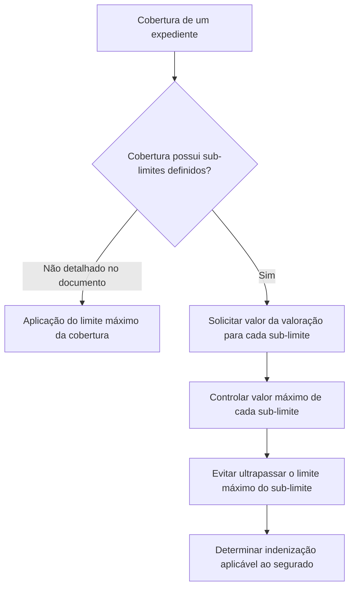

# Definição de Sub-limites para Valoração de Expedientes

## 1. Metadados do Documento
- **Arquivo de Origem:** Não identificado
- **Tipo de Documento:** Especificação Técnica
- **Domínio / Sistema:** Sub-limites de coberturas e valoração de expedientes
- **Público-Alvo:** Tramitadores, analistas funcionais e desenvolvedores
- **Data/Versão Identificada:** Não identificada

---

## 2. Resumo Executivo & Contexto de Negócio

O documento descreve como definir sub-limites associados a coberturas de uma apólice. Um sub-limite representa o valor máximo de indenização que será pago ao segurado quando ocorrer um sinistro que afete uma cobertura com sub-limites definidos.

Uma cobertura possui um limite máximo, mas o pagamento não necessariamente corresponde a 100% desse limite. Conforme as condições particulares da apólice, o valor aplicável pode ser inferior ao limite máximo da cobertura.

Quando uma cobertura de um expediente possui sub-limites definidos, o valor da valoração do expediente deve ser solicitado para cada sub-limite. Esse procedimento tem a finalidade de evitar que o limite máximo de cada sub-limite seja ultrapassado.

O cadastro de sub-limites contém código, nome, descrição, idioma e indicador de habilitação. O nome e a descrição devem estar registrados no idioma indicado, cujo código pertence a uma codificação de idiomas não detalhada no documento.

---

## 3. Arquitetura, Componentes & Tecnologias Envolvidas

O documento não descreve arquitetura de software, tecnologias, integrações, contratos HTTP, bancos de dados, ambientes ou componentes técnicos. O fluxo funcional identificado envolve uma cobertura, seus sub-limites, a valoração de um expediente e o controle do valor máximo indenizável.



**Nota de Análise:** O documento não detalha como o sistema calcula a indenização, como os sub-limites são persistidos, quais regras são aplicadas quando o valor solicitado excede o limite, nem quais interfaces, APIs ou telas realizam a valoração.

---

## 4. Regras de Negócio, Especificações Funcionais & Processos

1. Um sub-limite é o máximo de indenização que será pago ao segurado em caso de sinistro quando uma cobertura afetada possuir sub-limites definidos.
2. Uma cobertura possui um limite máximo definido.
3. O pagamento de uma cobertura não é necessariamente igual a 100% do limite máximo.
4. As condições particulares da apólice podem determinar que o limite aplicável seja inferior ao limite máximo da cobertura.
5. Quando uma cobertura de um expediente possuir sub-limites, o valor da valoração do expediente deve ser solicitado para cada sub-limite.
6. A solicitação de valores por sub-limite tem a finalidade de não ultrapassar o limite máximo de cada sub-limite.
7. O código do sub-limite contém a chave do sub-limite.
8. O nome do sub-limite deve ser registrado no idioma indicado.
9. A descrição do sub-limite deve ser mais ampla que o nome e auxiliar o tramitador a identificar o que o sub-limite contempla.
10. O idioma contém o código do idioma no qual os textos do sub-limite estão definidos; os idiomas são codificados.
11. O atributo **Inhabilitado** indica se o registro está habilitado ou não para uso na valoração de expedientes.

---

## 5. Tabelas de Parâmetros, Ambientes e Estruturas de Dados

| Item / Parâmetro | Descrição / Função | Tipo / Valores / Formato | Ambiente / Observações |
| :--- | :--- | :--- | :--- |
| Código do sub-limite | Contém a chave do sub-limite. | Não detalhado. | Identificador do sub-limite. |
| Nome do sub-limite | Contém o nome do sub-limite. | Texto; registrado no idioma indicado. | O documento não especifica tamanho, obrigatoriedade ou catálogo de idiomas. |
| Descrição do sub-limite | Contém uma descrição mais ampla que o nome para auxiliar o tramitador a entender o que o sub-limite contempla. | Texto; registrado no idioma indicado. | Destinada ao apoio da valoração de expedientes. |
| Idioma | Contém o código do idioma em que os textos estão definidos. | Código de idioma. | Os idiomas são codificados; a codificação não é apresentada. |
| Inhabilitado | Indica se o registro está ou não habilitado para utilização na valoração de expedientes. | Indicador de habilitação. | Valores concretos não detalhados. |
| Limite máximo da cobertura | Limite máximo definido para uma cobertura. | Valor monetário ou formato não detalhado. | O pagamento pode ser inferior conforme condições particulares da apólice. |
| Sub-limite | Máximo de indenização pagável ao segurado para uma cobertura com sub-limites definidos. | Valor monetário ou formato não detalhado. | Não deve ser ultrapassado durante a valoração. |
| Valoração do expediente | Valor solicitado para cada sub-limite quando a cobertura do expediente possuir sub-limites. | Valor não detalhado. | Usado para controlar o limite máximo de cada sub-limite. |

---

## 6. Bateria de Perguntas & Respostas para RAG (FAQ Sintético)

### P1: O que é um sub-limite no contexto de uma cobertura?
**R:** Um sub-limite é o máximo de indenização que será pago ao segurado em caso de sinistro quando a cobertura afetada possuir sub-limites definidos.

### P2: Uma cobertura sempre paga 100% do seu limite máximo?
**R:** Não. A cobertura possui um limite máximo definido, mas o documento informa que nem sempre será pago 100% desse limite. Conforme as condições particulares da apólice, o limite aplicável pode ser inferior.

### P3: O que deve ocorrer na valoração de um expediente com cobertura que possui sub-limites?
**R:** O valor da valoração do expediente deve ser solicitado para cada sub-limite definido na cobertura, para que os limites máximos dos sub-limites não sejam ultrapassados.

### P4: Qual é a finalidade de solicitar a valoração para cada sub-limite?
**R:** A finalidade é controlar os valores associados aos sub-limites e evitar que o limite máximo de cada sub-limite seja excedido.

### P5: Qual informação é armazenada no código do sub-limite?
**R:** O código do sub-limite contém a chave do sub-limite.

### P6: Como o nome de um sub-limite deve ser registrado?
**R:** O nome do sub-limite deve ser registrado no idioma indicado para o respectivo texto.

### P7: Para que serve a descrição do sub-limite?
**R:** A descrição do sub-limite é mais ampla que o nome e deve ajudar o tramitador a saber o que o sub-limite contempla.

### P8: O que representa o atributo de idioma do sub-limite?
**R:** O atributo de idioma contém o código do idioma no qual os textos do sub-limite estão definidos. O documento informa que esses idiomas são codificados, mas não apresenta a lista ou o padrão de códigos.

### P9: O que o campo Inhabilitado controla?
**R:** O campo **Inhabilitado** indica se o registro do sub-limite está ou não habilitado para ser utilizado na valoração de expedientes.

### P10: O documento especifica métodos de cálculo para a indenização ou para a valoração?
**R:** Não. O documento estabelece o objetivo de não ultrapassar os limites máximos dos sub-limites, mas não detalha fórmulas, métodos de cálculo, arredondamentos, moedas ou regras de rejeição.

---

## 7. Glossário de Termos, Siglas & Conceitos-Chave

- **Apólice:** Documento cujas condições particulares podem determinar um limite inferior ao limite máximo de uma cobertura.
- **Cobertura:** Elemento que possui um limite máximo definido e pode ter sub-limites associados.
- **Expediente:** Entidade cuja valoração deve considerar cada sub-limite quando a cobertura correspondente tiver sub-limites definidos.
- **Indenização:** Valor máximo que pode ser pago ao segurado em caso de sinistro, sujeito ao sub-limite aplicável.
- **Inhabilitado:** Indicador que informa se um registro pode ou não ser utilizado na valoração de expedientes.
- **Segurado:** Parte que pode receber indenização em caso de sinistro.
- **Sinistro:** Evento que pode afetar uma cobertura e resultar em indenização ao segurado.
- **Sub-limite:** Máximo de indenização aplicável a uma cobertura que tenha sub-limites definidos.
- **Tramitador:** Usuário que utiliza a descrição do sub-limite para saber o que o sub-limite contempla.
- **Valoração:** Processo para o qual o valor deve ser solicitado por sub-limite quando aplicável.

---

## 8. Notas Críticas, Riscos & Limitações

- O documento não apresenta exemplos completos de sub-limites, valores monetários, moedas, fórmulas ou critérios de cálculo.
- O documento não informa o comportamento do processo quando a valoração solicitada é superior ao limite máximo de um sub-limite.
- Não há definição do modelo de dados, obrigatoriedade dos campos, tipos técnicos, tamanho dos textos ou valores possíveis para o indicador **Inhabilitado**.
- A codificação de idiomas é mencionada, mas não é detalhada.
- Não são apresentados sistemas, APIs, URLs, ambientes, logs, perfis de acesso ou responsabilidades operacionais.
- **Nota de Análise:** O conteúdo lista propriedades funcionais do sub-limite, porém não detalha métodos HTTP, contratos JSON, integrações ou interfaces de usuário.

---

## 9. Conteúdo Bruto Estruturado (Referência Fiel)

```text
--- [PÁGINA 1 DE 2] ---

DEFINICIÓN de Sub-límites
Objetivo
Este documento tiene como objetivo explicar como definir sub-límites
Propiedades
Código del sub-límite
Esta propiedadcontendrá la clave del sub-límite.
Un sub-límite es el máximo de indemnización que en caso de siniestro se va a pagar al asegurado,
cuando se afecte a una cobertura que los tenga definidos. La cobertura tendrá un límite máximo
definido, pero no siempre se pagará el 100%, dependiendo de condiciones, conforme se detalla en
las condiciones particulares de la póliza, este límite puede ser inferior.
Cuando una cobertura de un expediente, tenga definido sub-límites el importe de la valoración del
expediente, se pedirá para cada uno de sub-límites para no sobrepasar el límite máximo de los
mismos.
Nombre del sub-límite
Ejemplo:
Info
 /
 CF
Home Solutions APIs Documentation Zeus
EN


--- [PÁGINA 2 DE 2] ---

Esta propiedadcontiene el nombre sub-límite, que tendrá que registrarse en el idioma que se indique
Descripción del sub-límite
Esta propiedadcontendrá la descripción del sub-límite. Esto será una descripción más amplia que el
nombre, que ayude al tramitador a saber que contempla el sub-límite.
Idioma
Esta propiedadcontiene el código del idioma en el que están definido los textos. Estos idiomas están
codificados.
Inhabilitado
Esta propiedadindica si el registro está o no habilitado para ser utilizado en la valoración de
expedientes.
```
