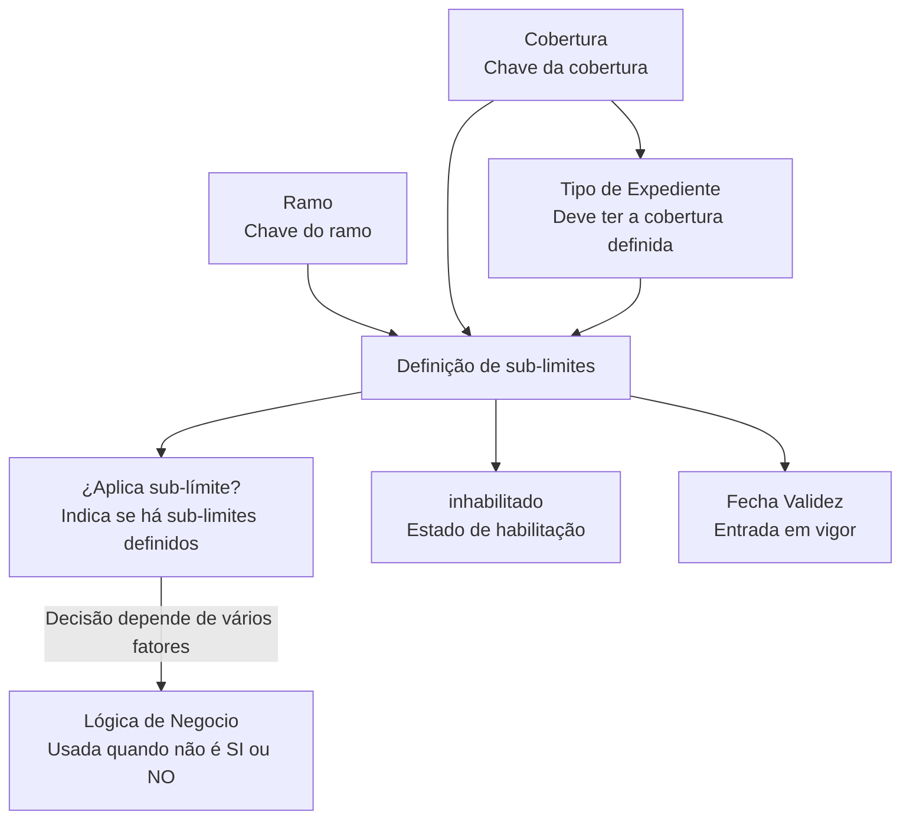

# Definição de Tipos de Expedientes e Aplicação de Sub-limites de Coberturas

## 1. Metadados do Documento
- **Arquivo de Origem:** Não identificado — conteúdo bruto fornecido na solicitação
- **Tipo de Documento:** Especificação Técnica
- **Domínio / Sistema:** Home Solutions APIs Documentation Zeus
- **Público-Alvo:** Desenvolvedores, Analistas Funcionais, Arquitetos e Operação
- **Data/Versão Identificada:** Não identificada

---

## 2. Resumo Executivo & Contexto de Negócio

O documento descreve a definição de **Tipos de Expedientes** associados a coberturas que possuem ou podem possuir **sub-limites**. O objetivo declarado é explicar como definir os Tipos de Expedientes que têm, ou podem ter, sub-limites configurados.

A configuração é composta pelas propriedades **Ramo**, **Cobertura**, **Tipo de Expediente**, **¿Aplica sub-límite?**, **Lógica de Negocio**, **inhabilitado** e **Fecha Validez**. Essas propriedades relacionam a cobertura e o tipo de expediente com a decisão sobre a existência ou aplicação de sub-limites.

A propriedade **¿Aplica sub-límite?** informa se determinado tipo de expediente que afeta uma cobertura possui ou não sub-limites definidos. Quando a decisão não puder ser representada diretamente como `SI` ou `NO`, o documento prevê a propriedade **Lógica de Negocio** para registrar a lógica que resolve a aplicação do sub-límite conforme diversos fatores.

A definição também possui controles de vigência e habilitação. A propriedade **inhabilitado** informa se o registro está habilitado, enquanto **Fecha Validez** indica a data em que a definição entra em vigor.

> **Nota de Análise:** O conteúdo não detalha valores permitidos, estruturas de persistência, interfaces, métodos HTTP, contratos JSON, algoritmos de decisão, nem os fatores considerados pela lógica de negócio.

---

## 3. Arquitetura, Componentes & Tecnologias Envolvidas

Os elementos identificados no documento são:

- **Home Solutions APIs Documentation Zeus:** contexto/sistema citado no conteúdo bruto.
- **Ramo:** chave do ramo dos Tipos de Expedientes para os quais são definidos sub-limites.
- **Cobertura:** cobertura à qual será definido se existem ou não sub-limites.
- **Tipo de Expediente:** tipo de expediente associado à definição; deve possuir a cobertura definida.
- **¿Aplica sub-límite?:** propriedade que determina se o Tipo de Expediente que afeta a Cobertura possui sub-limites.
- **Lógica de Negocio:** regra aplicável quando a decisão não é diretamente `SI` ou `NO`.
- **inhabilitado:** indicador do estado de habilitação da definição.
- **Fecha Validez:** data de entrada em vigor da definição.



---

## 4. Regras de Negócio, Especificações Funcionais & Processos

1. A definição trata Tipos de Expedientes que têm ou podem ter sub-limites.
2. O **Ramo** deve representar a chave do ramo dos Tipos de Expedientes para os quais serão definidos sub-limites.
3. A **Cobertura** deve conter a chave da cobertura para a qual será definido se existem ou não sub-limites.
4. O **Tipo de Expediente** deve conter o tipo de expediente para o qual serão definidos sub-limites.
5. O Tipo de Expediente definido deve possuir a Cobertura definida.
6. A propriedade **¿Aplica sub-límite?** deve indicar se o Tipo de Expediente que afeta a Cobertura possui ou não sub-limites definidos.
7. Quando a aplicação do sub-limite para a combinação de Cobertura e Tipo de Expediente não for simplesmente `SI` ou `NO`, a decisão deve ser resolvida por uma **Lógica de Negocio**.
8. A propriedade **inhabilitado** deve indicar se o registro da definição está ou não habilitado.
9. A **Fecha Validez** deve indicar a data em que a definição entra em vigor.

> **Nota de Análise:** O documento afirma que a Lógica de Negocio pode depender de vários fatores, mas não identifica esses fatores, nem apresenta regras condicionais, fórmulas ou prioridades de avaliação.

---

## 5. Tabelas de Parâmetros, Ambientes e Estruturas de Dados

| Item / Parâmetro | Descrição / Função | Tipo / Valores / Formato | Ambiente / Observações |
| :--- | :--- | :--- | :--- |
| Ramo | Chave do ramo dos Tipos de Expedientes para os quais são definidos sub-limites. | Chave; formato não detalhado. | Associado à definição de sub-limites. |
| Cobertura | Chave da cobertura para a qual será definido se possui ou não sub-limites. | Chave; formato não detalhado. | O Tipo de Expediente deve ter a Cobertura definida. |
| Tipo de Expediente | Tipo de expediente para o qual serão definidos sub-limites. | Tipo de expediente; valores não detalhados. | Deve possuir a Cobertura definida. |
| ¿Aplica sub-límite? | Indica se o Tipo de Expediente que afeta a Cobertura possui ou não sub-limites definidos. | `SI`, `NO` ou decisão dependente de lógica de negócio. | A lógica adicional aplica-se quando a decisão não for diretamente `SI` ou `NO`. |
| Lógica de Negocio | Define a resolução da aplicação de sub-limite quando a decisão depende de vários fatores. | Lógica de negócio; estrutura não detalhada. | Fatores e critérios não especificados. |
| inhabilitado | Indica se o registro da definição está ou não habilitado. | Indicador; valores/formato não detalhados. | Controle de estado da definição. |
| Fecha Validez | Data em que a definição entra em vigor. | Data; formato não detalhado. | Controle de vigência. |
| Home Solutions APIs Documentation Zeus | Referência de sistema/documentação exibida no conteúdo. | Texto identificador. | Não há detalhamento adicional. |
| CF | Texto exibido no conteúdo bruto. | Não detalhado. | Significado não identificado. |

---

## 6. Bateria de Perguntas & Respostas para RAG (FAQ Sintético)

### P1: Qual é o objetivo do documento sobre Tipos de Expedientes?
**R:** O objetivo é explicar como definir os Tipos de Expedientes que possuem ou podem possuir sub-limites.

### P2: Qual propriedade identifica o ramo relacionado à definição de sub-limites?
**R:** A propriedade **Ramo** contém a chave do ramo dos Tipos de Expedientes para os quais estão sendo definidos sub-limites.

### P3: Como a Cobertura é usada na definição de sub-limites?
**R:** A propriedade **Cobertura** contém a chave da cobertura para a qual será definido se existem ou não sub-limites.

### P4: Qual é a restrição entre Tipo de Expediente e Cobertura?
**R:** O Tipo de Expediente incluído na definição deve ter a Cobertura definida.

### P5: O que informa a propriedade “¿Aplica sub-límite?”?
**R:** A propriedade **¿Aplica sub-límite?** indica se o Tipo de Expediente que afeta determinada Cobertura possui ou não sub-limites definidos.

### P6: Quando a Lógica de Negocio deve ser utilizada?
**R:** A **Lógica de Negocio** deve ser utilizada quando a aplicação do sub-limite para uma Cobertura e um Tipo de Expediente não puder ser determinada diretamente como `SI` ou `NO` e depender de vários fatores.

### P7: O documento detalha quais fatores compõem a Lógica de Negocio?
**R:** Não. O documento apenas informa que a aplicação pode depender de vários fatores e que a lógica de negócio correspondente deve ser definida nessa propriedade.

### P8: Qual é a finalidade da propriedade “inhabilitado”?
**R:** A propriedade **inhabilitado** indica se o registro da definição está ou não habilitado.

### P9: O que representa a propriedade “Fecha Validez”?
**R:** A propriedade **Fecha Validez** representa a data em que a definição entra em vigor.

### P10: O documento informa o formato da chave de Ramo ou da chave de Cobertura?
**R:** Não. O documento descreve Ramo e Cobertura como chaves, mas não informa formato, tamanho, domínio de valores ou mecanismo de validação.

### P11: O documento especifica APIs, métodos HTTP ou contratos JSON para a configuração de sub-limites?
**R:** Não. Embora o conteúdo mencione “Home Solutions APIs Documentation Zeus”, não há métodos HTTP, endpoints, contratos JSON ou detalhes de integração no trecho fornecido.

### P12: O documento define valores possíveis para o campo “inhabilitado”?
**R:** Não. O documento apenas informa que a propriedade indica se o registro está ou não habilitado, sem definir formato ou valores permitidos.

---

## 7. Glossário de Termos, Siglas & Conceitos-Chave

- **Ramo:** Chave do ramo dos Tipos de Expedientes para os quais são definidos sub-limites.
- **Cobertura:** Chave da cobertura à qual se associa a definição de existência ou não de sub-limites.
- **Tipo de Expediente:** Tipo de expediente associado à definição de sub-limites; deve ter a cobertura definida.
- **Sub-límite:** Elemento cuja aplicação ou existência é definida para uma combinação de Cobertura e Tipo de Expediente.
- **¿Aplica sub-límite?:** Propriedade que informa se existem ou não sub-limites definidos para o Tipo de Expediente que afeta a Cobertura.
- **Lógica de Negocio:** Lógica utilizada quando a aplicação do sub-limite não é uma decisão direta entre `SI` e `NO`.
- **inhabilitado:** Propriedade que indica se o registro da definição está habilitado.
- **Fecha Validez:** Data em que uma definição passa a vigorar.
- **CF:** Sigla exibida no conteúdo bruto, sem significado definido.
- **Home Solutions APIs Documentation Zeus:** Identificação textual exibida no documento, sem detalhamento adicional.

---

## 8. Notas Críticas, Riscos & Limitações

- O conteúdo não apresenta critérios, fatores, precedências ou algoritmo para a **Lógica de Negocio**.
- Não são especificados os formatos, domínios de valores ou regras de validação de **Ramo**, **Cobertura**, **Tipo de Expediente**, **inhabilitado** e **Fecha Validez**.
- Não há definição de persistência, modelo de dados, tela, endpoint, contrato de API ou mecanismo de integração.
- Não há detalhamento sobre o comportamento de registros inabilitados nem sobre o tratamento de definições fora da data de validade.
- O texto menciona **Home Solutions APIs Documentation Zeus** e **CF**, porém não fornece contexto técnico ou funcional adicional para esses termos.

---

## 9. Conteúdo Bruto Estruturado (Referência Fiel)

```text
--- [PÁGINA 1 DE 2] ---

DEFINICIÓN de Tipos de Expedientes
Coberturas que pueden tener Sub-límites
Objetivo
Este documento tiene como objetivo explicar como definir los Tipos de Expedientes que tienen o
pueden tener definido sub-límites
Propiedades
Ramo
Clave del Ramo de los tipos de expedientes a el que estamos definiendo sub-límites.
Cobertura
Tendrá la clave de la cobertura a la que se le van a definir si tiene o no sub-límites.
Tipo de Expediente
Esta propiedadcontiene el tipo de expediente al que se le va a definir sub-límites. Este tipo de
expediente tiene que tener la cobertura definida
¿Aplica sub-límite?
Esta propiedadindica si este tipo de expediente que afecta a la cobertura, tiene o no sub-límites
definidos
 / 
 CF
Home Solutions APIs Documentation Zeus
EN


--- [PÁGINA 2 DE 2] ---

Lógica de Negocio que determina si se aplica o no el sub-límite
Si la aplicación del sub-límite para la cobertura y tipo de expediente no es SI o NO, si no que
depende da varios factores aquí estará definida la lógica de negocio que lo resuelve
inhabilitado
Esta propiedadindica si el registro está o no habilitada esta definición.
Fecha Validez
Fecha en la que entra en vigor la definición
```
