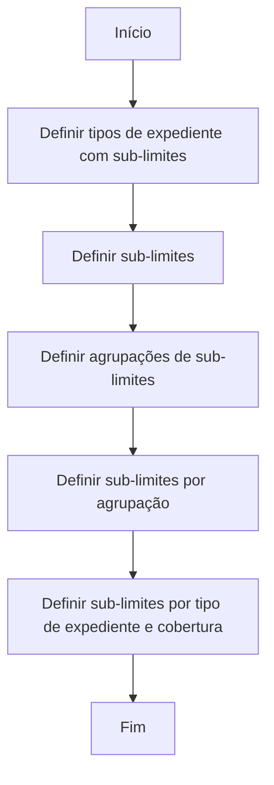

# Definição de Sub-limites para Tipos de Expediente e Coberturas

## 1. Metadados do Documento
- **Arquivo de Origem:** Não identificado
- **Tipo de Documento:** Procedimento
- **Domínio / Sistema:** Definição de sub-limites para expedientes e coberturas
- **Público-Alvo:** Negócio, analistas funcionais e operação
- **Data/Versão Identificada:** Não identificada

---

## 2. Resumo Executivo & Contexto de Negócio

O documento descreve o processo para definir expedientes cujas coberturas possuem um detalhamento dos conceitos que podem ser indenizados e dos limites aplicáveis a cada conceito. Esses limites detalhados são denominados **sub-limites**.

O processo estabelece uma sequência de cinco definições: tipos de expediente com sub-limites, sub-limites, agrupações de sub-limites, sub-limites por agrupação e sub-limites por combinação de tipo de expediente e cobertura.

A finalidade declarada é permitir que cada cobertura de um expediente tenha conceitos indenizáveis identificados e limites específicos associados. O documento apresenta o fluxo de alto nível, mas não fornece critérios de cálculo, campos de cadastro, responsabilidades, regras de validação, telas ou contratos técnicos.

> **Nota de Análise:** O conteúdo descreve as etapas de configuração de sub-limites, porém não detalha como os limites são calculados, aplicados ou validados durante uma indenização.

---

## 3. Arquitetura, Componentes & Tecnologias Envolvidas

O documento não identifica tecnologias, aplicações, microsserviços, bancos de dados, APIs, URLs, ambientes ou ferramentas. Os componentes funcionais explicitamente citados são:

- Tipos de expediente com sub-limites.
- Sub-limites.
- Agrupações de sub-limites.
- Sub-limites por agrupação.
- Sub-limites por tipo de expediente e cobertura.
- Coberturas.
- Conceitos indenizáveis.



---

## 4. Regras de Negócio, Especificações Funcionais & Processos

### Objetivo funcional

O processo existe para definir expedientes cujas coberturas terão:

1. Um detalhe dos conceitos que podem ser indenizados.
2. Limites associados a cada conceito indenizável.
3. Esses limites denominados **sub-limites**.

### Processo de definição de sub-limites

1. **Definir tipos de expediente com sub-limite**  
   Identificar os tipos de expediente que utilizarão sub-limites.

2. **Definir sub-limites**  
   Definir os sub-limites que representarão os limites dos conceitos indenizáveis.

3. **Definir agrupações de sub-limites**  
   Definir agrupações para os sub-limites.

4. **Definir sub-limites por agrupação**  
   Associar ou definir sub-limites no contexto de uma agrupação.

5. **Definir sub-limites por tipo de expediente e cobertura**  
   Definir os sub-limites aplicáveis à combinação de tipo de expediente e cobertura.

### Restrições documentais

O documento não especifica:

- Métodos de criação, alteração ou exclusão dos registros.
- Regras de elegibilidade de conceitos indenizáveis.
- Fórmulas monetárias, percentuais ou valores máximos.
- Prioridades entre sub-limites, agrupações e coberturas.
- Comportamento em caso de limite excedido.
- Fluxo de aprovação.
- Integrações técnicas ou persistência de dados.

---

## 5. Tabelas de Parâmetros, Ambientes e Estruturas de Dados

| Item / Parâmetro | Descrição / Função | Tipo / Valores / Formato | Ambiente / Observações |
| :--- | :--- | :--- | :--- |
| Tipo de expediente | Entidade para a qual podem ser definidos sub-limites. | Não detalhado | Deve ser definido como tipo de expediente com sub-limite. |
| Cobertura | Contexto associado à definição de sub-limites por tipo de expediente. | Não detalhado | O documento não lista coberturas específicas. |
| Conceito indenizável | Conceito que pode ser objeto de indenização dentro de uma cobertura. | Não detalhado | Cada conceito possui um limite associado. |
| Sub-limite | Limite definido para um conceito indenizável. | Não detalhado | Não há valores, moedas, fórmulas ou critérios de cálculo. |
| Agrupação de sub-limites | Agrupação definida para organizar sub-limites. | Não detalhado | O documento não informa regras de associação ou cardinalidade. |
| Sub-limite por agrupação | Definição de sub-limites no contexto de uma agrupação. | Não detalhado | Etapa 4 do processo. |
| Sub-limite por tipo de expediente e cobertura | Definição aplicável à combinação entre tipo de expediente e cobertura. | Não detalhado | Etapa final antes do encerramento do processo. |

---

## 6. Bateria de Perguntas & Respostas para RAG (FAQ Sintético)

### P1: Qual é o objetivo do processo de definição de sub-limites?
**R:** O objetivo é definir expedientes cujas coberturas terão detalhados os conceitos que podem ser indenizados e os limites correspondentes a cada conceito. Esses limites são chamados de sub-limites.

### P2: O que são sub-limites no contexto do documento?
**R:** Sub-limites são os limites definidos para os conceitos que podem ser indenizados dentro das coberturas de um expediente.

### P3: Quantas etapas compõem o processo de definição de sub-limites?
**R:** O processo contém cinco etapas: definir tipos de expediente com sub-limites, definir sub-limites, definir agrupações de sub-limites, definir sub-limites por agrupação e definir sub-limites por tipo de expediente e cobertura.

### P4: Qual é a primeira etapa do processo?
**R:** A primeira etapa é definir os tipos de expediente que terão sub-limites.

### P5: Em qual etapa são definidas as agrupações de sub-limites?
**R:** As agrupações de sub-limites são definidas na terceira etapa do processo.

### P6: O que acontece após a definição das agrupações de sub-limites?
**R:** Após definir as agrupações, o processo segue para a definição de sub-limites por agrupação.

### P7: Qual é a última definição funcional antes do fim do processo?
**R:** A última definição é a de sub-limites por tipo de expediente e cobertura.

### P8: O documento informa valores ou fórmulas para os sub-limites?
**R:** Não. O documento apenas informa que existem limites para os conceitos indenizáveis; não apresenta valores, fórmulas, moedas ou critérios de cálculo.

### P9: O documento especifica quais conceitos podem ser indenizados?
**R:** Não. O documento afirma que os conceitos indenizáveis devem ser detalhados nas coberturas, mas não fornece uma lista de conceitos.

### P10: O documento descreve APIs, telas ou integrações técnicas para configurar sub-limites?
**R:** Não. Não há descrição de APIs, interfaces, tecnologias, ambientes, integrações ou estruturas de dados técnicas.

---

## 7. Glossário de Termos, Siglas & Conceitos-Chave

- **Cobertura:** Contexto no qual são detalhados conceitos que podem ser indenizados e seus respectivos sub-limites.
- **Conceito indenizável:** Conceito que pode ser objeto de indenização segundo a cobertura.
- **Expediente:** Entidade mencionada pelo documento para a qual podem ser definidos sub-limites.
- **Sub-limite:** Limite aplicável a um conceito que pode ser indenizado.
- **Agrupação de sub-limites:** Agrupação definida para os sub-limites; o documento não detalha sua estrutura ou finalidade adicional.
- **Tipo de expediente:** Classificação de expediente que pode ser configurada para utilizar sub-limites.

---

## 8. Notas Críticas, Riscos & Limitações

- O documento apresenta apenas um fluxo funcional de alto nível.
- Não há valores, formatos, moedas, percentuais, limites máximos ou fórmulas para os sub-limites.
- Não são apresentados critérios de validação, precedência entre regras, tratamento de exceções ou comportamento diante de excedimento de limites.
- Não há identificação de sistema, ambiente, proprietário do processo, papéis de acesso ou responsáveis pelas definições.
- Não há detalhamento de APIs, interfaces de usuário, modelos de dados ou integrações.
- Não há exemplo preenchido após o marcador `Ejemplo:`.

---

## 9. Conteúdo Bruto Estruturado (Referência Fiel)

```text
--- [PÁGINA 1 DE 2] ---

/
CF
Home Solutions APIs Documentation Zeus
EN

--- [PÁGINA 2 DE 2] ---

DEFINICIÓN Sub-límites

Objetivo
Explicar los pasos a seguir para definir los expedientes cuyas coberturas van a tener definidos un
detalle de los conceptos que se pueden indemnizar y los límites de cada uno de ellos, llamados sub-
límites.

Proceso para la definición de Sub-límites de los Tipos de
Expediente

DEFINIR
Tipos expediente
con Sub-límites

DEFINIR
Sub-límites

DEFINIR
Agrupación
de Sub-límites

DEFINIR
Sub-límites
por Agrupación

DEFINIR
Sub-límites
Tipo de Expediente
Cobertura

FIN

1. DEFINIR Tipos expediente con Sub-límite
2. DEFINIR Sub-límites
3. DEFINIR Agrupaciones de Sub-límites
4. DEFINIR Sub-límites por agrupación
5. DEFINIR Sub-límites Tipo de Expediente Cobertura

Ejemplo:
```
