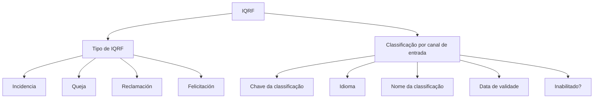

# Definição de Classificação de IQRF por Canal de Entrada

## 1. Metadados do Documento
- **Arquivo de Origem:** Não identificado no conteúdo fornecido
- **Tipo de Documento:** Especificação Técnica / Funcional
- **Domínio / Sistema:** Classificação de IQRF
- **Público-Alvo:** Negócio, analistas funcionais e operação
- **Data/Versão Identificada:** Não identificada

---

## 2. Resumo Executivo & Contexto de Negócio

O documento define a classificação de IQRF segundo o canal pelo qual a IQRF foi comunicada. A finalidade declarada é permitir a categorização das IQRF com base no canal de entrada.

A definição de classificação é aplicável a quatro tipos de IQRF: **Incidencia**, **Queja**, **Reclamación** e **Felicitación**. Para cada registro de classificação, o documento estabelece propriedades de identificação, descrição, idioma, vigência e habilitação.

A configuração exige uma chave de classificação, um idioma para o registro da descrição, um nome de classificação, uma data de validade e a indicação de inabilitação do registro. O conteúdo fornecido não descreve canais específicos, interfaces, contratos de integração, métodos HTTP, persistência de dados ou regras de validação adicionais.

---

## 3. Arquitetura, Componentes & Tecnologias Envolvidas

O conteúdo não apresenta arquitetura de software, tecnologias, ambientes, microsserviços, APIs ou integrações. A estrutura funcional identificada consiste no cadastro de uma classificação de IQRF vinculada a um tipo de IQRF e composta por propriedades de identificação, localização linguística, vigência e disponibilidade.



> **Nota de Análise:** O documento declara que a classificação é realizada pelo canal de comunicação da IQRF, mas não enumera os canais disponíveis nem detalha o mecanismo técnico de classificação.

---

## 4. Regras de Negócio, Especificações Funcionais & Processos

1. A finalidade da definição é classificar IQRF de acordo com o canal pelo qual a IQRF foi comunicada.
2. A propriedade **Tipo de IQRF** identifica para qual tipo de IQRF será definida a classificação de canais de entrada.
3. Os tipos de IQRF apresentados são:
   - Incidencia;
   - Queja;
   - Reclamación;
   - Felicitación.
4. A propriedade **Clave de la clasificación** deve registrar a chave atribuída à classificação que está sendo cadastrada.
5. A propriedade **Idioma** contém o idioma no qual será registrada a descrição da classificação.
6. A propriedade **Nombre de la clasificación** corresponde à descrição da classificação da IQRF segundo o canal pelo qual foi recebida.
7. A propriedade **Fecha de validez** indica a data a partir da qual entra em vigor a definição do código de classificação cadastrado.
8. A propriedade **Inhabilitado?** indica se o registro está inabilitado para uso.

> **Nota de Análise:** O conteúdo não define formatos para chave, data ou idioma. Também não especifica valores permitidos para o indicador de inabilitação, regras de unicidade, obrigatoriedade dos campos ou tratamento de registros expirados.

---

## 5. Tabelas de Parâmetros, Ambientes e Estruturas de Dados

| Item / Parâmetro | Descrição / Função | Tipo / Valores / Formato | Ambiente / Observações |
| :--- | :--- | :--- | :--- |
| Tipo de IQRF | Identifica o tipo de IQRF para o qual será definida a classificação de canais de entrada. | Incidencia; Queja; Reclamación; Felicitación. | Não são apresentados critérios adicionais de seleção. |
| Chave da classificação | Registra a chave atribuída à classificação em cadastro. | Formato não especificado. | A chave está associada à classificação registrada. |
| Idioma | Define o idioma utilizado para registrar a descrição da classificação. | Valores e formato não especificados. | Aplicável à descrição da classificação. |
| Nome da classificação | Contém a descrição da classificação da IQRF pelo canal de recebimento. | Texto; formato não especificado. | O documento não lista nomes ou canais concretos. |
| Data de validade | Indica a data a partir da qual a definição do código de classificação passa a vigorar. | Data; formato não especificado. | O documento não define data final de vigência. |
| Inabilitado? | Indica se o registro está inabilitado para utilização. | Valores não especificados. | Não há detalhamento sobre o comportamento de registros inabilitados. |

---

## 6. Bateria de Perguntas & Respostas para RAG (FAQ Sintético)

### P1: Qual é a finalidade da definição de classificação de IQRF?
**R:** A finalidade é classificar as IQRF pelo canal a partir do qual a IQRF foi comunicada.

### P2: Quais tipos de IQRF podem receber uma classificação de canal de entrada?
**R:** O documento lista quatro tipos de IQRF: Incidencia, Queja, Reclamación e Felicitación.

### P3: O que a propriedade “Tipo de IQRF” identifica?
**R:** A propriedade “Tipo de IQRF” identifica o tipo de IQRF para o qual será definida a classificação, especificamente os canais de entrada aplicáveis àquele tipo.

### P4: Para que serve a chave da classificação?
**R:** A chave da classificação deve registrar a chave que será atribuída à classificação que está sendo cadastrada.

### P5: Qual é a função do campo “Idioma” na classificação de IQRF?
**R:** O campo “Idioma” contém o idioma no qual será registrada a descrição da classificação.

### P6: O que deve ser informado no nome da classificação?
**R:** O nome da classificação deve conter a descrição da classificação da IQRF de acordo com o canal pelo qual a IQRF foi recebida.

### P7: Quando uma definição de código de classificação entra em vigor?
**R:** A definição do código de classificação entra em vigor a partir da data informada na propriedade “Fecha de validez”.

### P8: O que indica o campo “Inhabilitado?”?
**R:** O campo indica se o registro de classificação está inabilitado para ser utilizado ou não.

### P9: O documento define quais são os canais de entrada disponíveis para IQRF?
**R:** Não. O documento informa que a classificação é realizada pelo canal de comunicação, mas não apresenta uma lista de canais de entrada.

### P10: O documento especifica métodos HTTP, contratos JSON ou APIs para a classificação de IQRF?
**R:** Não. O conteúdo fornecido não detalha métodos HTTP, contratos JSON, APIs, persistência, integrações ou tecnologias associadas à classificação de IQRF.

---

## 7. Glossário de Termos, Siglas & Conceitos-Chave

- **IQRF:** Sigla utilizada no documento para os registros classificados pelo canal de comunicação. O significado expandido da sigla não é informado.
- **Incidencia:** Tipo de IQRF listado no documento.
- **Queja:** Tipo de IQRF listado no documento.
- **Reclamación:** Tipo de IQRF listado no documento.
- **Felicitación:** Tipo de IQRF listado no documento.
- **Canal de entrada:** Canal pelo qual uma IQRF foi comunicada ou recebida, utilizado como base para a classificação.
- **Chave da classificação:** Identificador atribuído à classificação em cadastro.
- **Data de validade:** Data a partir da qual a definição do código de classificação entra em vigor.
- **Registro inabilitado:** Registro marcado como não utilizável.

---

## 8. Notas Críticas, Riscos & Limitações

- O significado por extenso da sigla **IQRF** não é informado.
- Não há enumeração dos canais de entrada que podem originar uma classificação.
- O documento não apresenta exemplo preenchido, embora possua a indicação “Ejemplo:”.
- Não são especificados formatos, obrigatoriedade, validações ou unicidade para chave, idioma, nome e data de validade.
- Não há definição sobre a vigência após a data de validade, data final de vigência ou comportamento de classificações inabilitadas.
- Não são apresentados detalhes de arquitetura, ambientes, tecnologias, APIs, integrações, autenticação, auditoria ou tratamento de erros.

---

## 9. Conteúdo Bruto Estruturado (Referência Fiel)

```text
--- [PÁGINA 1 DE 2] ---

DEFINICIÓN de clasificación de IQRF
Objetivo
La finalidad es poder clasificar las IQRF por el canal desde el que se ha comunicado la misma.
Propiedades generales
Propiedades generales
Tipo de IQRF
Esta propiedad identifica a que tipo de IQRF se le van a definir la clasificación (canales de entrada):
Incidencia
Queja
Reclamación
Felicitación
Clave de la clasificación
En esta propiedad se deberá registrar la clave que se le va a dar a la clasificación que se está
registrando
Idioma
Contiene el idioma en el que se va a registrar la descripción de la clasificación
 /
 CF
Home Solutions APIs Documentation Zeus
EN


--- [PÁGINA 2 DE 2] ---

Nombre de la clasificación
En esta propiedad la descripción de la clasificación de la IQRF por el canal que se recibió.
Fecha de validez
Esta propiedad indica desde que fecha entra en vigor la definición del código de clasificación
registrado.
Inhabilitado?
Indica si el registro está inhabilitado para ser usado, o no
Ejemplo:
```
