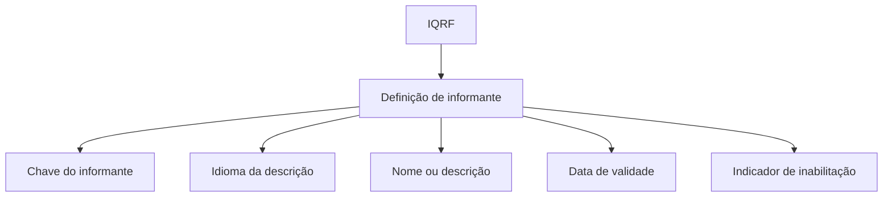

# Definição de Informantes de IQRF

## 1. Metadados do Documento
- **Arquivo de Origem:** Não identificado
- **Tipo de Documento:** Especificação Técnica
- **Domínio / Sistema:** IQRF
- **Público-Alvo:** Desenvolvedores, Analistas Funcionais e Operação
- **Data/Versão Identificada:** Não identificada

---

## 2. Resumo Executivo & Contexto de Negócio

O documento define os possíveis informantes de IQRF. O objetivo explicitamente apresentado é estabelecer a definição de todos os informantes que podem ser registrados no contexto de IQRF.

A especificação descreve propriedades gerais de uma definição de informante: chave, idioma, nome, data de validade e indicador de inabilitação. Essas propriedades suportam a identificação, descrição multilíngue, vigência e disponibilidade de uso do registro.

O conteúdo extraído não detalha processos de criação, alteração, consulta ou exclusão de informantes. Também não especifica contratos técnicos, integrações, persistência, APIs ou regras de validação adicionais.

---

## 3. Arquitetura, Componentes & Tecnologias Envolvidas

O conteúdo menciona exclusivamente o domínio **IQRF** e a entidade conceitual **informante**. Há referências textuais a “Home Solutions APIs Documentation Zeus”, mas o extrato não esclarece se essa expressão identifica uma aplicação, documentação, ambiente ou fonte de referência.



> **Nota de Análise:** O documento não detalha componentes de software, microsserviços, tecnologias, bancos de dados, endpoints, métodos HTTP ou fluxos de integração.

---

## 4. Regras de Negócio, Especificações Funcionais & Processos

1. A finalidade da definição é contemplar todos os informantes de IQRF possíveis.
2. Cada definição de informante deve possuir uma **chave do informante**.
3. A propriedade **idioma** determina o idioma no qual a descrição do informante será registrada.
4. A propriedade **nome do informante** armazena a descrição do informante.
5. A propriedade **data de validade** indica a data em que a definição registrada passa a vigorar.
6. A propriedade **inabilitado** indica se o registro está indisponível para uso.
7. O documento não define os valores permitidos para idioma, o formato da chave, o formato da data de validade nem as condições para inabilitar ou reabilitar um registro.

---

## 5. Tabelas de Parâmetros, Ambientes e Estruturas de Dados

| Item / Parâmetro | Descrição / Função | Tipo / Valores / Formato | Ambiente / Observações |
| :--- | :--- | :--- | :--- |
| Informante de IQRF | Entidade cuja definição contempla os informantes possíveis de IQRF. | Não especificado | Entidade central do documento. |
| Chave do informante | Contém a chave do informante da IQRF. | Não especificado | O formato e a obrigatoriedade não são detalhados. |
| Idioma | Contém o idioma em que será registrada a descrição do informante. | Não especificado | O documento apresenta `EN` como exemplo textual. |
| Nome do informante | Armazena a descrição do informante. | Não especificado | Não são definidos tamanho, idioma obrigatório ou unicidade. |
| Data de validade | Indica a data de entrada em vigor da definição registrada. | Data; formato não especificado | Não há regra sobre término de vigência. |
| Inabilitado | Indica se o registro está inabilitado para uso. | Indicador lógico; valores não especificados | Não são definidos critérios de inabilitação. |
| `CF` | Valor apresentado na seção de exemplo. | Não especificado | O significado não é definido no conteúdo. |
| `EN` | Valor apresentado na seção de exemplo. | Não especificado | Provavelmente relacionado a idioma, mas o documento não afirma isso explicitamente. |
| Home Solutions APIs Documentation Zeus | Texto apresentado na seção de exemplo. | Não especificado | Sem detalhamento de finalidade ou relação com IQRF. |

---

## 6. Bateria de Perguntas & Respostas para RAG (FAQ Sintético)

### P1: Qual é o objetivo da definição de informantes de IQRF?
**R:** O objetivo é definir todos os informantes de IQRF possíveis.

### P2: Qual propriedade identifica um informante de IQRF?
**R:** A propriedade **chave do informante** contém a chave do informante da IQRF. O documento não informa o formato, tamanho ou regra de unicidade dessa chave.

### P3: Como é definido o idioma da descrição de um informante?
**R:** A propriedade **idioma** contém o idioma no qual a descrição do informante será registrada. O extrato apresenta `EN` em um exemplo, mas não define a lista de idiomas aceitos.

### P4: Onde é armazenada a descrição de um informante?
**R:** A descrição do informante é armazenada na propriedade **nome do informante**.

### P5: Qual campo controla o início de vigência de uma definição de informante?
**R:** A propriedade **data de validade** indica a data em que a definição registrada do informante entra em vigor.

### P6: O documento define uma data de fim de validade para o informante?
**R:** Não. O conteúdo menciona somente a data em que a definição entra em vigor; não há referência a uma data de fim de vigência.

### P7: Como saber se um informante não pode ser utilizado?
**R:** A propriedade **inabilitado** indica se o registro está inabilitado para ser usado ou não.

### P8: Quais são os critérios para inabilitar um informante de IQRF?
**R:** O documento não especifica critérios, responsáveis, fluxo operacional ou condições de negócio para inabilitar um informante.

### P9: O documento especifica APIs ou métodos HTTP para consultar informantes de IQRF?
**R:** Não. O documento não detalha APIs, endpoints, métodos HTTP, contratos JSON ou integrações técnicas.

### P10: O que significa o valor `CF` apresentado no exemplo?
**R:** O significado de `CF` não é definido no conteúdo extraído. O valor aparece apenas na seção de exemplo.

---

## 7. Glossário de Termos, Siglas & Conceitos-Chave

- **IQRF:** Sigla utilizada para identificar o contexto ou domínio dos informantes; o significado expandido não é fornecido.
- **Informante:** Registro ou entidade definida no contexto de IQRF, composto por chave, idioma, nome, data de validade e indicador de inabilitação.
- **Data de validade:** Data na qual a definição registrada do informante entra em vigor.
- **Inabilitado:** Estado que indica que um registro não está disponível para uso.
- **EN:** Valor exibido no exemplo; o documento não o define formalmente.
- **CF:** Valor exibido no exemplo; o documento não o define formalmente.

---

## 8. Notas Críticas, Riscos & Limitações

- O arquivo de origem, data, versão e autoria não foram identificados no conteúdo fornecido.
- O significado da sigla **IQRF** não está definido.
- Não há detalhamento de tipos de dados, obrigatoriedade, limites de tamanho, valores permitidos ou validações das propriedades.
- O documento não descreve operações de ciclo de vida do informante, como criação, atualização, consulta, exclusão, inabilitação ou reabilitação.
- Não há contratos de integração, APIs, persistência, permissões, logs, ambientes ou dependências técnicas.
- Os elementos `CF`, `EN` e “Home Solutions APIs Documentation Zeus” aparecem no exemplo sem explicação contextual.
- **Nota de Análise:** O conteúdo define propriedades gerais da entidade de informante, mas não fornece detalhamento adicional suficiente para inferir regras técnicas ou funcionais além das explicitamente descritas.

---

## 9. Conteúdo Bruto Estruturado (Referência Fiel)

```text
--- [PÁGINA 1 DE 2] ---

DEFINICIÓN de informantes de IQRF
Objetivo
La finalidad es definir todos los informantes de IQRF posibles.
Propiedades generales
Propiedades generales
Clave del informante
Esta propiedad contendrá la clave del informante de la IQRF
Idioma
Contiene el idioma en el que se va a registrar la descripción del informante
Nombre del informante
Esta propiedad albergará la descripción del informante
Fecha de validez
Esta propiedad indica en qué fecha entra en vigor la definición del informante registrado
Ejemplo:
 /
 CF
Home Solutions APIs Documentation Zeus
EN


--- [PÁGINA 2 DE 2] ---

Inhabilitado?
Indica si el registro está inhabilitado para ser usado, o no.
```
