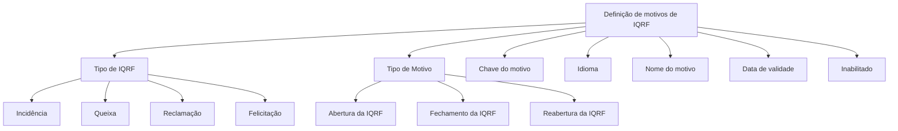

# Definição de Motivos de IQRF — Especificação Funcional de Cadastro

## 1. Metadados do Documento
- **Arquivo de Origem:** Não identificado no conteúdo extraído
- **Tipo de Documento:** Especificação Técnica
- **Domínio / Sistema:** IQRF
- **Público-Alvo:** Negócio, Analistas Funcionais, Desenvolvedores e Operação
- **Data/Versão Identificada:** Não identificada

---

## 2. Resumo Executivo & Contexto de Negócio

O documento define os motivos possíveis para registros de IQRF. A finalidade declarada é estabelecer motivos para cada tipo de IQRF: Incidência, Queixa, Reclamação e Felicitação.

A definição de motivos de IQRF é composta por propriedades gerais que identificam o tipo de IQRF aplicável, o momento de uso do motivo, a chave, o idioma, o nome ou descrição, a data de validade e o estado de inabilitação do registro.

O documento determina que um motivo pode ser utilizado em três etapas do ciclo de vida de uma IQRF: abertura, fechamento ou reabertura. Contudo, o conteúdo extraído não detalha regras de transição, responsabilidades de cadastro, persistência de dados, APIs, contratos JSON ou validações obrigatórias.

---

## 3. Arquitetura, Componentes & Tecnologias Envolvidas

O conteúdo não descreve uma arquitetura técnica, tecnologias, integrações, bancos de dados, APIs ou ambientes. O único fluxo funcional explicitamente identificado relaciona o cadastro de motivos de IQRF aos tipos de IQRF e aos pontos de uso do motivo.



> **Nota de Análise:** O rodapé extraído contém as expressões “Home Solutions APIs Documentation Zeus”, “EN” e “CF”, mas o documento não explica seu significado, relacionamento com IQRF ou função técnica.

---

## 4. Regras de Negócio, Especificações Funcionais & Processos

### 4.1 Objetivo funcional

A finalidade da definição de motivos de IQRF é cadastrar todos os motivos de IQRF possíveis para cada tipo de IQRF:

- Incidência
- Queixa
- Reclamação
- Felicitação

### 4.2 Classificação por tipo de IQRF

A propriedade **Tipo de IQRF** identifica para qual tipo de IQRF serão definidos os motivos. O documento lista quatro valores possíveis: Incidência, Queixa, Reclamação e Felicitação.

### 4.3 Momento de utilização do motivo

A propriedade **Tipo de Motivo** indica onde será utilizado o motivo que está sendo registrado. O documento enumera três contextos de utilização:

1. Abertura da IQRF.
2. Fechamento da IQRF.
3. Reabertura da IQRF.

### 4.4 Identificação e descrição do motivo

- A **Chave do motivo** deve registrar a chave atribuída ao motivo que está sendo cadastrado.
- O **Idioma** contém o idioma no qual será registrada a descrição do motivo.
- O **Nome do motivo** corresponde à descrição do motivo.

### 4.5 Vigência e disponibilidade

- A **Data de validade** indica a data a partir da qual a definição do motivo registrado entra em vigor.
- A propriedade **Inabilitado?** indica se o registro está inabilitado para uso.

> **Nota de Análise:** O documento não informa o formato da chave, o padrão de idioma, o formato da data, os valores aceitos para “Inabilitado?”, nem critérios de unicidade ou obrigatoriedade dos campos.

---

## 5. Tabelas de Parâmetros, Ambientes e Estruturas de Dados

| Item / Parâmetro | Descrição / Função | Tipo / Valores / Formato | Ambiente / Observações |
| :--- | :--- | :--- | :--- |
| Tipo de IQRF | Identifica para qual tipo de IQRF serão definidos motivos. | Incidência; Queixa; Reclamação; Felicitação. | Formato não detalhado. |
| Tipo de Motivo | Indica onde será utilizado o motivo registrado. | Abertura da IQRF; Fechamento da IQRF; Reabertura da IQRF. | Não são descritas regras adicionais de associação. |
| Chave do motivo | Registra a chave atribuída ao motivo cadastrado. | Não especificado. | O documento não define padrão, tamanho ou unicidade. |
| Idioma | Contém o idioma em que será registrada a descrição do motivo. | Não especificado. | Não são informados códigos ou idiomas suportados. |
| Nome do motivo | Contém a descrição do motivo. | Não especificado. | O documento usa “nome” e “descrição” para o motivo. |
| Data de validade | Indica desde qual data a definição do motivo registrado entra em vigor. | Data; formato não especificado. | Não é detalhado tratamento para fim de vigência. |
| Inabilitado? | Indica se o registro está inabilitado para uso. | Não especificado. | Não são definidos valores, comportamento operacional ou motivo de inabilitação. |
| Home Solutions APIs Documentation Zeus | Texto presente no rodapé da extração. | Não especificado. | Relação com IQRF não detalhada. |
| CF | Texto presente na extração. | Não especificado. | Significado não detalhado. |
| EN | Texto presente na extração. | Não especificado. | Significado não detalhado. |

---

## 6. Bateria de Perguntas & Respostas para RAG (FAQ Sintético)

### P1: Qual é o objetivo da definição de motivos de IQRF?
**R:** O objetivo é definir todos os motivos de IQRF possíveis para cada tipo de IQRF: Incidência, Queixa, Reclamação e Felicitação.

### P2: Quais tipos de IQRF podem receber definição de motivos?
**R:** O documento lista quatro tipos de IQRF para definição de motivos: Incidência, Queixa, Reclamação e Felicitação.

### P3: O que a propriedade “Tipo de IQRF” identifica?
**R:** A propriedade “Tipo de IQRF” identifica a qual tipo de IQRF serão definidos os motivos cadastrados.

### P4: Em quais etapas uma definição de motivo pode ser utilizada?
**R:** O motivo registrado pode ser utilizado na abertura da IQRF, no fechamento da IQRF ou na reabertura da IQRF.

### P5: Qual propriedade informa onde o motivo será utilizado no ciclo da IQRF?
**R:** A propriedade “Tipo de Motivo” indica onde o motivo registrado será utilizado: abertura, fechamento ou reabertura da IQRF.

### P6: Para que serve a chave do motivo?
**R:** A chave do motivo é a propriedade em que deve ser registrada a chave que será atribuída ao motivo em cadastro.

### P7: Qual é a finalidade da propriedade “Idioma”?
**R:** A propriedade “Idioma” contém o idioma no qual será registrada a descrição do motivo.

### P8: O que deve ser informado no campo “Nome do motivo”?
**R:** O campo “Nome do motivo” contém a descrição do motivo.

### P9: O que representa a data de validade de um motivo?
**R:** A data de validade indica desde qual data entra em vigor a definição do motivo registrado.

### P10: O que informa a propriedade “Inabilitado?”?
**R:** A propriedade “Inabilitado?” indica se o registro está inabilitado para ser utilizado ou não.

---

## 7. Glossário de Termos, Siglas & Conceitos-Chave

- **IQRF:** Sigla usada no documento para agrupar os tipos Incidência, Queixa, Reclamação e Felicitação. O significado expandido da sigla não é informado.
- **Incidência:** Tipo de IQRF listado no documento.
- **Queixa:** Tipo de IQRF listado no documento.
- **Reclamação:** Tipo de IQRF listado no documento.
- **Felicitação:** Tipo de IQRF listado no documento.
- **Motivo:** Registro definido para um tipo de IQRF e para um ponto de uso no ciclo de vida da IQRF.
- **Tipo de Motivo:** Propriedade que identifica se o motivo será utilizado na abertura, fechamento ou reabertura da IQRF.
- **Chave do motivo:** Chave atribuída ao motivo cadastrado.
- **Data de validade:** Data a partir da qual a definição do motivo entra em vigor.
- **Inabilitado:** Estado que indica que um registro não está disponível para uso.
- **CF:** Termo presente na extração, sem definição no documento.
- **EN:** Termo presente na extração, sem definição no documento.

---

## 8. Notas Críticas, Riscos & Limitações

- O conteúdo não identifica o arquivo de origem, autor, versão, data de publicação ou histórico de alterações.
- O significado expandido da sigla **IQRF** não é apresentado.
- O documento não define campos obrigatórios, regras de validação, tamanho ou formato da chave do motivo.
- O documento não especifica códigos de idioma, idiomas aceitos ou regras para múltiplas traduções do mesmo motivo.
- O formato da data de validade não é informado.
- O documento não informa se a data de validade possui término, se pode ser retroativa ou como conflitos de vigência devem ser tratados.
- O comportamento exato de um motivo inabilitado não é descrito.
- Não há detalhes sobre permissões, responsáveis pelo cadastro, auditoria, integração, APIs, persistência, URLs, logs ou ambientes.
- Não há exemplo preenchido de motivo, apesar de o texto encerrar com “Ejemplo:”.
- Os termos “CF”, “Home Solutions APIs Documentation Zeus” e “EN” aparecem no material extraído sem contextualização funcional ou técnica.

---

## 9. Conteúdo Bruto Estruturado (Referência Fiel)

```text
--- [PÁGINA 1 DE 2] ---

DEFINICIÓN de motivos de IQRF
Objetivo
La finalidad es definir todas los motivos de IQRF posibles, para cada tipo de IQRF ( Incidencia,
Queja, Reclamaciones y Felicitaciones)
Propiedades generales
Propiedades generales
Tipo de IQRF
Esta propiedad identifica a que tipo de IQRF se le van a definir motivos:
Incidencia
Queja
Reclamación
Felicitación
Tipo de Motivo
Esta propiedad indica donde se va a utilizar el motivo que se está registrando en:
Apertura de la IQRF
Cierre de la IQRF
Reapertura de la IQRF
 /
 CF
Home Solutions APIs Documentation Zeus
EN


--- [PÁGINA 2 DE 2] ---

Clave del motivo
En esta propiedad se deberá registrar la clave que se le va a dar al motivo que se está registrando.
Idioma
Contiene el idioma en el que se va a registrar la descripción del motivo.
Nombre del motivo
En esta propiedad la descripción del motivo.
Fecha de validez
Esta propiedad indica desde que fecha entra en vigor la definición del motivo registrado.
Inhabilitado?
Indica si el registro está inhabilitado para ser usado, o no
Ejemplo:
```
