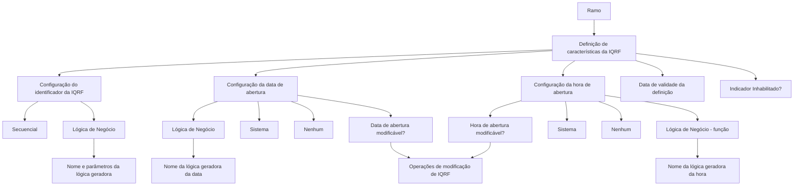

# Definição de Informação Inicial e Comportamentos de IQRF

## 1. Metadados do Documento
- **Arquivo de Origem:** Não identificado — conteúdo bruto fornecido no prompt
- **Tipo de Documento:** Especificação Técnica
- **Domínio / Sistema:** IQRF; definição por ramo
- **Público-Alvo:** Desenvolvedores, Arquitetos, Analistas Funcionais e Operação
- **Data/Versão Identificada:** Não identificada

---

## 2. Resumo Executivo & Contexto de Negócio

O documento define propriedades de configuração para informações iniciais e comportamentos do módulo IQRF. A configuração é estabelecida por **ramo**, permitindo que as características de IQRF sejam definidas especificamente para cada ramo de negócio.

As propriedades cobrem a geração do identificador da IQRF, o preenchimento inicial da data de abertura e o preenchimento inicial da hora de abertura. Para cada um desses elementos, o documento prevê comportamentos baseados em numeração sequencial, data/hora do sistema, lógica de negócio ou ausência de valor inicial, conforme a propriedade aplicável.

O documento também determina controles de modificabilidade para a data e a hora de abertura. Esses controles orientam as operações de modificação de IQRF sobre a permissão de alterar os respectivos valores após a criação.

A vigência da definição por ramo é controlada pela propriedade **Fecha de validez**, que determina desde qual data a configuração entra em vigor. A propriedade **Inhabilitado?** controla se um registro de definição está disponível para uso.

---

## 3. Arquitetura, Componentes & Tecnologias Envolvidas

Os componentes e conceitos explicitamente identificados são:

| Componente / Conceito | Papel identificado no documento |
| :--- | :--- |
| IQRF | Entidade ou módulo cujas propriedades iniciais e comportamentos são configurados. |
| Ramo | Contexto para o qual as características da IQRF são definidas. |
| Operações de modificação de IQRF | Operações que consultam as propriedades de modificabilidade de data e hora de abertura. |
| Lógica de Negócio | Regra ou função nomeada que pode gerar o identificador, a data inicial ou a hora inicial da IQRF. |
| Sistema | Fonte da data ou hora inicial quando a propriedade correspondente possui o valor `Sistema`. |
| Registro de definição | Registro que pode ser marcado como inabilitado para impedir seu uso. |



**Nota de Análise:** O documento cita uma lógica de negócio para geração de identificador, data e hora, mas não especifica os nomes concretos dessas lógicas, os parâmetros aceitos, contratos de entrada/saída, tecnologias, endpoints ou métodos de execução.

---

## 4. Regras de Negócio, Especificações Funcionais & Processos

### 4.1 Definição por ramo

1. A propriedade **Ramo** deve conter o ramo para o qual as características da IQRF estão sendo definidas ou já foram definidas.
2. A definição de informações iniciais e comportamentos é associada ao ramo informado.
3. A propriedade **Fecha de validez** indica a data a partir da qual a definição do ramo para IQRF entra em vigor.
4. O indicador **Inhabilitado?** define se o registro está inabilitado para uso.

### 4.2 Geração do identificador da IQRF

A propriedade **Cómo se va a generar el Identificador de la IQRF** determina o mecanismo usado para gerar o identificador da IQRF.

| Valor da configuração | Regra de negócio |
| :--- | :--- |
| `Secuencial` | O identificador da IQRF deve ser gerado por um número sequencial. |
| `Lógica de Negocio` | O identificador da IQRF deve ser gerado por uma regra de negócio. |

Quando a propriedade de geração de identificador possuir o valor **Lógica de Negocio**, a propriedade **Lógica de negocio que generará el identificador** deve conter o nome da lógica responsável pela geração do identificador da IQRF, com os parâmetros definidos.

### 4.3 Valor inicial da data de abertura

A propriedade **Valor inicial de la fecha de apertura** determina como o valor inicial da data de abertura da IQRF será gerado.

| Valor da configuração | Regra de negócio |
| :--- | :--- |
| `Lógica de Negocio` | O valor inicial da data deve ser gerado por uma regra de negócio. |
| `Sistema` | O valor inicial da data deve assumir a data do sistema. |
| `Ninguno` | A data de abertura não deve possuir valor inicial. |

Quando a propriedade de valor inicial da data de abertura possuir o valor **Lógica de Negocio**, a propriedade **Lógica de negocio para el valor inicial de la fecha de apertura** deve conter o nome da lógica que gera a data de abertura da IQRF.

A propriedade **¿Fecha de apertura de la IQRF modificable?** informa às operações de modificação de IQRF se a data de abertura pode ou não ser modificada.

### 4.4 Valor inicial da hora de abertura

A propriedade **valor inicial de la hora de apertura** determina como o valor inicial da hora de abertura da IQRF será gerado.

| Valor da configuração | Regra de negócio |
| :--- | :--- |
| `Lógica de Negocio (función)` | O valor inicial da hora deve ser gerado por uma regra de negócio. |
| `Sistema` | O valor inicial da hora deve assumir a hora do sistema. |
| `Ninguno` | Não deve ser gerado valor inicial para a hora. |

Quando a propriedade de valor inicial da hora possuir o valor **Lógica de Negocio**, a propriedade **Lógica de negocio que generará el valor inicial de la hora** deve conter a lógica que gera o valor inicial da hora de abertura da IQRF.

A propriedade **¿Hora de apertura modificable?** informa às operações de modificação de IQRF se a hora de abertura pode ser modificada.

---

## 5. Tabelas de Parâmetros, Ambientes e Estruturas de Dados

| Item / Parâmetro | Descrição / Função | Tipo / Valores / Formato | Ambiente / Observações |
| :--- | :--- | :--- | :--- |
| `Ramo` | Contém o ramo para o qual as características de IQRF são definidas. | Ramo; formato não detalhado. | Base de configuração da definição de IQRF. |
| `Cómo se va a generar el Identificador de la IQRF` | Define a forma de geração do identificador da IQRF. | `Secuencial`; `Lógica de Negocio`. | Não detalha formato, tamanho ou unicidade do identificador. |
| `Lógica de negocio que generará el identificador` | Nome da lógica responsável por gerar o identificador. | Nome da lógica e parâmetros definidos. | Aplicável quando a geração de identificador for `Lógica de Negocio`. |
| `Valor inicial de la fecha de apertura` | Define a origem do valor inicial da data de abertura da IQRF. | `Lógica de Negocio`; `Sistema`; `Ninguno`. | `Sistema` usa a data do sistema. |
| `Lógica de negocio para el valor inicial de la fecha de apertura` | Nome da lógica que gera a data inicial de abertura. | Nome da lógica; parâmetros não detalhados. | Aplicável quando o valor inicial da data for `Lógica de Negocio`. |
| `¿Fecha de apertura de la IQRF modificable?` | Define se a data de abertura pode ser modificada. | Valores não detalhados; comportamento binário implícito de permitir ou não permitir. | Consultada por operações de modificação de IQRF. |
| `valor inicial de la hora de apertura` | Define a origem do valor inicial da hora de abertura da IQRF. | `Lógica de Negocio (función)`; `Sistema`; `Ninguno`. | `Sistema` usa a hora do sistema. |
| `Lógica de negocio que generará el valor inicial de la hora` | Lógica que gera o valor inicial da hora de abertura. | Nome da lógica; parâmetros não detalhados. | Aplicável quando o valor inicial da hora for `Lógica de Negocio`. |
| `¿Hora de apertura modificable?` | Define se a hora de abertura pode ser modificada. | Valores não detalhados; comportamento binário implícito de permitir ou não permitir. | Consultada por operações de modificação de IQRF. |
| `Fecha de validez` | Indica a data desde a qual a definição do ramo para IQRF entra em vigor. | Data; formato não detalhado. | Controla vigência da definição. |
| `Inhabilitado?` | Indica se o registro está inabilitado para uso. | Indicador de habilitação; formato não detalhado. | Registro inabilitado não deve ser usado. |

**Ambientes, servidores, URLs, rotas de log e tecnologias:** não identificados no conteúdo fornecido.

---

## 6. Bateria de Perguntas & Respostas para RAG (FAQ Sintético)

### P1: Qual propriedade relaciona a configuração de IQRF a um contexto de negócio específico?
**R:** A propriedade `Ramo` contém o ramo para o qual as características da IQRF estão sendo definidas ou foram definidas. A configuração de informações iniciais e comportamentos da IQRF é estabelecida nesse contexto de ramo.

### P2: Quais são as opções para gerar o identificador da IQRF?
**R:** O identificador da IQRF pode ser gerado de forma `Secuencial`, utilizando um número sequencial, ou por `Lógica de Negocio`, utilizando uma regra de negócio.

### P3: Onde deve ser informado o nome da regra responsável por gerar o identificador da IQRF?
**R:** Quando a propriedade de geração do identificador estiver configurada como `Lógica de Negocio`, o nome da regra e seus parâmetros definidos devem ser informados na propriedade `Lógica de negocio que generará el identificador`.

### P4: Como configurar a data de abertura da IQRF para usar a data corrente?
**R:** A propriedade `Valor inicial de la fecha de apertura` deve possuir o valor `Sistema`. Nessa configuração, o valor inicial da data de abertura assume a data do sistema.

### P5: O que acontece quando o valor inicial da data de abertura é configurado como `Ninguno`?
**R:** Quando `Valor inicial de la fecha de apertura` possui o valor `Ninguno`, a data de abertura da IQRF não recebe valor inicial.

### P6: Como uma regra de negócio gera a data de abertura inicial da IQRF?
**R:** A propriedade `Valor inicial de la fecha de apertura` deve ser configurada como `Lógica de Negocio`. Em seguida, a propriedade `Lógica de negocio para el valor inicial de la fecha de apertura` deve indicar o nome da lógica que gera a data de abertura.

### P7: Qual propriedade controla se a data de abertura pode ser alterada após a criação da IQRF?
**R:** A propriedade `¿Fecha de apertura de la IQRF modificable?` informa às operações de modificação de IQRF se a data de abertura pode ou não ser modificada.

### P8: Quais valores podem ser usados para determinar a hora inicial de abertura da IQRF?
**R:** A propriedade `valor inicial de la hora de apertura` aceita `Lógica de Negocio (función)`, para geração por regra de negócio; `Sistema`, para uso da hora do sistema; e `Ninguno`, para não gerar valor inicial de hora.

### P9: Como impedir o uso de uma definição de IQRF?
**R:** O indicador `Inhabilitado?` informa se o registro está inabilitado para uso. O documento não detalha os valores técnicos aceitos pelo indicador, mas estabelece que ele controla a disponibilidade do registro.

### P10: Qual propriedade determina quando uma definição por ramo começa a vigorar?
**R:** A propriedade `Fecha de validez` indica a data a partir da qual a definição do ramo para IQRF entra em vigor.

### P11: O documento informa os contratos, métodos HTTP ou parâmetros técnicos das lógicas de negócio?
**R:** Não. O documento informa que lógicas de negócio podem gerar o identificador, a data inicial e a hora inicial da IQRF, mas não detalha métodos HTTP, contratos JSON, assinaturas de funções, endpoints, tecnologias ou valores concretos de parâmetros.

---

## 7. Glossário de Termos, Siglas & Conceitos-Chave

- **IQRF:** Entidade ou módulo referido no documento, para o qual são configurados valores iniciais e comportamentos. O significado expandido da sigla não é informado.
- **Ramo:** Contexto de negócio para o qual são definidas as características da IQRF.
- **Lógica de Negócio:** Regra de negócio usada para gerar o identificador, a data inicial de abertura ou a hora inicial de abertura da IQRF.
- **Secuencial:** Modalidade na qual o identificador da IQRF é gerado por um número sequencial.
- **Sistema:** Modalidade na qual a data ou a hora inicial assume o valor da data ou hora do sistema.
- **Ninguno:** Modalidade na qual não existe valor inicial para o campo configurado.
- **Fecha de validez:** Data a partir da qual a definição do ramo para IQRF entra em vigor.
- **Inhabilitado:** Estado que indica que o registro não está disponível para uso.

---

## 8. Notas Críticas, Riscos & Limitações

- O significado expandido da sigla **IQRF** não é apresentado.
- O documento não especifica o formato do identificador da IQRF, nem as regras de sequência, reinicialização, concorrência ou unicidade aplicáveis ao valor sequencial.
- Os nomes, parâmetros, contratos e mecanismos de execução das lógicas de negócio não são detalhados.
- Os valores técnicos aceitos pelas propriedades de modificabilidade da data e da hora não são explicitados.
- O formato de `Fecha de validez` não é informado, tampouco são descritas regras para definições sobrepostas, retroativas ou futuras.
- Não há informações sobre ambientes, servidores, URLs, APIs, rotas de log, persistência de dados, autenticação, autorização ou tratamento de erros.
- **Nota de Análise:** O documento descreve configurações funcionais de IQRF, porém não detalha a implementação técnica ou os contratos de integração do módulo.

---

## 9. Conteúdo Bruto Estruturado (Referência Fiel)

```text
--- [PÁGINA 1 DE 3] ---

EN CONSTRUCCIÓN
DEFINICIÓN de Información inicial y
Comportamientos de IQRF
Objetivo
La finalidad es definir todas los valores iniciales y comportamientos para algunas propiedades de
IQRF y comportamientos del módulo.
Propiedades generales
Propiedades generales
Ramo
Esta propiedad contendrá el ramo para el que se está definiendo o se han definido las características
de IRQF.
Cómo se va a generar el Identificador de la IQRF
Esta propiedad indica cómo se va a generar el identificador de la IQRF.
Sus valores son:
Secuencial
El identificador de la IQRF se generará con un número secuencial.
 / 
 CF
Home Solutions APIs Documentation Zeus
EN


--- [PÁGINA 2 DE 3] ---

Lógica de Negocio
El identificador de la IQRF, será generado por una regla de negocio.
Lógica de negocio que generará el identificador
Si la anterior propiedad contiene el valor "lógica de negocio", aquí irá el nombre de dicha lógica, que
va a generar el identificador de la IQRF, con los parámetros definidos.
Valor inicial de la fecha de apertura
Esta propiedad indica cómo se va a generar el valor inicial de la fecha de apertura de la IQRF.
Sus valores son:
Lógica de Negocio
El valor inicial de la fecha, será generado por una regla de negocio.
Sistema
El valor inicial de la fecha, tomará el valor de la fecha del sistema.
Ninguno
La fecha de apertura no tendrá valor inicial.
Lógica de negocio para el valor inicial de la fecha de apertura
Si la anterior propiedad contiene el valor "lógica de Negocio", aquí irá el nombre de la misma que va
a generar la fecha de apertura de la IQRF.
¿Fecha de apertura de la IQRF modificable?
Esto indicará a las operaciones de modificación de IQRF, si se puede modificar o no la fecha de
apertura.
valor inicial de la hora de apertura
Esta propiedad indica cómo se va a generar el valor inicial de la hora de apertura de la IQRF. Sus
valores son:
Lógica de Negocio (función) El valor inicial de la hora, será generado por una regla de negocio.
Sistema
El valor inicial de la hora, tomará el valor de la hora del sistema.
Ninguno No se va a generar el valor inicial de la hora
Lógica de negocio que generará el valor inicial de la hora
Si la anterior propiedad contiene el valor "Lógica de Negocio', aquí irá el dicha lógica, que generará el
valor inicial de la hora de apertura de la IQRF.


--- [PÁGINA 3 DE 3] ---

¿Hora de apertura modificable?
Esto indicará a las operaciones de modificación de IQRF, si se puede modificar la hora de apertura.
Fecha de validez
Esta propiedad indica desde que fecha entra en vigor la definición del ramo para IQRF
Inhabilitado?
Indica si el registro está inhabilitado para ser usado, o no
```
