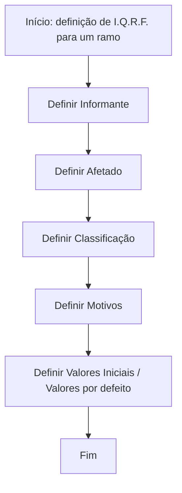

# Definición de I.Q.R.F. para Siniestros

## 1. Metadados do Documento
- **Arquivo de Origem:** Não identificado
- **Tipo de Documento:** Procedimento
- **Domínio / Sistema:** I.Q.R.F. em sinistros
- **Público-Alvo:** Usuários responsáveis pela definição e operação de I.Q.R.F. em ramos de sinistros
- **Data/Versão Identificada:** Não identificada

---

## 2. Resumo Executivo & Contexto de Negócio

O documento apresenta o processo para trabalhar com I.Q.R.F. em sinistros. I.Q.R.F. é expandido no próprio conteúdo como “Inicidencias, Quejas, Reclamaciones y Felicitaciones”.

O objetivo declarado é explicar os passos necessários para definir um I.Q.R.F. para um ramo. O fluxo de definição é composto pela configuração de informantes, afetados, classificação, motivos e valores iniciais ou valores por defeito.

O conteúdo possui caráter resumido e enumera as etapas do procedimento, sem detalhar regras de validação, interfaces, campos, responsabilidades, contratos de integração ou critérios de negócio para cada configuração.

---

## 3. Arquitetura, Componentes & Tecnologias Envolvidas

O documento não descreve uma arquitetura de software, tecnologias, microsserviços, bancos de dados, APIs, ambientes ou integrações técnicas. O fluxo identificável é um processo sequencial de definição de I.Q.R.F. para um ramo de sinistros.



### Componentes e etapas identificadas

| Componente / Etapa | Descrição sustentada pelo documento |
| :--- | :--- |
| I.Q.R.F. | Inicidencias, Quejas, Reclamaciones y Felicitaciones. |
| Siniestros | Contexto no qual o documento orienta o trabalho com I.Q.R.F. |
| Ramo | Unidade para a qual deve ser realizada a definição do I.Q.R.F. |
| Informante | Primeira etapa de definição do processo. |
| Afetado | Segunda etapa de definição do processo. |
| Classificação | Terceira etapa de definição do processo. |
| Motivos | Quarta etapa de definição do processo. |
| Valores iniciais / valores por defeito | Quinta e última etapa de definição antes do fim do processo. |

> **Nota de Análise:** O documento não detalha a função operacional, os campos configuráveis ou as dependências entre Informante, Afetado, Classificação, Motivos e Valores iniciais.

---

## 4. Regras de Negócio, Especificações Funcionais & Processos

### Objetivo do procedimento

O procedimento tem como objetivo explicar os passos para poder trabalhar com I.Q.R.F. em sinistros.

### Processo de definição de I.Q.R.F. para um ramo

A definição de I.Q.R.F. para um ramo segue cinco etapas listadas no documento:

1. **Definir Informante**
2. **Definir Afetado**
3. **Definir Classificação**
4. **Definir Motivos**
5. **Definir Valores por defeito**

A representação visual do documento apresenta a última etapa como **“Valores Iniciales”**, enquanto a lista numerada apresenta **“Valores defecto”**. Ambas as denominações foram preservadas por fidelidade ao conteúdo original.

> **Nota de Análise:** O documento não informa quais valores devem ser definidos em cada etapa, quais condições de validação existem, se a ordem é obrigatória do ponto de vista sistêmico ou quais efeitos a configuração produz no processamento de sinistros.

---

## 5. Tabelas de Parâmetros, Ambientes e Estruturas de Dados

| Item / Parâmetro | Descrição / Função | Tipo / Valores / Formato | Ambiente / Observações |
| :--- | :--- | :--- | :--- |
| I.Q.R.F. | Processo tratado pelo documento para trabalho em sinistros. | Sigla expandida como “Inicidencias, Quejas, Reclamaciones y Felicitaciones”. | Não há ambiente identificado. |
| Ramo | Escopo para o qual o I.Q.R.F. deve ser definido. | Não especificado. | Relacionado ao processo de sinistros. |
| Informante | Elemento a ser definido na primeira etapa. | Não especificado. | Não há detalhamento adicional. |
| Afetado | Elemento a ser definido na segunda etapa. | Não especificado. | Não há detalhamento adicional. |
| Classificação | Elemento a ser definido na terceira etapa. | Não especificado. | Não há detalhamento adicional. |
| Motivos | Elemento a ser definido na quarta etapa. | Não especificado. | Não há detalhamento adicional. |
| Valores iniciais | Elemento indicado no fluxo gráfico como etapa final. | Não especificado. | O texto também usa “Valores defecto”. |
| Valores por defeito | Elemento indicado na lista numerada como quinta etapa. | Não especificado. | Pode corresponder aos “Valores Iniciales” citados no fluxo; o documento não esclarece a equivalência. |

---

## 6. Bateria de Perguntas & Respostas para RAG (FAQ Sintético)

### P1: Qual é o objetivo do documento sobre I.Q.R.F.?
**R:** O objetivo é explicar os passos a seguir para poder trabalhar com I.Q.R.F. — “Inicidencias, Quejas, Reclamaciones y Felicitaciones” — no contexto de sinistros.

### P2: O que significa a sigla I.Q.R.F. no documento?
**R:** O documento expande I.Q.R.F. como “Inicidencias, Quejas, Reclamaciones y Felicitaciones”.

### P3: Em qual contexto de negócio o I.Q.R.F. deve ser trabalhado?
**R:** O documento declara que o I.Q.R.F. deve ser trabalhado em sinistros.

### P4: Para qual entidade deve ser realizado o processo de definição de I.Q.R.F.?
**R:** O processo é descrito como uma definição de I.Q.R.F. para um ramo.

### P5: Qual é a primeira etapa da definição de I.Q.R.F. para um ramo?
**R:** A primeira etapa é definir o Informante.

### P6: Qual é a sequência de etapas para definir I.Q.R.F. para um ramo?
**R:** A sequência apresentada é: definir Informante, definir Afetado, definir Classificação, definir Motivos e definir Valores por defeito. O fluxo gráfico denomina a última etapa como Valores iniciais.

### P7: O documento informa quais campos devem ser preenchidos ao definir um Informante?
**R:** Não. O documento apenas lista “Definir Informante” como a primeira etapa e não detalha campos, atributos, regras ou valores permitidos.

### P8: O documento descreve critérios para classificar I.Q.R.F.?
**R:** Não. “Definir Clasificación” é citado como a terceira etapa, mas não há critérios, categorias ou regras de classificação descritos.

### P9: Existem regras para configurar os motivos de I.Q.R.F.?
**R:** Não há regras detalhadas. O documento apenas indica “Definir Motivos” como a quarta etapa do processo.

### P10: Qual é a diferença entre Valores Iniciales e Valores defecto?
**R:** O documento usa “Valores Iniciales” no fluxo visual e “Valores defecto” na lista numerada. Não há explicação que permita afirmar se são sinônimos, valores distintos ou etapas diferentes.

### P11: O documento fornece APIs, URLs, ambientes ou detalhes de integração?
**R:** Não. Apesar de aparecerem os termos “Soluciones”, “APIs”, “Documentación” e “Zeus” no rodapé do conteúdo bruto, o documento não fornece detalhes técnicos, URLs, contratos ou integrações associados a esses termos.

### P12: O documento define o fluxo após a configuração dos valores por defeito?
**R:** Não. O fluxo indica “FIN” após a definição de Valores Iniciales, mas não descreve processamento posterior, aprovações, persistência ou operações de sinistro resultantes.

---

## 7. Glossário de Termos, Siglas & Conceitos-Chave

- **I.Q.R.F.:** “Inicidencias, Quejas, Reclamaciones y Felicitaciones”, conforme grafia presente no documento.
- **Siniestros:** Contexto no qual o documento orienta o trabalho com I.Q.R.F.
- **Ramo:** Escopo para o qual é realizado o processo de definição de I.Q.R.F.
- **Informante:** Elemento a ser definido na primeira etapa do processo.
- **Afetado:** Elemento a ser definido na segunda etapa do processo.
- **Classificação:** Elemento a ser definido na terceira etapa do processo.
- **Motivos:** Elemento a ser definido na quarta etapa do processo.
- **Valores Iniciales:** Denominação exibida no fluxo para a etapa final de definição.
- **Valores defecto:** Denominação usada na lista numerada para a quinta etapa de definição.
- **Zeus:** Termo apresentado no rodapé do conteúdo bruto, sem definição adicional.

---

## 8. Notas Críticas, Riscos & Limitações

- O documento é resumido e não detalha procedimentos de tela, campos de configuração, permissões, responsáveis ou critérios de aprovação.
- Não são informados contratos de API, métodos HTTP, estruturas JSON, URLs, ambientes, servidores, credenciais, logs ou mecanismos de auditoria.
- A relação entre **Valores Iniciales** e **Valores defecto** não é esclarecida.
- Não há regras de validação para Informante, Afetado, Classificação ou Motivos.
- Os termos “Soluciones”, “APIs”, “Documentación” e “Zeus” aparecem sem contexto funcional ou técnico adicional.
- Não foram identificadas data, versão, autor, sistema proprietário ou referência documental.

---

## 9. Conteúdo Bruto Estruturado (Referência Fiel)

```text
--- [PÁGINA 1 DE 1] ---

DEFINICIÓN I.Q.R.F.
Objetivo
Explicar los pasos a seguir para poder trabajar con I.Q.R.F. (Inicidencias, Quejas, Reclamaciones y
Felicitaciones) en siniestros.
Proceso para la definición de un I.Q.R.F. para un Ramo
DEFINIR
Informantes
DEFINIR
Afectados
DEFINIR
Clasificación
DEFINIR
Motivos
DEFINIR
Valores Iniciales FIN
1. DEFINIR Informante
2. DEFINIR Afectado
3. DEFINIR Clasificación
4. DEFINIR Motivos
5. DEFINIR Valores defecto
 / 
 RS
Inicio Soluciones APIs Documentación Zeus
ES
```
