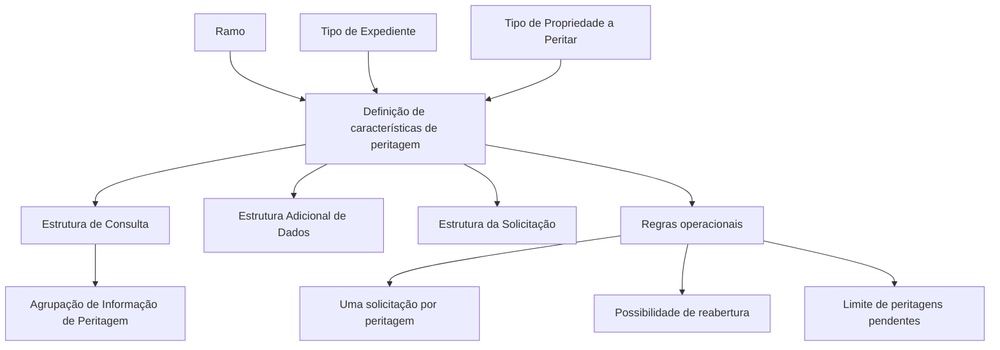

# Definição de Características de Peritagens por Ramo e Tipo de Expediente

## 1. Metadados do Documento
- **Arquivo de Origem:** Não identificado
- **Tipo de Documento:** Especificação Técnica
- **Domínio / Sistema:** Peritagens; Home Solutions APIs Documentation Zeus
- **Público-Alvo:** Desenvolvedores, Arquitetos, Analistas Funcionais e Operação
- **Data/Versão Identificada:** Não identificada

---

## 2. Resumo Executivo & Contexto de Negócio

O documento define características configuráveis para a realização de uma peritagem, organizadas por **Ramo** e **Tipo de Expediente**. O objetivo declarado é identificar o que deve ser definido para cada combinação de ramo e tipo de expediente antes de realizar uma peritagem.

A configuração abrange a propriedade que poderá ser peritada, estruturas de informação para consulta, dados complementares da peritagem e a estrutura de informação adicional exigida na solicitação de peritagem. O documento cita como tipos de propriedade a peritar: **Veículo** e **Patrimonial (casa, empresa)**.

Para cada tipo de expediente, deve-se determinar toda a informação disponível para consulta. Esse conjunto de propriedades deve receber uma chave e um nome, ser cadastrado como uma estrutura e associado à agrupação de informação de peritagem.

O documento também estabelece opções de controle operacional: limitação de solicitações por peritagem, possibilidade de reabertura de uma peritagem e limitação de peritagens pendentes para um expediente. Não são detalhados métodos HTTP, contratos JSON, persistência, interfaces de usuário ou mecanismos técnicos de implementação.

---

## 3. Arquitetura, Componentes & Tecnologias Envolvidas

Os elementos funcionais identificados são:

- **Ramo:** chave do ramo para o qual serão definidas as propriedades e estruturas adicionais de informação para peritagem.
- **Tipo de Expediente:** chave do tipo de expediente cujas características de peritagem serão definidas.
- **Tipo de Propriedade a Peritar:** atributo que identifica o tipo de propriedade para o qual serão definidas as partes passíveis de peritagem.
- **Estrutura de Consulta:** estrutura de dados apresentada ao realizar uma peritagem em um expediente do tipo configurado.
- **Estrutura Adicional de Dados:** estrutura destinada à captura de dados complementares da peritagem.
- **Estrutura da Solicitação:** estrutura de informação adicional solicitada durante a solicitação de peritagem.
- **Agrupação de Informação de Peritagem:** agrupação à qual uma estrutura cadastrada pode ser associada.
- **Home Solutions APIs Documentation Zeus:** termo presente no conteúdo extraído, sem detalhamento de função ou integração.



> *Nota de Análise: O documento descreve uma configuração funcional de peritagens, mas não apresenta arquitetura de software, protocolos de integração, serviços, bancos de dados, URLs, ambientes ou tecnologias de implementação.*

---

## 4. Regras de Negócio, Especificações Funcionais & Processos

1. A definição de propriedades e estruturas de informação de peritagem deve ser realizada por **Ramo** e por **Tipo de Expediente**.
2. O **Ramo** identifica, por meio de uma chave, o contexto para o qual serão definidas:
   - Propriedades a peritar.
   - Estruturas adicionais de informação de peritagem.
3. O **Tipo de Expediente** identifica, por meio de uma chave, as características de peritagem aplicáveis.
4. O **Tipo de Propriedade a Peritar** determina o tipo de propriedade cujas possíveis partes a peritar serão definidas.
5. Os tipos de propriedade explicitamente citados são:
   - Veículo.
   - Patrimonial, incluindo casa e empresa.
6. A **Estrutura de Consulta** representa o código da estrutura de dados que será exibida quando for realizada uma peritagem para um expediente do tipo em definição.
7. Para cada tipo de expediente, deve ser determinada toda a informação que poderá ser consultada.
8. O conjunto de propriedades que compõe a informação consultável deve:
   - Receber uma chave.
   - Receber um nome.
   - Ser cadastrado como uma estrutura.
   - Ser associado à agrupação de informação de peritagem.
   - Poder ser associado à configuração em questão.
9. A **Estrutura Adicional de Dados** contém o mecanismo ou programa de captura de dados complementares da peritagem, conforme redação disponível no conteúdo bruto.
10. A **Estrutura da Solicitação** contém a estrutura de informação adicional que será requisitada na solicitação de peritagem.
11. A propriedade **Uma sola solicitação por peritagem** indica se a peritagem poderá ter mais de uma solicitação.
12. A propriedade **Se pode reaperturar a peritagem** define se uma peritagem pode ser reaberta.
13. Quando a reabertura não for permitida, deve ser realizada uma nova peritagem.
14. A propriedade **Se pode ter somente uma peritagem pendente** indica se é permitido existir mais de uma peritagem pendente para um expediente.

---

## 5. Tabelas de Parâmetros, Ambientes e Estruturas de Dados

| Item / Parâmetro | Descrição / Função | Tipo / Valores / Formato | Ambiente / Observações |
| :--- | :--- | :--- | :--- |
| Ramo | Indica a chave do ramo para o qual serão definidas propriedades a peritar e estruturas adicionais de informação de peritagem. | Chave de ramo; formato não detalhado. | Não detalhado. |
| Tipo de Expediente | Indica a chave do tipo de expediente para o qual serão definidas as características das peritagens. | Chave de tipo de expediente; formato não detalhado. | Não detalhado. |
| Tipo de Propriedade a Peritar | Indica o tipo de propriedade para o qual serão definidas as possíveis partes a peritar. | Veículo; Patrimonial (casa, empresa). | Não detalhado. |
| Estrutura de Consulta | Indica o código da estrutura de dados exibida ao realizar uma peritagem em um expediente do tipo configurado. | Código de estrutura; formato não detalhado. | A informação consultável deve ser determinada para cada tipo de expediente. |
| Informação de Consulta | Conjunto de propriedades que podem ser consultadas para um tipo de expediente. | Cada conjunto deve possuir chave e nome. | Deve ser cadastrado como estrutura e associado à agrupação de informação de peritagem. |
| Estrutura Adicional de Dados | Contém estrutura ou programa de captura de dados complementares da peritagem. | Não detalhado. | O texto original contém a expressão “contendrprograma”. |
| Estrutura da Solicitação | Contém a estrutura de informação adicional solicitada na solicitação de peritagem. | Não detalhado. | Não detalhado. |
| Uma sola solicitação por peritagem | Indica se uma peritagem poderá ter mais de uma solicitação. | Regra de permissão; valores não detalhados. | O nome da propriedade sugere controle de quantidade de solicitações. |
| Se pode reaperturar a peritagem | Indica se uma peritagem pode ser reaberta. | Regra de permissão; valores não detalhados. | Se não for possível reabrir, deve ser criada outra peritagem. |
| Se pode ter somente uma peritagem pendente | Indica se é permitida mais de uma peritagem pendente para um expediente. | Regra de permissão; valores não detalhados. | Não detalhado. |
| Home Solutions APIs Documentation Zeus | Termo exibido no conteúdo extraído. | Não detalhado. | Não há descrição funcional, técnica ou de integração. |

---

## 6. Bateria de Perguntas & Respostas para RAG (FAQ Sintético)

### P1: Qual é a finalidade do documento de definição de características de peritagens?
**R:** A finalidade é identificar o que deve ser definido por ramo e por tipo de expediente para realizar uma peritagem, incluindo a propriedade a peritar, as estruturas de informação para consulta, estruturas de dados complementares e estruturas de solicitação de peritagem.

### P2: O que representa a propriedade Ramo na configuração de peritagens?
**R:** Ramo indica a chave do ramo para o qual serão definidas as propriedades a peritar e as estruturas adicionais de informação de peritagem.

### P3: Qual é a função do Tipo de Expediente?
**R:** Tipo de Expediente indica a chave do tipo de expediente para o qual serão definidas as características das peritagens.

### P4: Quais tipos de propriedade a peritar são citados no documento?
**R:** O documento cita os tipos de propriedade Veículo e Patrimonial, sendo Patrimonial exemplificado como casa ou empresa.

### P5: O que é a Estrutura de Consulta em uma peritagem?
**R:** A Estrutura de Consulta é o código da estrutura de dados que será mostrada quando for realizada uma peritagem em um expediente do tipo que está sendo definido.

### P6: Como deve ser organizada a informação consultável de cada tipo de expediente?
**R:** Para cada tipo de expediente, deve-se determinar toda a informação que poderá ser consultada. O conjunto de propriedades deve receber uma chave e um nome, ser cadastrado como estrutura e associado à agrupação de informação de peritagem.

### P7: O que contém a Estrutura Adicional de Dados?
**R:** O documento informa que a Estrutura Adicional de Dados contém um programa ou estrutura para captura de dados complementares da peritagem. O conteúdo extraído não detalha o formato, os campos ou o comportamento desse mecanismo.

### P8: Para que serve a Estrutura da Solicitação?
**R:** A Estrutura da Solicitação contém a estrutura de informação adicional que será solicitada no momento da solicitação de peritagem.

### P9: O que acontece quando uma peritagem não pode ser reaberta?
**R:** Quando não for possível reabrir a peritagem, deverá ser realizada uma nova peritagem.

### P10: A configuração permite mais de uma solicitação por peritagem?
**R:** A propriedade “Uma sola solicitação por peritagem” indica se a peritagem poderá ter mais de uma solicitação. O documento não apresenta os valores possíveis nem define a regra de decisão padrão.

### P11: Como a quantidade de peritagens pendentes é controlada por expediente?
**R:** A propriedade “Se pode ter somente uma peritagem pendente” indica se é permitida mais de uma peritagem pendente para um expediente. O documento não detalha os valores de configuração ou o tratamento operacional para tentativas adicionais.

### P12: O documento define APIs, métodos HTTP ou contratos JSON para peritagens?
**R:** Não. Embora o texto contenha o termo “Home Solutions APIs Documentation Zeus”, não são apresentados métodos HTTP, endpoints, URLs, contratos JSON, autenticação ou interfaces de integração.

---

## 7. Glossário de Termos, Siglas & Conceitos-Chave

- **Peritagem:** Processo para o qual são definidas propriedades, estruturas de consulta, dados complementares e solicitações.
- **Ramo:** Chave que identifica o ramo para o qual são configuradas propriedades e estruturas de informação de peritagem.
- **Tipo de Expediente:** Chave que identifica o tipo de expediente cujas características de peritagem serão definidas.
- **Propriedade a Peritar:** Tipo de propriedade para o qual podem ser definidas partes passíveis de peritagem.
- **Veículo:** Tipo de propriedade a peritar citado no documento.
- **Patrimonial:** Tipo de propriedade a peritar citado no documento, exemplificado por casa e empresa.
- **Estrutura de Consulta:** Estrutura de dados apresentada ao realizar uma peritagem para determinado tipo de expediente.
- **Estrutura Adicional de Dados:** Estrutura relacionada à captura de dados complementares de peritagem.
- **Estrutura da Solicitação:** Estrutura de informação adicional requerida na solicitação de peritagem.
- **Agrupação de Informação de Peritagem:** Agrupação à qual as estruturas de informação podem ser associadas.
- **Home Solutions APIs Documentation Zeus:** Termo presente no conteúdo extraído, sem expansão ou definição fornecida.

---

## 8. Notas Críticas, Riscos & Limitações

- O documento não identifica o arquivo de origem, autor, data, versão ou responsável.
- Não são detalhados campos, formatos, tipos de dados, valores permitidos ou obrigatoriedade para as propriedades descritas.
- Não há definição de comportamento para casos de erro, concorrência, cancelamento, aprovação ou encerramento de peritagens.
- O documento não especifica APIs, endpoints, métodos HTTP, contratos JSON, autenticação, banco de dados, ambientes, logs ou monitoramento.
- O texto relativo à Estrutura Adicional de Dados apresenta possível erro de extração ou transcrição: “Esta propiedad contendrprograma de captura de datos complementarios de la peritacion”.
- A propriedade denominada “Uma sola solicitação por peritagem” possui descrição que trata da possibilidade de mais de uma solicitação; o documento não esclarece os valores configuráveis nem a semântica final do indicador.
- O termo “Home Solutions APIs Documentation Zeus” não possui detalhamento suficiente para estabelecer sua função no processo de peritagem.

---

## 9. Conteúdo Bruto Estruturado (Referência Fiel)

```text
--- [PÁGINA 1 DE 2] ---

DEFINICIÓN Características de las peritaciones
por Ramo y Tipo de Expediente
Objetivo
La finalidad de este documento es conocer qué hay que definir por ramo y tipo de expediente para
realizar una peritación. Aquí se podrá definir, qué propiedad se va a poder peritar, estructura de
información de datos de consulta, estructura de la solicitud de peritación... etc.
Propiedades Generales
Propiedades
Ramo
Esta propiedad indica la clave del Ramo para el que se va a definir las propiedades a peritar y las
estructuras de información adicionales de peritación.
Tipo de Expediente
Esta propiedad indica la clave del Tipo de Expediente para el que se va a definir las características
de las peritaciones.
Tipo de Propiedad a peritar
Este atributo indica a que tipo de propiedad se le van a definir las posibles partes a peritar
Vehículo
 / 
 CF
Home Solutions APIs Documentation Zeus
EN


--- [PÁGINA 2 DE 2] ---

Patrimonial (casa, empresa)
Estructura de Consulta
Esta propiedad indica el código de la estructura de datos que se van mostrar cuando se quiera
realizar una peritación a un expediente del Tipo que se está definiendo.
Para cada tipo de expediente habrá que determinar toda la información que se va a poder consultar.
A toda esa información (conjunto de propiedades) se le dará una clave y un nombre es decir se le
dará de alta como estructura y se le asociará a la agrupación de información de peritación, para
poder asociarla aquí.
Estructura Adicional de datos
Esta propiedad contendrprograma de captura de datos complementarios de la peritacion
Estructura de la Solicitud
Esta propiedad contendrá la estructura de información adicional que se va a pedir en la solicitud de
peritación.
Una sola solicitud por peritación
Esta propiedad indica si la peritación podrá tener más de una solicitud por peritación
Se puede reaperturar la peritación
Esta propiedad indicará la posibilidad de reaperturar la peritación o de no poder reaperturarla y en
ese caso habrá que realizar otra peritación nueva.
Se puede tener solo una peritación pendiente
Esta propiedad indica si se permite más de una peritación pendiente para un expediente.
```
