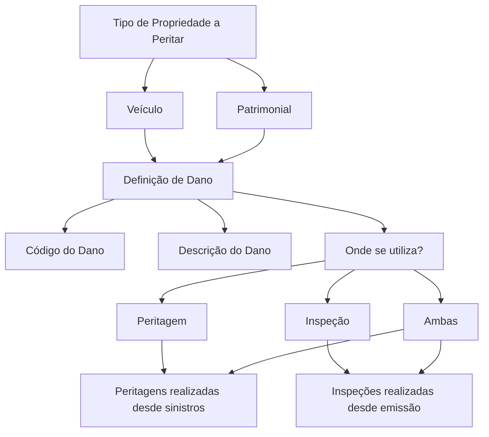

# Definição de Danos para Peritagem e Inspeção

## 1. Metadados do Documento
- **Arquivo de Origem:** Não identificado
- **Tipo de Documento:** Especificação Técnica
- **Domínio / Sistema:** Peritación / Inspección; Home Solutions APIs Documentation Zeus
- **Público-Alvo:** Negócio, Desenvolvedores, Operação
- **Data/Versão Identificada:** Não identificada

---

## 2. Resumo Executivo & Contexto de Negócio

O documento define os danos que podem ser configurados conforme o tipo de propriedade submetida à peritagem. O objetivo declarado é estabelecer danos aplicáveis a propriedades dos tipos **Veículo** e **Patrimonial**.

Cada dano possui um código, descrito como a chave do prejuízo causado, e uma descrição, correspondente ao nome do prejuízo causado. Esses atributos estruturam a identificação e a classificação dos danos.

O documento também define o contexto de utilização do dano. Um dano pode ser utilizado em inspeções de emissão, em peritagens de sinistros ou em ambos os processos.

Não há detalhamento de contratos de API, métodos HTTP, estruturas JSON, regras de validação, persistência de dados ou integração técnica com o componente “Home Solutions APIs Documentation Zeus”.

---

## 3. Arquitetura, Componentes & Tecnologias Envolvidas

Os componentes e conceitos explicitamente citados são:

| Componente / Conceito | Papel identificado |
| :--- | :--- |
| Peritación | Processo no qual danos podem ser utilizados para peritagens realizadas a partir de sinistros. |
| Inspección | Processo no qual danos podem ser utilizados para inspeções realizadas a partir de emissão. |
| Siniestros | Origem das peritagens citadas no documento. |
| Emisión | Origem das inspeções citadas no documento. |
| Vehículo | Tipo de propriedade que pode receber definição de danos. |
| Patrimonial | Tipo de propriedade que pode receber definição de danos. |
| Home Solutions APIs Documentation Zeus | Referência textual presente no conteúdo bruto, sem detalhamento técnico adicional. |



---

## 4. Regras de Negócio, Especificações Funcionais & Processos

1. A finalidade do documento é definir os danos que podem ocorrer por tipo de propriedade.
2. O atributo **Tipo Propiedad a peritar** informa para qual tipo de propriedade os danos serão definidos.
3. Os tipos de propriedade apresentados são:
   - Veículo.
   - Patrimonial.
4. O **Código del daño** representa a chave do prejuízo causado.
5. A **Descripción del daño causado** representa o nome do prejuízo causado.
6. A propriedade **Dónde se utiliza?** determina onde o dano será utilizado.
7. Os valores de utilização apresentados são:
   - **Peritación:** o dano será utilizado nas peritagens realizadas a partir de sinistros.
   - **Inspección:** o dano será utilizado nas inspeções realizadas a partir de emissão.
   - **Ambas:** o dano será utilizado tanto em peritagens quanto em inspeções.

---

## 5. Tabelas de Parâmetros, Ambientes e Estruturas de Dados

| Item / Parâmetro | Descrição / Função | Tipo / Valores / Formato | Ambiente / Observações |
| :--- | :--- | :--- | :--- |
| Tipo Propiedad a peritar | Indica o tipo de propriedade para o qual os danos serão definidos. | Veículo; Patrimonial | Não são fornecidos identificadores técnicos ou formatos. |
| Código del daño | Chave do prejuízo causado. | Não especificado | O documento não apresenta regra de composição ou validação. |
| Descripción del daño causado | Nome do prejuízo causado. | Não especificado | O documento não apresenta tamanho, idioma ou formato obrigatório. |
| Dónde se utiliza? | Indica se o dano é aplicável a inspeções de emissão, peritagens de sinistros ou ambos. | Peritación; Inspección; Ambas | Define o contexto operacional de uso do dano. |
| Peritación | Utilização do dano em peritagens realizadas desde sinistros. | Valor de utilização | Associada a sinistros. |
| Inspección | Utilização do dano em inspeções realizadas desde emissão. | Valor de utilização | Associada a emissão. |
| Ambas | Utilização do dano em peritagens e inspeções. | Valor de utilização | Abrange os dois contextos. |
| Home Solutions APIs Documentation Zeus | Referência textual no documento. | Não especificado | Não há informações sobre URL, API, autenticação ou contrato. |

---

## 6. Bateria de Perguntas & Respostas para RAG (FAQ Sintético)

### P1: Qual é a finalidade do documento de definição de danos?
**R:** A finalidade do documento é definir os danos que podem ocorrer por tipo de propriedade.

### P2: Quais tipos de propriedade podem receber definição de danos?
**R:** O documento apresenta os tipos de propriedade Veículo e Patrimonial.

### P3: O que representa o atributo “Tipo Propiedad a peritar”?
**R:** O atributo “Tipo Propiedad a peritar” indica para qual tipo de propriedade serão definidos os danos.

### P4: O que é o “Código del daño”?
**R:** O “Código del daño” é a chave do prejuízo causado.

### P5: O que representa a “Descripción del daño causado”?
**R:** A “Descripción del daño causado” representa o nome do prejuízo causado.

### P6: Para que serve a propriedade “Dónde se utiliza?”?
**R:** A propriedade “Dónde se utiliza?” indica se o dano é utilizado em inspeções de emissão, em peritagens de sinistros ou nos dois contextos.

### P7: Quando um dano configurado como “Peritación” deve ser utilizado?
**R:** Um dano configurado como “Peritación” deve ser utilizado nas peritagens realizadas desde sinistros.

### P8: Quando um dano configurado como “Inspección” deve ser utilizado?
**R:** Um dano configurado como “Inspección” deve ser utilizado nas inspeções realizadas desde emissão.

### P9: O que significa o valor “Ambas” na utilização de um dano?
**R:** O valor “Ambas” indica que o dano será utilizado tanto em peritagens quanto em inspeções.

### P10: O documento especifica métodos HTTP ou contratos JSON para Home Solutions APIs Documentation Zeus?
**R:** Não. O conteúdo apenas contém a referência “Home Solutions APIs Documentation Zeus” e não detalha métodos HTTP, URLs, autenticação, contratos JSON ou operações de API.

---

## 7. Glossário de Termos, Siglas & Conceitos-Chave

- **Daño:** Prejuízo causado, definido por código e descrição.
- **Código del daño:** Chave do prejuízo causado.
- **Descripción del daño causado:** Nome do prejuízo causado.
- **Tipo Propiedad a peritar:** Atributo que indica o tipo de propriedade para o qual serão definidos os danos.
- **Vehículo:** Tipo de propriedade citado para definição de danos.
- **Patrimonial:** Tipo de propriedade citado para definição de danos.
- **Peritación:** Utilização do dano em peritagens realizadas desde sinistros.
- **Inspección:** Utilização do dano em inspeções realizadas desde emissão.
- **Ambas:** Utilização do dano em peritagens e inspeções.
- **Siniestros:** Contexto a partir do qual são realizadas as peritagens citadas.
- **Emisión:** Contexto a partir do qual são realizadas as inspeções citadas.

---

## 8. Notas Críticas, Riscos & Limitações

- **Nota de Análise:** O arquivo de origem, data, versão e autoria não foram identificados no conteúdo fornecido.
- **Nota de Análise:** O documento não detalha regras de validação para código de dano, descrição do dano ou tipo de propriedade.
- **Nota de Análise:** O documento não informa modelos de dados, banco de dados, endpoints, métodos HTTP, contratos JSON, autenticação ou mecanismos de integração.
- **Nota de Análise:** A referência “Home Solutions APIs Documentation Zeus” não contém detalhamento adicional que permita caracterizar uma arquitetura de API.
- **Risco de interpretação:** O texto não define se um dano pode ser associado simultaneamente a mais de um tipo de propriedade.

---

## 9. Conteúdo Bruto Estruturado (Referência Fiel)

```text
--- [PÁGINA 1 DE 2] ---

DEFINICIÓN de Daños Peritación
Objetivo
La finalidad de este documento es definir los daños que se pueden dar por tipo de propiedad.
Tipo Propiedad a peritar
Este atributo indica a que tipo de propiedad se le van a definir los daños.
Vehículo
Patrimonial
Código del daño
Clave de perjuicio causado.
Descripción del daño causado
Nombre del perjuicio causado.
Dónde se utiliza?
Esta propiedad indicará si se utiliza el daño en inspecciones de emisión, en peritaciones de siniestros
...
Ejemplo:
 /
 CF
Home Solutions APIs Documentation Zeus
EN

--- [PÁGINA 2 DE 2] ---

Peritación
Inspección
Ambas
Peritación
Este Daño se utilizará para las peritaciones realizadas desde siniestros.
Inspección
Este Daño se utilizará para las inspecciones realizadas desde emisión.
Ambas
Este daño se utilizará en peritaciones y en inspecciones
```
