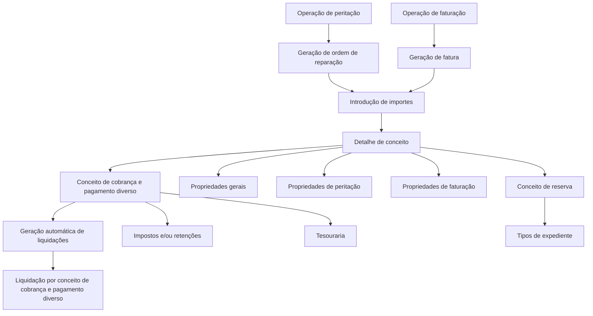

# Definição de Detalhes de Conceitos para Peritações e Faturação

## 1. Metadados do Documento
- **Arquivo de Origem:** Não identificado — conteúdo bruto fornecido pelo usuário.
- **Tipo de Documento:** Especificação Técnica.
- **Domínio / Sistema:** Peritações, ordens de reparação, faturação, tesouraria e liquidações.
- **Público-Alvo:** Desenvolvedores, analistas funcionais, operação e negócio.
- **Data/Versão Identificada:** Não identificada.

---

## 2. Resumo Executivo & Contexto de Negócio

O documento define o detalhe de conceitos utilizado em dois contextos operacionais: geração de ordens de reparação associadas a peritações e operações de faturação. O detalhe de conceito é o elemento ao qual são associados os importes informados durante a geração de uma ordem de reparação ou de uma fatura.

Cada detalhe de conceito é associado a um conceito de cobrança e pagamento diverso. Essa associação permite a geração automática de liquidações: as liquidações são produzidas por conceito de cobrança e pagamento diverso, consolidando a soma dos conceitos de detalhe relacionados.

A definição possui propriedades gerais, propriedades exclusivas de peritações e propriedades exclusivas de faturação. As propriedades gerais estabelecem identificação, ordenação, habilitação, setor, conceito de reserva e associação aos conceitos de cobrança e pagamento diverso.

No processo de peritações, existem propriedades para cálculo inicial e validação do valor máximo de um detalhe de conceito. No processo de faturação, existem propriedades para controle de ocorrências, exigência de valor faturado e lógicas de negócio executadas antes e depois do importe.

---

## 3. Arquitetura, Componentes & Tecnologias Envolvidas

Os componentes funcionais identificados são:

- **Detalhe de conceito:** Entidade associada aos importes inseridos em ordens de reparação ou faturas.
- **Conceito de cobrança e pagamento diverso:** Detalhe pelo qual o beneficiário de uma liquidação receberá pagamento.
- **Liquidação:** Processo gerado automaticamente por conceito de cobrança e pagamento diverso, somando os conceitos de detalhe.
- **Ordem de reparação:** Operação de peritação afetada pelas propriedades específicas de peritações.
- **Faturação:** Operação afetada pelas propriedades específicas de faturação.
- **Tesouraria:** Área na qual são definidos os conceitos utilizáveis em sinistros.
- **Impostos e/ou retenções:** Elementos associados aos conceitos de cobrança e pagamento diverso.
- **Tipos de expediente:** Tipos aos quais conceitos de reserva e conceitos de cobrança e pagamento diverso podem ser associados.
- **Setor:** Chave usada para identificar o setor dos expedientes relacionados aos detalhes de conceito de peritações.



> **Nota de Análise:** O documento não informa tecnologias de implementação, APIs, métodos HTTP, contratos JSON, bancos de dados, URLs, servidores, ambientes ou versões de software.

---

## 4. Regras de Negócio, Especificações Funcionais & Processos

### 4.1. Geração de ordens de reparação e faturas

1. Ao gerar uma ordem de reparação de peritação ou uma fatura, são introduzidos importes.
2. Os importes são introduzidos associados a detalhes de conceito.
3. Os detalhes de conceito são associados a conceitos de cobrança e pagamento diverso.
4. A associação entre detalhes de conceito e conceitos de cobrança e pagamento diverso permite gerar liquidações automaticamente.
5. As liquidações são geradas por conceito de cobrança e pagamento diverso.
6. Cada liquidação soma todos os conceitos de detalhe associados ao respectivo conceito de cobrança e pagamento diverso.

### 4.2. Regras gerais do detalhe de conceito

- O **Setor** indica a chave do setor ao qual pertencem os expedientes aos quais serão associados os detalhes de conceito para peritações.
- O **Conceito de reserva** é a chave do conceito de reserva ao qual serão associados os diferentes detalhes de conceito.
- Os conceitos de reserva devem estar definidos no nível de companhia.
- Os conceitos de reserva devem estar associados aos tipos de expediente que terão peritações ou que trabalharão com faturação.
- O **Código do Conceito de Detalhe** contém a chave do conceito de detalhe económico das peritações.
- O **Nome Detalhe do Conceito de Cobrança e Pagamento** contém o nome do conceito de detalhe económico das peritações.
- A **Descrição** contém uma descrição do conceito de detalhe.
- O **Número de Ordem** define a ordenação dos detalhes de conceito na tela.
- A propriedade **Inabilitado** informa se a definição está habilitada para uso.

### 4.3. Regras específicas para peritações

- As propriedades de peritação afetam exclusivamente as operações de ordens de reparação das peritações.
- O **Importe Inicial de las peritaciones** contém a lógica de negócio que calcula inicialmente o valor do detalhe de conceito.
- O **Importe Máximo peritaciones** contém a lógica de negócio que valida o valor máximo do detalhe de conceito.

### 4.4. Regras específicas para faturação

- As propriedades de faturação afetam exclusivamente as operações de faturação.
- **Ocurrencias Facturación** define se, na faturação, é necessário solicitar ocorrências ou número.
  - Exemplo apresentado: para medicamentos, pode ser solicitado um número.
  - Exemplo apresentado: para anestesia, pode não ser solicitado um número.
- **Se pide importe facturado?** determina se o detalhe definido exige o valor da fatura.
  - Exemplo apresentado: conceitos de ajuste ou dedutível não são detalhes refletidos na fatura.
  - Para conceitos de ajuste ou dedutível, deve ser definido que o valor faturado não é solicitado.
- **Lógica de Negocio Antes del importe** contém a lógica de negócio que calcula o valor a liquidar.
- **Lógica de Negocio después del importe** contém a lógica de negócio que calcula o valor a pagar.

### 4.5. Regras sobre conceito de cobrança e pagamento diverso

- O conceito de cobrança e pagamento diverso representa o detalhe pelo qual o beneficiário da liquidação será pago.
- Os conceitos que podem ser utilizados em sinistros são definidos na tesouraria.
- Impostos e/ou retenções também são associados aos conceitos de cobrança e pagamento diverso.
- A solicitação de impostos e/ou retenções depende:
  1. Do conceito de cobrança e pagamento diverso;
  2. Do documento que está sendo pago;
  3. Do destinatário do pagamento.
- Um conceito de cobrança e pagamento diverso pode ser associado de **1 a n tipos de expediente**.

---

## 5. Tabelas de Parâmetros, Ambientes e Estruturas de Dados

| Item / Parâmetro | Descrição / Função | Tipo / Valores / Formato | Ambiente / Observações |
| :--- | :--- | :--- | :--- |
| Setor | Indica a chave do setor dos expedientes aos quais serão associados os detalhes de conceito para peritações. | Chave de setor. | Propriedade geral. |
| Conceito de reserva | Chave do conceito de reserva ao qual são associados os diferentes detalhes de conceito. | Chave de conceito de reserva. | Deve estar definido no nível de companhia e associado a tipos de expediente com peritações ou faturação. |
| Conceito de cobrança e pagamento diverso | Define o detalhe pelo qual o beneficiário da liquidação recebe pagamento. | Conceito associado ao detalhe de conceito. | Conceitos utilizáveis em sinistros são definidos na tesouraria. Pode ter impostos e/ou retenções associados. |
| Código do Conceito de Detalhe | Contém a chave do conceito de detalhe económico das peritações. | Código ou chave. | Propriedade geral. |
| Nome Detalhe do Conceito de Cobrança e Pagamento | Contém o nome do conceito de detalhe económico das peritações. | Nome. | Propriedade geral. |
| Descrição | Contém a descrição do conceito de detalhe. | Texto descritivo. | Propriedade geral. |
| Número de Ordem | Define como os detalhes de conceito serão ordenados na tela. | Número de ordenação. | Propriedade geral. |
| Inabilitado | Informa se uma definição está habilitada para uso. | Indicador de habilitação. | Propriedade geral. |
| Importe Inicial de las peritaciones | Contém a lógica de negócio para calcular inicialmente o valor do detalhe de conceito. | Lógica de negócio. | Afeta exclusivamente ordens de reparação de peritações. |
| Importe Máximo peritaciones | Contém a lógica de negócio para validar o valor máximo do detalhe de conceito. | Lógica de negócio. | Afeta exclusivamente ordens de reparação de peritações. |
| Ocurrencias Facturación | Indica se a faturação solicita ocorrências ou número. | Indicador de solicitação de ocorrências/número. | Afeta exclusivamente operações de faturação. Medicamentos e anestesia são exemplos mencionados. |
| Se pide importe facturado? | Indica se o detalhe exige a informação do valor faturado. | Indicador de solicitação de valor faturado. | Afeta exclusivamente operações de faturação. Ajuste e dedutível são exemplos que não exigem valor faturado. |
| Lógica de Negocio Antes del importe | Contém a lógica de negócio para calcular o valor a liquidar. | Lógica de negócio. | Afeta exclusivamente operações de faturação. |
| Lógica de Negocio después del importe | Contém a lógica de negócio para calcular o valor a pagar. | Lógica de negócio. | Afeta exclusivamente operações de faturação. |
| Impostos e/ou retenções | Elementos associados ao conceito de cobrança e pagamento diverso. | Impostos e retenções. | Solicitados conforme conceito de cobrança e pagamento diverso, documento pago e destinatário do pagamento. |
| Tipos de expediente | Tipos aos quais conceitos podem ser associados. | Relação de associação. | Um conceito de cobrança e pagamento diverso pode ser atribuído de 1 a n tipos de expediente. |

---

## 6. Bateria de Perguntas & Respostas para RAG (FAQ Sintético)

### P1: Qual é a finalidade do detalhe de conceitos nas peritações e na faturação?
**R:** O detalhe de conceitos define aquilo pelo qual será realizado um pagamento durante a geração de ordens de reparação de peritações ou em operações de faturação. Os importes são inseridos associados a detalhes de conceito, que por sua vez são associados a conceitos de cobrança e pagamento diverso.

### P2: Como são geradas as liquidações no processo descrito?
**R:** As liquidações são geradas automaticamente por conceito de cobrança e pagamento diverso. Cada liquidação soma todos os conceitos de detalhe associados ao respectivo conceito de cobrança e pagamento diverso.

### P3: O que representa um conceito de cobrança e pagamento diverso?
**R:** Um conceito de cobrança e pagamento diverso representa o detalhe pelo qual será pago o beneficiário de uma liquidação. Para sinistros, os conceitos utilizáveis são definidos na tesouraria.

### P4: Quais fatores determinam a solicitação de impostos e retenções?
**R:** Impostos e/ou retenções são solicitados em função do conceito de cobrança e pagamento diverso, do documento que está sendo pago e de quem receberá o pagamento.

### P5: Para que serve a propriedade Setor?
**R:** A propriedade Setor indica a chave do setor ao qual pertencem os expedientes aos quais serão associados os detalhes de conceito para peritações.

### P6: Qual é a restrição aplicável ao conceito de reserva?
**R:** O conceito de reserva deve estar definido no nível de companhia e associado aos tipos de expediente que terão peritações ou que trabalharão com faturação.

### P7: Como o valor inicial de um detalhe de conceito é calculado em peritações?
**R:** O valor inicial é calculado pela lógica de negócio armazenada na propriedade **Importe Inicial de las peritaciones**. Essa propriedade afeta exclusivamente operações de ordens de reparação de peritações.

### P8: Como é validado o valor máximo de um detalhe de conceito em peritações?
**R:** O valor máximo é validado pela lógica de negócio armazenada na propriedade **Importe Máximo peritaciones**, aplicável exclusivamente às operações de ordens de reparação de peritações.

### P9: Quando a faturação deve solicitar ocorrências ou número?
**R:** A propriedade **Ocurrencias Facturación** indica se a faturação deve solicitar ocorrências ou número. O documento exemplifica que medicamentos podem exigir número, enquanto anestesia pode não exigir.

### P10: Em quais casos o importe faturado não deve ser solicitado?
**R:** O valor faturado não deve ser solicitado quando o detalhe definido não será refletido na fatura. O documento cita os conceitos de ajuste e de dedutível como exemplos desse caso.

### P11: Qual é a diferença entre a lógica de negócio antes e depois do importe na faturação?
**R:** A **Lógica de Negocio Antes del importe** calcula o valor a liquidar. A **Lógica de Negocio después del importe** calcula o valor a pagar.

### P12: Um conceito de cobrança e pagamento diverso pode estar associado a mais de um tipo de expediente?
**R:** Sim. O documento estabelece que conceitos de cobrança e pagamento diverso podem ser atribuídos de 1 a n tipos de expediente.

---

## 7. Glossário de Termos, Siglas & Conceitos-Chave

- **Conceito de detalhe:** Elemento económico ao qual são associados importes em ordens de reparação ou faturas.
- **Conceito de reserva:** Chave de conceito à qual diferentes detalhes de conceito são associados.
- **Conceito de cobrança e pagamento diverso:** Detalhe pelo qual o beneficiário de uma liquidação recebe pagamento.
- **Detalhe económico:** Conceito de detalhe económico citado para peritações.
- **Expediente:** Entidade ou tipo de expediente associado a setores, conceitos de reserva e conceitos de cobrança e pagamento diverso.
- **Faturação:** Operação para a qual existem propriedades específicas de ocorrência, importe faturado e lógicas de negócio.
- **Importe:** Valor inserido, calculado, liquidado ou pago conforme as propriedades aplicáveis.
- **Liquidação:** Resultado gerado automaticamente por conceito de cobrança e pagamento diverso, somando conceitos de detalhe associados.
- **Ordem de reparação:** Operação de peritação afetada pelas propriedades específicas de peritações.
- **Peritação:** Contexto de operação associado a ordens de reparação e detalhes económicos.
- **Tesouraria:** Área em que são definidos os conceitos utilizáveis em sinistros.

---

## 8. Notas Críticas, Riscos & Limitações

- O documento não detalha as fórmulas, regras condicionais ou implementação técnica das lógicas de negócio para cálculo inicial, validação do importe máximo, cálculo a liquidar ou cálculo a pagar.
- O documento não especifica métodos HTTP, contratos de integração, APIs, tecnologias, sistemas de persistência, ambientes, URLs, portas ou mecanismos de autenticação.
- O documento menciona impostos e/ou retenções, mas não descreve tipos de imposto, regras fiscais, alíquotas ou critérios de cálculo.
- O documento informa que conceitos utilizáveis em sinistros são definidos na tesouraria, mas não detalha o processo de definição, aprovação ou manutenção desses conceitos.
- O documento estabelece associação de 1 a n entre conceito de cobrança e pagamento diverso e tipos de expediente, mas não especifica validações adicionais para essa associação.
- **Nota de Análise:** O documento lista propriedades funcionais, mas não detalha o modelo de dados, obrigatoriedade de campos, valores permitidos ou comportamento de erro para cada propriedade.

---

## 9. Conteúdo Bruto Estruturado (Referência Fiel)

```text
--- [PÁGINA 1 DE 3] ---

Definición Detalle de Conceptos Peritaciones/
Facturación
Objetivo
La finalidad es definir para la generación de órdenes de reparación (de las peritaciones) o para las
operaciones de la facturación, el detalle por lo que se va a pagar.
A la hora de generar una orden de reparación o de generar una factura, se van introducir importes.
Los importes se van a introducir asociado a lo que llamamos detalle de conceptos. Estos a su vez,
estarán asociados a Conceptos de Cobro y Pago Vario. Esta unión nos va a dar la posibilidad de
generar las liquidaciones automáticamente. Las liquidaciones se generarán por concepto de cobro y
pago vario, sumando todos los conceptos de detalle.
Propiedades Generales
Propiedades Peritación
Propiedades Facturación
Propiedades Generales
Sector
Esta propiedad indica la clave del Sector al que pertenecen los de expedientes, a los que se les va a
asociar los conceptos de detalle para las peritaciones.
Ejemplo:
 /
 CF
Home Solutions APIs Documentation Zeus
EN


--- [PÁGINA 2 DE 3] ---

Concepto de reserva
Esta propiedad será la clave de Concepto de reserva a la que se le van a asociar los distintos
conceptos de detalle. Estos conceptos tienen que estar definidos a nivel de compañía y asociado a
los tipos de expediente que van a tener peritaciones o que van a trabajar con facturación.
Concepto de Cobro y Pago Vario
Los conceptos de cobro y pago vario son el detalle por el que se le va a pagar al beneficiario de la
liquidación. Los conceptos que se pueden utilizar en siniestros, se definen en tesorería. A estos
conceptos de cobro y pago vario, también se le asocian los impuestos y/o retenciones. Los
impuestos y/o retenciones se van a pedir en función del concepto de cobro y pago vario, en función
del documento que se esté pagando y en función de a quién se le esté pagando.
Código del Concepto de Detalle
Esta propiedad contendrá la clave del concepto de detalle económico de las peritaciones.
Nombre Detalle del Concepto de Cobro y Pago
Esta propiedad contendrá el nombre del concepto de detalle económico de las peritaciones.
Descripción
Esta propiedad contendrá una descripcion del concepto de detalle.
Número de Orden
Esta propiedad indicará como se ordenarán los conceptos de detalle en la pantalla.
Inhabilitado
Esta propiedad indica si la definición está o no habilitada para ser utilizado.
Propiedades Peritación
Estas propiedades sólo afecta a las operaciones de órdenes de reparación, de las peritaciones.
Importe Inicial de las peritaciones
Esta propiedad contendrá la lógica de negocio que calculará inicialmente el importe del concepto de
detalle.
Importe Máximo peritaciones


--- [PÁGINA 3 DE 3] ---

Esta propiedad contendrá la lógica de negocio que validará el importe máximo del concepto de
detalle.
Propiedades Facturación
Estas propiedades sólo afecta a las operaciones de facturación.
Ocurrencias Facturación
Esta propiedad indica si en la facturación se pide ocurrencias, número, por ejemplo si el detalle es
medicinas se puede pedir número, pero si es anestesia no.
Se pide importe facturado?
Esta propiedad indica si en el detalle que se está definiendo se pide importe de la factura o no, por
ejemplo si tenemos un concepto de ajuste o de deducible no son detalles que vayan a estar
reflejados en la factura, por lo que en estos detalles se pondrá que no se pide importe facturado.
Lógica de Negocio Antes del importe
Esta propiedad contendrá la lógica de negocio que calculará el importe a liquidar
Lógica de Negocio después del importe
Esta propiedad contendrá la lógica de negocio que calculará el importe a pagar.
Preguntas frecuentes
¿Un concepto de cobro y pago vario puede estar definido en varios tipos de expediente.?
R/ Si los conceptos de cobro y pago vario pueden asignarse de 1 a n tipos de expedientes.
```
