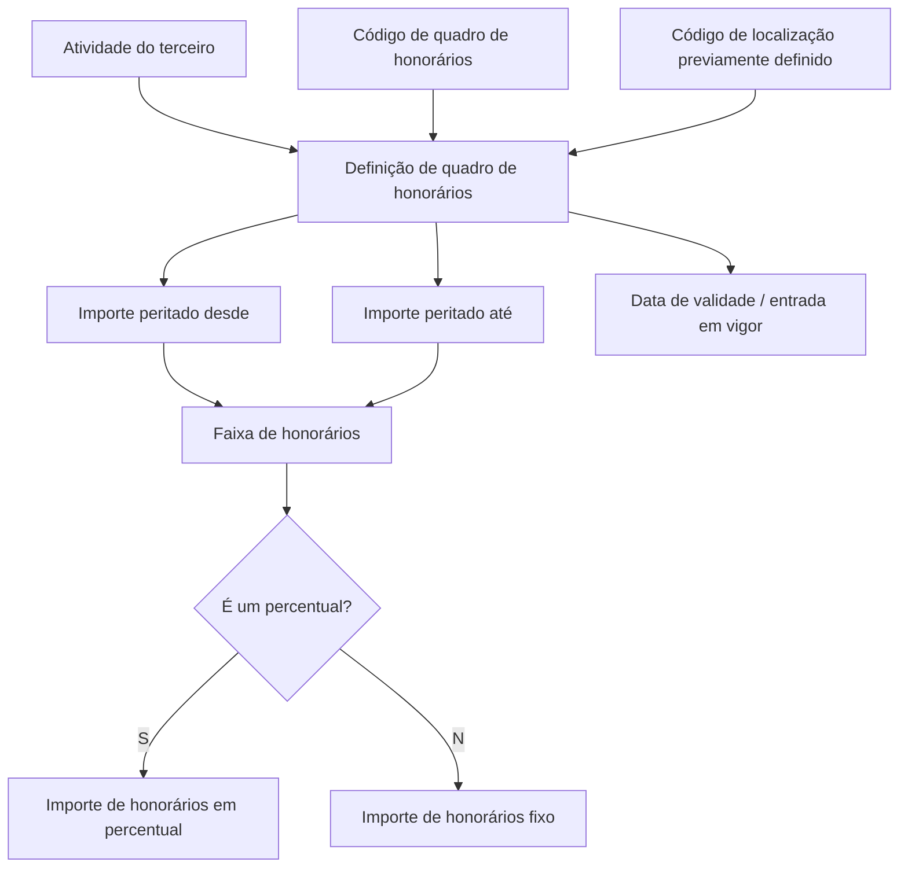

# Definição de Quadro de Honorários para Peritos ou Inspetores

## 1. Metadados do Documento
- **Arquivo de Origem:** Não identificado
- **Tipo de Documento:** Especificação Técnica
- **Domínio / Sistema:** Home Solutions APIs Documentation Zeus
- **Público-Alvo:** Negócio, analistas funcionais e desenvolvedores
- **Data/Versão Identificada:** Não identificada

---

## 2. Resumo Executivo & Contexto de Negócio

O documento define as propriedades necessárias para configurar um quadro de honorários destinado a peritos ou inspetores. O objetivo declarado é identificar quais atributos das perícias devem ser utilizados para estabelecer a remuneração desses terceiros.

A configuração de honorários associa a atividade de um terceiro a um código de quadro de honorários e a uma localização previamente definida. Dessa forma, a definição considera simultaneamente o tipo de atividade executada e a área geográfica ou chave de localização na qual uma perícia pode ocorrer.

O modelo de remuneração é estruturado por faixas de valor peritado. Cada faixa possui um limite inicial e um limite final, além de uma indicação que determina se o valor de honorários será tratado como percentual ou como valor fixo.

A vigência da definição é controlada por uma data de validade, caracterizada como a data de entrada em vigor da configuração. O documento não detalha mecanismos de versionamento, sobreposição de faixas, validação de lacunas entre faixas ou contratos de API.

---

## 3. Arquitetura, Componentes & Tecnologias Envolvidas

O conteúdo cita o contexto **Home Solutions APIs Documentation Zeus** e uma referência à definição de locais de perícia (`DEFINIR-Lugares-Peritacion.md`). Não há detalhamento de arquitetura de software, serviços, métodos HTTP, contratos JSON, tecnologias de implementação, ambientes ou integrações técnicas.

O processo funcional identificável relaciona a definição de honorários aos seguintes elementos:

- Atividade do terceiro.
- Código do quadro de honorários.
- Código de localização.
- Faixa de importe peritado.
- Modalidade de cálculo: percentual ou importe fixo.
- Valor de honorários.
- Data de validade.



> **Nota de Análise:** O documento não detalha componentes técnicos, endpoints, persistência de dados, regras de prioridade entre definições, nem métodos de consulta ou manutenção do quadro de honorários.

---

## 4. Regras de Negócio, Especificações Funcionais & Processos

1. A finalidade da definição é estabelecer um quadro de honorários para peritos ou inspetores.
2. A configuração deve identificar a **atividade do terceiro** para a qual será definido o quadro de honorários.
3. A definição deve conter o **código do quadro de honorários** que está sendo configurado.
4. A definição deve conter um **código de localização**, isto é, uma chave de localização onde uma perícia pode ser realizada.
5. Os locais ou localizações utilizados pelo código de localização devem estar previamente definidos.
6. O atributo **Importe peritado desde** determina o valor inicial a partir do qual uma faixa de honorários será constituída.
7. O atributo **Importe peritado até** determina o valor final até o qual uma faixa de honorários será constituída.
8. O atributo **É um percentual?** determina a natureza do valor informado em **Importe de Honorários**.
9. Quando **É um percentual?** possuir o valor `S`, o campo **Importe de Honorários** deve conter um percentual.
10. Quando **É um percentual?** possuir o valor `N`, o campo **Importe de Honorários** deve conter um importe fixo de honorários.
11. A **Data de validade** representa a data de entrada em vigor da definição.

> **Nota de Análise:** O documento não informa os formatos aceitos para valores monetários, percentuais, datas, códigos de atividade, códigos de localização ou códigos de quadro de honorários. Também não define o comportamento para limites coincidentes, faixas sobrepostas, faixas sem cobertura ou valores de entrada fora das faixas configuradas.

---

## 5. Tabelas de Parâmetros, Ambientes e Estruturas de Dados

| Item / Parâmetro | Descrição / Função | Tipo / Valores / Formato | Ambiente / Observações |
| :--- | :--- | :--- | :--- |
| Atividade do terceiro | Contém a atividade do terceiro para a qual será definido um quadro de honorários. | Não especificado. | Associada à definição do quadro de honorários. |
| Quadro de honorários | Contém o código do quadro de honorários que está sendo definido. | Código não especificado. | Não há regras de unicidade ou versionamento descritas. |
| Código de localização | Contém a chave de localização onde uma perícia pode ser realizada. | Chave ou código não especificado. | Os locais devem estar definidos previamente. |
| Importe peritado desde | Define o valor inicial a partir do qual é constituída uma faixa de honorários. | Valor de importe não especificado. | Representa o limite inferior da faixa. |
| Importe peritado até | Define o valor final até o qual é constituída uma faixa de honorários. | Valor de importe não especificado. | Representa o limite superior da faixa. |
| É um percentual? | Indica se o valor de honorários será percentual ou importe fixo. | `S` ou `N`. | `S` indica percentual; `N` indica importe fixo. |
| Importe de Honorários | Contém o valor de honorários aplicável à faixa configurada. | Percentual quando o indicador for `S`; importe fixo quando for `N`. | A semântica depende do campo **É um percentual?**. |
| Data de validade | Define a data de entrada em vigor da definição. | Data; formato não especificado. | Não há data de fim de vigência descrita. |
| Referência de localização | Referência documental para a definição de locais de perícia. | `[ubicacion]:<./DEFINIR-Lugares-Peritacion.md#titulo>` | O conteúdo do documento referenciado não foi disponibilizado. |

---

## 6. Bateria de Perguntas & Respostas para RAG (FAQ Sintético)

### P1: Qual é o objetivo da definição de quadro de honorários?
**R:** O objetivo é identificar quais propriedades das perícias são necessárias para definir um quadro de honorários aplicável a peritos ou inspetores.

### P2: Qual atributo identifica a atividade para a qual o quadro de honorários será definido?
**R:** O atributo **Atividade do terceiro** contém a atividade do terceiro para a qual será definido o quadro de honorários.

### P3: O que representa o campo Quadro de honorários?
**R:** O campo **Quadro de honorários** contém o código do quadro de honorários que está sendo definido.

### P4: Para que serve o Código de localização na definição de honorários?
**R:** O **Código de localização** contém a chave da localização onde uma perícia pode ser realizada. Os locais ou localizações utilizados devem estar previamente definidos.

### P5: Como é definida uma faixa de honorários?
**R:** Uma faixa de honorários é delimitada pelos campos **Importe peritado desde**, que estabelece o valor inicial, e **Importe peritado até**, que estabelece o valor final da faixa.

### P6: Como o sistema determina se o importe de honorários é percentual ou fixo?
**R:** O campo **É um percentual?** determina a modalidade. Quando possui `S`, o campo **Importe de Honorários** deve conter um percentual. Quando possui `N`, o campo deve conter um importe fixo de honorários.

### P7: O que deve ser informado em Importe de Honorários quando É um percentual? possui S?
**R:** Quando **É um percentual?** possui o valor `S`, o campo **Importe de Honorários** deve conter um percentual.

### P8: O que deve ser informado em Importe de Honorários quando É um percentual? possui N?
**R:** Quando **É um percentual?** possui o valor `N`, o campo **Importe de Honorários** deve conter um importe fixo de honorários.

### P9: Qual é a finalidade da Data de validade?
**R:** A **Data de validade** define a data de entrada em vigor da definição de quadro de honorários.

### P10: O documento define o formato de datas, importes ou percentuais?
**R:** Não. O documento menciona os campos de importe peritado, importe de honorários e data de validade, mas não especifica formatos, precisão decimal, moeda, máscara de data ou limites válidos.

---

## 7. Glossário de Termos, Siglas & Conceitos-Chave

- **Atividade do terceiro:** Atividade exercida pelo terceiro para a qual se define um quadro de honorários.
- **Código de localização:** Chave de localização onde uma perícia pode ser realizada.
- **Data de validade:** Data de entrada em vigor de uma definição.
- **Home Solutions APIs Documentation Zeus:** Identificação textual presente no documento; não há detalhamento adicional sobre a plataforma ou sistema.
- **Importe de Honorários:** Valor de honorários que pode representar um percentual ou um importe fixo, conforme o indicador aplicável.
- **Importe peritado:** Valor associado à perícia, usado para delimitar a faixa de honorários.
- **Peritagem / perícia:** Atividade para a qual o documento define critérios de localização e honorários.
- **Perito ou inspetor:** Profissional ou terceiro ao qual o quadro de honorários se aplica.
- **Quadro de honorários:** Configuração identificada por código, associada a atividade, localização, faixa de importe peritado e modalidade de remuneração.
- **S:** Valor do indicador **É um percentual?** que determina que o importe de honorários é um percentual.
- **N:** Valor do indicador **É um percentual?** que determina que o importe de honorários é um importe fixo.

---

## 8. Notas Críticas, Riscos & Limitações

- O documento não identifica o nome do arquivo de origem, data, versão ou autor.
- Não há especificação de API, métodos HTTP, payloads, códigos de erro ou contratos de integração.
- Não são detalhados formatos de dados, moeda, precisão de valores, arredondamento ou convenções de percentual.
- O documento não define regras para faixas de importe peritado sobrepostas, contíguas, ausentes ou inválidas.
- Não há regra explícita para o caso de uma perícia possuir valor exatamente igual aos limites inferior ou superior de uma faixa.
- A configuração depende de locais previamente definidos, mas a estrutura e a governança desses locais estão apenas referenciadas em documento externo.
- Não há detalhamento sobre encerramento de vigência, alteração retroativa ou coexistência de múltiplas definições válidas.
- Não há informação sobre autenticação, autorização, auditoria ou responsáveis pela manutenção das definições.

---

## 9. Conteúdo Bruto Estruturado (Referência Fiel)

```text
--- [PÁGINA 1 DE 2] ---

DEFINICIÓN de Honorarios de profesionales
Objetivo
La finalidad de este documento es conocer qué propiedades de las peritaciones son necesarias para
definir cuadro de honorarios para peritos o inspectores.
Propiedades Generales
Propiedades
Actividad del tercero
Esta propiedad contendrá la actividad del tercero, a la que se le va definir un cuadro de honorarios.
Cuadro de honorarios
Esta propiedad contiene el código del cuadro de honorarios que se está definiendo.
Código de ubicación
Esta propiedad contiene la clave de ubicación donde se pueden realizar una peritación. Los [lugares]
[ubicacion] tienen que estar definidos previamente.
Importe peritado desde
Este atributo contiene desde que importe peritado se va a constituir el tramo de honorarios.
 /
 CF
Home Solutions APIs Documentation Zeus
EN


--- [PÁGINA 2 DE 2] ---

Importe peritado hasta
Esta propiedad indica hasta que importe peritado se va a constituir el tramo de honorarios.
Es un porcentaje?
Se indicará en esta propiedad si el importe que se va a introducir en la propiedad siguiente es un
porcentaje o un importe fijo.
Importe de Honorarios
Si en la anterior propiedad contiene una S, aquí irá un porcentaje, si la propiedad anterior contiene
una 'N', esta propiedad contendrá un importe fijo de honorarios.
Fecha de validez
Fecha de entrada en vigor de esta definición.
[ubicacion]:<./DEFINIR-Lugares-Peritacion.md#titulo >
Ejemplo:
```
