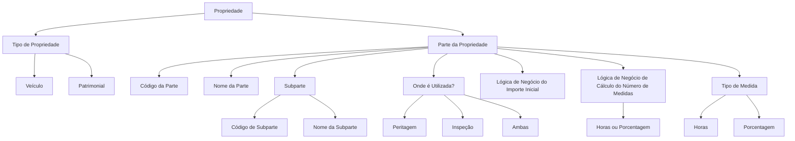

# Definição de Partes da Propriedade para Peritagem e Inspeção

## 1. Metadados do Documento
- **Arquivo de Origem:** `Não identificado`
- **Tipo de Documento:** `Especificação Técnica`
- **Domínio / Sistema:** `Definição de Partes da Propriedade`
- **Público-Alvo:** `Negócio, Analistas Funcionais, Desenvolvedores e Operação`
- **Data/Versão Identificada:** `Não identificada`

---

## 2. Resumo Executivo & Contexto de Negócio

O documento define os atributos necessários para cadastrar e caracterizar partes de uma propriedade que podem ser objeto de peritagem. A finalidade declarada é determinar, para cada tipo de propriedade, quais partes podem ser peritadas.

A estrutura cobre propriedades dos tipos **Veículo** e **Patrimonial**. Para cada parte cadastrada, o documento descreve identificadores, nome, possível subdivisão em subpartes e a aplicabilidade da parte nos processos de peritagem e/ou inspeção.

O material também estabelece atributos associados à lógica de negócio do importe inicial e ao cálculo do número de medidas. O tipo de medida usado para reparação pode ser expresso em **Horas** ou **Porcentagem**.

O documento apresenta definições funcionais dos campos, mas não especifica contratos de API, persistência de dados, regras de cálculo detalhadas, fórmulas de importe inicial, fluxos de aprovação ou responsabilidades por sistema. A referência textual a “Home Solutions APIs Documentation Zeus” aparece no conteúdo extraído, sem detalhamento adicional sobre a sua relação com a definição das partes da propriedade.

---

## 3. Arquitetura, Componentes & Tecnologias Envolvidas

O documento não descreve uma arquitetura tecnológica, servidores, protocolos, bancos de dados, endpoints, microsserviços ou ambientes. O conteúdo apresenta uma estrutura funcional de cadastro e uso de partes de propriedades.

Os elementos funcionais identificados são:

- **Propriedade:** entidade para a qual são definidas partes passíveis de peritagem.
- **Tipo de Propriedade:** classifica a propriedade a peritar como **Veículo** ou **Patrimonial**.
- **Parte da Propriedade:** elemento identificado por código e nome.
- **Subparte:** divisão de uma parte da propriedade; por exemplo, a parte dianteira pode ser dividida em capô e para-choques.
- **Processos de Uso:** peritagem, inspeção ou ambos.
- **Lógica de Negócio do Importe Inicial:** lógica que devolve o importe inicial.
- **Lógica de Negócio para Cálculo do Número de Medidas:** lógica que obtém o número de horas ou a porcentagem.
- **Tipo de Medida:** unidade aplicada à reparação, com valores Horas ou Porcentagem.



> **Nota de Análise:** O documento não detalha a implementação, os critérios de seleção ou os contratos das lógicas de negócio de importe inicial e cálculo do número de medidas.

---

## 4. Regras de Negócio, Especificações Funcionais & Processos

1. Para cada tipo de propriedade, devem ser definidas as partes que podem ser peritadas.
2. O atributo **Tipo de Propriedade a peritar** indica para qual tipo de propriedade serão definidas as possíveis partes a peritar.
3. Os tipos de propriedade explicitamente apresentados são:
   - Veículo.
   - Patrimonial.
4. Cada parte da propriedade deve possuir um **Código da Parte**, que contém a chave da parte a peritar.
5. Cada parte da propriedade deve possuir um **Nome da Parte**, que contém a descrição da parte a peritar.
6. Uma parte de propriedade pode possuir uma divisão identificada como **Subparte**.
7. O **Código de Subparte** contém a divisão de uma parte de uma propriedade.
8. O **Nome de Subparte** contém o nome da divisão de uma parte de uma propriedade.
9. O documento exemplifica que uma parte dianteira pode ser subdividida em elementos como capô e para-choques.
10. O atributo **Onde é Utilizada?** indica se a parte da propriedade é usada em inspeções de emissão, peritagens de sinistros ou ambos os processos.
11. Os valores de utilização apresentados são:
    - **Peritagem:** a parte é utilizada em peritagens realizadas a partir de sinistros.
    - **Inspeção:** a parte é utilizada em inspeções realizadas a partir de emissão.
    - **Ambas:** a parte é utilizada tanto em peritagens quanto em inspeções.
12. A **Lógica de Negócio do Importe Inicial** é descrita como a lógica que devolve o importe inicial.
13. A **Lógica de Negócio para Cálculo do Número de Medidas** é descrita como a lógica que obtém o número de horas ou a porcentagem.
14. O **Tipo de Medida** indica como será medida a reparação da parte.
15. Os tipos de medida apresentados são:
    - **Horas:** número de horas.
    - **Porcentagem:** porcentagem.

---

## 5. Tabelas de Parâmetros, Ambientes e Estruturas de Dados

| Item / Parâmetro | Descrição / Função | Tipo / Valores / Formato | Ambiente / Observações |
| :--- | :--- | :--- | :--- |
| Tipo de Propriedade a peritar | Indica o tipo de propriedade para o qual serão definidas as possíveis partes a peritar. | Veículo; Patrimonial. | Não são detalhados outros tipos de propriedade. |
| Código da Parte | Contém a chave da parte a peritar. | Código / chave. | Formato não especificado. |
| Nome da Parte | Contém a descrição da parte a peritar. | Texto descritivo. | Não há tamanho, idioma ou obrigatoriedade especificados. |
| Código de Subparte | Contém a divisão de uma parte de uma propriedade. | Código / chave. | A subparte representa uma divisão de parte da propriedade. |
| Nome de Subparte | Contém o nome da divisão de uma parte de uma propriedade. | Texto descritivo. | Exemplo citado: divisão da parte dianteira em capô e para-choques. |
| Onde é Utilizada? | Indica se a parte da propriedade é utilizada em inspeções de emissão, peritagens de sinistros ou ambos. | Peritagem; Inspeção; Ambas. | Define a aplicabilidade funcional da parte. |
| Peritagem | Indica uso da parte em peritagens realizadas a partir de sinistros. | Valor de utilização. | Associado a sinistros. |
| Inspeção | Indica uso da parte em inspeções realizadas a partir de emissão. | Valor de utilização. | Associado a emissão. |
| Ambas | Indica uso da parte em peritagens e inspeções. | Valor de utilização. | Combina Peritagem e Inspeção. |
| Lógica de Negócio do Importe Inicial | Lógica de negócio que devolve o importe inicial. | Lógica de negócio. | Fórmula, entradas e saídas não especificadas. |
| Lógica de Negócio para Cálculo do Número de Medidas | Lógica de negócio que obtém o número de horas ou a porcentagem. | Lógica de negócio. | Método de cálculo não especificado. |
| Tipo de Medida | Indica em que unidade será medida a reparação da parte. | Horas; Porcentagem. | Aplicável à reparação da parte. |
| Horas | Representa o número de horas. | Medida temporal. | O documento não especifica unidade mínima ou regras de arredondamento. |
| Porcentagem | Representa porcentagem. | Medida percentual. | Base percentual não especificada. |
| Home Solutions APIs Documentation Zeus | Texto de referência presente no conteúdo extraído. | Referência textual. | Não há detalhamento de função, integração ou tecnologia. |

---

## 6. Bateria de Perguntas & Respostas para RAG (FAQ Sintético)

### P1: Qual é a finalidade do documento de definição de partes da propriedade?
**R:** A finalidade do documento é definir, para cada tipo de propriedade, quais partes podem ser peritadas.

### P2: Quais tipos de propriedade podem ser associados a partes passíveis de peritagem?
**R:** O documento apresenta os tipos de propriedade **Veículo** e **Patrimonial** como valores para o atributo “Tipo de Propriedade a peritar”.

### P3: O que representa o atributo “Tipo de Propriedade a peritar”?
**R:** O atributo “Tipo de Propriedade a peritar” indica a qual tipo de propriedade serão definidas as possíveis partes a peritar.

### P4: Qual é a função do código da parte?
**R:** O código da parte contém a chave da parte da propriedade que será peritada. O documento não informa o formato técnico dessa chave.

### P5: Para que serve o nome da parte?
**R:** O nome da parte contém a descrição da parte da propriedade que pode ser peritada.

### P6: O que é uma subparte de uma propriedade?
**R:** Uma subparte é uma divisão de uma parte de uma propriedade. O documento exemplifica que uma parte dianteira pode ser subdividida em capô e para-choques.

### P7: Quais opções existem para indicar onde uma parte da propriedade é utilizada?
**R:** O atributo “Onde é Utilizada?” pode assumir os valores **Peritagem**, **Inspeção** ou **Ambas**. Esses valores indicam se a parte é usada em peritagens de sinistros, inspeções de emissão ou nos dois processos.

### P8: Quando uma parte deve ser marcada como “Peritagem”?
**R:** Uma parte deve ser marcada como “Peritagem” quando for utilizada em peritagens realizadas a partir de sinistros.

### P9: Quando uma parte deve ser marcada como “Inspeção”?
**R:** Uma parte deve ser marcada como “Inspeção” quando for utilizada em inspeções realizadas a partir de emissão.

### P10: O que significa o valor “Ambas” no atributo de utilização?
**R:** O valor “Ambas” indica que a parte da propriedade será utilizada tanto em peritagens quanto em inspeções.

### P11: Qual é a função da lógica de negócio do importe inicial?
**R:** A lógica de negócio do importe inicial é descrita como a lógica responsável por devolver o importe inicial. O documento não apresenta fórmula, critérios ou parâmetros dessa lógica.

### P12: O que calcula a lógica de negócio do número de medidas?
**R:** A lógica de negócio de cálculo do número de medidas obtém o número de horas ou a porcentagem aplicável à parte da propriedade.

### P13: Quais tipos de medida podem ser usados para uma reparação?
**R:** O tipo de medida pode ser **Horas** ou **Porcentagem**. Horas representa o número de horas, enquanto Porcentagem representa uma medida percentual.

---

## 7. Glossário de Termos, Siglas & Conceitos-Chave

- **Ambas:** Valor que indica utilização da parte da propriedade em peritagens e inspeções.
- **Código da Parte:** Chave da parte da propriedade a peritar.
- **Código de Subparte:** Código que contém a divisão de uma parte de uma propriedade.
- **Emissão:** Contexto associado às inspeções mencionadas no documento.
- **Importe Inicial:** Valor devolvido pela lógica de negócio de importe inicial; o método de cálculo não é detalhado.
- **Inspeção:** Processo em que uma parte da propriedade pode ser utilizada, especificamente em inspeções realizadas a partir de emissão.
- **Número de Medidas:** Número de horas ou porcentagem obtido pela lógica de negócio de cálculo de medidas.
- **Parte da Propriedade:** Elemento de uma propriedade que pode ser definido para peritagem.
- **Peritagem:** Processo em que uma parte da propriedade pode ser utilizada, especificamente em peritagens realizadas a partir de sinistros.
- **Propriedade Patrimonial:** Tipo de propriedade listado no documento.
- **Subparte:** Divisão de uma parte de uma propriedade.
- **Tipo de Medida:** Indicação de como será medida a reparação de uma parte, por Horas ou Porcentagem.
- **Veículo:** Tipo de propriedade listado no documento.

---

## 8. Notas Críticas, Riscos & Limitações

- O documento não identifica o arquivo de origem, a data, a versão, o autor ou a área responsável.
- Não há detalhamento de arquitetura de software, integrações, APIs, contratos JSON, métodos HTTP, persistência, autenticação ou ambientes.
- O texto “Home Solutions APIs Documentation Zeus” é apresentado sem explicação sobre seu significado, escopo ou relação com a especificação.
- A lógica de negócio de importe inicial é citada, mas não possui fórmula, entradas, saídas, regras de exceção ou critérios de validação.
- A lógica de negócio para cálculo do número de medidas é citada, mas não descreve como são calculadas horas ou porcentagens.
- Não são especificadas regras de obrigatoriedade, unicidade, formato, tamanho ou validação para códigos e nomes de partes e subpartes.
- Não são apresentados critérios para decidir quando uma parte deve ter subpartes.
- Não são detalhadas regras para coexistência, prioridade ou conflitos entre Peritagem, Inspeção e Ambas.
- Não há definição da base de cálculo, limites, precisão ou arredondamento para valores percentuais.

---

## 9. Conteúdo Bruto Estruturado (Referência Fiel)

```text
--- [PÁGINA 1 DE 3] ---

DEFINICIÓN de Partes de la Propiedad
Objetivo
La finalidad de este documento es definir para cada tipo de propiedad, qué partes se pueden peritar.
Propiedades Generales
Propiedades
Tipo de Propiedad a peritar
Este atributo indica a que tipo de propiedad se le van a definir las posibles partes a peritar
Vehículo
Patrimonial
Código de la parte
Este atributo contiene el clave de la parte a peritar.
Nombre de la parte
Este atributo contiene la descripción de la parte a peritar
código de sub-parte
Este atributo contiene la división de una parte, de una propiedad.
 / 
 CF
Home Solutions APIs Documentation Zeus
EN


--- [PÁGINA 2 DE 3] ---

Nombre sub-parte
Este atributo contiene el nombre de la división de la parte de una propiedad. Si es la parte delantera
se puede sub-dividir en capó, para-golpes... etc
Dónde se utiliza?
Esta propiedad indicará si se utiliza la parte de la propiedad en las inspecciones de emisión, en
peritaciones de siniestros ...
Peritación
Inspección
Ambas
Peritación
Esta Parte se utilizará para las peritaciones realizadas desde siniestros.
Inspección
Esta Parte se utilizará para las inspecciones realizadas desde emisión.
Ambas
Esta Parte se utilizará en peritaciones y en inspecciones
Lógica de Negocio importe inicial
Lógica de Negocio que devuelve el importe inicial.
Lógica de Negocio cálculo de número de medidas
Lógica de Negocio que haya el número de horas o porcentaje.
Tipo de Medida
Indica en qué se va a medir la reparación de la parte
Horas
Porcentaje
Horas
Número de horas


--- [PÁGINA 3 DE 3] ---

Porcentaje
Porcentaje
```
