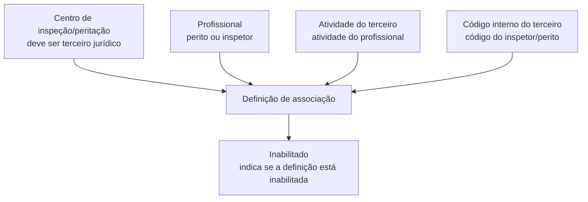

# Definición de Asociación de Profesionales a Centros de Peritación

## 1. Metadados do Documento
- **Arquivo de Origem:** Não identificado
- **Tipo de Documento:** Especificação Técnica
- **Domínio / Sistema:** Associação de peritos/inspetores a centros de inspeção/peritação
- **Público-Alvo:** Desenvolvedores, Analistas Funcionais, Operação
- **Data/Versão Identificada:** Não identificada

---

## 2. Resumo Executivo & Contexto de Negócio

O documento descreve a definição de associação entre profissionais — especificamente peritos e inspetores — e centros de peritação ou inspeção. O objetivo declarado é esclarecer como os profissionais são associados a um centro de peritação.

A associação é composta por propriedades gerais que identificam o centro de inspeção/peritação, a atividade do profissional e o código interno do profissional. O centro selecionado para a associação deve estar previamente cadastrado como um terceiro jurídico.

O documento também prevê uma propriedade de inabilitação. Essa propriedade indica se a definição de associação está inabilitada, permitindo identificar associações que não devem permanecer ativas.

Não há detalhamento de operações de criação, alteração, exclusão, consulta, APIs, métodos HTTP, contratos JSON, persistência, permissões, validações adicionais ou comportamento do sistema após uma definição ser marcada como inabilitada.

---

## 3. Arquitetura, Componentes & Tecnologias Envolvidas

Os elementos funcionais identificados são:

| Componente / Entidade | Papel identificado |
| :--- | :--- |
| Centro de inspeção/peritação | Centro ao qual profissionais são associados. Deve estar cadastrado como terceiro jurídico. |
| Profissional | Perito ou inspetor associado a um centro de inspeção/peritação. |
| Atividade do terceiro | Propriedade que contém a atividade do profissional associado ao centro. |
| Código interno do terceiro | Código interno do inspetor ou perito. |
| Definição de associação | Registro ou definição que pode ser marcada como inabilitada. |
| Home Solutions APIs Documentation Zeus | Texto presente na extração original, sem explicação de relação funcional com o processo. |



> **Nota de Análise:** O documento não detalha uma arquitetura de software, sistemas externos, bancos de dados, APIs, tecnologias, ambientes ou protocolos de integração.

---

## 4. Regras de Negócio, Especificações Funcionais & Processos

1. A finalidade da definição é associar peritos e inspetores a um centro de peritação.
2. A propriedade **Centro de inspeção** contém o centro de inspeção/peritação ao qual os profissionais serão associados.
3. O centro de inspeção/peritação utilizado na associação deve estar previamente cadastrado como um **terceiro jurídico**.
4. A propriedade **Atividade do terceiro** contém a atividade do profissional que será associado ao centro.
5. A propriedade **Código interno do terceiro** corresponde ao código interno do inspetor ou perito.
6. A propriedade **Inhabilitado** indica se a definição de associação está inabilitada.
7. O conteúdo extraído apresenta a indicação “Ejemplo: / CF”, mas não explica o significado, formato ou utilização operacional desse exemplo.

> **Nota de Análise:** O documento não especifica campos obrigatórios, cardinalidade de associações, critérios de unicidade, regras para alteração de centro, consequências funcionais da inabilitação ou fluxo de aprovação.

---

## 5. Tabelas de Parâmetros, Ambientes e Estruturas de Dados

| Item / Parâmetro | Descrição / Função | Tipo / Valores / Formato | Ambiente / Observações |
| :--- | :--- | :--- | :--- |
| Centro de inspeção | Contém o centro de inspeção/peritação ao qual os profissionais serão associados. | Não especificado. | O centro deve estar cadastrado como terceiro jurídico. |
| Atividade do terceiro | Contém a atividade do profissional que será associado ao centro. | Não especificado. | Aplicável ao profissional associado. |
| Código interno do terceiro | Código interno do inspetor ou perito. | Não especificado. | Aplicável ao profissional associado. |
| Inhabilitado | Indica se a definição está inabilitada. | Não especificado. | O documento não define os efeitos operacionais da inabilitação. |
| Exemplo | Texto apresentado como exemplo. | `/` e `CF` | Sem explicação adicional no conteúdo extraído. |
| Home Solutions APIs Documentation Zeus | Texto identificado na extração literal. | Não especificado. | Não há descrição funcional, técnica ou arquitetural associada. |
| Ambiente | Não identificado. | Não identificado. | O documento não informa URLs, servidores, versões ou ambientes. |

---

## 6. Bateria de Perguntas & Respostas para RAG (FAQ Sintético)

### P1: Qual é o objetivo da definição de associação de profissionais a centros de peritação?
**R:** O objetivo é conhecer como peritos e inspetores são associados a um centro de peritação.

### P2: Que tipo de profissional pode ser associado a um centro de peritação?
**R:** O documento menciona profissionais classificados como peritos ou inspetores.

### P3: O que representa a propriedade “Centro de inspeção”?
**R:** A propriedade “Centro de inspeção” contém o centro de inspeção ou peritação ao qual os profissionais serão associados.

### P4: Qual pré-requisito deve ser atendido pelo centro de inspeção/peritação?
**R:** O centro de inspeção/peritação deve estar previamente cadastrado como um terceiro jurídico.

### P5: O que deve ser informado na propriedade “Atividade do terceiro”?
**R:** A propriedade “Atividade do terceiro” deve conter a atividade do profissional que será associado ao centro.

### P6: Qual é a finalidade do “Código interno do terceiro”?
**R:** O “Código interno do terceiro” corresponde ao código interno do inspetor ou perito.

### P7: O que significa a propriedade “Inhabilitado”?
**R:** A propriedade “Inhabilitado” indica se a definição de associação está inabilitada.

### P8: O documento informa quais são os efeitos de inabilitar uma definição de associação?
**R:** Não. O documento apenas afirma que a propriedade indica se a definição está inabilitada, sem detalhar os efeitos funcionais ou operacionais dessa condição.

### P9: O documento define APIs, métodos HTTP ou contratos de integração para a associação?
**R:** Não. O conteúdo não descreve APIs, métodos HTTP, contratos JSON, tecnologias de integração ou fluxos de comunicação entre sistemas.

### P10: O documento especifica o formato do código interno do inspetor ou perito?
**R:** Não. O documento identifica a finalidade do código interno, mas não informa formato, tamanho, obrigatoriedade ou regras de validação.

### P11: O que significa o exemplo “/ CF” apresentado no documento?
**R:** O documento apresenta “Ejemplo: / CF”, porém não fornece contexto suficiente para determinar seu significado, formato ou aplicação na associação.

---

## 7. Glossário de Termos, Siglas & Conceitos-Chave

- **Centro de inspeção/peritação:** Centro ao qual peritos ou inspetores são associados.
- **Perito:** Profissional mencionado como passível de associação a um centro de peritação.
- **Inspetor:** Profissional mencionado como passível de associação a um centro de inspeção/peritação.
- **Terceiro jurídico:** Classificação exigida para que um centro de inspeção/peritação possa ser usado na associação.
- **Atividade do terceiro:** Propriedade que contém a atividade do profissional associado.
- **Código interno do terceiro:** Código interno atribuído ao inspetor ou perito.
- **Inhabilitado:** Propriedade que indica se a definição está inabilitada.
- **CF:** Sigla ou texto presente no exemplo original, sem significado definido no documento.
- **Zeus:** Termo presente em “Home Solutions APIs Documentation Zeus”, sem definição adicional no documento.

---

## 8. Notas Críticas, Riscos & Limitações

- O documento é conciso e não detalha o processo operacional de criação ou manutenção das associações.
- Não há definição de campos obrigatórios, tipos de dados, formatos, regras de validação ou mensagens de erro.
- Não há descrição de comportamento após a inabilitação de uma definição.
- O documento não especifica se um profissional pode estar associado a múltiplos centros de inspeção/peritação.
- Não há informações sobre autenticação, autorização, perfis de acesso, auditoria ou rastreabilidade.
- Não foram identificados ambientes, URLs, servidores, versões, tecnologias ou integrações.
- O texto “Home Solutions APIs Documentation Zeus” está presente na extração, mas sem contexto que permita classificá-lo como sistema, produto, documentação ou dependência.
- O exemplo “/ CF” não possui explicação suficiente para ser convertido em regra funcional.

---

## 9. Conteúdo Bruto Estruturado (Referência Fiel)

```text
--- [PÁGINA 1 DE 2] ---

DEFINICIÓN de Asociación de Profesionales a
Centros de Peritación
Objetivo
La finalidad de este documento es conocer como se asocia los peritos/inspectores a un centro de
peritación.
Propiedades Generales
Propiedades
Centro de inspección
Esta propiedad contiene el centro de inspección/peritación al que se le van a asociar los
profesionales. El centro de inspección tiene que estar dado de alta como un tercero jurídico.
Actividad del tercero
Esta propiedad contendrá la actividad del profesional que se va asociar al centro.
Código interno del tercero
Código interno del inspector/perito.
Ejemplo:
 /
 CF
Home Solutions APIs Documentation Zeus
EN


--- [PÁGINA 2 DE 2] ---

Inhabilitado
Esta propiedad indica si la definición está inhabilitada.
```
