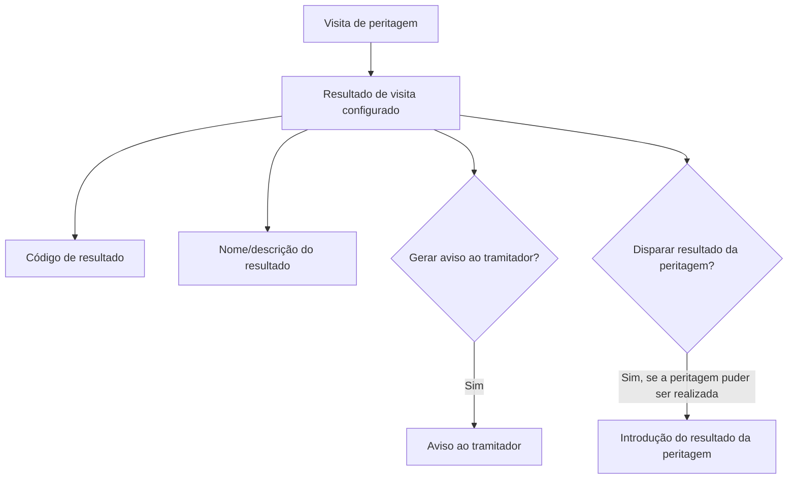

# Definição de Resultados de Visitas de Peritagem

## 1. Metadados do Documento
- **Arquivo de Origem:** Não identificado no conteúdo fornecido
- **Tipo de Documento:** Especificação Técnica
- **Domínio / Sistema:** Peritagens — resultados de visitas
- **Público-Alvo:** Operação e tramitadores envolvidos em peritagens
- **Data/Versão Identificada:** Não identificada

---

## 2. Resumo Executivo & Contexto de Negócio

O documento define as propriedades necessárias para configurar os diferentes resultados possíveis de uma visita associada a uma peritagem. O objetivo declarado é identificar quais características das peritagens são necessárias para determinar esses resultados.

Cada resultado de visita possui uma chave de identificação, uma descrição e regras operacionais associadas. As regras cobrem a geração de aviso ao tramitador e a possibilidade de disparar o resultado da peritagem.

A configuração determina se, ao ocorrer uma visita com determinado código de resultado, o sistema deve gerar um aviso ao tramitador. Também determina se a peritagem pode receber um resultado, representando que a peritagem foi realizada.

O conteúdo fornecido não descreve sistemas técnicos, contratos HTTP, integrações, ambientes, persistência de dados ou mecanismos de implementação. A especificação concentra-se nas propriedades funcionais dos resultados de visita.

---

## 3. Arquitetura, Componentes & Tecnologias Envolvidas

O texto cita peritagens, visitas, resultados de visita e o papel do tramitador. Não há detalhamento de microsserviços, tecnologias, bases de dados, APIs, ambientes ou relações técnicas entre componentes.



> **Nota de Análise:** O conteúdo mostra referências a “Home Solutions APIs Documentation Zeus” e “CF”, mas não explica o significado, a função ou a relação desses termos com a definição de resultados de visita.

---

## 4. Regras de Negócio, Especificações Funcionais & Processos

1. Um resultado de peritagem deve possuir um **código de resultado**, que contém a chave do resultado da peritagem.
2. Um resultado de peritagem deve possuir um **nome do resultado**, que contém a descrição do resultado da peritagem.
3. A propriedade **“Se cria um aviso ao tramitador?”** indica se deve ser gerado um aviso ao tramitador quando o resultado da visita corresponder ao código que está sendo definido.
4. A propriedade **“Dispara Resultado?”** indica se, quando a visita possuir o resultado configurado, deve ser disparado o resultado da peritagem.
5. Quando a peritagem tiver sido realizada, a propriedade **“Dispara Resultado?”** deve ser indicada como positiva para permitir a introdução do resultado da peritagem.
6. O texto não informa valores permitidos, tipos de dados, obrigatoriedade de campos, códigos existentes, regras de precedência ou tratamento para combinações inválidas de propriedades.

---

## 5. Tabelas de Parâmetros, Ambientes e Estruturas de Dados

| Item / Parâmetro | Descrição / Função | Tipo / Valores / Formato | Ambiente / Observações |
| :--- | :--- | :--- | :--- |
| Código de Resultado | Contém a chave do resultado da peritagem. | Não especificado. | Associado ao resultado configurado. |
| Nome do resultado | Contém a descrição do resultado da peritagem. | Não especificado. | Associado ao resultado configurado. |
| Se cria um aviso ao tramitador? | Indica se é gerado aviso ao tramitador quando o resultado da visita corresponde ao código definido. | Não especificado; semanticamente indica decisão de geração de aviso. | O destinatário citado é o tramitador. |
| Dispara Resultado? | Indica se o resultado da peritagem é disparado quando a visita possui o resultado configurado. | Não especificado; semanticamente indica decisão de disparo. | Para peritagem realizada, deve permitir a introdução do resultado da peritagem. |
| CF | Termo exibido como exemplo. | Não especificado. | Sem explicação adicional no conteúdo. |
| Home Solutions APIs Documentation Zeus | Texto exibido no conteúdo bruto. | Não especificado. | Não há contexto técnico ou funcional adicional. |

---

## 6. Bateria de Perguntas & Respostas para RAG (FAQ Sintético)

### P1: Qual é o objetivo do documento de definição de resultados de visitas?
**R:** O objetivo é identificar quais propriedades das peritagens são necessárias para definir os diferentes resultados que uma visita pode ter.

### P2: O que representa o Código de Resultado?
**R:** O Código de Resultado contém a chave do resultado da peritagem.

### P3: O que representa o Nome do resultado?
**R:** O Nome do resultado contém a descrição do resultado da peritagem.

### P4: Quando é criado um aviso ao tramitador?
**R:** Um aviso ao tramitador pode ser criado quando o resultado da visita for o código de resultado que está sendo definido. A propriedade “Se cria um aviso ao tramitador?” indica se esse aviso deve ou não ser gerado.

### P5: Qual é a finalidade da propriedade “Dispara Resultado?”?
**R:** A propriedade “Dispara Resultado?” indica às peritagens se, quando a visita tiver o resultado que está sendo definido, o resultado da peritagem deve ser disparado.

### P6: Quando deve ser permitido introduzir o resultado da peritagem?
**R:** Quando a peritagem tiver podido ser realizada, deve ser indicado que o resultado é disparado para permitir a introdução do resultado da própria peritagem.

### P7: O documento especifica valores válidos para Código de Resultado?
**R:** Não. O documento informa somente que o Código de Resultado contém a chave do resultado da peritagem; não especifica formato, tipo de dado ou valores permitidos.

### P8: O documento define métodos HTTP ou contratos JSON para os resultados de visita?
**R:** Não. O conteúdo fornecido não detalha métodos HTTP, contratos JSON, APIs, serviços ou integrações técnicas.

### P9: O que acontece se “Se cria um aviso ao tramitador?” estiver habilitado?
**R:** O documento estabelece que será gerado um aviso ao tramitador quando o resultado da visita corresponder ao código que está sendo definido. O mecanismo de envio do aviso não é detalhado.

### P10: O termo “CF” é definido no documento?
**R:** Não. “CF” aparece como exemplo, mas o documento não informa seu significado, sua relação com códigos de resultado ou seu uso operacional.

---

## 7. Glossário de Termos, Siglas & Conceitos-Chave

- **Peritagem / Peritación:** Processo ao qual são associados resultados e visitas, conforme descrito no documento.
- **Visita:** Evento ou etapa relacionada à peritagem que pode possuir um resultado configurado.
- **Resultado de visita:** Resultado associado a uma visita e utilizado para acionar regras de aviso e de disparo do resultado da peritagem.
- **Código de Resultado:** Chave do resultado da peritagem.
- **Tramitador:** Papel que pode receber aviso quando a visita possui determinado código de resultado.
- **Dispara Resultado:** Propriedade que indica se o resultado da peritagem deve ser disparado a partir do resultado da visita.
- **CF:** Termo apresentado como exemplo, sem definição adicional.
- **Zeus:** Termo presente na referência “Home Solutions APIs Documentation Zeus”, sem definição adicional.

---

## 8. Notas Críticas, Riscos & Limitações

- O documento não identifica arquivo de origem, autor, data, versão ou sistema responsável.
- Não há definição de tipos, formatos, valores válidos ou obrigatoriedade para as propriedades descritas.
- Não são especificadas regras para resultados duplicados, códigos inexistentes, falhas na geração de avisos ou resultados de visita sem configuração.
- Não há detalhamento de interfaces, APIs, contratos de dados, integrações, ambientes ou persistência.
- O significado de “CF”, “Home Solutions APIs Documentation Zeus” e “EN” não é explicado.
- **Nota de Análise:** O documento descreve as propriedades funcionais dos resultados de visita, mas não detalha como esses valores são configurados, armazenados ou consumidos por sistemas técnicos.

---

## 9. Conteúdo Bruto Estruturado (Referência Fiel)

```text
--- [PÁGINA 1 DE 2] ---

DEFINICIÓN de Resultado de las visitas
Objetivo
La finalidad de este documento es conocer qué propiedades de las peritaciones son necesarias para
definir los distintos resultados que puede tener una visita
Propiedades Generales
Propiedades
Código de Resultado
Esta propiedad contiene la clave del resultado de la peritación.
Nombre del resultado
Esta propiedad contiene la descripción del resultado de la peritación.
Se crea un aviso al tramitador?
Esta propiedad indica si cuando el resultado de la visita sea el código que se está definiendo, si se
genera o no aviso al tramitador.
Dispara Resultado?
Ejemplo:
 / 
 CF
Home Solutions APIs Documentation Zeus
EN


--- [PÁGINA 2 DE 2] ---

Esta propiedad indica a las peritaciones si cuando la visita sea la que se está definiendo, si se
dispara el resultado de la peritación, es decir si la peritación se ha podido realizar, habrá que indicarle
que sí, para poder introducir el resultado de la misma.
```
