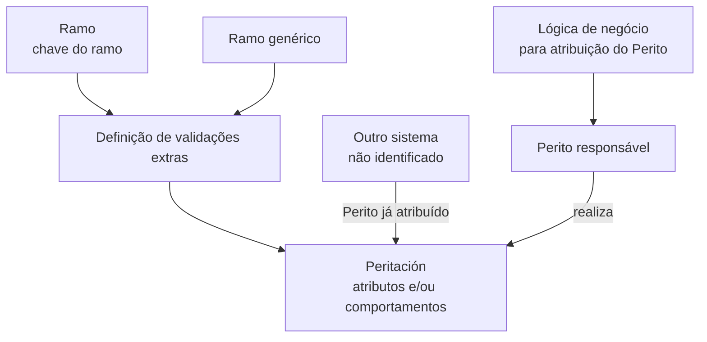

# Definición de Validaciones de la Peritación

## 1. Metadados do Documento
- **Arquivo de Origem:** Não identificado no conteúdo fornecido
- **Tipo de Documento:** Especificação Técnica
- **Domínio / Sistema:** Peritaciones / Home Solutions APIs Documentation Zeus
- **Público-Alvo:** Negócio, analistas funcionais e desenvolvedores envolvidos em peritaciones
- **Data/Versão Identificada:** Não identificada

---

## 2. Resumo Executivo & Contexto de Negócio

O documento define o objetivo das validações aplicáveis às *peritaciones*. A finalidade declarada é identificar quais funcionalidades podem ser modificadas nesse contexto.

As propriedades descritas permitem estabelecer definições diferentes por ramo e validações adicionais também por ramo. Portanto, a configuração de validações não é necessariamente uniforme para todas as peritaciones.

A propriedade **Ramo** identifica a chave do ramo para o qual são definidas validações extras de atributos e/ou comportamentos das peritaciones. O documento também prevê um ramo genérico, aplicável aos ramos que não tenham definição própria.

O documento registra uma lógica de negócio voltada à atribuição do **Perito**. Essa lógica devolve o perito responsável pela realização da peritación; caso o perito tenha sido atribuído em outro sistema, ele poderá ser trazido para a peritación.

Não há detalhamento sobre métodos HTTP, contratos JSON, regras de precedência entre configurações específicas e genéricas, nem sobre a implementação técnica da lógica de negócio.

---

## 3. Arquitetura, Componentes & Tecnologias Envolvidas

| Componente / Conceito | Papel descrito |
| :--- | :--- |
| Peritación | Contexto funcional no qual funcionalidades, atributos e comportamentos podem receber validações. |
| Ramo | Propriedade que contém a chave do ramo usado para definir validações extras. |
| Ramo genérico | Configuração aplicável a todos os ramos que não tenham definição própria. |
| Lógica de negócio para atribuição do Perito | Lógica que devolve o perito que realizará a peritación. |
| Outro sistema | Sistema externo não identificado que pode já ter atribuído o perito. |
| Perito | Responsável por realizar a peritación. |
| Home Solutions APIs Documentation Zeus | Texto citado no conteúdo bruto; o documento não detalha sua função ou relação técnica com as validações. |



> **Nota de Análise:** O diagrama representa somente as relações explicitamente descritas. O documento não informa interfaces, tecnologias, protocolos, persistência, APIs ou contratos de integração.

---

## 4. Regras de Negócio, Especificações Funcionais & Processos

1. As propriedades das peritaciones permitem definições diferentes por ramo.
2. As propriedades das peritaciones permitem validações extras por ramo.
3. A propriedade **Ramo** contém a chave do ramo para o qual são definidas validações extras.
4. As validações extras podem incidir sobre atributos e/ou comportamentos das peritaciones.
5. Pode ser utilizado um **ramo genérico**.
6. A definição do ramo genérico aplica-se aos ramos que não possuam definição própria.
7. A lógica de negócio para atribuição do Perito contém o nome da lógica de negócio que devolverá o perito que realizará a peritación.
8. Quando o perito tiver sido atribuído em outro sistema, esse perito poderá ser trazido para a peritación.

> **Nota de Análise:** O documento não especifica critérios de seleção do Perito, condições de erro, prioridade entre a atribuição externa e a lógica de negócio, nem o comportamento quando não houver perito retornado.

---

## 5. Tabelas de Parâmetros, Ambientes e Estruturas de Dados

| Item / Parâmetro | Descrição / Função | Tipo / Valores / Formato | Ambiente / Observações |
| :--- | :--- | :--- | :--- |
| Ramo | Contém a chave do ramo para o qual são definidas validações extras dos atributos e/ou comportamentos das peritaciones. | Chave do ramo; formato não especificado. | Pode possuir definição própria. |
| Ramo genérico | Permite uma definição aplicável aos ramos que não tenham definição própria. | Valor/conceito genérico; representação não especificada. | Aplicável na ausência de definição própria para o ramo. |
| Validações extras | Validações configuradas para atributos e/ou comportamentos das peritaciones. | Não especificado. | Definidas por ramo. |
| Lógica de negócio para atribuição do Perito | Nome da lógica de negócio que devolve o perito que realizará a peritación. | Nome da lógica de negócio; formato não especificado. | Pode considerar uma atribuição ocorrida em outro sistema. |
| Perito | Profissional ou entidade que realizará a peritación. | Não especificado. | Pode ser trazido de outro sistema quando já atribuído. |
| Outro sistema | Origem externa potencial de uma atribuição prévia de perito. | Sistema não identificado. | Não há detalhes de integração. |
| Home Solutions APIs Documentation Zeus | Texto presente no conteúdo extraído. | Não especificado. | A relação com os demais conceitos não é detalhada. |

---

## 6. Bateria de Perguntas & Respostas para RAG (FAQ Sintético)

### P1: Qual é a finalidade do documento de definição de validações da peritación?
**R:** A finalidade declarada é conhecer quais funcionalidades podem ser modificadas nas peritaciones. O documento descreve propriedades que permitem definições diferentes e validações extras por ramo.

### P2: O que a propriedade Ramo representa nas validações da peritación?
**R:** A propriedade Ramo contém a chave do ramo para o qual são definidas validações extras dos atributos e/ou comportamentos das peritaciones.

### P3: As validações podem variar entre ramos?
**R:** Sim. O documento informa que as propriedades permitem definições diferentes por ramo e validações extras por ramo.

### P4: O que acontece quando um ramo não possui definição própria?
**R:** Pode ser utilizado o ramo genérico. A definição genérica aplica-se a todos os ramos que não tenham uma definição própria.

### P5: Sobre quais elementos da peritación podem incidir validações extras?
**R:** As validações extras podem ser definidas para atributos e/ou comportamentos das peritaciones.

### P6: Qual é a função da lógica de negócio para atribuição do Perito?
**R:** A lógica de negócio contém o nome da lógica que devolverá o perito que realizará a peritación.

### P7: Um perito atribuído em outro sistema pode ser usado na peritación?
**R:** Sim. O documento informa que, se o perito tiver sido atribuído em outro sistema, ele poderá ser trazido para a peritación.

### P8: O documento especifica como a lógica de negócio consulta outro sistema?
**R:** Não. O documento apenas informa que um perito já atribuído em outro sistema poderá ser trazido para a peritación; não descreve protocolo, API, contrato, autenticação ou mecanismo de integração.

### P9: O documento define a prioridade entre uma configuração específica de ramo e o ramo genérico?
**R:** O documento informa que o ramo genérico é aplicável aos ramos sem definição própria. Não apresenta regras adicionais de precedência, conflitos ou sobreposição de validações.

### P10: Quais detalhes técnicos sobre Home Solutions APIs Documentation Zeus estão disponíveis?
**R:** Apenas o texto “Home Solutions APIs Documentation Zeus” aparece no conteúdo bruto. O documento não detalha a função desse elemento, APIs, endpoints, métodos HTTP ou contratos associados.

---

## 7. Glossário de Termos, Siglas & Conceitos-Chave

- **Peritación:** Contexto funcional mencionado no documento, sujeito a definições, validações, atributos, comportamentos e atribuição de Perito.
- **Perito:** Entidade que realizará a peritación.
- **Ramo:** Propriedade que contém a chave usada para definir validações extras para uma peritación.
- **Ramo genérico:** Definição aplicável aos ramos que não tenham definição própria.
- **Validações extras:** Validações de atributos e/ou comportamentos das peritaciones, definidas por ramo.
- **Lógica de negócio:** Lógica cujo nome é configurado para devolver o Perito responsável pela peritación.
- **Home Solutions APIs Documentation Zeus:** Expressão presente no documento; significado e função não detalhados.

---

## 8. Notas Críticas, Riscos & Limitações

- O conteúdo fornecido possui somente uma página e não identifica arquivo, data, versão ou autoria.
- Não há definição de formatos, valores permitidos ou estrutura técnica para a chave de **Ramo**.
- Não há catálogo de ramos, exemplos de validações extras ou descrição dos atributos e comportamentos validáveis.
- A lógica de atribuição do Perito é citada, mas não são informados algoritmo, entradas, saídas, exceções ou critérios de decisão.
- A integração com “outro sistema” não possui identificação, contrato, fluxo de falha ou regra de sincronização.
- “Home Solutions APIs Documentation Zeus” é citado sem contextualização adicional.
- Não são informados métodos HTTP, URLs, ambientes, tecnologias, logs, permissões ou estruturas JSON.

---

## 9. Conteúdo Bruto Estruturado (Referência Fiel)

```text
--- [PÁGINA 1 DE 1] ---

DEFINICIÓN de Validaciones de la peritación
Objetivo
La finalidad de este documento es conocer que funcionalidades podemos variar en las peritaciones.
Estas propiedades permiten definiciones diferentes por ramo y validaciones extras por ramo.
Propiedades
Ramo
Esta propiedad contiene la Clave del ramo para el que se están definiendo las validaciones extras de
los atributos y / o comportamientos de las peritaciones. Se puede utilizar el ramo genérico que indica
que la definición aplica a todos los ramos, que no tengan definición propia.
Logica de Negocio para la asignación del Perito
Contiene el nombre de la Lógica de negocio que devolverá el perito que va a realizar la peritación, si
se ha asignado en otro sistema, se podrá traer a la peritación.
 / 
 CF
Home Solutions APIs Documentation Zeus
EN
```
