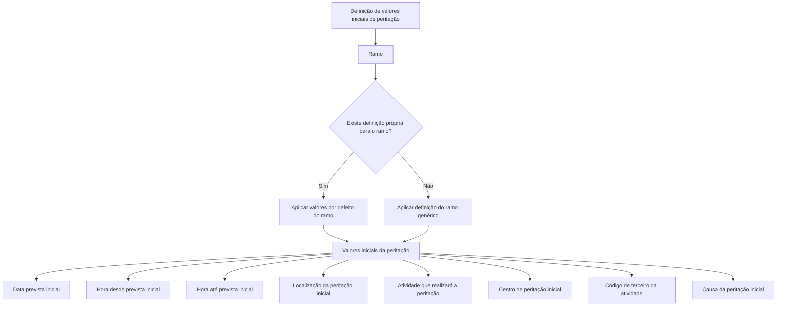

# Definição de Valores Iniciais de Peritação

## 1. Metadados do Documento
- **Arquivo de Origem:** Não identificado no conteúdo extraído
- **Tipo de Documento:** Especificação Técnica
- **Domínio / Sistema:** Peritações; referências a “Home Solutions APIs Documentation Zeus”
- **Público-Alvo:** Não identificado explicitamente; conteúdo direcionado à configuração de propriedades de peritações
- **Data/Versão Identificada:** Não identificada

---

## 2. Resumo Executivo & Contexto de Negócio

O documento descreve quais propriedades de uma peritação podem receber valores iniciais ou valores por defeito. O propósito declarado é aumentar a eficácia no momento da geração de uma peritação.

A configuração é organizada por **ramo**, cuja chave define o contexto de aplicação dos valores por defeito. O documento prevê a utilização de um ramo genérico, aplicável aos ramos que não possuírem uma definição própria.

As propriedades configuráveis abrangem data, janelas de horário, localização, atividade responsável, centro de peritação, código de terceiro e causa da peritação. Cada propriedade é apresentada como uma lógica de negócio responsável por devolver o valor inicial correspondente.

O conteúdo não especifica interfaces, métodos HTTP, contratos JSON, tecnologias de implementação, persistência, responsáveis pela configuração ou regras internas de cálculo dessas lógicas de negócio.

---

## 3. Arquitetura, Componentes & Tecnologias Envolvidas

Os elementos identificados no conteúdo são:

- **Peritação:** entidade ou processo para o qual são definidos valores iniciais.
- **Propriedades gerais:** grupo de propriedades configuráveis da peritação.
- **Ramo:** chave de classificação que determina o escopo de aplicação dos valores por defeito.
- **Ramo genérico:** definição aplicável a todos os ramos sem configuração própria.
- **Lógicas de negócio:** mecanismos que devolvem os valores iniciais das propriedades da peritação.
- **Perito e tramitador:** exemplos de atividades que podem realizar a peritação.
- **Centro de peritação:** valor devolvido quando quem realiza a peritação é um perito.
- **Home Solutions APIs Documentation Zeus:** texto presente na extração, sem detalhamento de relação funcional ou técnica com as propriedades descritas.



> **Nota de Análise:** O diagrama representa exclusivamente a relação lógica expressa no documento entre ramo, ramo genérico e propriedades configuráveis. O conteúdo não descreve microsserviços, bases de dados, APIs, protocolos, ambientes ou fluxos de integração.

---

## 4. Regras de Negócio, Especificações Funcionais & Processos

1. A finalidade da definição de valores iniciais ou por defeito é tornar mais eficaz a geração de uma peritação.
2. O atributo **Ramo** contém a chave do ramo para o qual são definidos os valores por defeito das propriedades de peritações.
3. Pode ser utilizado um **ramo genérico**.
4. A definição associada ao ramo genérico aplica-se a todos os ramos que não tenham uma definição própria.
5. A lógica de negócio da **data prevista inicial** devolve a data prevista inicial da peritação.
6. A lógica de negócio da **hora desde prevista inicial** devolve a hora inicial prevista para realizar a peritação.
7. A lógica de negócio da **hora até prevista inicial** devolve a hora final prevista para realizar a peritação.
8. A lógica de negócio da **localização da peritação inicial** devolve o lugar onde a peritação será realizada por defeito.
9. A lógica de negócio da **atividade que vai peritar inicialmente** devolve a atividade que realizará a peritação por defeito. O documento cita como exemplos o perito e o tramitador.
10. A lógica de negócio do **centro de peritação inicial** devolve o centro de peritação quando quem realiza a peritação é um perito.
11. A lógica de negócio do **código de terceiro da atividade a peritar** devolve o código do terceiro correspondente à atividade da peritação.
12. A lógica de negócio da **causa da peritação inicial** devolve a causa da peritação inicial.

---

## 5. Tabelas de Parâmetros, Ambientes e Estruturas de Dados

| Item / Parâmetro | Descrição / Função | Tipo / Valores / Formato | Ambiente / Observações |
| :--- | :--- | :--- | :--- |
| Ramo | Contém a chave do ramo para o qual são definidos valores por defeito das propriedades das peritações. | Chave de ramo; formato não especificado. | Pode usar ramo genérico quando não existir definição própria para um ramo. |
| Ramo genérico | Define valores aplicáveis a todos os ramos sem definição própria. | Não especificado. | Regra de abrangência por ausência de configuração específica. |
| Lógica de Negócio de la Fecha prevista inicial | Devolve a data prevista inicial da peritação. | Lógica de negócio; formato de data não especificado. | Sem detalhamento do cálculo. |
| Lógica de Negocio Hora desde prevista inicial | Devolve a hora inicial prevista para realizar a peritação. | Lógica de negócio; formato de hora não especificado. | Sem detalhamento do cálculo. |
| Lógica de Negocio Hora hasta prevista inicial | Devolve a hora final prevista para realizar a peritação. | Lógica de negócio; formato de hora não especificado. | Sem detalhamento do cálculo. |
| Lógica de Negocio de la Ubicación de la peritación inicial | Devolve o local onde a peritação será realizada por defeito. | Lógica de negócio; formato de localização não especificado. | Sem detalhamento do cálculo. |
| Lógica de Negocio de la actividad que va a peritar inicial | Devolve a atividade que realizará a peritação por defeito. | Lógica de negócio; valores exemplificados: perito, tramitador. | O documento não fornece lista completa de atividades. |
| Lógica de Negocio centro de peritación inicial | Devolve o centro de peritação quando quem realizará a peritação for um perito. | Lógica de negócio; formato do centro não especificado. | Aplicável no caso explicitamente indicado de realização por perito. |
| Lógica de Negocio código de tercero de la actividad a peritar | Devolve o código do terceiro correspondente à atividade da peritação. | Lógica de negócio; formato do código não especificado. | Sem detalhamento de origem ou validação do código. |
| Lógica de Negocio causa de la peritación inicial | Devolve a causa da peritação inicial. | Lógica de negócio; valores ou formato não especificados. | Sem detalhamento do cálculo. |
| Home Solutions APIs Documentation Zeus | Referência textual presente no conteúdo extraído. | Não especificado. | Não há explicação sobre função, ambiente ou integração. |

---

## 6. Bateria de Perguntas & Respostas para RAG (FAQ Sintético)

### P1: Qual é a finalidade da definição de valores iniciais de peritação?
**R:** A finalidade é identificar quais propriedades das peritações podem receber valores iniciais ou valores por defeito, tornando mais eficaz a geração de uma peritação.

### P2: Como o ramo influencia os valores por defeito das propriedades de peritação?
**R:** O atributo Ramo contém a chave do ramo para o qual são definidos os valores por defeito das propriedades das peritações. A definição é, portanto, associada ao ramo correspondente.

### P3: Quando a definição do ramo genérico deve ser aplicada?
**R:** O ramo genérico pode ser utilizado quando um ramo não possui uma definição própria. Nesse caso, a definição genérica aplica-se aos ramos sem configuração específica.

### P4: O que devolve a lógica de negócio da data prevista inicial?
**R:** A lógica de negócio da data prevista inicial devolve a data prevista inicial da peritação. O documento não informa como essa data é calculada nem seu formato.

### P5: Quais horários iniciais podem ser definidos para uma peritação?
**R:** O documento prevê uma lógica de negócio para devolver a hora desde prevista inicial e outra para devolver a hora até prevista inicial. Juntas, essas propriedades representam o início e o fim previstos para a realização da peritação.

### P6: Como é definido o local padrão da peritação?
**R:** A lógica de negócio da localização da peritação inicial devolve o lugar onde a peritação será realizada por defeito. O documento não detalha as regras usadas para determinar esse local.

### P7: Quem pode realizar uma peritação segundo o documento?
**R:** A lógica de negócio da atividade que vai realizar a peritação inicialmente devolve a atividade responsável pela peritação por defeito. O documento cita o perito e o tramitador como exemplos.

### P8: Em qual situação é devolvido o centro de peritação inicial?
**R:** A lógica de negócio do centro de peritação inicial devolve o centro de peritação no caso em que a pessoa ou atividade que realizará a peritação seja um perito.

### P9: Para que serve o código de terceiro da atividade a peritar?
**R:** A lógica de negócio do código de terceiro da atividade a peritar devolve o código do terceiro que corresponde à atividade da peritação. O documento não informa o formato do código nem o sistema de origem.

### P10: O que determina a lógica de negócio da causa da peritação inicial?
**R:** Essa lógica de negócio devolve a causa da peritação inicial. O documento não especifica as causas possíveis, critérios de seleção ou validações.

---

## 7. Glossário de Termos, Siglas & Conceitos-Chave

- **Peritación / Peritação:** processo ou entidade para a qual o documento define propriedades com valores iniciais ou por defeito.
- **Ramo:** atributo que contém a chave do ramo para o qual são definidos valores por defeito das propriedades de uma peritação.
- **Ramo genérico:** configuração aplicável aos ramos que não possuem definição própria.
- **Valor inicial:** valor devolvido para uma propriedade no contexto inicial de uma peritação.
- **Valor por defeito:** valor padrão configurado para uma propriedade de peritação.
- **Perito:** exemplo de atividade que pode realizar a peritação; é o caso citado para devolução do centro de peritação.
- **Tramitador:** exemplo de atividade que pode realizar a peritação.
- **Centro de peritação:** centro devolvido pela lógica de negócio quando a peritação é realizada por um perito.
- **Código de terceiro:** código do terceiro correspondente à atividade da peritação.
- **Causa da peritação:** causa devolvida para a peritação inicial.
- **Home Solutions APIs Documentation Zeus:** referência textual presente na extração, sem definição adicional.

---

## 8. Notas Críticas, Riscos & Limitações

- O conteúdo não identifica o arquivo de origem, autoria, data, versão ou ambiente.
- O documento não especifica formatos de data, hora, código de terceiro, ramo ou centro de peritação.
- O documento não detalha os algoritmos, regras condicionais, fontes de dados ou validações das lógicas de negócio descritas.
- Não há contratos de API, métodos HTTP, URLs, autenticação, tecnologias, persistência ou fluxos de integração.
- Não é fornecida uma lista completa de atividades que podem realizar uma peritação; apenas perito e tramitador são citados como exemplos.
- A referência “Home Solutions APIs Documentation Zeus” aparece no texto extraído, mas não possui contexto funcional ou técnico adicional.
- **Nota de Análise:** o documento descreve propriedades configuráveis, mas não detalha a implementação das lógicas de negócio que devolvem os valores iniciais.

---

## 9. Conteúdo Bruto Estruturado (Referência Fiel)

```text
--- [PÁGINA 1 DE 2] ---

DEFINICIÓN de Valores Iniciales Peritación
Objetivo
La finalidad de este documento es conocer a qué propiedades de las peritaciones se les puede
definir valores iniciales, valores por defecto, con la finalidad de ser más eficaces cuando se genera
una peritación.
Propiedades Generales
Propiedades
Ramo
Este Atributo contiene la Clave del ramo para el que se están definiendo los valores por defecto de
las propiedades de las peritaciones. Se puede utilizar el ramo genérico que indica que la definición
aplica a todos los ramos, que no tengan definición propia.
Lógica de Negocio de la Fecha prevista inicial
Esta propiedad contiene la lógica de negocio que devuelve la fecha prevista peritación inicial
Lógica de Negocio Hora desde prevista inicial
Esta propiedad contiene la lógica de negocio que devuelve la hora desde prevista para realizar la
peritación inicial.
Lógica de Negocio Hora hasta prevista inicial
 /
 CF
Home Solutions APIs Documentation Zeus
EN


--- [PÁGINA 2 DE 2] ---

Esta propiedad contiene la lógica de negocio que devuelve la hora hasta prevista para realizar la
peritación inicial.
Lógica de Negocio de la Ubicación de la peritación inicial
Esta propiedad contiene la lógica de negocio que devuelve el lugar donde se va a realizar la
peritación por defecto.
Lógica de Negocio de la actividad que va a peritar inicial
Esta propiedad contiene la lógica de negocio que devuelve la actividad que va a realizar la peritación
por defecto. El perito, el tramitador... etc
Lógica de Negocio centro de peritación inicial
Esta propiedad contiene la lógica de negocio que devolverá el centro de peritación, en el caso de que
el que realice la peritación sea un perito .
Lógica de Negocio código de tercero de la actividad a peritar
Esta propiedad contiene la lógica de negocio que devuelve el código del tercero que se corresponde
con la actividad de la peritación
Lógica de Negocio causa de la peritación inicial
Esta propiedad contiene la lógica de negocio que devuelve la causa de la peritación inicial.
```
