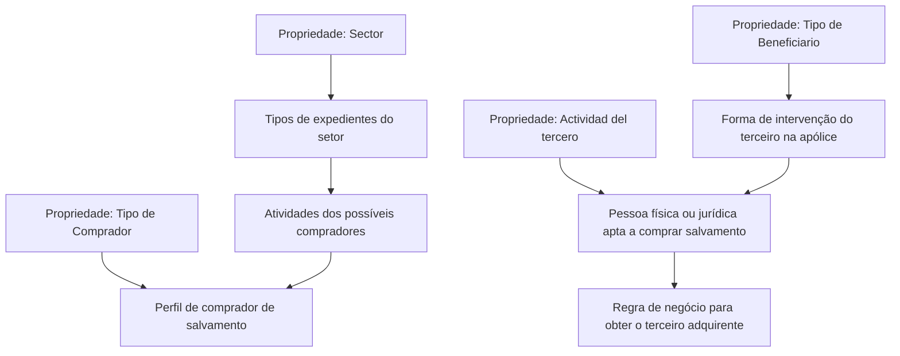

# Definição de Atividades de Terceiros que Podem Comprar um Salvamento

## 1. Metadados do Documento
- **Arquivo de Origem:** Não identificado no conteúdo extraído
- **Tipo de Documento:** Especificação Funcional
- **Domínio / Sistema:** Gestão de Salvamentos — definição de compradores e atividades de terceiros
- **Público-Alvo:** Analistas funcionais, negócio, desenvolvedores e operação
- **Data/Versão Identificada:** Não identificada

---

## 2. Resumo Executivo & Contexto de Negócio

O documento define propriedades utilizadas para configurar possíveis atividades de terceiros habilitados a comprar um salvamento. O escopo é centrado na associação entre setores, tipos de expediente, tipos de comprador, atividades de terceiros e tipos de beneficiário em apólices.

A propriedade **Sector** indica a chave do setor ao qual pertencem os tipos de expediente. Esses tipos de expediente serão associados às atividades dos possíveis compradores de um salvamento. O documento não detalha a estrutura da chave de setor nem os tipos de expediente existentes.

A propriedade **Tipo de Comprador** categoriza os compradores em ex-proprietário, empregado, agente, comprador com registro e comprador autorizado. Cada categoria possui uma descrição funcional que delimita o perfil de terceiro apto a adquirir salvamentos.

A propriedade **Actividad del tercero** armazena a atividade de pessoas físicas ou jurídicas que poderão comprar um salvamento. Quando a atividade for “assegurado”, a propriedade **Tipo de Beneficiario** define a forma de participação do terceiro na apólice.

O documento também menciona uma lógica de negócio que obtém o terceiro que adquire o salvamento. Entretanto, não apresenta regras condicionais, algoritmos, entradas, saídas, métodos HTTP, contratos de integração ou detalhes técnicos dessa lógica.

---

## 3. Arquitetura, Componentes & Tecnologias Envolvidas

O conteúdo não descreve arquitetura de software, microsserviços, bancos de dados, APIs, tecnologias, ambientes ou mecanismos de integração. Os componentes funcionais identificados são propriedades de configuração relacionadas à identificação de compradores de salvamentos.



**Nota de Análise:** O documento cita “Home Solutions APIs Documentation Zeus” no rodapé extraído, mas não explica se esse texto identifica uma plataforma, API, sistema, ambiente ou repositório documental.

---

## 4. Regras de Negócio, Especificações Funcionais & Processos

1. A propriedade **Sector** informa a chave do setor ao qual pertencem os tipos de expedientes.
2. Os tipos de expedientes associados a um setor são relacionados às atividades dos possíveis compradores de um salvamento.
3. A propriedade **Tipo de Comprador** deve assumir uma das categorias documentadas:
   - `(X)` Ex-dueño;
   - `(E)` Empleado;
   - `(A)` Agente;
   - `(R)` Comprador con registro;
   - `(C)` Comprador autorizado.
4. O tipo `(X) Ex-dueño` representa o antigo proprietário do bem que foi salvado ou recuperado.
5. O tipo `(E) Empleado` representa um empregado da companhia.
6. O tipo `(A) Agente` representa um agente da companhia.
7. O tipo `(R) Comprador con registro` representa um comprador que pode ser qualquer pessoa.
8. O tipo `(C) Comprador autorizado` representa compradores habituais que compram lotes de salvamentos.
9. A propriedade **Actividad del tercero** contém a atividade das pessoas físicas ou jurídicas que poderão comprar um salvamento.
10. Quando a atividade do terceiro for **assegurado**, a propriedade **Tipo de Beneficiario** define como o terceiro intervém na apólice.
11. Os tipos de beneficiário documentados incluem tomador, tomadores alternos, assegurados, condutores, proprietários, beneficiários, beneficiários de vida, proponente, endossatário, preventor, beneficiários contingentes de vida, consórcio, Ace, tutor legal, subagentes, pagador, beneficiário irrevogável, beneficiário por cessão de direitos/pignoração e beneficiários legais.
12. Existe uma lógica de negócio destinada a obter o terceiro que adquire o salvamento.

**Nota de Análise:** O documento não especifica os critérios de seleção, prioridade entre tipos de comprador, validações, exceções ou resultado esperado da lógica de negócio que retorna o comprador.

---

## 5. Tabelas de Parâmetros, Ambientes e Estruturas de Dados

| Item / Parâmetro | Descrição / Função | Tipo / Valores / Formato | Ambiente / Observações |
| :--- | :--- | :--- | :--- |
| Sector | Indica a chave do setor ao qual pertencem os tipos de expedientes. | Chave de setor; formato não detalhado. | Associada às atividades de possíveis compradores de salvamento. |
| Tipo de Comprador | Classifica o perfil do terceiro comprador de um salvamento. | `(X)`, `(E)`, `(A)`, `(R)`, `(C)`. | Cada código possui descrição funcional própria. |
| Actividad del tercero | Contém a atividade de pessoas físicas ou jurídicas que poderão comprar um salvamento. | Atividade; valores não detalhados. | Quando a atividade é “assegurado”, relaciona-se ao Tipo de Beneficiario. |
| Tipo de Beneficiario | Define a forma de intervenção do terceiro na apólice quando a atividade for assegurado. | Códigos `0` a `9`, `11` a `14` e `20` a `24`. | Não existe código `10` no conteúdo fornecido. |
| Lógica de negócio que devuelve al comprador | Obtém o terceiro que adquire o salvamento. | Não detalhado. | Sem critérios, interfaces, entradas ou saídas documentadas. |

| Código | Tipo de Comprador | Descrição / Função |
| :--- | :--- | :--- |
| `(X)` | Ex-dueño | Antigo proprietário do bem que foi salvado ou recuperado. |
| `(E)` | Empleado | Empregado da companhia. |
| `(A)` | Agente | Agente da companhia. |
| `(R)` | Comprador con registro | Comprador que pode ser qualquer pessoa. |
| `(C)` | Comprador autorizado | Compradores habituais que compram lotes de salvamentos. |

| Código | Tipo de Beneficiário | Descrição / Função |
| :--- | :--- | :--- |
| `(0)` | Tomador | Forma de intervenção do terceiro na apólice. |
| `(1)` | Tomadores alternos | Forma de intervenção do terceiro na apólice. |
| `(2)` | Asegurados | Forma de intervenção do terceiro na apólice. |
| `(3)` | Conductores | Forma de intervenção do terceiro na apólice. |
| `(4)` | Propietarios | Forma de intervenção do terceiro na apólice. |
| `(5)` | Beneficiarios | Forma de intervenção do terceiro na apólice. |
| `(6)` | Beneficiarios vida | Forma de intervenção do terceiro na apólice. |
| `(7)` | Proponente | Forma de intervenção do terceiro na apólice. |
| `(8)` | Endosatario | Forma de intervenção do terceiro na apólice. |
| `(9)` | Preventor | Forma de intervenção do terceiro na apólice. |
| `(11)` | Benefs. contingente vida | Forma de intervenção do terceiro na apólice. |
| `(12)` | Consorcio | Forma de intervenção do terceiro na apólice. |
| `(13)` | Ace | Forma de intervenção do terceiro na apólice. |
| `(14)` | Tutor legal | Forma de intervenção do terceiro na apólice. |
| `(20)` | Subagentes | Forma de intervenção do terceiro na apólice. |
| `(21)` | Pagador | Forma de intervenção do terceiro na apólice. |
| `(22)` | Beneficiario irrevocable | Forma de intervenção do terceiro na apólice. |
| `(23)` | Beneficiario cesion derechos/pignoracion | Forma de intervenção do terceiro na apólice. |
| `(24)` | Beneficiarios legales | Forma de intervenção do terceiro na apólice. |

---

## 6. Bateria de Perguntas & Respostas para RAG (FAQ Sintético)

### P1: Qual é a finalidade do documento sobre atividades que podem comprar um salvamento?
**R:** A finalidade é explicar como são definidas as possíveis atividades de terceiros que podem comprar um salvamento.

### P2: O que a propriedade Sector representa?
**R:** A propriedade Sector indica a chave do setor ao qual pertencem os tipos de expedientes que serão associados às atividades dos possíveis compradores de um salvamento.

### P3: Quais tipos de comprador são documentados para aquisição de salvamentos?
**R:** São documentados cinco tipos: `(X) Ex-dueño`, `(E) Empleado`, `(A) Agente`, `(R) Comprador con registro` e `(C) Comprador autorizado`.

### P4: Quem é classificado como Ex-dueño no contexto de compra de salvamento?
**R:** Ex-dueño é o antigo proprietário do bem que foi salvado ou recuperado.

### P5: O que caracteriza um Comprador autorizado?
**R:** Comprador autorizado representa compradores habituais que compram lotes de salvamentos.

### P6: O que significa Comprador con registro?
**R:** Comprador con registro é definido no documento como um comprador que pode ser qualquer pessoa.

### P7: O que é armazenado na propriedade Actividad del tercero?
**R:** A propriedade Actividad del tercero contém a atividade de pessoas físicas ou jurídicas que poderão comprar um salvamento.

### P8: Quando o Tipo de Beneficiario deve ser considerado?
**R:** O Tipo de Beneficiario deve ser considerado quando a atividade do terceiro for assegurado, pois indica a forma pela qual o terceiro intervém na apólice.

### P9: Qual código de Tipo de Beneficiario representa o tomador da apólice?
**R:** O código `(0)` representa o Tomador.

### P10: Qual código representa beneficiário irrevogável?
**R:** O código `(22)` representa Beneficiario irrevocable.

### P11: Qual código representa beneficiário por cessão de direitos ou pignoração?
**R:** O código `(23)` representa Beneficiario cesion derechos/pignoracion.

### P12: O documento detalha como a lógica de negócio escolhe o comprador do salvamento?
**R:** Não. O documento apenas informa que existe uma lógica de negócio para obter o terceiro que adquire o salvamento, sem detalhar critérios, condições, prioridade, entradas ou saídas.

---

## 7. Glossário de Termos, Siglas & Conceitos-Chave

- **Salvamento:** Bem que foi salvado ou recuperado e que pode ser adquirido por um terceiro, conforme o contexto do documento.
- **Sector:** Propriedade que indica a chave do setor ao qual pertencem os tipos de expedientes.
- **Tipo de expediente:** Categoria pertencente a um setor e associada às atividades dos possíveis compradores de salvamento.
- **Tipo de Comprador:** Classificação do perfil do terceiro comprador.
- **Ex-dueño:** Antigo proprietário do bem salvado ou recuperado.
- **Empleado:** Empregado da companhia.
- **Agente:** Agente da companhia.
- **Comprador con registro:** Comprador definido como qualquer pessoa.
- **Comprador autorizado:** Comprador habitual de lotes de salvamentos.
- **Actividad del tercero:** Atividade de pessoa física ou jurídica apta a comprar um salvamento.
- **Tipo de Beneficiario:** Forma de intervenção de um terceiro na apólice quando sua atividade for assegurado.
- **Tomador:** Papel de terceiro identificado pelo código `(0)`.
- **Endosatario:** Papel de terceiro identificado pelo código `(8)`.
- **Pignoracion:** Termo presente em “cesion derechos/pignoracion”; não possui definição adicional no documento.
- **Ace:** Tipo de beneficiário identificado pelo código `(13)`; significado não detalhado.

---

## 8. Notas Críticas, Riscos & Limitações

- O documento não identifica arquivo de origem, autor, data, versão ou sistema proprietário.
- Não há especificação técnica de APIs, contratos JSON, banco de dados, rotas, logs, ambientes, URLs, autenticação ou permissões.
- A lógica de negócio que obtém o comprador é somente mencionada, sem detalhamento operacional.
- Não são informadas regras de prioridade ou compatibilidade entre setor, tipo de expediente, atividade do terceiro, tipo de comprador e tipo de beneficiário.
- O conteúdo apresenta os códigos de Tipo de Beneficiario de `0` a `9`, depois `11` a `14` e `20` a `24`; os códigos ausentes não são explicados.
- O texto “Ace” é listado como tipo de beneficiário, mas seu significado não é definido.
- O rodapé “Home Solutions APIs Documentation Zeus” aparece no material extraído sem contexto funcional ou técnico adicional.

---

## 9. Conteúdo Bruto Estruturado (Referência Fiel)

```text
--- [PÁGINA 1 DE 3] ---

DEFINICIÓN de Actividades que pueden
comprar un Salvamento
Objetivo
La finalidad de este documento es conocer cómo se definen las posibles actividades de terceros que
pueden comprar un salvado.
Propiedades Generales
Propiedades
Sector
Esta propiedad indica la clave del Sector al que pertenecen los tipos de expedientes, a los que se les
va a asociar las actividades de los posibles compradores de un salvado.
Tipo de Comprador
Los tipos de comprador son:
(X)Ex-dueño
(E)Empleado
(A)Agente
(R)Comprador con registro
(C)Comprador autorizado
 /
 CF
Home Solutions APIs Documentation Zeus
EN


--- [PÁGINA 2 DE 3] ---

(X)Ex-due%o
El antiguo dueño de la propiedad que se ha salvado, recuperado.
(E)Empleado
Un empleado de la compañía.
(A)Agente
Un agente de la compañía.
(R)Comprador con registro
Comprador cualquier persona
(C)Comprador autorizado
Compradores habituales que compran lotes de salvados.
Actividad del tercero
Esta propiedad contendrá la actividad de las personas físicas o jurídicas que podrán comprar un
salvamento.
Tipo de Beneficiario
Esta propiedad contiene la forma en la que interviene como tercero en la póliza, en el caso de que la
actividad sea asegurado.
(0)Tomador
(1)Tomadores alternos
(2)Asegurados
(3)Conductores
(4)Propietarios
(5)Beneficiarios
(6)Beneficiarios vida
(7)Proponente
(8)Endosatario
(9)Preventor


--- [PÁGINA 3 DE 3] ---

(11)Benefs. contingente vida
(12)Consorcio
(13)Ace
(14)Tutor legal
(20)Subagentes
(21)Pagador
(22)Beneficiario irrevocable
(23)Beneficiario cesion derechos/pignoracion
(24)Beneficiarios legales
Logica de Negocio que devuelve al comprador
Lógica de negocio que se obtiene el tercero que adquiere el Salvamento.
```
