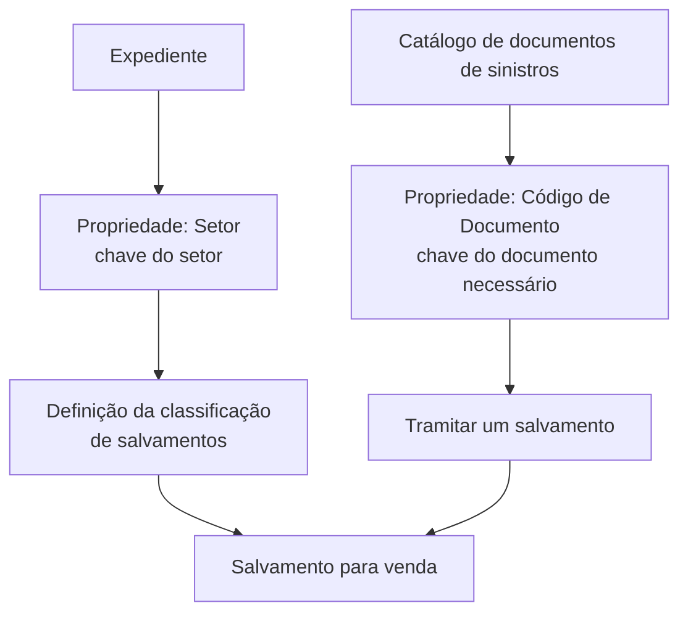

# Definição de Documentos para Tramitar um Salvamento

## 1. Metadados do Documento
- **Arquivo de Origem:** Não identificado
- **Tipo de Documento:** Especificação Técnica
- **Domínio / Sistema:** Classificação de salvamentos para venda; catálogo de documentos de sinistros
- **Público-Alvo:** Negócio, analistas funcionais e desenvolvedores
- **Data/Versão Identificada:** Não identificada

---

## 2. Resumo Executivo & Contexto de Negócio

O documento define propriedades necessárias para classificar um salvamento destinado à venda. O objetivo declarado é permitir o conhecimento das propriedades exigidas para realizar essa classificação.

A classificação de salvamentos depende de informações gerais relacionadas ao expediente e ao documento utilizado no trâmite. O documento identifica duas propriedades principais: **Setor** e **Código de Documento**.

A propriedade **Setor** estabelece a chave do setor ao qual pertence o expediente que terá a classificação de salvamentos definida. A propriedade **Código de Documento** contém a chave do documento necessário para tramitar um salvamento.

O documento necessário para tramitar o salvamento deve estar previamente definido no catálogo de documentos de sinistros. Não são detalhados métodos HTTP, contratos JSON, integrações, ambientes, regras de validação adicionais ou o processo operacional completo.

---

## 3. Arquitetura, Componentes & Tecnologias Envolvidas

Os elementos identificados são:

| Componente / Conceito | Papel descrito |
| :--- | :--- |
| Salvamento | Entidade que será classificada para venda. |
| Expediente | Elemento associado ao setor usado na definição da classificação dos salvamentos. |
| Setor | Propriedade que indica a chave do setor ao qual o expediente pertence. |
| Código de Documento | Propriedade que contém a chave do documento necessário para tramitar um salvamento. |
| Catálogo de documentos de sinistros | Catálogo no qual o documento necessário para o trâmite de salvamento deve estar definido. |
| Home Solutions APIs Documentation Zeus | Texto apresentado no exemplo ou na referência de origem; o documento não explica sua função. |



> **Nota de Análise:** O documento não descreve aplicações, microsserviços, APIs, protocolos, bancos de dados, ambientes ou tecnologias de implementação.

---

## 4. Regras de Negócio, Especificações Funcionais & Processos

### Objetivo funcional

A finalidade declarada é conhecer as propriedades necessárias para classificar um salvamento para venda.

### Propriedade: Setor

1. A propriedade **Setor** indica a chave do setor.
2. A chave do setor corresponde ao setor ao qual pertence o expediente.
3. O expediente é aquele para o qual será definida a classificação dos salvamentos.

### Propriedade: Código de Documento

1. A propriedade **Código de Documento** contém a chave do código de documento.
2. O código de documento é necessário para tramitar um salvamento.
3. O documento associado ao código de documento deve estar definido no catálogo de documentos de sinistros.

### Restrições explicitamente identificadas

- Para tramitar um salvamento, o documento utilizado deve existir no catálogo de documentos de sinistros.
- O documento não especifica formato, tamanho, obrigatoriedade técnica, origem de dados ou mecanismo de validação para as chaves de Setor e Código de Documento.
- O documento não detalha o significado operacional de “salvamento”, as etapas posteriores à classificação ou os critérios usados para determinar a venda.

---

## 5. Tabelas de Parâmetros, Ambientes e Estruturas de Dados

| Item / Parâmetro | Descrição / Função | Tipo / Valores / Formato | Ambiente / Observações |
| :--- | :--- | :--- | :--- |
| Setor | Indica a chave do setor ao qual pertence o expediente para o qual será definida a classificação dos salvamentos. | Chave de setor; formato não informado. | Não informado. |
| Código de Documento | Contém a chave do código de documento necessário para tramitar um salvamento. | Chave de código de documento; formato não informado. | O documento correspondente deve estar definido no catálogo de documentos de sinistros. |
| Expediente | Elemento associado a um setor e relacionado à definição da classificação dos salvamentos. | Não informado. | Não informado. |
| Salvamento | Entidade cuja classificação é definida para venda e que necessita de documento para trâmite. | Não informado. | Não informado. |
| Catálogo de documentos de sinistros | Repositório ou catálogo onde o documento necessário para tramitar o salvamento deve estar definido. | Não informado. | Não são especificados consulta, manutenção ou estrutura do catálogo. |
| `CF` | Valor apresentado no exemplo do documento. | Não informado. | O contexto e a função específica de `CF` não são detalhados. |

---

## 6. Bateria de Perguntas & Respostas para RAG (FAQ Sintético)

### P1: Qual é o objetivo do documento de definição de documentos para tramitar um salvamento?
**R:** O objetivo é conhecer as propriedades necessárias para classificar um salvamento para venda.

### P2: Qual propriedade identifica o setor relacionado ao expediente?
**R:** A propriedade **Setor** indica a chave do setor ao qual pertence o expediente para o qual será definida a classificação dos salvamentos.

### P3: O que representa a propriedade Código de Documento?
**R:** A propriedade **Código de Documento** contém a chave do código de documento necessário para tramitar um salvamento.

### P4: Qual condição deve ser atendida pelo documento usado no trâmite de um salvamento?
**R:** O documento necessário para tramitar um salvamento deve estar definido no catálogo de documentos de sinistros.

### P5: O documento informa o formato da chave de Setor?
**R:** Não. O documento somente afirma que Setor indica a chave do setor ao qual pertence o expediente; não apresenta formato, tipo de dado ou exemplos de valores para essa chave.

### P6: O documento define APIs ou métodos HTTP para tramitar salvamentos?
**R:** Não. O conteúdo não detalha APIs, métodos HTTP, endpoints, contratos JSON ou tecnologias de integração para o trâmite de salvamentos.

### P7: Como a classificação de salvamentos se relaciona ao expediente?
**R:** A propriedade Setor identifica a chave do setor ao qual pertence o expediente que terá a classificação dos salvamentos definida.

### P8: Onde o código de documento necessário para o salvamento deve estar cadastrado?
**R:** O documento correspondente ao código de documento necessário para tramitar o salvamento deve estar definido no catálogo de documentos de sinistros.

### P9: O documento apresenta critérios para aprovar, rejeitar ou vender um salvamento?
**R:** Não. O documento informa que a finalidade é classificar salvamentos para venda, mas não detalha critérios de aprovação, rejeição, precificação ou execução da venda.

### P10: O valor `CF` possui significado definido no documento?
**R:** Não. `CF` aparece na seção de exemplo, mas o documento não explica seu significado, seu relacionamento com Setor ou Código de Documento, nem suas regras de uso.

---

## 7. Glossário de Termos, Siglas & Conceitos-Chave

- **Salvamento:** Entidade mencionada como objeto de classificação para venda e de trâmite documental. O documento não fornece uma definição adicional.
- **Setor:** Propriedade que indica a chave do setor ao qual pertence o expediente.
- **Expediente:** Elemento associado ao setor e para o qual será definida a classificação dos salvamentos.
- **Código de Documento:** Propriedade que contém a chave do documento necessário para tramitar um salvamento.
- **Catálogo de documentos de sinistros:** Catálogo no qual o documento necessário para tramitar um salvamento deve estar definido.
- **CF:** Valor apresentado como exemplo, sem definição contextual no documento.
- **Home Solutions APIs Documentation Zeus:** Texto presente no exemplo; seu significado e relação com o processo não são detalhados.

---

## 8. Notas Críticas, Riscos & Limitações

- O documento é resumido e não especifica fluxos operacionais completos para classificação ou venda de salvamentos.
- Não há detalhamento de validações, mensagens de erro, responsabilidades, permissões, integrações ou persistência de dados.
- Não foram identificados métodos HTTP, endpoints, contratos JSON, versões, servidores, URLs, portas ou ambientes.
- O documento estabelece uma dependência explícita: o documento necessário ao trâmite do salvamento deve estar definido no catálogo de documentos de sinistros.
- O exemplo contém os textos `/`, `CF` e `Home Solutions APIs Documentation Zeus`, mas não explica suas funções.
- **Nota de Análise:** O conteúdo não informa se Setor e Código de Documento são campos obrigatórios, nem como suas chaves são obtidas ou validadas.

---

## 9. Conteúdo Bruto Estruturado (Referência Fiel)

```text
--- [PÁGINA 1 DE 1] ---

DEFINICIÓN de Documentos para tramitar un
Salvamento
Objetivo
La finalidad de este documento es conocer las propiedades necesarias para poder clasificar un
salvado para su venta.
Propiedades Generales
Propiedades
Sector
Esta propiedad indica la clave del Sector al que pertenecen el expediente, al que se les va a definir la
clasificación de los salvados.
Código de Documento
Esta propiedad contiene la clave del código de documento necesario para tramitar un salvado. Este
documento tiene que estar definido en el catálogo de documentos de siniestros.
Ejemplo:
 /
 CF
Home Solutions APIs Documentation Zeus
EN
```
