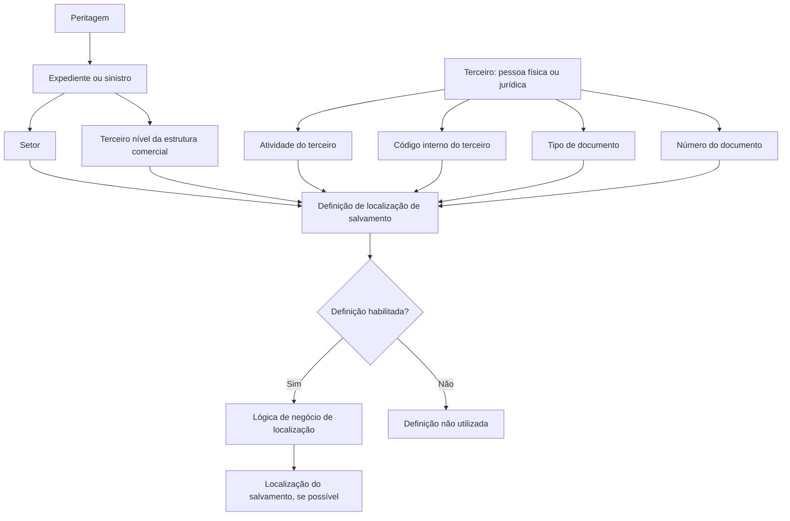

# Definição de Localizações de Salvamento para Peritagens

## 1. Metadados do Documento
- **Arquivo de Origem:** `Não identificado no conteúdo extraído`
- **Tipo de Documento:** Especificação Funcional
- **Domínio / Sistema:** Localizações de salvamento / peritagens
- **Público-Alvo:** Analistas funcionais, desenvolvedores e operação
- **Data/Versão Identificada:** Não identificada

---

## 2. Resumo Executivo & Contexto de Negócio

O documento define as propriedades necessárias para determinar os diferentes locais onde um salvamento pode estar situado durante uma peritagem. O objetivo declarado é identificar quais atributos das peritagens devem ser considerados para definir essas localizações.

A definição relaciona o expediente ou sinistro do salvamento a atributos organizacionais e cadastrais de um terceiro. Os atributos incluem setor, terceiro nível da estrutura comercial, atividade do terceiro, código interno do terceiro e documentos identificadores da pessoa física ou jurídica.

A atividade do terceiro possui relevância direta para a localização do salvamento. O documento menciona explicitamente a atividade própria de salvamentos denominada **“depósitos de salvamentos”**.

A propriedade denominada **Lógica de Negócio lugar de Ubicación** deve devolver, quando possível, a localização do salvamento. A utilização de uma definição depende também do indicador **Inhabilitado**, que informa se a definição está habilitada ou não para uso.

O documento não detalha implementações técnicas, contratos de API, persistência de dados, algoritmos de correspondência ou critérios de prioridade entre definições de localização.

---

## 3. Arquitetura, Componentes & Tecnologias Envolvidas

Os elementos funcionais identificados são:

- **Peritagem:** contexto no qual se define a localização de um salvamento.
- **Salvamento:** entidade cuja localização pode ser determinada.
- **Expediente / sinistro:** associado a um setor e a uma estrutura comercial.
- **Terceiro:** pessoa física ou jurídica associada à atividade, ao código interno e aos documentos identificadores.
- **Definição de localização:** conjunto de propriedades utilizado pela lógica de negócio.
- **Lógica de negócio de localização:** mecanismo que tenta devolver a localização do salvamento.
- **Indicador Inhabilitado:** determina se uma definição pode ser utilizada.



> **Nota de Análise:** O conteúdo cita “Home Solutions APIs Documentation Zeus” e “CF”, mas não fornece explicação funcional ou técnica que permita classificá-los como sistemas, APIs, módulos ou tecnologias da solução.

---

## 4. Regras de Negócio, Especificações Funcionais & Processos

1. A finalidade da definição é conhecer as propriedades das peritagens necessárias para estabelecer os diferentes locais em que um salvamento pode ser encontrado.
2. O **Setor** representa a chave do setor ao qual pertence o expediente para o qual serão definidas as localizações possíveis de um salvamento.
3. O **Terceiro nível da estrutura comercial** representa o terceiro nível da estrutura comercial à qual pertencerá o sinistro ou expediente do salvamento.
4. A **Atividade do terceiro** contém a atividade na qual os salvamentos poderão estar localizados.
5. O documento identifica **“depósitos de salvamentos”** como uma atividade própria de salvamentos.
6. O **Código Interno Tercero** representa a chave interna atribuída ao terceiro que possui a atividade informada anteriormente.
7. O **Tipo de documento** identifica o tipo de documento da pessoa física ou jurídica classificada como terceiro.
8. O **Número de documento** contém o número do documento da pessoa física ou jurídica classificada como terceiro.
9. A **Lógica de Negócio lugar de Ubicación** deve retornar a localização do salvamento quando isso for possível.
10. A propriedade **Inhabilitado** informa se a definição está habilitada para utilização.
11. Uma definição marcada como não habilitada não deve ser utilizada, conforme o significado funcional atribuído à propriedade Inhabilitado.

> **Nota de Análise:** O documento não especifica quais combinações de propriedades produzem uma localização, nem descreve comportamento para ausência, duplicidade ou conflito entre atributos.

---

## 5. Tabelas de Parâmetros, Ambientes e Estruturas de Dados

| Item / Parâmetro | Descrição / Função | Tipo / Valores / Formato | Ambiente / Observações |
| :--- | :--- | :--- | :--- |
| Setor | Indica a chave do setor ao qual pertence o expediente para o qual são definidas localizações de salvamento. | Chave de setor; formato não detalhado. | Associado ao expediente. |
| Terceiro nível da estrutura comercial | Contém o terceiro nível da estrutura comercial à qual pertence o sinistro ou expediente do salvamento. | Estrutura comercial; formato não detalhado. | Associado ao sinistro/expediente. |
| Atividade do terceiro | Contém a atividade na qual os salvamentos podem estar localizados. | Atividade; valores não exaustivos. | O documento cita “depósitos de salvamentos” como atividade própria de salvamentos. |
| Código Interno Tercero | Chave interna atribuída ao terceiro com a atividade definida na propriedade anterior. | Chave interna; formato não detalhado. | Relacionado ao terceiro e à atividade do terceiro. |
| Tipo de documento | Contém o tipo de documento identificador de uma pessoa física ou jurídica classificada como terceiro. | Tipo de documento; valores não detalhados. | Identificação do terceiro. |
| Número de documento | Contém o número do documento da pessoa física ou jurídica classificada como terceiro. | Número de documento; formato não detalhado. | Identificação do terceiro. |
| Lógica de Negócio lugar de Ubicación | Contém a lógica de negócio para devolver a localização do salvamento, quando possível. | Lógica de negócio; critérios não detalhados. | Não há algoritmo ou contrato técnico descrito. |
| Inhabilitado | Indica se a definição está habilitada para ser utilizada. | Indicador de habilitação; valores literais não detalhados. | Controla a utilização da definição. |
| Depósitos de salvamentos | Atividade própria de salvamentos mencionada no documento. | Nome de atividade. | Exemplo explícito de atividade em que salvamentos podem estar localizados. |

---

## 6. Bateria de Perguntas & Respostas para RAG (FAQ Sintético)

### P1: Qual é o objetivo da definição de localizações de salvamento?
**R:** O objetivo é conhecer quais propriedades das peritagens são necessárias para definir os diferentes lugares onde um salvamento pode estar localizado.

### P2: Qual propriedade relaciona o expediente ao setor aplicável à localização do salvamento?
**R:** A propriedade **Setor** indica a chave do setor ao qual pertence o expediente para o qual serão definidas as diferentes localizações de um salvamento.

### P3: Qual nível da estrutura comercial é utilizado na definição?
**R:** O documento utiliza o **terceiro nível da estrutura comercial**, associado ao sinistro ou expediente do salvamento.

### P4: O que representa a atividade do terceiro?
**R:** A atividade do terceiro representa a atividade na qual os salvamentos poderão estar localizados. O documento cita “depósitos de salvamentos” como uma atividade própria de salvamentos.

### P5: Para que serve o Código Interno Tercero?
**R:** O Código Interno Tercero é a chave interna atribuída ao terceiro que possui a atividade definida na propriedade Atividade do terceiro.

### P6: Quais propriedades identificam uma pessoa física ou jurídica classificada como terceiro?
**R:** O documento identifica o terceiro por meio do **Tipo de documento**, que informa o tipo de documento identificador, e do **Número de documento**, que contém o número desse documento.

### P7: O que a Lógica de Negócio lugar de Ubicación deve retornar?
**R:** A Lógica de Negócio lugar de Ubicación deve devolver a localização do salvamento, quando isso for possível. O documento não detalha os critérios utilizados para esse retorno.

### P8: Qual é a função do indicador Inhabilitado?
**R:** O indicador Inhabilitado informa se a definição está habilitada para ser utilizada. Quando a definição não está habilitada, ela não deve ser usada.

### P9: O documento informa métodos HTTP ou contratos JSON para a definição de localizações?
**R:** Não. O conteúdo extraído não descreve métodos HTTP, endpoints, contratos JSON, esquemas de banco de dados ou integrações técnicas.

### P10: O documento define todos os valores permitidos para a atividade do terceiro?
**R:** Não. O documento informa que a atividade contém a atividade onde os salvamentos podem estar localizados e apresenta “depósitos de salvamentos” como exemplo, mas não fornece uma lista completa de valores.

---

## 7. Glossário de Termos, Siglas & Conceitos-Chave

- **Atividade do terceiro:** Atividade em que os salvamentos podem estar localizados.
- **Código Interno Tercero:** Chave interna atribuída ao terceiro que possui a atividade indicada.
- **Definição de localização:** Configuração baseada em propriedades de peritagem, expediente e terceiro para determinar uma possível localização de salvamento.
- **Depósitos de salvamentos:** Atividade própria de salvamentos citada como local possível para salvamentos.
- **Expediente:** Entidade associada ao setor e à estrutura comercial na definição de localizações.
- **Inhabilitado:** Propriedade que indica se uma definição está habilitada para uso.
- **Peritagem:** Contexto cujas propriedades são necessárias para definir localizações de salvamento.
- **Salvamento:** Entidade cuja localização pode ser devolvida pela lógica de negócio.
- **Setor:** Chave do setor ao qual pertence o expediente.
- **Terceiro:** Pessoa física ou jurídica identificada por atividade, código interno e documento.
- **Terceiro nível da estrutura comercial:** Nível da estrutura comercial ao qual pertence o sinistro ou expediente do salvamento.

---

## 8. Notas Críticas, Riscos & Limitações

- O documento não informa o nome do arquivo original, data, versão, autor ou responsáveis.
- Não há detalhamento da regra de decisão aplicada pela **Lógica de Negócio lugar de Ubicación**.
- Não são definidos critérios de prioridade, desempate ou tratamento de múltiplas localizações elegíveis.
- Não há especificação de formatos, obrigatoriedade, domínios de valores ou validações para os campos.
- O documento não descreve APIs, métodos HTTP, contratos de integração, persistência, logs, URLs, ambientes ou autenticação.
- As referências “Home Solutions APIs Documentation Zeus” e “CF” aparecem no conteúdo extraído, mas não recebem contexto suficiente para interpretação técnica confiável.
- Não há conteúdo adicional apresentado após o marcador **“Ejemplo:”**.

---

## 9. Conteúdo Bruto Estruturado (Referência Fiel)

```text
--- [PÁGINA 1 DE 2] ---

DEFINICIÓN de Ubicaciones Salvamento
Objetivo
La finalidad de este documento es conocer qué propiedades de las peritaciones son necesarias para
definir los distintos lugares donde se puede realizar una peritación.
Propiedades Generales
Propiedades
Sector
Esta propiedad indica la clave del Sector al que pertenecen el expediente, al que se les va a definir
las diferentes ubicaciones donde se puede encontrar un salvado.
Tercer nivel estructura comercial
Esta propiedad contiene el tercer nivel de la estructura comercial, a la que va a pertenecer el
siniestro/expediente del salvado.
Actividad del tercero
Esta propiedad contendrá la actividad donde van a poder estar ubicados los salvados. Hay una
actividad propia de salvados que es la de "depósitos de salvamentos".
Código Interno Tercero
 / 
 CF
Home Solutions APIs Documentation Zeus
EN


--- [PÁGINA 2 DE 2] ---

Esta propiedad será la clave interna que tiene asignada el tercero con la actividad de la propiedad
anterior.
Tipo de documento
Esta propiedad contendrá el tipo documento identificador de la persona física o jurídica (tercero)
Número de documento
Esta propiedad contendrá del número del documento de la persona física o jurídica (tercero)
Lógica de Negocio lugar de Ubicación
Esta propiedad contiene una lógica de negocio para devolver, si se puede, la ubicación del
salvamento.
Inhabilitado
Esta propiedad indica si la definición está o no habilitada para ser utilizada.
Ejemplo:
```
