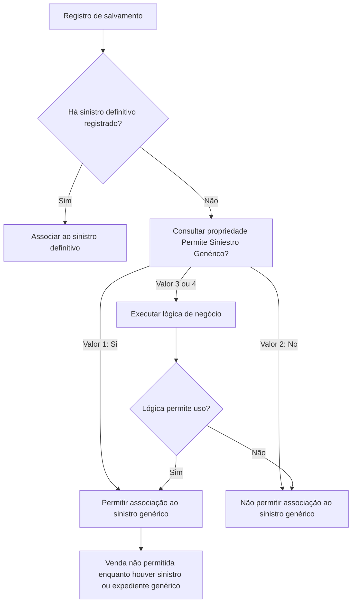

# Definição de Validações de Salvamentos

## 1. Metadados do Documento
- **Arquivo de Origem:** Não identificado
- **Tipo de Documento:** Especificação Técnica
- **Domínio / Sistema:** Validações de salvamentos e peritações
- **Público-Alvo:** Negócio, analistas funcionais e desenvolvedores
- **Data/Versão Identificada:** Não identificada

---

## 2. Resumo Executivo & Contexto de Negócio

O documento define propriedades configuráveis para variar funcionalidades nas peritações relacionadas a salvamentos. As propriedades permitem estabelecer definições diferentes por ramo e aplicar validações adicionais aos atributos e/ou comportamentos dos salvamentos.

A principal propriedade apresentada é **Ramo**, que contém a chave do ramo ao qual as validações extras se aplicam. O documento também permite o uso de um ramo genérico, cuja definição deve ser aplicada aos ramos que não possuam definição própria.

A propriedade **Permite Siniestro Genérico?** controla se um salvamento pode ser associado temporariamente a um siniestro genérico enquanto o siniestro definitivo ainda não foi registrado. Mesmo quando essa associação temporária é permitida, o documento determina que a venda de um salvamento associado a siniestro genérico ou expediente genérico nunca é permitida.

A decisão sobre permitir o siniestro genérico pode ser direta, por valores explícitos de sim ou não, ou dependente de uma lógica de negócio. Quando os valores configurados forem `3` ou `4`, uma lógica de negócio deve determinar a permissão com base em informações adicionais não detalhadas no documento.

---

## 3. Arquitetura, Componentes & Tecnologias Envolvidas

O conteúdo não descreve arquitetura de software, tecnologias, APIs, contratos HTTP, ambientes, bancos de dados ou integrações entre sistemas.

Os elementos funcionais identificados são:

- **Peritações:** contexto no qual funcionalidades relacionadas a salvamentos podem variar.
- **Salvamentos:** entidades sujeitas a atributos, comportamentos e validações extras.
- **Ramo:** chave de segmentação das definições de validação.
- **Ramo genérico:** configuração aplicável quando não existir uma definição própria para determinado ramo.
- **Siniestro genérico:** associação temporária possível durante o registro de um salvamento, conforme valor ou lógica configurada.
- **Siniestro definitivo:** sinistro a ser registrado posteriormente, substituindo a necessidade da associação genérica.
- **Expediente genérico:** condição que, assim como o siniestro genérico, impede a venda do salvamento.



> **Nota de Análise:** O documento não detalha os critérios internos da lógica de negócio aplicável aos valores `3` e `4`, nem especifica como ocorre a transição de siniestro genérico para siniestro definitivo.

---

## 4. Regras de Negócio, Especificações Funcionais & Processos

### 4.1. Definições por ramo

1. As propriedades permitem definições diferentes por ramo.
2. As propriedades permitem validações extras por ramo para atributos e/ou comportamentos dos salvamentos.
3. A propriedade **Ramo** deve conter a chave do ramo para o qual estão sendo definidas as validações extras.
4. É possível utilizar um ramo genérico.
5. A definição do ramo genérico deve ser aplicada a todos os ramos que não possuam definição própria.

### 4.2. Associação a siniestro genérico

1. A propriedade **Permite Siniestro Genérico?** determina se, no momento do registro de um salvamento, é permitido associar o salvamento a um siniestro genérico.
2. A associação ao siniestro genérico é temporária, até que o siniestro definitivo seja registrado.
3. A venda de um salvamento é proibida quando o salvamento possuir:
   - siniestro genérico; ou
   - expediente genérico.
4. Os valores `1` e `2` representam decisões diretas:
   - `1`: Sim.
   - `2`: Não.
5. Os valores `3` e `4` exigem lógica de negócio para determinar se o uso do siniestro genérico é permitido.
6. A lógica de negócio deve ser executada quando a decisão não for simplesmente “Sim” ou “Não” e depender de outras informações.

### 4.3. Fluxo funcional de decisão

1. Registrar ou processar um salvamento.
2. Verificar se há necessidade de associar o salvamento a um siniestro genérico.
3. Consultar a propriedade **Permite Siniestro Genérico?**.
4. Aplicar a decisão conforme o valor configurado:
   - Valor `1`: permitir a associação ao siniestro genérico.
   - Valor `2`: não permitir a associação ao siniestro genérico.
   - Valor `3` ou `4`: executar lógica de negócio.
5. Quando houver siniestro genérico ou expediente genérico associado, bloquear a venda do salvamento.

> **Nota de Análise:** O documento não descreve mensagens de erro, comportamento de interface, persistência da configuração, critérios de validação da venda nem o significado individual distinto entre os valores `3` e `4`.

---

## 5. Tabelas de Parâmetros, Ambientes e Estruturas de Dados

| Item / Parâmetro | Descrição / Função | Tipo / Valores / Formato | Ambiente / Observações |
| :--- | :--- | :--- | :--- |
| Ramo | Contém a chave do ramo para o qual são definidas validações extras de atributos e/ou comportamentos dos salvamentos. | Chave de ramo; formato não detalhado. | Pode utilizar ramo genérico quando não houver definição própria para um ramo. |
| Ramo genérico | Definição aplicável a todos os ramos sem definição própria. | Não detalhado. | Atua como regra de cobertura para ramos sem configuração específica. |
| Permite Siniestro Genérico? | Indica se, ao registrar um salvamento, é permitido associá-lo a um siniestro genérico até o registro do siniestro definitivo. | `1`: Si; `2`: No; `3`, `4`: Lógica de Negócio. | A venda do salvamento nunca é permitida quando existir siniestro genérico ou expediente genérico. |
| Lógica de Negócio de si permite el siniestro Genérico | Determina se o siniestro genérico pode ser utilizado quando a propriedade anterior possuir valor `3` ou `4`. | Lógica dependente de outra informação; critérios não detalhados. | Deve ser utilizada quando a decisão não for diretamente “Sim” ou “Não”. |
| Siniestro genérico | Associação temporária de um salvamento enquanto o siniestro definitivo não é registrado. | Não detalhado. | Impede a venda do salvamento. |
| Siniestro definitivo | Sinistro a ser registrado após eventual associação temporária a siniestro genérico. | Não detalhado. | O processo de substituição ou atualização não é descrito. |
| Expediente genérico | Condição associada ao salvamento. | Não detalhado. | Impede a venda do salvamento. |
| `CF` | Termo exibido ao lado de “Lógica de Negocio” no texto extraído. | Não detalhado. | O documento não define o significado de `CF`. |
| Home Solutions APIs Documentation Zeus | Texto apresentado no rodapé da primeira página. | Não detalhado. | Não há explicação sobre relação com as validações de salvamentos. |

---

## 6. Bateria de Perguntas & Respostas para RAG (FAQ Sintético)

### P1: Qual é a finalidade do documento de validações de salvamentos?
**R:** A finalidade é identificar quais funcionalidades podem variar nas peritações. As propriedades apresentadas permitem criar definições diferentes por ramo e aplicar validações extras aos atributos e/ou comportamentos dos salvamentos.

### P2: O que representa a propriedade Ramo?
**R:** A propriedade **Ramo** contém a chave do ramo para o qual são definidas validações extras de atributos e/ou comportamentos dos salvamentos.

### P3: Quando a configuração de ramo genérico deve ser aplicada?
**R:** A configuração de ramo genérico pode ser utilizada e deve ser aplicada aos ramos que não tenham uma definição própria.

### P4: O que a propriedade Permite Siniestro Genérico? controla?
**R:** A propriedade **Permite Siniestro Genérico?** determina se, no registro de um salvamento, é permitido associar temporariamente o salvamento a um siniestro genérico até que o siniestro definitivo seja registrado.

### P5: Quais são os valores permitidos para Permite Siniestro Genérico??
**R:** Os valores permitidos são `1`, com significado “Si”; `2`, com significado “No”; e `3` ou `4`, que exigem a aplicação de uma lógica de negócio para decidir se o siniestro genérico pode ser utilizado.

### P6: Um salvamento associado a siniestro genérico pode ser vendido?
**R:** Não. O documento estabelece que nunca será permitida a venda de um salvamento que tenha siniestro genérico ou expediente genérico.

### P7: Um salvamento associado a expediente genérico pode ser vendido?
**R:** Não. A venda nunca é permitida para um salvamento que tenha expediente genérico.

### P8: Quando a lógica de negócio para uso de siniestro genérico deve ser executada?
**R:** A lógica de negócio deve ser executada quando a propriedade **Permite Siniestro Genérico?** contiver valor `3` ou `4`, pois nesses casos a decisão depende de outras informações e não é uma resposta direta de sim ou não.

### P9: O documento explica os critérios usados pela lógica de negócio dos valores 3 e 4?
**R:** Não. O documento informa apenas que os valores `3` e `4` devem conter uma lógica de negócio para determinar se o siniestro genérico pode ser utilizado. Os critérios, dados de entrada e regras dessa lógica não são detalhados.

### P10: O documento diferencia funcionalmente o valor 3 do valor 4?
**R:** Não. O documento agrupa os valores `3` e `4` como casos de “Lógica de Negócio”, sem apresentar distinção funcional entre eles.

### P11: A venda é liberada automaticamente após o registro do siniestro definitivo?
**R:** Não há detalhamento suficiente para afirmar isso. O documento apenas informa que o siniestro genérico pode ser utilizado até o registro do siniestro definitivo e que a venda é proibida enquanto houver siniestro ou expediente genérico.

### P12: O documento descreve APIs, métodos HTTP ou contratos JSON relacionados aos salvamentos?
**R:** Não. Embora o texto extraído contenha a expressão “Home Solutions APIs Documentation Zeus”, não há detalhamento de APIs, métodos HTTP, URLs, payloads ou contratos JSON.

---

## 7. Glossário de Termos, Siglas & Conceitos-Chave

- **Salvamento:** Entidade cujos atributos e/ou comportamentos podem receber validações extras por ramo.
- **Peritação:** Contexto no qual o documento informa que funcionalidades relacionadas a salvamentos podem variar.
- **Ramo:** Chave utilizada para definir validações extras aplicáveis a salvamentos.
- **Ramo genérico:** Configuração utilizada para abranger ramos que não tenham definição própria.
- **Siniestro genérico:** Sinistro utilizado temporariamente para associação a um salvamento até o registro do siniestro definitivo.
- **Siniestro definitivo:** Sinistro que deve ser registrado após a eventual associação temporária a um siniestro genérico.
- **Expediente genérico:** Condição que impede a venda de um salvamento, assim como o siniestro genérico.
- **Lógica de Negócio:** Regra necessária para decidir se o uso do siniestro genérico é permitido nos valores `3` ou `4`.
- **CF:** Sigla ou marcador presente no texto extraído, sem significado definido no documento.
- **Home Solutions APIs Documentation Zeus:** Texto presente no rodapé do conteúdo extraído, sem explicação funcional adicional.

---

## 8. Notas Críticas, Riscos & Limitações

- O documento não identifica arquivo de origem, autor, versão, data, sistema proprietário ou ambiente de execução.
- O documento não explica a diferença entre os valores `3` e `4` da propriedade **Permite Siniestro Genérico?**.
- A lógica de negócio associada aos valores `3` e `4` não possui critérios, condições, dados de entrada, prioridades ou exemplos de decisão.
- Não há descrição do processo para substituir o siniestro genérico pelo siniestro definitivo.
- Não há detalhamento sobre como o bloqueio de venda é implementado, em qual etapa ocorre ou quais mensagens são exibidas.
- Não há definição técnica para `CF`.
- Não há especificação de APIs, métodos HTTP, contratos JSON, estruturas de persistência, URLs, ambientes, logs ou mecanismos de auditoria.
- O texto “Home Solutions APIs Documentation Zeus” não possui contextualização suficiente para estabelecer sua relação com as regras de salvamentos.

---

## 9. Conteúdo Bruto Estruturado (Referência Fiel)

```text
--- [PÁGINA 1 DE 2] ---

DEFINICIÓN de Validaciones de Salvamentos

Objetivo
La finalidad de este documento es conocer que funcionalidades podemos variar en las peritaciones.
Estas propiedades permiten definiciones diferentes por ramo y validaciones extras por ramo.

Propiedades

Ramo
Esta propiedad contiene la Clave del ramo para el que se están definiendo las validaciones extras de
los atributos y / o comportamientos de los salvamentos. Se puede utilizar el ramo genérico que indica
que la definición aplica a todos los ramos, que no tengan definición propia.

Permite Siniestro Genérico?
Esta propiedad indica si se permite cuando se registra un salvado, asociarlo a un siniestro genérico,
hasta que se registre el definitivo. Nunca se va a permitir la venta de un salvamento que tenga el
siniestro o el expediente genérico.

Los valores permitidos serán:
1: Si
2: No
3,4: Lógica de Negocio
 /
 CF
Home Solutions APIs Documentation Zeus
EN


--- [PÁGINA 2 DE 2] ---

Lógica de Negocio de si permite el siniestro Genérico
Si la propiedad anterior contiene un 3 o un 4, esta propiedad contendrá una lógica de negocio para
determinar si se permite utilizar el siniestro genérico o no. Esta lógica habrá que realizarla cuando no
sea Sí o No, sino que dependa de otra información.
```
