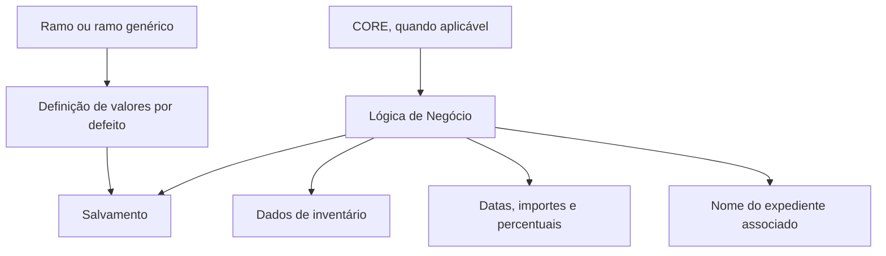

# Definição de Valores Iniciais de Salvamento

## 1. Metadados do Documento
- **Arquivo de Origem:** Não informado; conteúdo bruto fornecido na solicitação.
- **Tipo de Documento:** Especificação funcional.
- **Domínio / Sistema:** Salvamentos; lógica de negócio CORE.
- **Público-Alvo:** Analistas funcionais, desenvolvedores e operadores de salvamentos.
- **Data/Versão Identificada:** Não identificada.

---

## 2. Resumo Executivo & Contexto de Negócio

O documento descreve as propriedades de salvamentos que podem receber valores iniciais ou valores por defeito. O propósito declarado é aumentar a eficácia operacional durante o uso de um salvamento.

A definição dos valores por defeito é associada a um **ramo**. O documento estabelece que pode ser utilizado um ramo genérico quando a configuração precisar ser aplicada a todos os ramos que não possuam definição própria.

As propriedades configuráveis abrangem dados de inventário, nível organizacional, subasta, data estimada de cobrança, valores financeiros, nome do inventário, percentual de acordo e identificação do expediente associado ao salvamento.

Em diversos casos, o documento apresenta o comportamento da lógica de negócio **CORE** como referência: geração de código de subasta por ano e sequência, data de cobrança baseada na data do sistema, valor de pré-venda baseado na avaliação do expediente de recobro e nome de inventário composto por uma etiqueta fixa e pelo número do inventário.

O documento não apresenta detalhes de implementação, métodos HTTP, contratos de integração, persistência, tecnologia, URL, ambiente ou responsáveis pelas lógicas de negócio configuráveis.

---

## 3. Arquitetura, Componentes & Tecnologias Envolvidas

Os componentes e conceitos explicitamente citados são:

| Componente / Conceito | Papel descrito |
| :--- | :--- |
| Salvamento | Entidade para a qual podem ser definidos valores iniciais ou valores por defeito. |
| Propriedades Gerais | Conjunto de propriedades configuráveis para salvamentos. |
| Ramo | Chave do ramo para o qual os valores por defeito são definidos. |
| Ramo genérico | Definição aplicável a todos os ramos sem definição própria. |
| Lógica de Negócio | Mecanismo citado para devolver os valores iniciais de propriedades. |
| CORE | Lógica de negócio referenciada para alguns valores iniciais. |
| Inventário | Elemento associado a código, nome e número de inventário. |
| Expediente de recobro de salvamento | Fonte da avaliação usada pela lógica CORE para o importe de pré-venda. |
| Expediente | Entidade à qual o salvamento pode ser associado. |



> **Nota de Análise:** O documento menciona a lógica CORE, mas não identifica a tecnologia, a arquitetura interna, interfaces, contratos de entrada e saída, métodos de integração ou localização dessa lógica.

---

## 4. Regras de Negócio, Especificações Funcionais & Processos

### 4.1 Aplicação de valores por ramo

1. A propriedade **Ramo** contém a chave do ramo para o qual são definidos valores por defeito das propriedades de salvamentos.
2. Pode ser utilizado um **ramo genérico**.
3. A definição do ramo genérico aplica-se a todos os ramos que não tenham definição própria.

### 4.2 Valores iniciais configuráveis

1. A lógica de negócio de código de inventário devolve o nome do inventário inicial, conforme a descrição literal fornecida.
2. A lógica de negócio de código de nível 3 devolve o terceiro nível inicial.
3. Para código de nível 3, a lógica devolve o nível 3 do usuário que entra para gerar o inventário.
4. A lógica de negócio de código de subasta devolve o código de subasta inicial.
5. A lógica CORE devolve como código de subasta o ano mais um número sequencial.
6. A lógica de negócio de data estimada de cobrança devolve a data estimada de cobrança inicial.
7. A lógica CORE devolve como data estimada de cobrança a data do sistema.
8. A lógica de negócio de importe de pré-venda devolve o importe inicial de pré-venda.
9. A lógica CORE devolve como importe de pré-venda a avaliação do expediente de recobro de salvamento.
10. A lógica de negócio de importe de referência devolve o importe de referência inicial.
11. O importe de referência pode usar, por exemplo, tabelas de depreciação de veículo baseadas em marca, modelo e ano.
12. A lógica de negócio de importe de venda devolve o importe de venda inicial.
13. A lógica de negócio de nome do inventário devolve o nome do inventário inicial.
14. A lógica CORE devolve como nome do inventário um texto fixo contido em uma etiqueta, `Referencia`, concatenado com o número do inventário.
15. A lógica de negócio de percentual de acordo devolve o percentual inicial do acordo em relação ao importe de referência.
16. A lógica de negócio de nome do expediente associado devolve o nome inicial do expediente ao qual o salvamento será associado.
17. O nome do expediente pode ser usado para fornecer mais informação no momento de associar um expediente; o documento exemplifica o uso da matrícula para expedientes de automóveis.
18. Se a lógica de negócio não devolver nenhum valor para o nome do expediente, o sistema exibirá a descrição do tipo de expediente.

---

## 5. Tabelas de Parâmetros, Ambientes e Estruturas de Dados

| Item / Parâmetro | Descrição / Função | Tipo / Valores / Formato | Ambiente / Observações |
| :--- | :--- | :--- | :--- |
| Ramo | Contém a chave do ramo para o qual são definidos valores por defeito das propriedades de salvamentos. | Chave de ramo; formato não detalhado. | Pode usar ramo genérico para ramos sem definição própria. |
| Ramo genérico | Permite uma configuração comum. | Não detalhado. | Aplica-se a todos os ramos sem definição própria. |
| Lógica de negócio de código de inventário | Devolve o nome do inventário inicial, conforme a descrição do documento. | Lógica de negócio; retorno não detalhado. | Há aparente inconsistência entre o nome da propriedade e a descrição do retorno. |
| Lógica de negócio de código de nível 3 | Devolve o terceiro nível inicial. | Lógica de negócio. | CORE devolve o nível 3 do usuário que gera o inventário. |
| Lógica de negócio de código de subasta | Devolve o código de subasta inicial. | Lógica de negócio. | CORE devolve ano mais número sequencial. |
| Lógica de negócio de data estimada de cobrança | Devolve a data estimada de cobrança inicial. | Lógica de negócio; formato de data não detalhado. | CORE devolve a data do sistema. |
| Lógica de negócio de importe de pré-venda | Devolve o importe inicial de pré-venda. | Lógica de negócio; moeda e precisão não detalhadas. | CORE usa a avaliação do expediente de recobro de salvamento. |
| Lógica de negócio de importe de referência | Devolve o importe de referência inicial. | Lógica de negócio; moeda e precisão não detalhadas. | Pode usar tabelas de depreciação de veículo: marca, modelo e ano. |
| Lógica de negócio de importe de venda | Devolve o importe de venda inicial. | Lógica de negócio; moeda e precisão não detalhadas. | Sem comportamento CORE detalhado. |
| Lógica de negócio de nome do inventário | Devolve o nome inicial do inventário. | Lógica de negócio; texto. | CORE usa a etiqueta `Referencia` concatenada com o número do inventário. |
| Lógica de negócio de percentual de acordo | Devolve o percentual inicial de acordo relativo ao importe de referência. | Lógica de negócio; escala e precisão não detalhadas. | Relação explícita com o importe de referência. |
| Lógica de negócio de nome do expediente associado | Devolve o nome inicial do expediente a associar ao salvamento. | Lógica de negócio; texto. | Pode usar matrícula em expedientes de automóveis. Se vazio, exibe descrição do tipo de expediente. |

---

## 6. Bateria de Perguntas & Respostas para RAG (FAQ Sintético)

### P1: Qual é o objetivo da definição de valores iniciais de salvamento?
**R:** O objetivo é identificar quais propriedades de salvamentos podem receber valores iniciais ou valores por defeito, com a finalidade de tornar a operação de um salvamento mais eficaz.

### P2: Como uma definição de valores por defeito é associada a um ramo?
**R:** A propriedade **Ramo** contém a chave do ramo para o qual os valores por defeito das propriedades de salvamento são definidos.

### P3: Quando deve ser utilizado o ramo genérico?
**R:** O ramo genérico pode ser utilizado quando a definição deve ser aplicada a todos os ramos que não tenham uma definição própria.

### P4: Como a lógica CORE obtém o código inicial de nível 3?
**R:** A lógica de negócio CORE devolve como código de nível 3 o nível 3 do usuário que entra para gerar o inventário.

### P5: Como a lógica CORE forma o código inicial de subasta?
**R:** A lógica CORE devolve como código de subasta a combinação do ano com um número sequencial. O documento não detalha o formato textual, o tamanho do número sequencial ou a regra de reinicialização da sequência.

### P6: Qual é a origem da data estimada de cobrança inicial na lógica CORE?
**R:** A lógica de negócio CORE devolve a data do sistema como a data estimada de cobrança inicial.

### P7: Como é definido o importe inicial de pré-venda?
**R:** A lógica de negócio CORE devolve como importe inicial de pré-venda a avaliação do expediente de recobro de salvamento.

### P8: Como pode ser calculado o importe de referência para um veículo?
**R:** O documento indica que o importe de referência pode utilizar tabelas de depreciação de veículo baseadas em marca, modelo e ano. Não informa a fonte dessas tabelas nem a fórmula de cálculo.

### P9: Como a lógica CORE constrói o nome inicial do inventário?
**R:** A lógica CORE devolve um texto fixo contido em uma etiqueta, `Referencia`, concatenado com o número do inventário.

### P10: A que valor está relacionado o percentual inicial do acordo?
**R:** O percentual inicial do acordo é definido em relação ao importe de referência.

### P11: O que ocorre se a lógica de negócio não devolver um nome para o expediente associado?
**R:** Se a lógica não devolver nenhum valor, o sistema mostrará a descrição do tipo de expediente.

### P12: Que informação adicional pode ser usada para identificar um expediente de automóveis?
**R:** O documento apresenta a matrícula como exemplo de informação adicional que pode ser devolvida para auxiliar na associação de um expediente de automóveis.

---

## 7. Glossário de Termos, Siglas & Conceitos-Chave

- **CORE:** Lógica de negócio citada como responsável por devolver valores iniciais para determinadas propriedades. O significado expandido da sigla não é informado.
- **Ramo:** Chave que identifica o ramo ao qual se aplica uma definição de valores por defeito.
- **Ramo genérico:** Configuração aplicável a ramos que não tenham definição própria.
- **Salvamento:** Entidade cujas propriedades podem receber valores iniciais ou valores por defeito.
- **Inventário:** Elemento para o qual o documento descreve código, número e nome iniciais.
- **Nível 3:** Terceiro nível devolvido pela lógica de negócio a partir do usuário que gera o inventário.
- **Subasta:** Código inicial devolvido por uma lógica de negócio; na lógica CORE, é formado pelo ano e por um número sequencial.
- **Importe de pré-venda:** Valor inicial baseado, na lógica CORE, na avaliação do expediente de recobro de salvamento.
- **Importe de referência:** Valor inicial que pode usar tabelas de depreciação de veículo.
- **Importe de venda:** Valor inicial de venda, sem regra adicional detalhada.
- **Percentual de acordo:** Percentual inicial definido em relação ao importe de referência.
- **Expediente:** Registro ao qual o salvamento pode ser associado.
- **Expediente de recobro de salvamento:** Expediente cuja avaliação é usada pela lógica CORE para o importe de pré-venda.
- **Matrícula:** Exemplo de informação adicional para identificar ou associar um expediente de automóveis.

---

## 8. Notas Críticas, Riscos & Limitações

- O documento não informa nome de arquivo, autor, data, versão ou responsáveis.
- Não são detalhados tecnologias, bancos de dados, APIs, URLs, ambientes, permissões, logs ou mecanismos de persistência.
- O documento não define contratos de entrada e saída das lógicas de negócio, nem informa tratamento de erros, validações, tipos de dados, moeda, precisão decimal ou formatos de data.
- Há uma possível inconsistência textual: a propriedade denominada **“Lógica de Negócio que devuelve el código de inventario”** é descrita como devolvendo o nome do inventário inicial.
- A sigla **CORE** é citada, mas não é expandida ou tecnicamente caracterizada.
- A regra de subasta informa “ano mais um número sequencial”, mas não especifica separador, escopo, concorrência, unicidade ou ciclo da sequência.
- As tabelas de depreciação de veículo são citadas apenas como exemplo; fonte, estrutura e governança não são detalhadas.

---

## 9. Conteúdo Bruto Estruturado (Referência Fiel)

```text
--- [PÁGINA 1 DE 2] ---

DEFINICIÓN de Valores Iniciales Salvamento
Objetivo
La finalidad de este documento es conocer a qué propiedades de salvamentos se les puede definir
valores iniciales, valores por defecto, con la finalidad de ser más eficaces cuando se opera con un
salvamento.
Propiedades Generales
Propiedades
Ramo
Este Atributo contiene la Clave del ramo para el que se están definiendo los valores por defecto de
las propiedades de los salvamentos. Se puede utilizar el ramo genérico que indica que la definición
aplica a todos los ramos, que no tengan definición propia.
Lógica de Negocio que devuelve el código de inventario
Esta propiedad contiene la lógica de negocio que devuelve el nombre del inventario inicial.
Lógica de Negocio que devuelve el código de nivel 3
Esta propiedad contiene la lógica de negocio que devuelve el tercer nivel inicial. La lógica de Negocio
devuelve el nivel 3 del usuario que entra a generar el inventario
Lógica de Negocio que devuelve el código de subasta
 /
 CF
Home Solutions APIs Documentation Zeus
EN


--- [PÁGINA 2 DE 2] ---

Esta propiedad contiene la lógica de negocio que devuelve el código de subasta inicial. La lógica de
Negocio de CORE devuelve como código de subasta el año más un número secuencial.
Lógica de Negocio que devuelve la fecha estimada de cobro
Esta propiedad contiene la lógica de negocio que devuelve la fecha estimada de cobro inicial. La
lógica de Negocio de CORE devuelve como fecha estimada de cobro la fecha del sistema.
Lógica de Negocio que devuelve el importe de la pre-venta
Esta propiedad contiene la lógica de negocio que devuelve el importe pre-venta inicial. La lógica de
Negocio de CORE devuelve como importe de pre-venta la valoración del expediente de recobro de
salvamento.
Lógica de Negocio que devuelve importe de referencia
Esta propiedad contiene la lógica de negocio que devuelve el importe referencia inicial. Se puede
utilizar por ejemplo si es un vehículo las tablas de depreciación del vehículo (marca,modelo, año).
Lógica de Negocio que devuelve el importe de venta
Esta propiedad contiene la lógica de negocio que devuelve el importe venta inicial.
Lógica de Negocio que devuelve el nombre del inventario
Esta propiedad contiene la lógica de negocio que devuelve el nombre del inventario inicial. La lógica
de Negocio de CORE devuelve devuelve como nombre de inventario un texto fijo contenido en una
etiqueta (‘Referencia’) concatenado con el número del inventario.
Lógica de Negocio que devuelve el porcentaje del acuerdo
Esta propiedad contiene la lógica de negocio que devuelve el porcentaje acuerdo inicial, con respecto
al importe de referencia.
Lógica de Negocio que el nombre de expediente al que se asocia el salvamento
Esta propiedad contiene la lógica de negocio que devuelve el nombre expediente inicial. Se puede
utilizar para dar más información cuando se va a asociar un expediente. Por ejemplo, matrícula si es
un expediente de automóviles. Si no se devuelve nada mostrará la descripción del tipo de
expediente.
```
