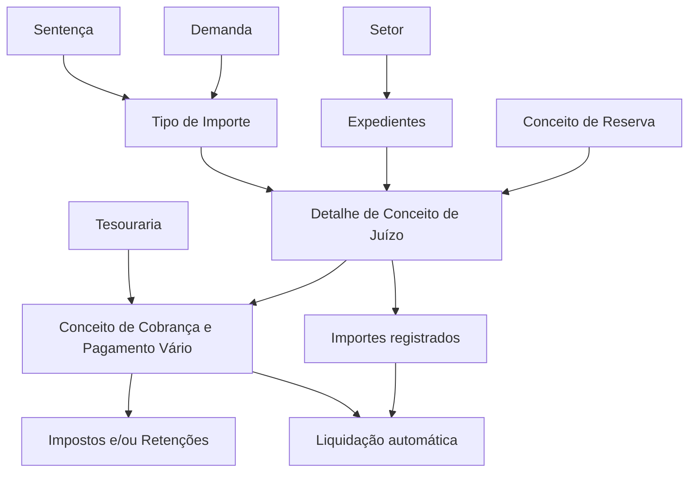

# Definição do Detalhe de Conceitos de Juízo

## 1. Metadados do Documento
- **Arquivo de Origem:** Não identificado
- **Tipo de Documento:** Especificação Funcional
- **Domínio / Sistema:** Juízos, sinistros, tesouraria, liquidações e faturamento
- **Público-Alvo:** Analistas funcionais, desenvolvedores, operação e áreas de tesouraria
- **Data/Versão Identificada:** Não identificada

---

## 2. Resumo Executivo & Contexto de Negócio

O documento descreve a definição de **Detalhes de Conceitos de Juízo**, utilizados para registrar os valores associados à geração de ordens de reparação provenientes de perícias e às operações de faturamento. Os importes registrados representam o detalhamento econômico dos pagamentos associados a processos de juízo.

Cada Detalhe de Conceito é associado a um **Conceito de Cobrança e Pagamento Vário**. Essa associação permite consolidar automaticamente os valores em liquidações: a liquidação é gerada por Conceito de Cobrança e Pagamento Vário, somando todos os conceitos de detalhe vinculados.

Os Conceitos de Cobrança e Pagamento Vário determinam o motivo pelo qual o beneficiário recebe uma liquidação. Para utilização em sinistros, esses conceitos são definidos na tesouraria e podem possuir impostos e/ou retenções associados. A solicitação de impostos ou retenções depende do conceito utilizado, do documento que está sendo pago e do destinatário do pagamento.

A especificação define propriedades de cadastro e comportamento dos Detalhes de Conceitos de Juízo, incluindo setor, conceito de reserva, código, nome, tipo de importe, ordem de apresentação, lógica inicial de cálculo, validação de valor máximo e indicador de habilitação.

---

## 3. Arquitetura, Componentes & Tecnologias Envolvidas

Os elementos funcionais identificados são:

- **Expedientes:** registros aos quais os conceitos de detalhe de juízo são associados.
- **Setor:** chave que identifica o setor dos expedientes abrangidos.
- **Conceito de Reserva:** chave à qual os conceitos de detalhe são associados.
- **Detalhe de Conceito de Juízo:** detalhamento econômico utilizado em ordens de reparação ou faturamento.
- **Conceito de Cobrança e Pagamento Vário:** elemento que define o motivo de pagamento ao beneficiário da liquidação.
- **Liquidação:** resultado automático da soma dos Detalhes de Conceitos associados a um Conceito de Cobrança e Pagamento Vário.
- **Tesouraria:** área onde são definidos os Conceitos de Cobrança e Pagamento Vário utilizáveis em sinistros.
- **Demanda e Sentença:** contextos documentais nos quais determinados importes podem ser solicitados.
- **Impostos e/ou Retenções:** elementos associados aos Conceitos de Cobrança e Pagamento Vário.



**Nota de Análise:** o documento não identifica tecnologias, APIs, bancos de dados, microsserviços, URLs, ambientes, contratos HTTP ou mecanismos técnicos de integração.

---

## 4. Regras de Negócio, Especificações Funcionais & Processos

### 4.1 Finalidade do Detalhe de Conceito de Juízo

1. O Detalhe de Conceito de Juízo é definido para a geração de:
   - Ordens de reparação relacionadas a perícias.
   - Operações de faturamento.
2. Na geração de uma ordem de reparação ou de uma fatura, são registrados importes.
3. Os importes inseridos são associados a Detalhes de Conceitos.
4. Os Detalhes de Conceitos são associados a Conceitos de Cobrança e Pagamento Vário.
5. A associação permite gerar liquidações automaticamente.
6. A liquidação é gerada por Conceito de Cobrança e Pagamento Vário.
7. A liquidação soma todos os conceitos de detalhe vinculados ao mesmo Conceito de Cobrança e Pagamento Vário.

### 4.2 Associação por Setor e Conceito de Reserva

1. A propriedade **Setor** indica a chave do setor ao qual pertencem os expedientes.
2. Os conceitos de detalhe de juízo são associados aos expedientes pertencentes ao setor configurado.
3. A propriedade **Conceito de Reserva** contém a chave do conceito de reserva ao qual os conceitos de detalhe serão associados.
4. Os conceitos de detalhe devem estar definidos no nível de companhia.
5. Os conceitos de detalhe devem estar associados aos tipos de expediente que possuem juízos.

### 4.3 Conceitos de Cobrança e Pagamento Vário

1. O Conceito de Cobrança e Pagamento Vário representa o detalhe pelo qual o beneficiário de uma liquidação será pago.
2. Os conceitos utilizáveis em sinistros são definidos na tesouraria.
3. Podem ser associados impostos e/ou retenções a um Conceito de Cobrança e Pagamento Vário.
4. A solicitação de impostos e/ou retenções ocorre conforme:
   - O Conceito de Cobrança e Pagamento Vário.
   - O documento que está sendo pago.
   - A entidade ou pessoa que receberá o pagamento.

### 4.4 Tipo de Importe

A propriedade **Tipo de Importe** define em qual contexto o importe do Detalhe de Conceito de Juízo será solicitado.

| Código | Contexto de solicitação | Regra | Exemplo citado |
| :--- | :--- | :--- | :--- |
| `D` | Demanda | O importe é solicitado somente na demanda. | Consignação judicial |
| `S` | Sentença | O importe é solicitado somente na sentença. | Importe da Sentença |
| `V` | Vários | O importe é solicitado tanto na sentença quanto na demanda. | Não informado |

### 4.5 Cálculo, Validação e Disponibilidade

1. A propriedade **Importe inicial** contém a lógica de negócio que calcula inicialmente o importe do conceito de detalhe de juízo.
2. A propriedade **Validação do importe** contém a lógica de negócio que valida o importe máximo do conceito de detalhe de juízo.
3. A propriedade **Inabilitado** indica se uma definição está habilitada ou não para utilização.
4. O documento não especifica fórmulas, regras de cálculo, valores máximos, mensagens de erro ou critérios técnicos para as lógicas de importe inicial e validação.

---

## 5. Tabelas de Parâmetros, Ambientes e Estruturas de Dados

| Item / Parâmetro | Descrição / Função | Tipo / Valores / Formato | Ambiente / Observações |
| :--- | :--- | :--- | :--- |
| Setor | Indica a chave do setor ao qual pertencem os expedientes que receberão conceitos de detalhe de juízo. | Chave de setor; formato não informado. | Associado a expedientes. |
| Conceito de Reserva | Indica a chave do conceito de reserva ao qual os conceitos de detalhe serão associados. | Chave de conceito de reserva; formato não informado. | Os conceitos devem ser definidos no nível de companhia e associados a tipos de expediente com juízos. |
| Conceito de Cobrança e Pagamento Vário | Define o detalhe ou motivo pelo qual o beneficiário de uma liquidação será pago. | Conceito econômico; código/formato não informado. | Conceitos usados em sinistros são definidos na tesouraria. |
| Código do Conceito de Detalhe | Contém a chave do conceito de detalhe econômico. | Código ou chave; formato não informado. | Aplicável ao detalhe econômico de juízo. |
| Nome Detalhe do Conceito de Cobrança e Pagamento | Contém o nome do conceito de detalhe econômico do juízo. | Texto; tamanho não informado. | Descrição funcional do detalhe econômico. |
| Tipo de Importe | Define onde será solicitado o importe do detalhe econômico do juízo. | `D` = Demanda; `S` = Sentença; `V` = Vários. | `V` permite solicitação em demanda e sentença. |
| Número de Ordem | Indica como os conceitos de detalhe serão ordenados na tela. | Número; formato não informado. | Controla a ordenação de exibição. |
| Importe inicial | Contém a lógica de negócio que calcula inicialmente o importe do conceito de detalhe de juízo. | Lógica de negócio; fórmula não informada. | O documento menciona um exemplo, mas não o apresenta no conteúdo extraído. |
| Validação do importe | Contém a lógica de negócio que valida o importe máximo do conceito de detalhe de juízo. | Lógica de negócio; limite não informado. | Não há detalhamento de critérios de validação. |
| Inabilitado | Indica se a definição está habilitada para uso. | Indicador de habilitação; valores técnicos não informados. | Quando inabilitado, a definição não está disponível para utilização. |
| Impostos e/ou Retenções | Encargos associados a Conceitos de Cobrança e Pagamento Vário. | Não informado. | Dependem do conceito, documento pago e destinatário do pagamento. |
| Liquidação | Resultado gerado automaticamente por Conceito de Cobrança e Pagamento Vário. | Soma de importes dos conceitos de detalhe. | Processo de consolidação econômica. |

---

## 6. Bateria de Perguntas & Respostas para RAG (FAQ Sintético)

### P1: Qual é a finalidade do Detalhe de Conceito de Juízo?
**R:** O Detalhe de Conceito de Juízo é utilizado para registrar os importes associados à geração de ordens de reparação de perícias e às operações de faturamento. Esses importes representam o detalhamento econômico que será considerado no processo de liquidação.

### P2: Como são geradas as liquidações dos conceitos de detalhe?
**R:** As liquidações são geradas automaticamente por Conceito de Cobrança e Pagamento Vário. Para cada conceito, a liquidação soma todos os importes dos Detalhes de Conceitos que estejam associados a ele.

### P3: O que representa um Conceito de Cobrança e Pagamento Vário?
**R:** Um Conceito de Cobrança e Pagamento Vário representa o detalhe ou motivo pelo qual o beneficiário de uma liquidação receberá um pagamento. Os conceitos utilizados em sinistros são definidos na tesouraria.

### P4: Quais fatores determinam a solicitação de impostos ou retenções?
**R:** A solicitação de impostos e/ou retenções depende do Conceito de Cobrança e Pagamento Vário, do documento que está sendo pago e de quem receberá o pagamento.

### P5: O que a propriedade Setor controla na definição de conceitos de detalhe de juízo?
**R:** A propriedade Setor contém a chave do setor ao qual pertencem os expedientes. Os conceitos de detalhe de juízo são associados aos expedientes pertencentes ao setor informado.

### P6: Qual é a finalidade da propriedade Conceito de Reserva?
**R:** A propriedade Conceito de Reserva identifica a chave do conceito de reserva ao qual os conceitos de detalhe serão associados. Esses conceitos devem estar definidos no nível de companhia e vinculados a tipos de expediente que possuam juízos.

### P7: Em que situações o Tipo de Importe `D` deve ser utilizado?
**R:** O Tipo de Importe `D`, correspondente a Demanda, deve ser utilizado quando o importe do detalhe econômico de juízo precisa ser solicitado exclusivamente durante a demanda. O documento cita “Consignação judicial” como exemplo.

### P8: Em que situações o Tipo de Importe `S` deve ser utilizado?
**R:** O Tipo de Importe `S`, correspondente a Sentença, deve ser utilizado quando o importe do detalhe econômico de juízo deve ser solicitado somente na sentença. O documento cita “Importe de la Sentencia” como exemplo.

### P9: O que significa o Tipo de Importe `V`?
**R:** O Tipo de Importe `V`, correspondente a Vários, determina que o importe do detalhe econômico de juízo deve ser solicitado tanto no contexto de demanda quanto no contexto de sentença.

### P10: Para que serve o Número de Ordem?
**R:** O Número de Ordem determina como os conceitos de detalhe serão ordenados na tela. O documento não detalha se a ordenação é crescente, decrescente ou se existem regras adicionais de prioridade.

### P11: O que é calculado pela propriedade Importe inicial?
**R:** A propriedade Importe inicial contém a lógica de negócio responsável por calcular inicialmente o importe de um conceito de detalhe de juízo. A especificação não fornece a fórmula, os dados de entrada ou as condições dessa lógica.

### P12: Qual é a responsabilidade da Validação do importe?
**R:** A Validação do importe contém a lógica de negócio responsável por validar o importe máximo permitido para um conceito de detalhe de juízo. O documento não especifica os limites, regras de rejeição ou mensagens de validação.

### P13: Como a propriedade Inabilitado afeta uma definição de conceito?
**R:** A propriedade Inabilitado indica se uma definição está habilitada para utilização. Quando a definição não está habilitada, ela não deve estar disponível para uso.

---

## 7. Glossário de Termos, Siglas & Conceitos-Chave

- **Conceito de Cobrança e Pagamento Vário:** detalhe pelo qual um beneficiário receberá o pagamento de uma liquidação.
- **Conceito de Detalhe:** elemento associado a um importe registrado em ordens de reparação ou faturamento.
- **Conceito de Reserva:** chave de reserva à qual os conceitos de detalhe são associados.
- **Demanda:** contexto no qual determinados importes podem ser solicitados, identificado pelo código `D`.
- **Detalhe de Conceito de Juízo:** detalhamento econômico associado aos processos de juízo.
- **Expediente:** registro associado a um setor e a conceitos de detalhe de juízo.
- **Importe:** valor monetário registrado para um conceito de detalhe.
- **Inabilitado:** indicador que informa se uma definição está disponível para utilização.
- **Juízo:** domínio funcional relacionado aos processos que possuem demanda, sentença e conceitos econômicos associados.
- **Liquidação:** consolidação automática dos importes dos conceitos de detalhe associados a um Conceito de Cobrança e Pagamento Vário.
- **Retenção:** elemento associado a um Conceito de Cobrança e Pagamento Vário, solicitado conforme conceito, documento pago e destinatário.
- **Sentença:** contexto no qual determinados importes podem ser solicitados, identificado pelo código `S`.
- **Setor:** chave que identifica o setor de pertencimento dos expedientes.
- **Tesouraria:** área onde são definidos os Conceitos de Cobrança e Pagamento Vário aplicáveis a sinistros.
- **Tipo de Importe:** propriedade que define se o importe será solicitado em Demanda, Sentença ou ambos os contextos.
- **Vários:** valor `V` do Tipo de Importe, aplicável simultaneamente a demanda e sentença.

---

## 8. Notas Críticas, Riscos & Limitações

- O conteúdo não informa o nome do arquivo de origem, versão, data, responsável ou sistema corporativo específico.
- O documento não descreve tecnologias, integrações técnicas, APIs, banco de dados, interfaces, ambientes ou URLs.
- Não são fornecidos formatos, domínios de valores ou obrigatoriedade para chaves de setor, conceitos de reserva, códigos de detalhe e número de ordem.
- A lógica de negócio para **Importe inicial** é mencionada, mas não é detalhada.
- A lógica de negócio para **Validação do importe** é mencionada, mas não contém fórmula, valor máximo, condições de erro ou comportamento em caso de rejeição.
- O documento menciona um “Exemplo” após a propriedade Importe inicial, porém o conteúdo do exemplo não está presente na extração fornecida.
- Não há detalhamento sobre regras de exclusão, alteração, auditoria, versionamento ou vigência dos conceitos.
- Não há detalhamento sobre o comportamento funcional de conceitos inabilitados em registros já existentes.
- **Nota de Análise:** a especificação descreve a associação entre Detalhes de Conceitos e Conceitos de Cobrança e Pagamento Vário, mas não detalha os métodos de configuração, telas, contratos de integração ou persistência desses vínculos.

---

## 9. Conteúdo Bruto Estruturado (Referência Fiel)

```text
--- [PÁGINA 1 DE 3] ---

Definición Detalle de Conceptos Juicio
Objetivo
La finalidad es definir para la generación de órdenes de reparación de las peritaciones o para las
operaciones de la facturación, el detalle por lo que se va a pagar.
A la hora de generar una orden de reparación o de generar una factura, se van registrar importes.
Los importes que se van a introducir están asociados a lo que llamamos detalle de conceptos. Estos
a su vez, estarán asociados a Conceptos de Cobro y Pago Vario. Esta unión nos va a dar la
posibilidad de generar las liquidaciones automáticamente. Las liquidaciones se generarán por
concepto de cobro y pago vario, sumando todos los conceptos de detalle.
Propiedades Generales
Propiedades Generales
Sector
Esta propiedad indica la clave del Sector al que pertenecen los expedientes, a los que se les va a
asociar los conceptos de detalle para los juicios.
Concepto de reserva
Esta propiedad será la clave de Concepto de reserva a la que se le van a asociar los distintos
conceptos de detalle. Estos conceptos tienen que estar definidos a nivel de compañía y asociado a
los tipos de expediente que van a tener juicios.
 /
 CF
Home Solutions APIs Documentation Zeus
EN


--- [PÁGINA 2 DE 3] ---

Concepto de Cobro y Pago Vario
Los conceptos de cobro y pago vario son el detalle por el que se le va a pagar al beneficiario de la
liquidación. Los conceptos que se pueden utilizar en siniestros, se definen en tesorería. A estos
conceptos de cobro y pago vario, también se le asocian los impuestos y/o retenciones. Los
impuestos y/o retenciones se van a pedir en función del concepto de cobro y pago vario, en función
del documento que se esté pagando y en función de a quién se le esté pagando.
Código del Concepto de Detalle
Esta propiedad contendrá la clave del concepto de detalle económico.
Nombre Detalle del Concepto de Cobro y Pago
Esta propiedad contendrá el nombre del concepto de detalle económico del juicio.
Tipo de Importe
En esta propiedad se indicará donde se va a solicitar el importe del detalle económico del juicio. Sus
posibles valores son:
(D)Demanda
(S)Sentencia
(V)Varios
Demanda
Este importe sólo se pedirá en la demanda. Por ejemplo: "Consignación judicial".
(S)Sentencia
Este importe sólo se pedirá en la sentencia. Por ejemplo: "Importe de la Sentencia"
(V)Varios
Este importe se pedirá en la sentencia y en la demanda.
Número de Orden
Esta propiedad indicará como se ordenarán los conceptos de detalle en la pantalla.
Importe inicial
Ejemplo:


--- [PÁGINA 3 DE 3] ---

Esta propiedad contendrá la lógica de negocio que calculará inicialmente el importe del concepto de
detalle del juicio.
Validación del importe
Esta propiedad contendrá la lógica de negocio que validará el importe máximo del concepto de
detalle del juicio.
Inhabilitado
Esta propiedad indica si la definición está o no habilitada para ser utilizado.
```
