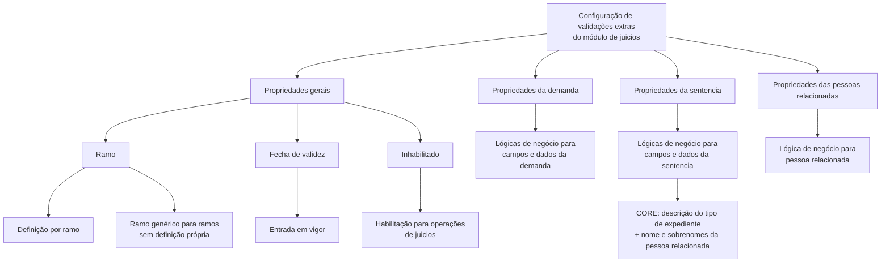

# Definição de Validações de Juicios — Propriedades Extras por Ramo

## 1. Metadados do Documento
- **Arquivo de Origem:** `Não identificado`
- **Tipo de Documento:** `Especificação Técnica`
- **Domínio / Sistema:** `Módulo de juicios`
- **Público-Alvo:** `Não identificado; conteúdo voltado à configuração técnica de validações`
- **Data/Versão Identificada:** `Não identificada`

---

## 2. Resumo Executivo & Contexto de Negócio

O documento descreve as validações extras configuráveis para o módulo de **juicios**. A finalidade declarada é permitir definições diferenciadas por **ramo**, aplicáveis aos atributos e/ou comportamentos dos juicios.

A configuração é dividida em quatro grupos: propriedades gerais, propriedades da demanda, propriedades da sentencia e propriedades das pessoas relacionadas ao juicio. Cada propriedade de validação referencia o nome de uma lógica de negócio responsável por validar um dado específico.

As propriedades gerais controlam o escopo e a vigência da definição. A propriedade **Ramo** identifica para qual ramo as validações são configuradas, incluindo a possibilidade de uso de um ramo genérico para aplicar a configuração a todos os ramos sem definição própria. A propriedade **Fecha de validez** determina quando a definição entra em vigor, enquanto **Inhabilitado** determina se as validações podem ser utilizadas nas operações de juicios.

O documento não informa contratos de API, métodos HTTP, nomes concretos de lógicas de negócio, regras internas de execução, formatos de datas, mensagens de erro ou ambientes técnicos. Ele documenta exclusivamente quais pontos de validação podem ser configurados.

---

## 3. Arquitetura, Componentes & Tecnologias Envolvidas

O conteúdo apresenta uma estrutura de configuração do módulo de juicios baseada em propriedades. Essas propriedades apontam para lógicas de negócio responsáveis por validações de campos ou informações relacionadas à demanda, sentencia e pessoas relacionadas.

Componentes e conceitos identificados:

- **Módulo de juicios:** módulo que utiliza as validações extras configuradas.
- **Ramo:** chave usada para definir o escopo das validações.
- **Ramo genérico:** configuração aplicável aos ramos que não possuem definição própria.
- **Lógica de negócio:** referência nominal para a lógica responsável por uma validação.
- **CORE:** mencionado como responsável por uma lógica que devolve a descrição do tipo de expediente combinada ao nome e sobrenomes da pessoa relacionada.
- **Demanda:** grupo de propriedades de validação relacionadas a autoridade, advogado, juzgado, tipo de juicio, datas e dados da demanda.
- **Sentencia:** grupo de propriedades de validação relacionadas a expediente, tipo de sentencia, datas e dados da sentencia.
- **Pessoas relacionadas ao juicio:** grupo de validação da pessoa relacionada.



> **Nota de Análise:** O documento descreve referências a “lógicas de negócio”, mas não informa os respectivos nomes configurados, assinaturas, regras internas, contratos de entrada ou resultados de validação.

---

## 4. Regras de Negócio, Especificações Funcionais & Processos

### 4.1 Aplicação das validações por ramo

1. A propriedade **Ramo** contém a chave do ramo para o qual são definidas validações extras de atributos e/ou comportamentos dos juicios.
2. Pode ser utilizado um **ramo genérico**.
3. A definição do ramo genérico aplica-se a todos os ramos que não possuírem uma definição própria.
4. O documento não detalha como é determinada a precedência técnica entre uma definição própria e uma definição genérica; apenas informa que a definição genérica se aplica aos ramos sem definição própria.

### 4.2 Vigência e habilitação

1. A propriedade **Fecha de validez** contém a data em que uma definição entra em vigor.
2. A propriedade **Inhabilitado** indica se as validações definidas estão habilitadas ou não para uso nas operações de juicios.
3. O documento não especifica os valores aceitos por **Inhabilitado**, o formato da data de validade ou o comportamento para configurações expiradas.

### 4.3 Validações da demanda

As propriedades da demanda contêm o nome de uma lógica de negócio para validar:

1. Tipo de autoridade.
2. Código de advogado.
3. Código de juzgado.
4. Tipo de juicio.
5. Tipo de actuación.
6. Situación judicial.
7. Fecha de juicio.
8. Fecha de denuncia do juicio.
9. Fecha de demanda.
10. Fecha de reapertura.
11. Código de procurador.
12. Fecha de cálculo de interés.
13. Dados da demanda.

### 4.4 Validações da sentencia

As propriedades da sentencia contêm o nome de uma lógica de negócio para validar:

1. Associação de um expediente ao juicio.
2. Descrição do tipo de expediente.
3. Tipo de sentencia.
4. Fecha de sentencia.
5. Fecha de terminación del juicio.
6. Fecha de pago.
7. Dados da sentencia.

A validação da descrição do tipo de expediente possui uma observação específica: a lógica de negócio de **CORE** devolve a descrição do tipo de expediente concatenada com o nome e os sobrenomes da pessoa relacionada ao tipo de expediente.

### 4.5 Validação de pessoas relacionadas

A propriedade de pessoas relacionadas ao juicio contém o nome de uma lógica de negócio para validar a pessoa relacionada ao juicio.

---

## 5. Tabelas de Parâmetros, Ambientes e Estruturas de Dados

| Item / Parâmetro | Descrição / Função | Tipo / Valores / Formato | Ambiente / Observações |
| :--- | :--- | :--- | :--- |
| Ramo | Contém a chave do ramo para o qual são definidas validações extras de atributos e/ou comportamentos dos juicios. | Chave de ramo; formato não informado. | Pode ser usado um ramo genérico para ramos sem definição própria. |
| Ramo genérico | Define validações aplicáveis a todos os ramos que não possuam definição própria. | Não informado. | Não há detalhamento de precedência além da aplicação a ramos sem definição própria. |
| Fecha de validez | Contém a data em que a definição entra em vigor. | Data; formato não informado. | Aplicável às definições de validação. |
| Inhabilitado | Indica se as validações definidas podem ser utilizadas nas operações de juicios. | Estado de habilitação; valores não informados. | Não são documentados valores possíveis ou comportamento operacional detalhado. |
| Lógica de Negocio validación del tipo autoridad | Referência à lógica de negócio para validar o tipo de autoridade. | Nome de lógica de negócio. | Grupo: Demanda. |
| Lógica de Negocio validación del de abogado | Referência à lógica de negócio para validar o código de advogado. | Nome de lógica de negócio. | Grupo: Demanda. |
| Lógica de Negocio validación del juzgado | Referência à lógica de negócio para validar o código de juzgado. | Nome de lógica de negócio. | Grupo: Demanda. |
| Lógica de Negocio validación del tipo de juicio | Referência à lógica de negócio para validar o tipo de juicio. | Nome de lógica de negócio. | Grupo: Demanda. |
| Lógica de Negocio validación del tipo de actuación | Referência à lógica de negócio para validar o tipo de actuación. | Nome de lógica de negócio. | Grupo: Demanda. |
| Lógica de Negocio validación de la situación judicial | Referência à lógica de negócio para validar a situación judicial. | Nome de lógica de negócio. | Grupo: Demanda. |
| Lógica de Negocio validación de la fecha de juicio | Referência à lógica de negócio para validar a fecha de juicio. | Nome de lógica de negócio. | Grupo: Demanda. |
| Lógica de Negocio validación de la fecha de denuncia | Referência à lógica de negócio para validar a fecha de denuncia do juicio. | Nome de lógica de negócio. | Grupo: Demanda. |
| Lógica de Negocio validación de la fecha de la demanda | Referência à lógica de negócio para validar a fecha de demanda. | Nome de lógica de negócio. | Grupo: Demanda. |
| Lógica de Negocio validación de la fecha reapertura | Referência à lógica de negócio para validar a fecha de reapertura. | Nome de lógica de negócio. | Grupo: Demanda. |
| Lógica de Negocio validación del procurador | Referência à lógica de negócio para validar o código de procurador. | Nome de lógica de negócio. | Grupo: Demanda. |
| Lógica de Negocio validación de la fecha del cálculo de interés | Referência à lógica de negócio para validar a fecha de cálculo de interés. | Nome de lógica de negócio. | Grupo: Demanda. |
| Lógica de Negocio validación de la información de la demanda | Referência à lógica de negócio para validar os dados da demanda. | Nome de lógica de negócio. | Grupo: Demanda. |
| Lógica de Negocio validación en la asociación de un expediente al juicio | Referência à lógica de negócio para validar a associação entre expediente e juicio. | Nome de lógica de negócio. | Grupo: Sentencia. |
| Lógica de Negocio validación de descripción del tipo de Expediente | Referência à lógica de negócio para validar a descrição do tipo de expediente. | Nome de lógica de negócio. | Grupo: Sentencia. A lógica de CORE devolve descrição do tipo de expediente mais nome e sobrenomes da pessoa relacionada. |
| Lógica de Negocio validación del tipo de sentencia | Referência à lógica de negócio para validar o tipo de sentencia. | Nome de lógica de negócio. | Grupo: Sentencia. |
| Lógica de Negocio validación de la fecha de sentencia | Referência à lógica de negócio para validar a fecha de sentencia. | Nome de lógica de negócio. | Grupo: Sentencia. |
| Lógica de Negocio validación de la fecha terminación del juicio | Referência à lógica de negócio para validar a fecha de terminación del juicio. | Nome de lógica de negócio. | Grupo: Sentencia. |
| Lógica de Negocio validación de la fecha de pago | Referência à lógica de negócio para validar a fecha de pago. | Nome de lógica de negócio. | Grupo: Sentencia. |
| Lógica de Negocio validación de información de la sentencia | Referência à lógica de negócio para validar os dados da sentencia. | Nome de lógica de negócio. | Grupo: Sentencia. |
| Lógica de Negocio validación de persona relacionada al juicio | Referência à lógica de negócio para validar a pessoa relacionada ao juicio. | Nome de lógica de negócio. | Grupo: Pessoas relacionadas ao juicio. |

---

## 6. Bateria de Perguntas & Respostas para RAG (FAQ Sintético)

### P1: Qual é a finalidade das validações extras do módulo de juicios?
**R:** A finalidade é permitir a definição de validações extras para atributos e/ou comportamentos dos juicios, com possibilidade de configurações diferentes por ramo.

### P2: Como uma configuração de validação é associada a um ramo?
**R:** A propriedade **Ramo** contém a chave do ramo para o qual as validações extras são definidas. Essa associação permite que atributos e comportamentos dos juicios tenham validações específicas por ramo.

### P3: Quando o ramo genérico deve ser utilizado?
**R:** O ramo genérico pode ser utilizado quando uma definição deve aplicar-se a todos os ramos que não possuem uma definição própria.

### P4: O que determina a entrada em vigor de uma definição de validação?
**R:** A propriedade **Fecha de validez** contém a data em que a definição entra em vigor. O documento não informa o formato dessa data.

### P5: Qual é a função da propriedade Inhabilitado?
**R:** A propriedade **Inhabilitado** indica se as validações definidas estão habilitadas ou não para utilização nas operações de juicios. O documento não especifica os valores aceitos pela propriedade.

### P6: Quais dados da demanda podem possuir lógicas de negócio de validação configuradas?
**R:** Podem possuir lógicas de validação o tipo de autoridade, código de advogado, código de juzgado, tipo de juicio, tipo de actuación, situación judicial, fecha de juicio, fecha de denuncia, fecha de demanda, fecha de reapertura, código de procurador, fecha de cálculo de interés e dados da demanda.

### P7: Existe validação configurável para a associação de um expediente a um juicio?
**R:** Sim. A propriedade **Lógica de Negocio validación en la asociación de un expediente al juicio** contém o nome de uma lógica de negócio para validar a associação de um expediente ao juicio.

### P8: O que a lógica de CORE retorna na validação da descrição do tipo de expediente?
**R:** A lógica de negócio de CORE retorna a descrição do tipo de expediente acrescida do nome e dos sobrenomes da pessoa relacionada ao tipo de expediente.

### P9: Quais validações podem ser configuradas para a sentencia?
**R:** Podem ser configuradas validações para associação de expediente ao juicio, descrição do tipo de expediente, tipo de sentencia, fecha de sentencia, fecha de terminación del juicio, fecha de pago e dados da sentencia.

### P10: Como é validada uma pessoa relacionada ao juicio?
**R:** A propriedade **Lógica de Negocio validación de persona relacionada al juicio** contém o nome de uma lógica de negócio usada para validar a pessoa relacionada ao juicio.

### P11: O documento especifica os métodos HTTP, contratos JSON ou nomes concretos das lógicas de negócio?
**R:** Não. O documento somente indica que cada propriedade contém o nome de uma lógica de negócio para determinada validação; ele não detalha métodos HTTP, contratos JSON, assinaturas, nomes efetivos das lógicas ou formatos de retorno.

---

## 7. Glossário de Termos, Siglas & Conceitos-Chave

- **CORE:** Componente citado como responsável por uma lógica de negócio que devolve a descrição do tipo de expediente juntamente com o nome e os sobrenomes da pessoa relacionada ao tipo de expediente.
- **Demanda:** Grupo de propriedades de validação relacionado a informações como autoridade, advogado, juzgado, tipos, datas e dados da demanda.
- **Expediente:** Elemento associado ao juicio e objeto de validações na seção de sentencia.
- **Fecha de validez:** Data de entrada em vigor da definição.
- **Inhabilitado:** Propriedade que informa se as validações definidas estão habilitadas para uso em operações de juicios.
- **Juzgado:** Entidade cujo código pode ser validado por uma lógica de negócio configurada na demanda.
- **Juicio / Juicios:** Módulo e objeto de negócio ao qual se aplicam as validações extras descritas.
- **Lógica de negócio:** Lógica cujo nome é configurado em uma propriedade para validar um atributo, data, código ou conjunto de dados.
- **Procurador:** Entidade cujo código pode ser validado por uma lógica de negócio configurada na demanda.
- **Ramo:** Chave que define o escopo de uma configuração de validações extras.
- **Ramo genérico:** Configuração aplicável aos ramos sem definição própria.
- **Sentencia:** Grupo de propriedades de validação relacionado a expediente, tipo, datas e dados da sentencia.
- **Situación judicial:** Informação da demanda que pode ser submetida a uma lógica de negócio de validação.
- **Tipo de actuación:** Informação da demanda que pode ser submetida a uma lógica de negócio de validação.

---

## 8. Notas Críticas, Riscos & Limitações

- O documento não identifica o arquivo de origem, versão, data, autor, ambiente ou sistema técnico proprietário.
- Não são informados os nomes efetivos das lógicas de negócio configuradas nas propriedades.
- Não há descrição dos critérios internos, entradas, saídas, mensagens de erro ou resultados esperados para cada lógica de validação.
- Não há especificação de formatos para datas, valores aceitos, obrigatoriedade de campos ou tratamento de exceções.
- O comportamento de precedência entre configurações específicas e genéricas não é descrito além da indicação de que o ramo genérico se aplica a ramos sem definição própria.
- Não são apresentados contratos de API, métodos HTTP, URLs, ambientes, rotas de log, serviços, bancos de dados ou mecanismos de persistência.
- A referência a CORE está limitada ao retorno da lógica de descrição do tipo de expediente; a arquitetura e as interfaces de CORE não são detalhadas.

---

## 9. Conteúdo Bruto Estruturado (Referência Fiel)

```text
--- [PÁGINA 1 DE 4] ---

DEFINICIÓN de Validaciones de Juicios
Objetivo
La finalidad de este documento es conocer que las validaciones extras que se pueden definir para el
módulo de juicios Estas propiedades permiten definiciones diferentes por ramo.
Propiedades Generales
Propiedades Demanda
Propiedades Sentencia
Propiedades Personas Relacionadas
Propiedades Generales
Ramo
Esta propiedad contiene la Clave del ramo para el que se están definiendo las validaciones extras de
los atributos y / o comportamientos de los juicios. Se puede utilizar el ramo genérico que indica que la
definición aplica a todos los ramos, que no tengan definición propia.
Fecha de validez
Esta propiedad contiene fecha en la que la definición entra en vigor.
Inhabilitado
 / 
 CF
Home Solutions APIs Documentation Zeus
EN


--- [PÁGINA 2 DE 4] ---

Esta propiedad indica si las validaciones que están definidas, están habilitadas o no para ser
utilizadas en las operaciones de juicios.
Propiedades de la Demanda
Lógica de Negocio validación del tipo autoridad
Esta propiedad contiene el nombre de una lógica de negocio para la validación tipo autoridad.
Lógica de Negocio validación del de abogado
Esta propiedad contiene el nombre de una lógica de negocio para la validación del código abogado.
Lógica de Negocio validación del juzgado
Esta propiedad contiene el nombre de una lógica de negocio para la validación del código juzgado.
Lógica de Negocio validación del tipo de juicio
Esta propiedad contiene el nombre de una lógica de negocio para la validación del tipo juicio.
Lógica de Negocio validación del tipo de actuación
Esta propiedad contiene el nombre de una lógica de negocio para la validación del tipo actuación.
Lógica de Negocio validación de la situación judicial
Esta propiedad contiene el nombre de una lógica de negocio para la validación del situación judicial.
Lógica de Negocio validación de la fecha de juicio
Esta propiedad contiene el nombre de una lógica de negocio para la validación del fecha juicio.
Lógica de Negocio validación de la fecha de denuncia
Esta propiedad contiene el nombre de una lógica de negocio para la validación del fecha denuncia
juicio.
Lógica de Negocio validación de la fecha de la demanda
Esta propiedad contiene el nombre de una lógica de negocio para la validación del tipo fecha
demanda.
Lógica de Negocio validación de la fecha reapertura
Esta propiedad contiene el nombre de una lógica de negocio para la validación del fecha reapertura.


--- [PÁGINA 3 DE 4] ---

Lógica de Negocio validación del procurador
Esta propiedad contiene el nombre de una lógica de negocio para la validación del código
procurador.
Lógica de Negocio validación de la fecha del cálculo de interés
Esta propiedad contiene el nombre de una lógica de negocio para la validación del fecha calculo
interés.
Lógica de Negocio validación de la información de la demanda
Esta propiedad contiene el nombre de una lógica de negocio para la validación del datos demanda.
Propiedades de la Sentencia
Lógica de Negocio validación en la asociación de un expediente al juicio
Esta propiedad contiene el nombre de una lógica de negocio para la validación del asociación
expediente juicio.
Lógica de Negocio validación de descripción del tipo de Expediente
Esta propiedad contiene el nombre de una lógica de negocio para la validación del descripción tipo
expediente. La lógica de negocio de CORE, devuelve la descripción del tipo de expediente + el
nombre y apellidos de la persona relacionada con el tipo de expediente.
Lógica de Negocio validación del tipo de sentencia
Esta propiedad contiene el nombre de una lógica de negocio para la validación del tipo sentencia.
Lógica de Negocio validación de la fecha de sentencia
Esta propiedad contiene el nombre de una lógica de negocio para la validación del fecha sentencia.
Lógica de Negocio validación de la fecha terminación del juicio
Esta propiedad contiene el nombre de una lógica de negocio para la validación del fecha terminación.
Lógica de Negocio validación de la fecha de pago
Esta propiedad contiene el nombre de una lógica de negocio para la validación del fecha pago.
Lógica de Negocio validación de información de la sentencia
Esta propiedad contiene el nombre de una lógica de negocio para la validación del datos sentencia.


--- [PÁGINA 4 DE 4] ---

Propiedades de las Personas Relacionadas con el juicio
Lógica de Negocio validación de persona relacionada al juicio
Esta propiedad contiene el nombre de una lógica de negocio para la validación del persona
relacionada.
```
