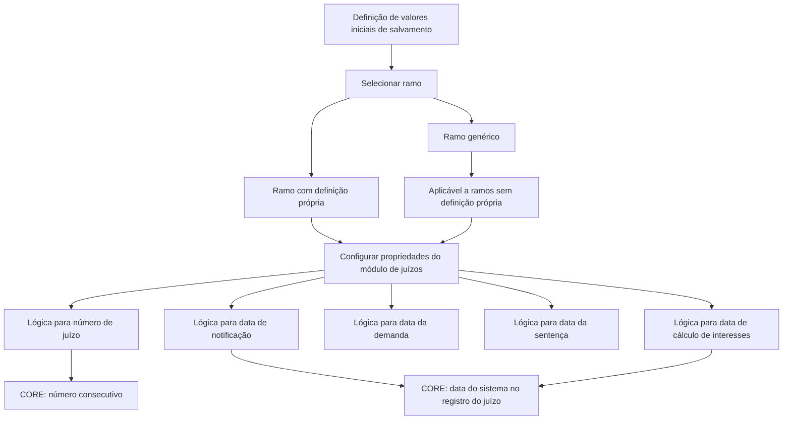

# Definição de Valores Iniciais para Juízos — Propriedades de Salvamentos

## 1. Metadados do Documento
- **Arquivo de Origem:** Não identificado
- **Tipo de Documento:** Especificação Funcional
- **Domínio / Sistema:** Módulo de juízos; propriedades de salvamentos; CORE
- **Público-Alvo:** Desenvolvedores, analistas funcionais e operadores
- **Data/Versão Identificada:** Não identificada

---

## 2. Resumo Executivo & Contexto de Negócio

O documento descreve quais propriedades de salvamentos podem receber valores iniciais ou valores padrão no módulo de juízos. A finalidade declarada é aumentar a eficácia operacional durante o tratamento de um salvamento.

A configuração é definida por ramo. O atributo **Ramo** contém a chave do ramo ao qual os valores padrão das propriedades do módulo de juízos se aplicam. Também pode ser utilizado um ramo genérico, cuja definição é aplicável a todos os ramos que não possuam definição própria.

O documento estabelece propriedades que apontam para lógicas de negócio responsáveis por devolver valores associados ao juízo: número do juízo, data de notificação, data da demanda, data da sentença e data do cálculo de interesses. Para número do juízo e algumas datas, o texto informa comportamentos específicos da lógica de negócio CORE.

A documentação não detalha interfaces, métodos HTTP, contratos JSON, persistência, prioridades entre definições específica e genérica, nem os nomes concretos das lógicas de negócio configuradas.

---

## 3. Arquitetura, Componentes & Tecnologias Envolvidas

Os elementos identificados são:

- **Módulo de juízos:** módulo cujas propriedades recebem valores padrão.
- **Salvamento:** contexto operacional no qual os valores iniciais são utilizados.
- **Ramo:** chave de segmentação da definição de valores padrão.
- **Ramo genérico:** definição aplicável aos ramos sem definição própria.
- **Lógica de negócio:** mecanismo configurado para devolver número ou datas do juízo.
- **CORE:** lógica de negócio citada como fornecedora de número consecutivo ou da data do sistema, conforme a propriedade.



> **Nota de Análise:** O documento menciona a lógica CORE, mas não define a expansão da sigla, sua implementação, sua localização técnica ou a forma de configuração das lógicas de negócio.

---

## 4. Regras de Negócio, Especificações Funcionais & Processos

1. Valores iniciais e valores padrão podem ser definidos para propriedades de salvamentos vinculadas ao módulo de juízos.
2. A finalidade da definição de valores padrão é tornar a operação de um salvamento mais eficaz.
3. A propriedade **Ramo** contém a chave do ramo para o qual estão sendo definidos os valores padrão das propriedades do módulo de juízos.
4. Pode ser utilizado um **ramo genérico**.
5. A definição associada ao ramo genérico aplica-se a todos os ramos que não possuem uma definição própria.
6. A propriedade **Lógica de Negócio que devolve o número de juízo** contém o nome da lógica de negócio responsável por devolver o número de juízo.
7. A lógica de negócio **CORE** devolve um número consecutivo para o número de juízo.
8. A propriedade **Lógica de Negócio que devolve data de notificação** contém o nome da lógica de negócio responsável por devolver a data de notificação.
9. Para a data de notificação, a lógica de negócio **CORE** devolve a data do sistema: a data do dia em que o juízo é registrado.
10. A propriedade **Lógica de Negócio que devolve data da demanda** contém o nome da lógica de negócio responsável por devolver a data da demanda.
11. A propriedade **Lógica de Negócio que devolve data da sentença** contém o nome da lógica de negócio responsável por devolver a data da sentença.
12. A propriedade **Lógica de Negócio que devolve data do cálculo de interesses** contém o nome da lógica de negócio responsável por devolver a data do cálculo de interesses.
13. Para a data do cálculo de interesses, o documento informa que a lógica de negócio **CORE** devolve a data do sistema, isto é, a data do dia em que o juízo é registrado.

---

## 5. Tabelas de Parâmetros, Ambientes e Estruturas de Dados

| Item / Parâmetro | Descrição / Função | Tipo / Valores / Formato | Ambiente / Observações |
| :--- | :--- | :--- | :--- |
| Ramo | Contém a chave do ramo para o qual são definidos valores padrão das propriedades do módulo de juízos. | Chave de ramo; formato não detalhado. | Pode ser ramo específico ou ramo genérico. |
| Ramo genérico | Permite uma definição aplicável a ramos sem definição própria. | Valor de ramo genérico; identificação concreta não detalhada. | Aplicável a todos os ramos sem definição própria. |
| Lógica de Negócio que devolve o número de juízo | Contém o nome da lógica de negócio que devolve o número de juízo. | Nome de lógica de negócio. | CORE devolve um número consecutivo. |
| Lógica de Negócio que devolve data de notificação | Contém o nome da lógica de negócio que devolve a data de notificação. | Nome de lógica de negócio. | CORE devolve a data do sistema, correspondente ao dia de registro do juízo. |
| Lógica de Negócio que devolve data da demanda | Contém o nome da lógica de negócio que devolve a data da demanda. | Nome de lógica de negócio. | O comportamento da lógica CORE para este campo não é detalhado. |
| Lógica de Negócio que devolve data da sentença | Contém o nome da lógica de negócio que devolve a data da sentença. | Nome de lógica de negócio. | O comportamento da lógica CORE para este campo não é detalhado. |
| Lógica de Negócio que devolve data do cálculo de interesses | Contém o nome da lógica de negócio que devolve a data do cálculo de interesses. | Nome de lógica de negócio. | CORE devolve a data do sistema, correspondente ao dia de registro do juízo. |
| CORE | Lógica de negócio mencionada pelo documento. | Nome de lógica; expansão não informada. | Devolve número consecutivo para número de juízo e data do sistema para os comportamentos explicitamente descritos. |

---

## 6. Bateria de Perguntas & Respostas para RAG (FAQ Sintético)

### P1: Qual é a finalidade da definição de valores iniciais para juízos?
**R:** A finalidade é identificar quais propriedades de salvamentos podem receber valores iniciais ou valores padrão, tornando a operação de um salvamento mais eficaz.

### P2: Para que serve o atributo Ramo na definição de valores padrão?
**R:** O atributo Ramo contém a chave do ramo para o qual são definidos os valores padrão das propriedades do módulo de juízos.

### P3: Quando uma definição de ramo genérico deve ser aplicada?
**R:** A definição de ramo genérico pode ser utilizada para que a configuração seja aplicada a todos os ramos que não tenham uma definição própria.

### P4: Como é obtido o número de juízo quando a lógica de negócio configurada é CORE?
**R:** A lógica de negócio CORE devolve um número consecutivo para o número de juízo.

### P5: O que contém a propriedade de lógica de negócio para data de notificação?
**R:** A propriedade contém o nome da lógica de negócio que devolve a data de notificação do juízo.

### P6: Qual data CORE devolve para a data de notificação?
**R:** Para a data de notificação, CORE devolve a data do sistema, ou seja, a data do dia em que o juízo é registrado.

### P7: Como é definida a data da demanda de um juízo?
**R:** A propriedade correspondente contém o nome da lógica de negócio que deve devolver a data da demanda. O documento não detalha o comportamento específico de CORE para essa propriedade.

### P8: Como é definida a data da sentença de um juízo?
**R:** A propriedade correspondente contém o nome da lógica de negócio que deve devolver a data da sentença. O documento não especifica a lógica concreta nem o comportamento de CORE para esse campo.

### P9: Qual é a função da propriedade de data do cálculo de interesses?
**R:** Essa propriedade contém o nome da lógica de negócio responsável por devolver a data do cálculo de interesses.

### P10: Qual valor CORE devolve para a data do cálculo de interesses?
**R:** CORE devolve a data do sistema, definida no documento como a data do dia em que o juízo é registrado.

### P11: O documento descreve contratos técnicos, APIs ou métodos HTTP para as lógicas de negócio?
**R:** Não. O documento apenas descreve que as propriedades contêm o nome das lógicas de negócio e informa alguns comportamentos da lógica CORE.

### P12: O documento define como resolver conflito entre ramo específico e ramo genérico?
**R:** Não explicitamente. O documento informa apenas que o ramo genérico se aplica aos ramos que não possuem definição própria.

---

## 7. Glossário de Termos, Siglas & Conceitos-Chave

- **CORE:** Lógica de negócio citada no documento. Para número de juízo, devolve um número consecutivo; para data de notificação e data do cálculo de interesses, devolve a data do sistema no dia de registro do juízo.
- **Juízo:** Entidade ou registro tratado pelo módulo de juízos. O documento não fornece definição adicional.
- **Módulo de juízos:** Módulo cujas propriedades podem receber valores padrão por ramo.
- **Ramo:** Chave utilizada para definir a quais ramos se aplicam os valores padrão das propriedades do módulo de juízos.
- **Ramo genérico:** Definição que se aplica aos ramos sem definição própria.
- **Salvamento:** Contexto operacional mencionado como beneficiário dos valores iniciais; não possui detalhamento adicional.
- **Lógica de negócio:** Lógica identificada por nome e configurada para devolver valores de propriedades do juízo.

---

## 8. Notas Críticas, Riscos & Limitações

- O documento não identifica o arquivo de origem, data, versão, autor ou sistema corporativo proprietário.
- A expansão e a implementação da lógica de negócio **CORE** não são informadas.
- Não há detalhamento dos formatos de data, regras de fuso horário, tratamento de erro ou comportamento quando uma lógica de negócio não devolve valor.
- Não são descritos contratos de integração, endpoints, APIs, persistência ou estruturas de dados.
- O documento não especifica a precedência técnica entre definição de ramo específico e definição de ramo genérico; apenas afirma que o ramo genérico atende ramos sem definição própria.
- A lógica CORE é explicitamente descrita para número de juízo, data de notificação e data de cálculo de interesses, mas não para data da demanda ou data da sentença.

---

## 9. Conteúdo Bruto Estruturado (Referência Fiel)

```text
--- [PÁGINA 1 DE 2] ---

DEFINICIÓN de Valores Iniciales Juicios
Objetivo
La finalidad de este documento es conocer a qué propiedades de salvamentos se les puede definir
valores iniciales, valores por defecto, con la finalidad de ser más eficaces cuando se opera con un
salvamento.
Propiedades Generales
Propiedades
Ramo
Este Atributo contiene la Clave del ramo para el que se están definiendo los valores por defecto de
las propiedades del módulo de juicios. Se puede utilizar el ramo genérico que indica que la definición
aplica a todos los ramos, que no tengan definición propia.
Lógica de Negocio que devuelve el número de juicio
Esta propiedad contiene el nombre de la lógica de negocio que devuelve el número de juicio. La
lógica de negocio de CORE, devuelve un número consecutivo.
Lógica de Negocio que devuelve fecha notificación
Esta propiedad contiene el nombre de la lógica de negocio que devuelve la fecha notificación. La
lógica de negocio de CORE, devuelve la fecha del sistema, la fecha del día que se registra el juicio.
 /
 CF
Home Solutions APIs Documentation Zeus
EN


--- [PÁGINA 2 DE 2] ---

Lógica de Negocio que devuelve fecha de la demanda
Esta propiedad contiene el nombre de la lógica de negocio que devuelve la fecha demanda.
Lógica de Negocio que devuelve de la sentencia
Esta propiedad contiene el nombre de la lógica de negocio que devuelve la fecha sentencia.
Lógica de Negocio que devuelve del cálculo de intereses
Esta propiedad contiene el nombre de la lógica de negocio que devuelve la fecha cálculo intereses.
La lógica de negocio de CORE, devuelve la fecha del sistema, la fecha del día que se registra el
juicio.
```
