# Definição das Características do Plano de Renda

## 1. Metadados do Documento
- **Arquivo de Origem:** Não identificado no conteúdo fornecido
- **Tipo de Documento:** Especificação Técnica / Manual Funcional
- **Domínio / Sistema:** Módulo de Plano de Renda
- **Público-Alvo:** Analistas funcionais, desenvolvedores, arquitetos e operadores/tramitadores
- **Data/Versão Identificada:** Não identificada

---

## 2. Resumo Executivo & Contexto de Negócio

O documento descreve as propriedades necessárias para definir as características de um **Plano de Renda** e o comportamento dessas propriedades durante a geração de um plano associado a um expediente. A definição está organizada em quatro grupos funcionais: propriedades gerais, propriedades de quotas, propriedades de valores, propriedades de beneficiários e propriedades para cálculo de reserva.

O Plano de Renda determina como pagamentos ou liquidações são distribuídos ao longo do tempo, para cada beneficiário. O módulo permite configurar periodicidade de quotas — anual, mensal ou liquidação única inicial —, número de quotas, existência de quotas extras e lógicas de negócio responsáveis por calcular valores iniciais, valores totais, quotas e valores por beneficiário.

O documento estabelece regras de flexibilidade operacional. Diversas propriedades podem indicar se um tramitador pode modificar determinado valor na geração do plano para um expediente específico, incluindo tipo e número de quotas, percentual inicial, valor inicial, valor total, percentuais de beneficiários e tipo de cálculo de reserva.

A reserva do expediente associado ao Plano de Renda pode ser calculada pelo valor total do plano, pelo valor anual a liquidar ou pelo valor mensal a liquidar. Cada modalidade de reserva possui comportamento próprio em relação às liquidações pagas. A definição também possui uma data de validade, que determina quando entra em vigor.

---

## 3. Arquitetura, Componentes & Tecnologias Envolvidas

O conteúdo não descreve uma arquitetura de software, tecnologias, APIs, bancos de dados, protocolos ou ambientes. O documento especifica exclusivamente o modelo funcional de configuração do módulo **Plano de Renda**.

### Componentes funcionais identificados

| Componente / Conceito | Responsabilidade descrita |
| :--- | :--- |
| Plano de Renda | Entidade cuja definição reúne regras de quotas, importes, beneficiários e reserva. |
| Expediente | Contexto no qual o Plano de Renda é gerado e no qual determinadas propriedades podem ser modificadas. |
| Tramitador | Usuário ou papel que pode modificar propriedades na geração do plano, quando a respectiva configuração permitir. |
| Beneficiário | Destinatário das quotas ou liquidações do Plano de Renda. |
| Risco | Fonte possível dos percentuais de participação dos beneficiários. |
| Póliza | Nível alternativo no qual beneficiários podem ser incluídos, além do nível de risco. |
| Lógica de Negócio | Regra identificada por nome para cálculos ou validações associados ao Plano de Renda. |
| Reserva | Valoração do expediente associada ao Plano de Renda, calculada segundo modalidade total, anual ou mensal. |
| Liquidação | Pagamento gerado conforme quotas e beneficiários configurados. |
| Moeda de reserva do expediente | Moeda na qual devem ser devolvidos o importe inicial calculado e o importe total calculado. |

```mermaid
graph TD
  PR[Definição do Plano de Renda]
  PR --> G[Propriedades Gerais]
  PR --> Q[Propriedades de Quotas]
  PR --> I[Propriedades de Importe Inicial e Total]
  PR --> B[Propriedades de Beneficiários]
  PR --> R[Propriedades de Cálculo de Reserva]
  PR --> V[Data de Validade]

  Q --> QT[Tipo de Quota: Anual, Mensal ou Inicial]
  Q --> NQ[Número de Quotas]
  Q --> QE[Quotas Extras]
  Q --> LQ[Lógica de Negócio de Cálculo da Quota]

  I --> PI[Percentual Inicial]
  I --> II[Importe Inicial]
  I --> LI[Lógica de Negócio para Importe Inicial]
  I --> LT[Lógica de Negócio para Importe Total]

  B --> PB[Percentual de Participação]
  B --> LB[Lógica para Quota por Beneficiário]
  B --> VB[Lógica de Validação de Beneficiários]
  B --> AP[Beneficiários em Nível de Póliza]

  R --> RT[Reserva Total]
  R --> RA[Reserva Anual]
  R --> RM[Reserva Mensal]

  PR --> E[Plano gerado para um Expediente]
  E --> L[Liquidações por Quota e Beneficiário]
  E --> RES[Valoração / Reserva do Expediente]
```



> **Nota de Análise:** O documento menciona “Lógica de Negócio” como referência nominal para cálculos e validações, mas não detalha linguagem de implementação, contratos de entrada e saída, métodos HTTP, serviços responsáveis ou fórmulas internas dessas lógicas.

---

## 4. Regras de Negócio, Especificações Funcionais & Processos

### 4.1 Identificação do Plano de Renda

A propriedade **Código do Plano de Renda** contém a chave de identificação do Plano de Renda cujas características serão definidas.

### 4.2 Regras para quotas e liquidações

O tipo de quota informa às operações do Plano de Renda qual periodicidade de quota será aplicada. O sistema deve gerar tantas liquidações quanto as quotas e os beneficiários indicados.

As modalidades descritas são:

1. **(A) Uma liquidação anual**
   - O Plano de Renda deve gerar uma única quota por ano para cada beneficiário.

2. **(M) Liquidações mensais**
   - O Plano de Renda deve gerar quotas mensalmente para cada beneficiário.

3. **(I) Somente liquidação inicial**
   - O Plano de Renda terá apenas uma quota.
   - O valor total será realizado em uma única liquidação para cada beneficiário.

A propriedade **Permite modificar o tipo de quota** define se o tramitador pode modificar, durante a geração do plano para um expediente, o tipo de quota previamente definido.

A propriedade **Número de quotas** contém o número total de quotas do Plano de Renda. A definição desse número não é obrigatória. Quando não for definido, o número poderá ser informado durante a geração do plano para o expediente ou poderá ser calculado.

A propriedade **Permite modificar o número de quotas** somente se aplica quando um número total de quotas tiver sido definido. Essa propriedade informa se o número poderá ser alterado na geração do Plano de Renda para um expediente.

A propriedade **Lógica de Negócio para cálculo do importe da quota** contém o nome de uma Lógica de Negócio destinada ao cálculo do importe inicial.

A propriedade **O Plano possui quotas extras?** indica se o Plano de Renda contempla quotas extras.

A propriedade **Lógica de Negócio para cálculo de quotas extras** contém o nome de uma Lógica de Negócio para calcular o importe das quotas extras.

### 4.3 Regras para importe inicial e importe total

O Plano de Renda pode prever pagamento inicial por percentual, pagamento inicial por valor fixo, cálculo por Lógica de Negócio ou ausência de quota inicial, conforme as propriedades configuradas.

#### Percentual inicial

A propriedade **Percentual inicial** deve ser usada quando houver necessidade de um pagamento inicial definido como percentual do importe total. Trata-se de um percentual fixo e não é obrigatório.

O documento estabelece que o importe inicial pode ser:
- um percentual do importe total;
- um importe fixo; ou
- inexistente, sem quota inicial.

A propriedade **Permite modificar o percentual inicial** informa se o percentual poderá ser alterado, na geração do plano para um expediente, para cálculo do importe inicial. Caso não tenha sido definido um percentual inicial, o percentual poderá ser modificado.

#### Importe inicial fixo

A propriedade **Importe inicial** permite definir um valor fixo como pagamento inicial para todos os expedientes da modalidade.

As seguintes condições são obrigatórias:
- Se houver percentual inicial definido, não poderá ser definido importe inicial fixo.
- Se houver importe inicial fixo definido, não poderá ser definido percentual inicial.
- A configuração do importe inicial não é obrigatória.

A propriedade **Lógica de Negócio para cálculo do importe inicial do Plano** contém o nome de uma Lógica de Negócio a ser utilizada se o importe inicial resultar de um cálculo. Essa Lógica de Negócio deve devolver o importe na moeda de reserva do expediente.

A propriedade **Permite modificar o importe inicial** determina se o importe inicial calculado no Plano de Renda poderá ser modificado para um expediente concreto.

#### Importe total

A propriedade **Lógica de Negócio para cálculo do importe total do Plano de Renda** contém o nome de uma Lógica de Negócio para calcular o importe total.

O importe total do Plano de Renda:
- deve ser calculado incluindo o importe inicial;
- deve ser devolvido na moeda de reserva do expediente.

A propriedade **Permite modificar o importe total** define se o importe total calculado no Plano de Renda poderá ser modificado para um expediente concreto.

### 4.4 Regras para beneficiários

A propriedade **São registrados os percentuais dos beneficiários?** indica se, ao gerar um Plano de Renda, os beneficiários terão percentuais de participação nas quotas.

Os percentuais de participação dos beneficiários podem:
- ser obtidos da informação de risco; ou
- ser registrados.

Quando a resposta para essa propriedade for **“N”**, será obrigatória uma Lógica de Negócio para calcular as quotas de cada beneficiário.

A propriedade **Permite modificar o percentual dos beneficiários** aplica-se quando for permitido registrar ou obter o percentual de participação de cada beneficiário. Essa propriedade informa se os percentuais poderão ser modificados durante a geração do Plano de Renda.

A propriedade **Lógica de Negócio para cálculo de quota por beneficiário** contém o nome de uma Lógica de Negócio para calcular o importe da quota por beneficiário. Essa Lógica de Negócio é obrigatória quando não forem obtidos os percentuais de participação por beneficiário.

A propriedade **Permite modificar os beneficiários** determina se os beneficiários poderão ser modificados.

A propriedade **Beneficiários em nível de póliza?** indica se é permitido incluir beneficiários no nível da póliza. O documento informa que, normalmente, os beneficiários estão no nível de risco, mas alguns produtos exigiram a inclusão em nível de póliza.

A propriedade **Lógica de Negócio de validação de beneficiários** contém o nome de uma Lógica de Negócio para validar os beneficiários.

### 4.5 Regras para cálculo de reserva

A propriedade **Tipo de cálculo de reserva** define a modalidade de cálculo da reserva do expediente associado ao Plano de Renda. Os valores possíveis são **Total**, **Anual** e **Mensal**.

#### (T) Total

A valoração do expediente associado ao Plano de Renda deve ser realizada pelo total do plano.

A reserva no fim do mês será:

**Reserva de fim de mês = valoração total do plano − liquidações pagas**

#### (A) Anual

A valoração do expediente associado ao Plano de Renda deve ser realizada pelo importe que será liquidado no ano.

A reserva no fim do mês será:

**Reserva de fim de mês = valoração do que será pago na anualidade − liquidações pagas**

#### (M) Mensal

A valoração do expediente associado ao Plano de Renda deve aumentar mensalmente pelo valor que será pago naquele mês.

O documento indica que, dessa forma, a reserva será sempre:

**Reserva = 0, considerando Valorado − Pagado**

A propriedade **Permite modificar o tipo de cálculo de reserva** informa se o tipo de cálculo da reserva poderá ser modificado durante a geração do Plano de Renda para um expediente concreto.

### 4.6 Vigência da definição

A propriedade **Data de validade** contém a data em que a definição entra em vigor.

---

## 5. Tabelas de Parâmetros, Ambientes e Estruturas de Dados

| Item / Parâmetro | Descrição / Função | Tipo / Valores / Formato | Ambiente / Observações |
| :--- | :--- | :--- | :--- |
| Código do Plano de Renda | Chave de identificação do Plano de Renda cuja configuração será definida. | Código / chave de identificação. | Não detalhado. |
| Tipo de quota | Define a periodicidade e o comportamento das liquidações. | `(A)` anual; `(M)` mensal; `(I)` somente liquidação inicial. | O sistema gera liquidações conforme quotas e beneficiários. |
| Uma liquidação anual | Gera uma única quota por ano para cada beneficiário. | Valor de tipo de quota: `(A)`. | Aplicável por beneficiário. |
| Liquidações mensais | Gera quotas todos os meses para cada beneficiário. | Valor de tipo de quota: `(M)`. | Aplicável por beneficiário. |
| Somente liquidação inicial | Gera uma única quota; o importe total é pago em uma única liquidação. | Valor de tipo de quota: `(I)`. | Aplicável por beneficiário. |
| Permite modificar o tipo de quota | Indica se o tramitador pode alterar o tipo de quota na geração do plano. | Indicador de permissão. | Aplicável à geração para expediente. |
| Número de quotas | Define o número total de quotas do Plano de Renda. | Número total de quotas; não obrigatório. | Se ausente, pode ser informado na geração ou calculado. |
| Permite modificar o número de quotas | Indica se o total de quotas definido pode ser alterado. | Indicador de permissão. | Aplicável quando houver número total definido. |
| Lógica de Negócio para cálculo do importe da quota | Nome da Lógica de Negócio para cálculo do importe inicial. | Nome de Lógica de Negócio. | O contrato da lógica não é detalhado. |
| Plano possui quotas extras | Indica se o Plano de Renda contempla quotas extras. | Indicador. | Não detalha critérios de geração. |
| Lógica de Negócio para quotas extras | Nome da Lógica de Negócio para calcular o importe de quotas extras. | Nome de Lógica de Negócio. | Não detalha contrato ou fórmula. |
| Percentual inicial | Percentual fixo do importe total usado como pagamento inicial. | Percentual; não obrigatório. | Não pode coexistir com importe inicial fixo. |
| Permite modificar o percentual inicial | Define se o percentual inicial pode ser modificado na geração do plano. | Indicador de permissão. | Se não houver percentual inicial definido, pode ser modificado. |
| Importe inicial | Valor fixo de pagamento inicial para expedientes da modalidade. | Importe fixo; não obrigatório. | Não pode coexistir com percentual inicial. |
| Lógica de Negócio para importe inicial | Nome da Lógica de Negócio para cálculo do importe inicial. | Nome de Lógica de Negócio. | Deve devolver valor na moeda de reserva do expediente. |
| Permite modificar o importe inicial | Define se o importe inicial calculado pode ser alterado. | Indicador de permissão. | Aplicável a expediente concreto. |
| Lógica de Negócio para importe total | Nome da Lógica de Negócio para cálculo do importe total do plano. | Nome de Lógica de Negócio. | O resultado deve incluir o importe inicial e ser devolvido na moeda de reserva. |
| Permite modificar o importe total | Define se o importe total calculado pode ser alterado. | Indicador de permissão. | Aplicável a expediente concreto. |
| Registro de percentuais dos beneficiários | Indica se há percentuais de participação dos beneficiários nas quotas. | Indicador; o documento cita o valor `N`. | Percentuais podem vir do risco ou ser registrados. |
| Percentual de participação do beneficiário | Participação do beneficiário nas quotas. | Percentual. | Pode ser obtido da informação de risco ou registrado. |
| Permite modificar percentual dos beneficiários | Define se percentuais de participação podem ser modificados. | Indicador de permissão. | Aplicável quando percentuais puderem ser registrados ou obtidos. |
| Lógica de Negócio para quota por beneficiário | Calcula o importe da quota de cada beneficiário. | Nome de Lógica de Negócio. | Obrigatória quando não forem recolhidos percentuais de participação. |
| Permite modificar beneficiários | Define se os beneficiários podem ser alterados. | Indicador de permissão. | Não detalha condições adicionais. |
| Beneficiários em nível de póliza | Permite incluir beneficiários no nível da póliza. | Indicador. | Normalmente os beneficiários estão no nível de risco. |
| Lógica de Negócio de validação de beneficiários | Valida os beneficiários do Plano de Renda. | Nome de Lógica de Negócio. | Regras internas não detalhadas. |
| Tipo de cálculo de reserva | Define a modalidade de valoração e cálculo de reserva. | `(T)` total; `(A)` anual; `(M)` mensal. | Aplicável ao expediente associado ao Plano de Renda. |
| Reserva total | Valora o expediente pelo total do Plano de Renda. | `(T)`. | Reserva fim do mês = valor total do plano − liquidações pagas. |
| Reserva anual | Valora o expediente pelo que será liquidado no ano. | `(A)`. | Reserva fim do mês = valor da anualidade − liquidações pagas. |
| Reserva mensal | Aumenta a valoração mensalmente pelo que será pago naquele mês. | `(M)`. | O documento informa que a reserva é sempre 0: Valorado − Pagado. |
| Permite modificar cálculo de reserva | Define se o tipo de cálculo de reserva pode ser alterado. | Indicador de permissão. | Aplicável na geração para expediente concreto. |
| Data de validade | Data de entrada em vigor da definição. | Data. | Formato não informado. |
| Moeda de reserva do expediente | Moeda de retorno dos cálculos de importe inicial e total. | Moeda do expediente. | Código monetário não especificado. |

---

## 6. Bateria de Perguntas & Respostas para RAG (FAQ Sintético)

### P1: Quais tipos de quota podem ser configurados em um Plano de Renda?
**R:** O documento define três tipos de quota: `(A)` uma liquidação anual, que gera uma única quota por ano para cada beneficiário; `(M)` liquidações mensais, que geram quotas a cada mês para cada beneficiário; e `(I)` somente liquidação inicial, que gera uma única quota e realiza o importe total em uma única liquidação para cada beneficiário.

### P2: Como o sistema determina a quantidade de liquidações de um Plano de Renda?
**R:** O sistema deve gerar tantas liquidações quanto as quotas e os beneficiários indicados. A periodicidade das quotas é determinada pelo tipo de quota configurado como anual, mensal ou liquidação inicial única.

### P3: O número de quotas é obrigatório na definição de um Plano de Renda?
**R:** Não. O número total de quotas não é obrigatório. Quando não for definido na configuração do Plano de Renda, poderá ser informado durante a geração do plano para o expediente ou poderá ser calculado.

### P4: Um Plano de Renda pode possuir percentual inicial e importe inicial fixo simultaneamente?
**R:** Não. O documento estabelece exclusão mútua: se for definido um percentual inicial, não poderá ser definido um importe inicial fixo; se for definido um importe inicial fixo, não poderá ser definido percentual inicial.

### P5: Em qual moeda devem ser devolvidos os cálculos de importe inicial e importe total?
**R:** A Lógica de Negócio que calcula o importe inicial deve devolver o valor na moeda de reserva do expediente. A Lógica de Negócio que calcula o importe total também deve devolver o resultado na moeda de reserva do expediente.

### P6: O importe total do Plano de Renda deve considerar o importe inicial?
**R:** Sim. O documento determina que o importe total do Plano de Renda deve ser calculado incluindo o importe inicial.

### P7: Quando a Lógica de Negócio para cálculo da quota por beneficiário é obrigatória?
**R:** A Lógica de Negócio para cálculo do importe da quota por beneficiário é obrigatória quando não forem recolhidos os percentuais de participação dos beneficiários. O documento também informa que, se a propriedade de registro de percentuais dos beneficiários tiver valor `N`, será obrigatória uma Lógica de Negócio para calcular as quotas de cada beneficiário.

### P8: De onde podem vir os percentuais de participação dos beneficiários?
**R:** Os percentuais de participação dos beneficiários nas quotas podem ser obtidos da informação de risco ou podem ser registrados durante a geração do Plano de Renda, conforme a configuração aplicável.

### P9: Qual é a diferença entre beneficiários em nível de risco e em nível de póliza?
**R:** O documento informa que normalmente os beneficiários estão no nível de risco. Entretanto, a propriedade “Beneficiários a nível de póliza?” permite incluir beneficiários no nível da póliza para produtos que tenham essa necessidade.

### P10: Como é calculada a reserva quando o tipo de cálculo é Total?
**R:** No tipo `(T) Total`, a valoração do expediente associado ao Plano de Renda é feita pelo total do plano. A reserva no fim do mês corresponde à valoração total do plano menos as liquidações pagas.

### P11: Como funciona o cálculo de reserva Anual?
**R:** No tipo `(A) Anual`, a valoração do expediente associado ao Plano de Renda é realizada pelo importe que será liquidado no ano. A reserva no fim do mês é a valoração do que será pago na anualidade menos as liquidações pagas.

### P12: Como funciona o cálculo de reserva Mensal?
**R:** No tipo `(M) Mensal`, a valoração do expediente associado ao Plano de Renda aumenta mensalmente pelo que será pago naquele mês. O documento afirma que, dessa forma, a reserva será sempre 0, considerando “Valorado − Pagado”.

### P13: Quais propriedades podem ser controladas para permitir alteração durante a geração do plano para um expediente?
**R:** O documento prevê propriedades para permitir ou impedir a modificação de: tipo de quota, número de quotas, percentual inicial, importe inicial, importe total, percentuais dos beneficiários, beneficiários e tipo de cálculo de reserva.

---

## 7. Glossário de Termos, Siglas & Conceitos-Chave

- **Plano de Renda:** Entidade cuja configuração define quotas, importes, beneficiários, cálculo de reserva e vigência.
- **Código do Plano de Renda:** Chave de identificação do Plano de Renda configurado.
- **Quota:** Parcela ou unidade de liquidação do Plano de Renda.
- **Liquidação:** Pagamento gerado para cada quota e beneficiário conforme a configuração do plano.
- **Importe Inicial:** Valor de pagamento inicial do Plano de Renda, definido como valor fixo ou calculado.
- **Percentual Inicial:** Percentual fixo do importe total utilizado para determinar o pagamento inicial.
- **Importe Total:** Valor total do Plano de Renda; deve incluir o importe inicial.
- **Quota Extra:** Quota adicional contemplada pelo Plano de Renda quando essa possibilidade estiver configurada.
- **Beneficiário:** Participante que recebe quotas ou liquidações do Plano de Renda.
- **Percentual de Participação:** Participação de um beneficiário nas quotas do Plano de Renda.
- **Expediente:** Contexto associado ao Plano de Renda, para o qual o plano é gerado e em que certas propriedades podem ser modificadas.
- **Tramitador:** Papel que pode modificar propriedades durante a geração do plano, quando permitido pela configuração.
- **Risco:** Fonte possível dos percentuais de participação dos beneficiários.
- **Póliza:** Nível no qual podem ser incluídos beneficiários para determinados produtos.
- **Lógica de Negócio:** Regra identificada por nome que executa cálculos ou validações do Plano de Renda.
- **Reserva:** Valoração do expediente associado ao Plano de Renda, descontadas as liquidações pagas segundo o tipo de cálculo aplicável.
- **Moeda de Reserva do Expediente:** Moeda na qual devem ser retornados os importes inicial e total calculados.
- **(A):** Código usado para “uma liquidação anual” no tipo de quota e para “anual” no tipo de cálculo de reserva.
- **(M):** Código usado para “liquidações mensais” no tipo de quota e para “mensal” no tipo de cálculo de reserva.
- **(I):** Código usado para “somente liquidação inicial”.
- **(T):** Código usado para o tipo de cálculo de reserva “Total”.

---

## 8. Notas Críticas, Riscos & Limitações

- O documento não identifica o arquivo de origem, sistema corporativo, versão, data de emissão, proprietário funcional ou responsáveis técnicos.
- Não são detalhadas tecnologias, serviços, APIs, bancos de dados, integrações, ambientes, URLs, servidores, permissões ou rotas de log.
- As Lógicas de Negócio são mencionadas apenas por finalidade e por nome configurável. O documento não apresenta fórmulas, pseudocódigo, contratos de entrada e saída, estratégia de tratamento de erros ou responsáveis por execução.
- O documento exige que o importe inicial calculado e o importe total calculado sejam devolvidos na moeda de reserva do expediente, mas não define regras de conversão monetária, arredondamento, precisão decimal ou tratamento de moedas.
- A expressão “reserva sempre seria 0. Valorado-Pagado” para o cálculo mensal é reproduzida fielmente; o documento não detalha o momento de atualização da valoração e do pagamento nem os cenários de diferença temporal.
- A propriedade “Lógica de Negócio cálculo importe da quota” é descrita como contendo uma lógica para “cálculo do importe inicial”. Essa associação é mantida por fidelidade ao texto, mas pode exigir validação funcional por possível ambiguidade terminológica.
- Não são descritas regras para o caso de quotas extras combinadas com cada tipo de quota, nem a influência dessas quotas no importe total, na reserva ou na distribuição por beneficiários.
- Não são definidos formatos, limites, obrigatoriedade completa, valores padrão ou validações de entrada para códigos, datas, percentuais, importes e números de quotas.

---

## 9. Conteúdo Bruto Estruturado (Referência Fiel)

```text
--- [PÁGINA 1 DE 5] ---

DEFINICIÓN Características del Plan de Renta
Objetivo
La finalidad de este documento es conocer todas las propiedades que hay que definir para el módulo
de Plan de Renta y su comportamiento.
Propiedades Generales
Propiedades Cuotas
Propiedades Importes
Propiedades Beneficiarios
Propiedades Cálculo Reserva
Propiedades Generales
Código del Plan de Renta
Esta propiedad contiene la clave de identificación del Plan de Renta al que se le va a definir sus
características.
Propiedades de Cuotas
Tipo de Cuota
Esta propiedad indicará a las operaciones del plan de renta, qué tipo de cuota va a tener. El sistema
va a generar tantas liquidaciones como cuotas y beneficiarios, se indique.
 / 
 CF
Home Solutions APIs Documentation Zeus
EN


--- [PÁGINA 2 DE 5] ---

Una liquidación Anual
Liquidaciones Mensuales
Solo liquidación Inicial
(A)Una liquidación Anual
Indica que el Plan de Renta deberá generar una sola cuota por año, para cada beneficiario.
(M)Liquidaciones Mensuales
Indica que el Plan de Renta deberá generar cuotas cada mes, para cada beneficiario.
(I)Solo liquidación Inicial
Indica que el Plan sólo tendrá una cuota, es decir que el importe total se realizará en una sola
liquidación, para cada beneficiario.
Se permite modificar el tipo de Cuota
Esta propiedad indica si a la hora de generar del plan para un expediente, el tramitador puede
modificar el tipo de cuota que se ha definido.
Número de Cuotas
Esta propiedad contendrá el número de cuotas total del Plan. No es obligatorio definir un número de
cuotas. Si no se definen, se podrá introducir en la generación del plan del expediente o calcular.
Se puede Modificar el número de cuotas?
En el caso de que se haya definido el número total de cuotas del Plan de Renta, esta propiedad
indicará si se puede modificar el numero de cuotas cuando se esté generando el Plan de Renta para
un expediente.
Lógica de Negocio cálculo Importe Cuota
Esta propiedad contiene el nombre de una Lógica de Negocio calculo del importe inicial
Tiene Cuotas Extras el Plan?
Indica si el P.R.M contempla o no que haya cuotas extras.
Lógica de Negocio cálculo cuotas Extras
Esta propiedad contiene el nombre de una Lógica de Negocio para el cálculo del importe de las
cuotas extras


--- [PÁGINA 3 DE 5] ---

Propiedades de Importe Inicial e Importe Total
Porcentaje inicial
Si se necesita un pago inicial y este es un porcentaje del importe total, se introducirá un porcentaje
fijo. No es obligatorio. Se puede definir que el importe inicial sea un porcentaje del importe total o un
importe fijo o que no haya cuota inicial.
Se puede Modificar el Porcentaje Inicial?
Esta propiedad indica si se permite modificar el porcentaje, en la generación del plan para un
expediente, para el calculo del importe inicial. Si no se ha definido porcentaje inicial, se podrá
modificar.
Importe Inicial
Si se quisiera definir un importe fijo como pago inicial, se le indicará dicho importe en esta propiedad,
para todos los expedientes de la modalidad. Si se ha definido un porcentaje, no se podrá definir
importe y viceversa. No es obligatorio.
Lógica de Negocio cálculo importe Inicial del Plan
Esta propiedad contiene el nombre de una Lógica de Negocio si el importe inicial fuera producto de
un cálculo. Esta lógica debe devolver el importe en la moneda de reserva del expediente.
Se puede Modificar el Importe Inicial?
Se indica si se puede modificar el importe inicial que se calcula en el Plan de Renta, para algún
expediente en concreto.
Lógica de Negocio cálculo Importe Total del Plan de Renta
Esta propiedad contiene el nombre de una Lógica de Negocio para el cálculo del importe total. Este
importe total del Plan de Renta, debe ser calculado, incluyendo el importe inicial. El importe total se
devolverá en la moneda de reserva del expediente.
Se puede modifica el importe Total?
Esta propiedad está indicando si se puede modificar el importe total que se calcula en el Plan de
Renta, para algún expediente en concreto.
Propiedades de Beneficiarios
Se registra el porcentaje de los beneficiarios?


--- [PÁGINA 4 DE 5] ---

Esta propiedad nos indica si al generar un Plan Renta los beneficiarios van a tener el porcentaje de
participación en las cuotas, estos porcentajes se pueden traer de la información del riesgo o
registrarlos. En caso que sea que ‘N’, se pedirá obligatoriamente una Lógica de cálculo para las
cuotas de cada beneficiario.
Se puede modificar el porcentaje de los Beneficiarios?
En el caso de que se permita registrar o traer el porcentaje de participación de cada beneficiario, esta
propiedad le indicará a la generación del plan de renta si se permite o no modificar dichos
porcentajes.
Lógica de Negocio para el cálculo cuota por Beneficiario
Esta propiedad contiene el nombre de una Lógica de Negocio calculo importe de la cuota por
beneficiario. Esta Lógica será obligatoria en el caso de que no se recojan los porcentajes de
participación por Beneficiario
Se puede Modificar los Beneficiarios?
Esta propiedad indica si se permite modificar beneficiarios.
Beneficiarios a nivel de póliza?
Indica si permite incluir beneficiarios a nivel de póliza, normalmente los beneficiarios están a nivel de
riesgo, pero para algunos productos se vio la necesidad de incluirlos a nivel de póliza
Lógica de Negocio Validación de Beneficiarios
Esta propiedad contiene el nombre de una Lógica de Negocio de validación de los beneficiarios
Propiedades para el Cálculo de Reserva
Tipo Cálculo de Reserva
tipo de calculo de la reserva
Total
Anual
Mensual
(T)Total
Este valor está indicando que la valoración del expediente asociado al Plan de Renta sea por el
total del Plan. La Reserva a fin de mes será la valoración total del plan, menos las liquidaciones
pagadas.


--- [PÁGINA 5 DE 5] ---

(A)Anual
Este valor está indicando que la valoración del expediente asociado al Plan de Renta sea por el
importe que se va a liquidar en el año. La Reserva a fin de mes será la valoración de lo que se
va a pagar en la anualidad, menos las liquidaciones pagadas.
(M)Mensual
Este valor está indicando que la valoración del expediente asociado al Plan de Renta se vaya
incrementando cada mes con lo que se va a pagar ese mes. De esta manera la reserva siempre
sería 0. Valorado-Pagado.
Se puede Modificar el tipo Cálculo de Reserva
Esta propiedad indica si se permite modificar el tipo de calculo de la reserva en la generación del
plan de Renta en un expediente en concreto.
Fecha de validez
Esta propiedad contiene fecha en la que la definición entra en vigor.
```
