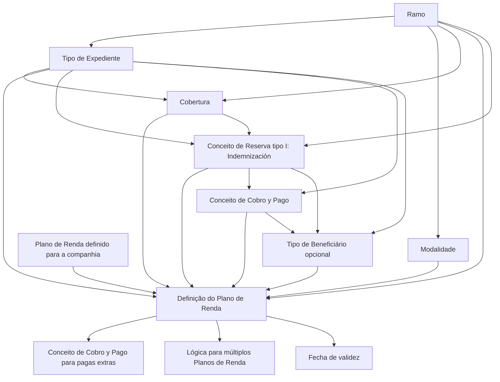

# Definição de Plano de Renda por Tipo de Expediente, Ramo e Modalidade

## 1. Metadados do Documento
- **Arquivo de Origem:** Não identificado — conteúdo bruto fornecido na solicitação
- **Tipo de Documento:** Especificação Técnica
- **Domínio / Sistema:** Plano de Renda por Tipo de Expediente, Ramo e Modalidade
- **Público-Alvo:** Desenvolvedores, Analistas Funcionais, Arquitetos e Operação
- **Data/Versão Identificada:** Não identificada

---

## 2. Resumo Executivo & Contexto de Negócio

O documento define as propriedades necessárias para associar um **Plan de Renta** a tipos de expedientes, considerando o **Ramo**, o **Tipo de Expediente** e a **Modalidad**. O objetivo é configurar as características principais de planos de renda aplicáveis a expedientes que possam possuir esse tipo de plano.

A configuração estabelece a qual cobertura serão associadas as valorações, liquidações e pagamentos do Plano de Renda. Também determina o conceito de reserva e os conceitos de cobrança e pagamento utilizados nas liquidações, pagamentos regulares e quotas extras.

A definição possui dependências explícitas de cadastro prévio. Ramo, Tipo de Expediente, Modalidade, Plano de Renda, Cobertura, Conceito de Reserva e Conceitos de Cobrança e Pagamento devem existir e, em vários casos, já estar associados entre si antes da definição do plano.

O documento também define o comportamento para abertura de múltiplos Planos de Renda para um mesmo expediente, condicionado a uma lógica de negócio específica do Tipo de Expediente. A validade temporal da definição é controlada por uma data de entrada em vigor.

---

## 3. Arquitetura, Componentes & Tecnologias Envolvidas

O conteúdo não descreve arquitetura de software, protocolos, APIs, microsserviços, bancos de dados, ambientes ou tecnologias de implementação. A estrutura abaixo representa exclusivamente as relações funcionais e as validações de associação descritas.



**Nota de Análise:** O documento cita elementos de navegação como “CF”, “Home Solutions”, “APIs Documentation” e “Zeus”, mas não apresenta detalhamento suficiente para classificá-los como sistemas, componentes ou integrações relacionados ao Plano de Renda.

---

## 4. Regras de Negócio, Especificações Funcionais & Processos

1. O Plano de Renda é definido por combinação de **Ramo**, **Tipo de Expediente** e **Modalidade**.
2. O Ramo informado deve possuir Tipos de Expediente definidos.
3. O Tipo de Expediente deve estar definido para o Ramo selecionado.
4. A Modalidade deve existir dentro do Ramo selecionado.
5. É possível informar uma Modalidade genérica para definir um plano genérico para todas as modalidades do Ramo.
6. O Código do Plano de Renda deve estar previamente definido entre os Planos de Renda da companhia.
7. A Cobertura utilizada pelo Plano de Renda deve estar previamente associada ao Ramo e ao Tipo de Expediente.
8. As valorações, liquidações e pagamentos do Plano de Renda são associados à Cobertura configurada.
9. O Conceito de Reserva deve estar previamente associado ao Ramo, ao Tipo de Expediente e às Coberturas previamente indicadas.
10. O Conceito de Reserva configurado para o Plano de Renda deve ser exclusivamente do tipo **“I” — Indemnización**.
11. O Conceito de Cobro y Pago deve estar previamente associado ao Tipo de Expediente e ao Conceito de Reserva indicados.
12. O Tipo de Beneficiário é opcional e define o beneficiário padrão das liquidações do Plano de Renda.
13. Quando informado, o Tipo de Beneficiário deve estar associado ao Tipo de Expediente, ao Conceito de Reserva e ao Conceito de Cobro y Pago vario.
14. Para expedientes de invalidez, o exemplo apresentado indica que o beneficiário pode ser o segurado.
15. Para expedientes de morte, o exemplo apresentado indica que os beneficiários podem ser os registrados no risco ou os herdeiros legais.
16. O conceito de cobrança e pagamento para pagas extras deve ser um conceito de cobro y pago vario associado ao expediente para as quotas extras.
17. A possibilidade de abrir mais de um Plano de Renda por expediente é determinada por uma lógica de negócio configurada para o Tipo de Expediente.
18. A propriedade de múltiplos planos permite definir se expedientes daquele Tipo de Expediente podem ter mais de um Plano de Renda aberto.
19. A Fecha de validez define a data em que a definição entra em vigor.

---

## 5. Tabelas de Parâmetros, Ambientes e Estruturas de Dados

| Item / Parâmetro | Descrição / Função | Tipo / Valores / Formato | Ambiente / Observações |
| :--- | :--- | :--- | :--- |
| Ramo | Indica a chave do Ramo dos Tipos de Expediente aos quais será associado um Plano de Renda. | Chave de Ramo | O Ramo deve possuir Tipos de Expediente definidos. |
| Tipo de Expediente | Indica a chave do Tipo de Expediente para o qual serão definidas as características do Plano de Renda. | Chave de Tipo de Expediente | Deve estar definido para o Ramo informado. |
| Modalidad | Contém a chave da Modalidade usada na definição. | Chave de Modalidade; modalidade genérica permitida | Deve existir dentro do Ramo. A modalidade genérica permite um plano aplicável a todas as modalidades do Ramo. |
| Código del Plan de Renta | Identifica o Plano de Renda a ser associado ao Tipo de Expediente. | Chave de identificação do Plano de Renda | Deve estar definido nos Planos de Renda da companhia. |
| Cobertura | Define a Cobertura à qual serão associadas valorações, liquidações e pagamentos do Plano de Renda. | Chave de Cobertura | Deve estar associada previamente ao Ramo e ao Tipo de Expediente. |
| Concepto de Reserva | Define o Conceito de Reserva associado às valorações, liquidações e pagamentos do Plano de Renda. | Chave de Conceito de Reserva; somente tipo `I` | Deve estar associado previamente ao Ramo, Tipo de Expediente e Coberturas indicadas. `I` significa `Indemnización`. |
| Concepto de Cobro y Pago | Define o conceito de cobrança e pagamento vario associado às liquidações e pagamentos do Plano de Renda. | Chave de conceito de cobro y pago vario | Deve estar associado previamente ao Tipo de Expediente e ao Conceito de Reserva. |
| Tipo de Beneficiario | Define o tipo de beneficiário padrão para as liquidações do Plano de Renda. | Opcional; códigos de beneficiário | Quando informado, deve estar associado ao Tipo de Expediente, Conceito de Reserva e Conceito de Cobro y Pago vario. |
| Concepto de Cobro y Pago para pagas extras | Define o conceito de cobrança e pagamento vario para quotas extras. | Conceito associado ao expediente | Aplicável às quotas extras. |
| Permite abrir más de un Plan de Renta por Expediente | Determina se é permitido abrir mais de um Plano de Renda para expedientes do Tipo de Expediente. | Regra determinada por lógica de negócio | A propriedade contém a lógica de negócio aplicável. |
| Fecha de validez | Define a data de entrada em vigor da definição. | Data | Controla a vigência da configuração. |

### Tipos de Beneficiário permitidos

| Código | Tipo de Beneficiário | Observações documentadas |
| :--- | :--- | :--- |
| 0 | Tomador | — |
| 1 | Tomadores alternos | — |
| 2 | Asegurados | Exemplo de possível beneficiário para expediente de invalidez. |
| 3 | Conductores | — |
| 4 | Propietarios | — |
| 5 | Beneficiarios | — |
| 6 | Beneficiarios vida | — |
| 7 | Proponente | — |
| 8 | Endosatario | — |
| 9 | Preventor | — |
| 11 | Benefs. contingente vida | — |
| 12 | Consorcio | — |
| 13 | Ace | — |
| 14 | Tutor legal | — |
| 20 | Subagentes | — |
| 21 | Pagador | — |
| 22 | Beneficiario irrevocable | — |
| 23 | Beneficiario cesion derechos/pignoracion | — |
| 24 | Beneficiarios legales | Exemplo de possível beneficiário para expediente de morte. |

---

## 6. Bateria de Perguntas & Respostas para RAG (FAQ Sintético)

### P1: Qual é a finalidade da definição de Plano de Renda por Tipo de Expediente, Ramo e Modalidade?
**R:** A finalidade é definir, por Ramo e Modalidade, as características principais do Plano de Renda para cada Tipo de Expediente que possa possuir um Plano de Renda. A definição associa o plano a uma Cobertura, a um Conceito de Reserva e a conceitos de cobrança e pagamento.

### P2: Quais são as pré-condições para informar um Tipo de Expediente em uma definição de Plano de Renda?
**R:** O Tipo de Expediente deve estar previamente definido para o Ramo informado. Além disso, o próprio Ramo precisa possuir Tipos de Expediente definidos.

### P3: É possível criar um Plano de Renda aplicável a todas as modalidades de um Ramo?
**R:** Sim. O documento permite informar uma Modalidade genérica quando se deseja definir um plano genérico para todas as modalidades do Ramo. A Modalidade utilizada deve existir dentro do Ramo.

### P4: Qual é a validação do Código do Plano de Renda?
**R:** O Código do Plano de Renda deve corresponder a um Plano de Renda previamente definido para a companhia. O código é a chave de identificação do plano que será associado ao Tipo de Expediente.

### P5: Que associações devem existir antes de configurar uma Cobertura em um Plano de Renda?
**R:** A Cobertura deve estar previamente associada ao Ramo e ao Tipo de Expediente. A Cobertura é o elemento ao qual serão associadas as valorações, liquidações e pagamentos do Plano de Renda.

### P6: Qual tipo de Conceito de Reserva pode ser utilizado no Plano de Renda?
**R:** O Conceito de Reserva deve ser exclusivamente do tipo `I`, identificado no documento como `Indemnización`. Além disso, esse conceito deve estar previamente associado ao Ramo, ao Tipo de Expediente e às Coberturas indicadas.

### P7: Como o Conceito de Cobro y Pago é validado?
**R:** O Conceito de Cobro y Pago vario associado às liquidações e pagamentos deve estar previamente associado ao Tipo de Expediente e ao Conceito de Reserva definidos na configuração.

### P8: O Tipo de Beneficiário é obrigatório na definição do Plano de Renda?
**R:** Não. O Tipo de Beneficiário é opcional. Quando informado, define o beneficiário padrão para as liquidações do Plano de Renda e deve estar associado ao Tipo de Expediente, ao Conceito de Reserva e ao Conceito de Cobro y Pago vario.

### P9: Quais exemplos de beneficiário são fornecidos para expedientes de invalidez e morte?
**R:** Para um expediente de invalidez, o documento informa que o beneficiário pode ser o segurado. Para um expediente de morte, os beneficiários podem ser aqueles registrados no risco ou os herdeiros legais.

### P10: Para que serve o Conceito de Cobro y Pago para pagas extras?
**R:** Esse campo define o conceito de cobro y pago vario associado ao expediente para o processamento de quotas extras.

### P11: Como é definida a possibilidade de abrir mais de um Plano de Renda para um expediente?
**R:** A possibilidade é determinada por uma lógica de negócio configurada na propriedade “Permite abrir más de un Plan de Renta por Expediente”. Essa lógica define se expedientes daquele Tipo de Expediente podem ter mais de um Plano de Renda aberto.

### P12: O que controla a vigência da definição de Plano de Renda?
**R:** A propriedade “Fecha de validez” contém a data em que a definição entra em vigor.

---

## 7. Glossário de Termos, Siglas & Conceitos-Chave

- **Plan de Renta:** Plano associado a um Tipo de Expediente para definir características de valorações, liquidações e pagamentos.
- **Ramo:** Chave do ramo dos Tipos de Expediente aos quais será associado um Plano de Renda.
- **Tipo de Expediente:** Chave do tipo de expediente para o qual são definidas as características do Plano de Renda.
- **Modalidad:** Chave de modalidade existente dentro de um Ramo; pode ser genérica para aplicação a todas as modalidades do Ramo.
- **Cobertura:** Cobertura à qual são associadas as valorações, liquidações e pagamentos do Plano de Renda.
- **Concepto de Reserva:** Conceito de reserva associado ao Plano de Renda; deve ser do tipo `I`.
- **I — Indemnización:** Tipo obrigatório do Conceito de Reserva utilizado nessa definição.
- **Concepto de Cobro y Pago:** Conceito de cobrança e pagamento vario associado a liquidações e pagamentos do Plano de Renda.
- **Pagas extras:** Quotas extras vinculadas a um conceito de cobro y pago vario associado ao expediente.
- **Tipo de Beneficiario:** Tipo de beneficiário padrão para liquidações do Plano de Renda; configuração opcional.
- **Fecha de validez:** Data em que a definição entra em vigor.
- **Expediente:** Entidade de negócio à qual pode ser associado um Plano de Renda, conforme Tipo de Expediente, Ramo e Modalidade.

---

## 8. Notas Críticas, Riscos & Limitações

- O documento não detalha a implementação técnica, APIs, métodos HTTP, contratos JSON, persistência, interfaces de usuário, controle de acesso ou fluxos de aprovação.
- O documento não apresenta valores de exemplo para Ramo, Tipo de Expediente, Modalidade, Cobertura, Código do Plano de Renda, Conceito de Reserva ou Conceitos de Cobro y Pago.
- A expressão “lógica de negócio” para múltiplos Planos de Renda é mencionada, mas seus critérios, regras condicionais e comportamento operacional não são especificados.
- O Tipo de Beneficiário é opcional, mas sua associação prévia a três elementos — Tipo de Expediente, Conceito de Reserva e Conceito de Cobro y Pago vario — é obrigatória quando utilizado.
- A validade temporal é mencionada apenas como data de entrada em vigor; não há descrição de data de expiração, versionamento, substituição de definições ou tratamento de configurações sobrepostas.
- **Nota de Análise:** O documento lista tipos de beneficiário por código, mas não detalha validações específicas, regras de prioridade ou elegibilidade para cada código.

---

## 9. Conteúdo Bruto Estruturado (Referência Fiel)

```text
--- [PÁGINA 1 DE 3] ---

DEFINICIÓN Plan de Renta por Tipo de
Expediente, Ramo, Modalidad
Objetivo
La finalidad es definir por ramo y modalidad para cada uno de los tipos de expedientes que vayan a
poder tener un Plan de Renta las características principales del Plan. Se definirá a que cobertura del
tipo de expediente se le va a asociar el plan, a que concepto de reserva... etc.
Propiedades Por Ramo
Propiedades por Ramo
Ramo
Esta propiedad indica la clave del Ramo de los tipos de expedientes a los que se le va a asociar un
plan de Renta. Este Ramo tiene que tener definidos tipos de expedientes.
Tipo de Expediente
Esta propiedad indica la clave del Tipo de Expediente al que se va a definir las características. Este
tipo de expediente tiene que estar definido para el Ramo indicado en la propiedad anterior.
Modalidad
Esta propiedad contiene la clave de Modalidad, pudiendo introducir la modalidad genérica, si se
quiere definir un plan genérico para todas las modalidades del Ramo. La modalidad tiene que existir
 / 
 CF
Home Solutions APIs Documentation Zeus
EN


--- [PÁGINA 2 DE 3] ---

dentro del Ramo.
Código del Plan de Renta
Esta propiedad contiene la clave de identificación del Plan de Renta al que se le va a asociar al tipo
de expediente. Tiene que estar definido en los planes de Renta para la compañía.
Cobertura
Esta propiedad contendrá la clave de la Cobertura a la que se le van a asociar las valoraciones,
liquidaciones y pagos del Plan de Renta. Esta cobertura tiene que estar asociada previamente al
Ramo y al Tipo de Expediente.
Concepto de Reserva
concepto de reserva Esta propiedad será la clave de Concepto de reserva a la que se le van a
asociar las valoraciones, liquidaciones y pagos del Plan de Renta. Este concepto tiene que estar
asociado previamente al Ramo, Tipo de Expediente y Coberturas indicadas previamente. Este
concepto de reserva será únicamente del tipo ‘I’ Indemnización.
Concepto de Cobro y Pago
Esta propiedad contendrá la clave del concepto de cobro y pago vario al que se le van a asociar las
liquidaciones y pagos del Plan de Renta. Este concepto tiene que estar asociado previamente al Tipo
de Expediente y Concepto de Reserva indicados previamente.
Tipo de Beneficiario
Esta propiedad indicará el tipo de beneficiario por defecto al que se le va a realizar las liquidaciones
del Plan. No es obligatorio. Si se introduce el tipo de beneficiario tendrá que estar asociado al tipo de
expediente, concepto de reserva y concepto de cobro y pago vario.
Por Ejemplo: Si es un expediente de invalidez puede ser al asegurado, Si es un expediente de
Muerte los beneficiarios registrados en el riesgo o los herederos legales.
(0)Tomador
(1)Tomadores alternos
(2)Asegurados
(3)Conductores
(4)Propietarios
(5)Beneficiarios
(6)Beneficiarios vida
(7)Proponente


--- [PÁGINA 3 DE 3] ---

(8)Endosatario
(9)Preventor
(11)Benefs. contingente vida
(12)Consorcio
(13)Ace
(14)Tutor legal
(20)Subagentes
(21)Pagador
(22)Beneficiario irrevocable
(23)Beneficiario cesion derechos/pignoracion
(24)Beneficiarios legales
Concepto de Cobro y Pago para pagas extras
concepto de cobro y pago vario asociado al expediente para las cuotas extras
Permite abrir más de un Plan de Renta por Expediente?
Se permite abrir más de un Plan de Renta para los expedientes de este Tipo
Lógica de Negocio Permite abrir más de un Plan de Renta por Expediente
Esta propiedad contiene la Lógica de Negocio que determina si se permite abrir más de un Plan de
Renta para el tipo de expediente.
Fecha de validez
Esta propiedad contiene fecha en la que la definición entra en vigor.
```
