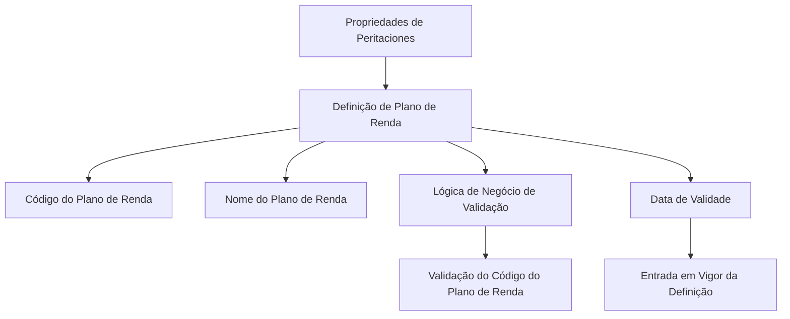

# Definição de Plano de Renda — Propriedades e Validação

## 1. Metadados do Documento
- **Arquivo de Origem:** Não identificado
- **Tipo de Documento:** Especificação Técnica
- **Domínio / Sistema:** Plan de Renta / Peritaciones
- **Público-Alvo:** Negócio, Analistas Funcionais, Desenvolvedores
- **Data/Versão Identificada:** Não identificada

---

## 2. Resumo Executivo & Contexto de Negócio

O documento define as propriedades de peritaciones necessárias para estabelecer os diferentes planos de renda da companhia. O escopo apresentado concentra-se na identificação, descrição, validação e vigência de cada Plano de Renta.

A especificação estabelece que um Plano de Renta possui um código de identificação e um nome descritivo. Esses dois atributos permitem distinguir e descrever as definições de planos existentes.

O documento também prevê uma lógica de negócio associada à validação do código do Plano de Renta. Entretanto, o texto não detalha o nome concreto dessa lógica, seus critérios de validação, nem a implementação técnica utilizada.

A definição possui uma data de validade que indica quando a definição entra em vigor. O documento não informa regras para expiração, alteração retroativa, coexistência de versões ou tratamento de datas inválidas.

---

## 3. Arquitetura, Componentes & Tecnologias Envolvidas

O conteúdo não descreve arquitetura de software, integrações, microsserviços, bancos de dados, APIs, ambientes ou tecnologias. O fluxo funcional explícito relaciona propriedades de peritaciones à definição e à validação de um Plano de Renta.



**Nota de Análise:** O documento não detalha componentes técnicos, contratos de API, métodos HTTP, estruturas JSON, persistência de dados ou tecnologias empregadas.

---

## 4. Regras de Negócio, Especificações Funcionais & Processos

1. A finalidade do documento é identificar quais propriedades de peritaciones são necessárias para definir os diferentes planos de renda da companhia.
2. O **Código do Plano de Renda** contém a chave de identificação do Plano de Renta.
3. O **Nome do Plano de Renda** contém a descrição do Plano de Renta.
4. A **Lógica de negócios de validação do Plano de Renda** contém o nome da lógica de negócio usada para validar o Código do Plano de Renta.
5. A **Data de Validade** contém a data em que a definição do Plano de Renta entra em vigor.

**Nota de Análise:** O documento afirma a existência de uma lógica de validação para o código, mas não informa quais condições tornam um código válido ou inválido.

---

## 5. Tabelas de Parâmetros, Ambientes e Estruturas de Dados

| Item / Parâmetro | Descrição / Função | Tipo / Valores / Formato | Ambiente / Observações |
| :--- | :--- | :--- | :--- |
| Código do Plano de Renda | Chave de identificação do Plano de Renta. | Não informado. | Deve ser validado por uma lógica de negócio identificada na definição. |
| Nome do Plano de Renda | Descrição do Plano de Renta. | Não informado. | O documento não informa tamanho, obrigatoriedade ou idioma. |
| Lógica de negócios de validação do Plano de Renda | Nome da lógica de negócio usada para validar o Código do Plano de Renta. | Nome de lógica de negócio; formato não informado. | Não são descritos critérios, execução ou implementação da validação. |
| Data de Validade | Data em que a definição entra em vigor. | Data; formato não informado. | Não há regras documentadas para expiração ou coexistência de definições. |

---

## 6. Bateria de Perguntas & Respostas para RAG (FAQ Sintético)

### P1: Qual é a finalidade do documento de Definição de Plano de Renda?
**R:** A finalidade do documento é conhecer quais propriedades de peritaciones são necessárias para definir os diferentes planos de renda da companhia.

### P2: Qual propriedade identifica um Plano de Renda?
**R:** O Código do Plano de Renda contém a chave de identificação do Plano de Renta.

### P3: Qual é a função do Nome do Plano de Renda?
**R:** O Nome do Plano de Renda contém a descrição do Plano de Renta.

### P4: Para que serve a lógica de negócios de validação do Plano de Renda?
**R:** A lógica de negócios de validação do Plano de Renda contém o nome da lógica de negócio utilizada para validar o Código do Plano de Renta.

### P5: O documento informa quais regras validam o Código do Plano de Renda?
**R:** Não. O documento informa apenas que existe uma lógica de negócio para validação do código, sem detalhar critérios, condições ou resultados de validação.

### P6: O que representa a Data de Validade na definição de um Plano de Renda?
**R:** A Data de Validade contém a data em que a definição do Plano de Renta entra em vigor.

### P7: O documento especifica o formato da Data de Validade?
**R:** Não. O texto informa apenas que a propriedade contém a data de entrada em vigor da definição.

### P8: O documento define APIs ou integrações para o Plano de Renda?
**R:** Não. O conteúdo disponível não descreve APIs, integrações, microsserviços, métodos HTTP, contratos JSON ou tecnologias de implementação.

### P9: O Código do Plano de Renda é apenas uma descrição?
**R:** Não. O Código do Plano de Renda é a chave de identificação do Plano de Renta. A propriedade descritiva é o Nome do Plano de Renda.

### P10: Quais propriedades gerais são apresentadas para a definição de Plano de Renda?
**R:** O documento apresenta Código do Plano de Renda, Nome do Plano de Renda, Lógica de negócios de validação do Plano de Renda e Data de Validade.

---

## 7. Glossário de Termos, Siglas & Conceitos-Chave

- **Plan de Renta / Plano de Renda:** Entidade cuja definição é composta pelas propriedades gerais apresentadas no documento.
- **Peritaciones:** Contexto de propriedades mencionado como necessário para definir os distintos planos de renda.
- **Código do Plano de Renda:** Chave de identificação do Plano de Renta.
- **Nome do Plano de Renda:** Descrição do Plano de Renta.
- **Lógica de Negócio:** Lógica cujo nome é informado para validar o Código do Plano de Renta.
- **Data de Validade:** Data em que a definição entra em vigor.

---

## 8. Notas Críticas, Riscos & Limitações

- O documento não identifica arquivo de origem, autor, versão ou data.
- Não há detalhamento da lógica de negócio de validação do Código do Plano de Renta.
- Não são especificados tipos de dados, formatos, obrigatoriedade ou valores permitidos para as propriedades.
- Não há informações sobre persistência, interfaces, integrações, ambientes, segurança ou operação.
- O conteúdo não descreve regras de expiração, substituição ou versionamento de definições de Plano de Renta.

---

## 9. Conteúdo Bruto Estruturado (Referência Fiel)

```text
--- [PÁGINA 1 DE 2] ---

/
CF
Home Solutions APIs Documentation Zeus
EN

--- [PÁGINA 2 DE 2] ---

DEFINICIÓN Plan de Renta
Objetivo
La finalidad de este documento es conocer qué propiedades de las peritaciones son necesarias para
definir los distintos planes de renta de la compañía.
Propiedades Generales
Propiedades Generales
Código del Plan de Renta
Esta propiedad contiene la clave de identificación del Plan de Renta.
Nombre del Plan de Renta
Esta propiedad contiene la descripción del Plan de Renta
Lógica de negocios validación Plan de Renta
Esta propiedad contiene el nombre de la lógica de Negocio para la de validación del Código del Plan
de Renta.
Fecha de validez
Esta propiedad contiene fecha en la que la definición entra en vigor.
```
