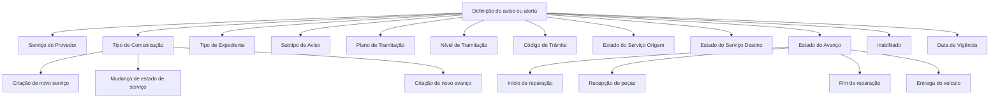

# Definição de Avisos e Alertas para Ordens de Serviço

## 1. Metadados do Documento
- **Arquivo de Origem:** Não informado; conteúdo bruto fornecido no enunciado
- **Tipo de Documento:** Especificação Técnica
- **Domínio / Sistema:** Avisos e alertas de ordens de serviço
- **Público-Alvo:** Analistas funcionais, configuração corporativa, operação e desenvolvimento
- **Data/Versão Identificada:** Não identificada

---

## 2. Resumo Executivo & Contexto de Negócio

O documento define as propriedades necessárias para configurar avisos e alertas associados a ordens de serviço. A finalidade declarada é permitir o recebimento de notificações relacionadas a eventos, alterações de estado e avanços de serviços de fornecedores.

A configuração considera o tipo de serviço prestado pelo fornecedor, incluindo os valores citados `CHAPA`, `LUNAS` e `NEUMÁTICOS`. Também define o tipo de comunicação que deve gerar um aviso: criação de novo serviço, mudança de estado de um serviço ou criação de novo avanço para um serviço.

Os avisos podem ser restringidos por contexto corporativo e processual: tipo de expediente, subtipo de aviso, plano de tramitação, nível de tramitação e código de trâmite. Para tipo de expediente, plano, nível e trâmite, o documento prevê valores genéricos que tornam a definição aplicável a todos os respectivos elementos.

A configuração ainda pode usar estados de serviço de origem e destino, estado de avanço, habilitação e data de vigência. O texto não detalha a implementação técnica do mecanismo de entrega, canais de comunicação, APIs, contratos JSON, persistência de dados ou regras de prioridade dos avisos.

---

## 3. Arquitetura, Componentes & Tecnologias Envolvidas

O conteúdo não descreve arquitetura de software, microsserviços, integrações, ferramentas, protocolos ou ambientes técnicos. O documento apresenta exclusivamente um modelo funcional de definição de avisos para ordens de serviço.

Componentes funcionais identificados:

- **Serviço do Provedor:** classifica o tipo de serviço, como `CHAPA`, `LUNAS` e `NEUMÁTICOS`.
- **Tipo de Comunicação:** determina o evento que pode gerar aviso.
- **Tipo de Expediente:** delimita a aplicabilidade da definição por tipo de expediente da companhia.
- **Subtipo de Aviso:** deve estar definido nos tipos de avisos da companhia.
- **Plano, Nível e Código de Tramitação:** delimitam o contexto processual de uso dos avisos.
- **Estados de Serviço:** permitem condicionar a definição a estados de origem e destino.
- **Estado do Avanço:** identifica marcos operacionais do serviço.
- **Inabilitado e Data de Vigência:** controlam disponibilidade e início de validade da definição.



> **Nota de Análise:** o documento não descreve como a definição de aviso é armazenada, avaliada em tempo de execução ou enviada aos destinatários.

---

## 4. Regras de Negócio, Especificações Funcionais & Processos

1. A definição de avisos deve conter propriedades para identificar o serviço do fornecedor e o tipo de comunicação a ser alertado.
2. O campo **Serviço do Provedor** contém o tipo de serviço. Os exemplos apresentados são `CHAPA`, `LUNAS` e `NEUMÁTICOS`.
3. O campo **Tipo de Comunicação** pode indicar:
   - `(1)` criação de novo serviço;
   - `(2)` mudança de estado de um serviço;
   - `(3)` criação de novo avanço para um serviço.
4. O **Tipo de Expediente** indica a chave do tipo de expediente ao qual serão definidos alertas ou avisos.
   - O tipo de expediente deve estar definido no nível da companhia.
   - Pode conter um tipo de expediente genérico.
   - O tipo genérico torna a definição válida para todos os tipos de expediente.
5. O **Subtipo de Aviso** deve estar definido nos tipos de avisos no nível da companhia.
6. O **Plano de Tramitação** contém a chave do plano no qual os avisos definidos podem ser usados.
   - Pode conter um plano genérico.
   - O plano genérico permite utilizar a definição em todos os planos.
7. O **Nível de Tramitação** contém a chave do nível no qual os avisos definidos podem ser usados.
   - Pode conter um nível genérico.
   - O nível genérico permite utilizar a definição em todos os níveis.
8. O **Código de Trâmite** contém a chave do trâmite no qual os avisos definidos podem ser usados.
   - Pode conter um trâmite genérico.
   - O trâmite genérico permite utilizar a definição em todos os trâmites.
9. O **Estado do Serviço Origem** representa o estado inicial do serviço usado na definição.
10. O **Estado do Serviço Destino** é apresentado como contendo o estado de origem do serviço; entretanto, pelo nome do campo, ele representa o estado de destino. O documento fornece a mesma lista de códigos para ambos os campos.
11. O **Estado do Avanço** identifica o marco de avanço em que o serviço se encontra:
    - início de reparação;
    - recepção de peças;
    - fim de reparação;
    - entrega do veículo.
12. O avanço **Início de reparação** indica que a ordem de serviço de reparação foi iniciada.
13. O avanço **Recepção de peças** indica que a ordem de serviço de reparação está aguardando peças.
14. O avanço **Fim de reparação** indica que a ordem de reparação foi finalizada.
15. O avanço **Entrega do veículo** indica que é aguardada a retirada do veículo.
16. A propriedade **Inabilitado** indica se a definição está habilitada ou não para uso.
17. A propriedade **Data de Vigência** contém a data de entrada em vigor da definição.

---

## 5. Tabelas de Parâmetros, Ambientes e Estruturas de Dados

| Item / Parâmetro | Descrição / Função | Tipo / Valores / Formato | Ambiente / Observações |
| :--- | :--- | :--- | :--- |
| Serviço do Provedor | Contém o tipo de serviço do fornecedor. | `CHAPA`, `LUNAS`, `NEUMÁTICOS`, entre outros não detalhados. | Não informado. |
| Tipo de Comunicação | Define o evento que será alertado. | `(1)` Criação de novo serviço; `(2)` Mudança de estado de um serviço; `(3)` Criação de novo avanço para um serviço. | Não informado. |
| Tipo de Expediente | Contém a chave do tipo de expediente ao qual os alertas ou avisos são definidos. | Chave de tipo de expediente ou tipo genérico. | Deve estar definido no nível da companhia. O tipo genérico é válido para todos os tipos de expediente. |
| Subtipo de Aviso | Identifica o subtipo de aviso. | Não detalhado. | Deve estar definido nos tipos de avisos no nível da companhia. |
| Plano de Tramitação | Contém a chave do plano em que os avisos podem ser utilizados. | Chave de plano ou plano genérico. | O plano genérico permite uso em todos os planos. |
| Nível de Tramitação | Contém a chave do nível em que os avisos podem ser utilizados. | Chave de nível ou nível genérico. | O nível genérico permite uso em todos os níveis. |
| Código de Trâmite | Contém a chave do trâmite em que os avisos podem ser utilizados. | Chave de trâmite ou trâmite genérico. | O trâmite genérico permite uso em todos os trâmites. |
| Estado do Serviço Origem | Contém o estado de origem do serviço. | `ES`, `CA`, `CL`, `EA`, `EE`, `EEW`, `EF`, `FA`, `FN`, `PA`. | Aplicável à definição de avisos. |
| Estado do Serviço Destino | Campo denominado como estado de destino; a descrição textual diz “estado Origen del Servicio”. | `ES`, `CA`, `CL`, `EA`, `EE`, `EEW`, `EF`, `FA`, `FN`, `PA`. | Há inconsistência textual entre o nome do campo e sua descrição. |
| Estado do Avanço | Indica o estado de avanço em que se encontra o serviço. | `(1)` Início de reparação; `(2)` Recepção de peças; `(3)` Fim de reparação; `(4)` Entrega do veículo. | Aplicável a avanços de serviço. |
| Inabilitado | Indica se a definição está habilitada para uso. | Estado de habilitação não detalhado. | Não são informados valores técnicos ou formato. |
| Data de Vigência | Contém a data de entrada em vigor da definição. | Data; formato não informado. | Não é indicado critério de expiração. |

### Estados de Serviço

| Código | Estado do Serviço |
| :--- | :--- |
| `ES` | Asignado |
| `CA` | Cancelado |
| `CL` | Cerrado |
| `EA` | En Espera Asignado |
| `EE` | En Ejecución |
| `EEW` | En Espera En Ejecución |
| `EF` | En Espera Finalizado |
| `FA` | Facturado |
| `FN` | Finalizado |
| `PA` | Pendiente Asignación |

### Estados de Avanço

| Código | Estado do Avanço | Significado descrito |
| :--- | :--- | :--- |
| `(1)` | Inicio de reparación | A ordem de serviço de reparação foi iniciada. |
| `(2)` | Recepción de piezas | A ordem de serviço de reparação está aguardando peças. |
| `(3)` | Fin de reparación | A ordem de reparação foi finalizada. |
| `(4)` | Entrega del vehículo | É aguardada a retirada do veículo. |

---

## 6. Bateria de Perguntas & Respostas para RAG (FAQ Sintético)

### P1: Qual é a finalidade da definição de avisos e alertas para ordens de serviço?
**R:** A finalidade é conhecer e configurar as propriedades necessárias para receber avisos relacionados às ordens de serviço. O documento trata de avisos associados a tipos de serviço, criação de serviços, alterações de estado e criação de avanços.

### P2: Quais tipos de comunicação podem gerar alertas?
**R:** O documento lista três tipos de comunicação: `(1)` criação de novo serviço, `(2)` mudança de estado de um serviço e `(3)` criação de novo avanço para um serviço.

### P3: Quais exemplos de tipos de serviço do fornecedor são apresentados?
**R:** O campo Serviço do Provedor apresenta como exemplos os tipos de serviço `CHAPA`, `LUNAS` e `NEUMÁTICOS`. O texto usa reticências, portanto não declara que essa lista seja exaustiva.

### P4: Qual é a regra para configurar o tipo de expediente de um aviso?
**R:** O tipo de expediente deve estar definido no nível da companhia. A propriedade contém a chave do tipo de expediente ao qual serão definidos alertas ou avisos. Um tipo de expediente genérico pode ser usado para tornar a definição válida para todos os tipos de expediente.

### P5: Como funcionam os valores genéricos para plano, nível e código de trâmite?
**R:** Um plano genérico permite usar a definição em todos os planos de tramitação. Um nível genérico permite uso em todos os níveis. Um trâmite genérico permite uso em todos os trâmites. O documento não especifica quais valores técnicos representam esses genéricos.

### P6: Quais códigos de estado de serviço podem ser usados como estado de origem ou destino?
**R:** O documento lista os códigos `ES`, `CA`, `CL`, `EA`, `EE`, `EEW`, `EF`, `FA`, `FN` e `PA` para estado de serviço de origem e destino. Os significados são, respectivamente: Asignado, Cancelado, Cerrado, En Espera Asignado, En Ejecución, En Espera En Ejecución, En Espera Finalizado, Facturado, Finalizado e Pendiente Asignación.

### P7: O que significa o estado de avanço “Recepción de piezas”?
**R:** “Recepción de piezas” indica que a ordem de serviço de reparação está aguardando peças.

### P8: O que representa o estado de avanço “Entrega del vehículo”?
**R:** “Entrega del vehículo” indica que é aguardada a retirada do veículo.

### P9: O que a propriedade “Inhabilitado” controla?
**R:** A propriedade “Inhabilitado” indica se a definição está ou não habilitada para ser utilizada. O documento não informa os valores possíveis, o tipo de dado ou o comportamento de uma definição inabilitada além de sua não utilização.

### P10: Quando uma definição de aviso começa a valer?
**R:** A propriedade “Fecha de Vigencia” contém a data em que a definição entra em vigor. O documento não informa formato da data, fuso horário, data de término ou regras de tratamento para definições sem vigência.

---

## 7. Glossário de Termos, Siglas & Conceitos-Chave

- **Aviso / Alerta:** notificação cuja definição é configurada para eventos e contextos de ordens de serviço.
- **Serviço do Provedor:** propriedade que identifica o tipo de serviço fornecido.
- **CHAPA:** tipo de serviço citado no documento, sem detalhamento adicional.
- **LUNAS:** tipo de serviço citado no documento, sem detalhamento adicional.
- **NEUMÁTICOS:** tipo de serviço citado no documento, sem detalhamento adicional.
- **Tipo de Comunicação:** evento que determina o aviso: novo serviço, alteração de estado ou novo avanço.
- **Tipo de Expediente:** chave que identifica o tipo de expediente ao qual a definição de alerta se aplica.
- **Plano de Tramitação:** plano no qual os avisos definidos podem ser utilizados.
- **Nível de Tramitação:** nível no qual os avisos definidos podem ser utilizados.
- **Código de Trâmite:** chave do trâmite no qual os avisos definidos podem ser utilizados.
- **Estado do Serviço Origem:** estado inicial do serviço considerado pela definição.
- **Estado do Serviço Destino:** estado final do serviço considerado pela definição, embora a descrição textual repita “estado de origem”.
- **Estado do Avanço:** marco operacional de progresso do serviço.
- **Data de Vigência:** data em que a definição entra em vigor.

---

## 8. Notas Críticas, Riscos & Limitações

- O documento não descreve mecanismos técnicos de emissão, entrega, consumo ou confirmação dos avisos.
- Não há especificação de canais de comunicação, destinatários, templates de mensagem, prioridades, retentativas ou tratamento de falhas.
- Não são definidos formatos de dados para chaves, datas, campos de habilitação ou valores genéricos.
- O campo **Estado do Serviço Destino** possui uma inconsistência: sua descrição afirma que contém o “estado Origen del Servicio”, apesar de o nome indicar estado de destino.
- O documento apresenta a expressão `subtipo aviso plan tramitación`, mas não detalha a estrutura, relacionamento ou valores do subtipo de aviso.
- Não há detalhamento adicional sobre APIs, métodos HTTP, contratos JSON, banco de dados, logs, monitoramento, permissões ou segregação por companhia.

---

## 9. Conteúdo Bruto Estruturado (Referência Fiel)

```text
--- [PÁGINA 1 DE 4] ---

DEFINICIÓN de Avisos Alertas por órdenes de
Servicio
Objetivo
La finalidad de este documento es conocer qué propiedades se necesitan definir para poder recibir
avisos del las órdenes de servicio.
Propiedades Generales
Propiedades
Servicio del Proveedor
Esta propiedad contiene el tipo de servicio
CHAPA
LUNAS
NEUMÁTICOS ...
Tipo de Comunicación
Esta propiedad contiene el tipo de comunicación que se va alertar
(1)Creación de nuevo servicio
(2)Cambio de estado de un servicio
(3)Creacion de nuevo avance para un servicio
 / 
 CF
Home Solutions APIs Documentation Zeus
EN


--- [PÁGINA 2 DE 4] ---

Creación de nuevo servicio
Cambio de estado de un servicio
Creación de nuevo avance para un servicio
Tipo de Expediente
Esta propiedad indica la clave del Tipo de Expediente al que se va a definir las alertas o avisos. Este
tipo de expediente tiene que estar definido a nivel de compañía. Puede contener el tipo de
expediente genérico que indicará que esta definición es válida para todos lo Tipos de Expedientes
Sub-tipo de Aviso
subtipo aviso plan tramitación
Tiene que estar definido en los tipos de avisos a nivel de compañía.
Plan de Tramitación
Esta propiedad contiene la clave del Plan en el que se pueden utilizar los avisos que se están
definiendo. Puede contener el plan genérico que indicará que se podrá utilizar en todos los planes.
Nivel de Tramitación
Esta propiedad contiene la clave del Nivel en el que se puede utilizar los avisos que se están
definiendo. Puede contener el nivel genérico que indicará que se podrá utilizar en todos los niveles.
Código de Tramite
Esta propiedad contiene la clave del Trámite en el que se puede utilizar los avisos que se están
definiendo. Puede contener el trámite genérico que indicará que se podrá utilizar en todos los
trámites.
Estado del Servicio Origen
Esta propiedad contiene el estado Origen del Servicio
ES Asignado
CA Cancelado
CL Cerrado
EA En Espera Asignado


--- [PÁGINA 3 DE 4] ---

EE En Ejecución
EEW En Espera En Ejecución
EF En Espera Finalizado
FA Facturado
FN Finalizado
PA Pendiente Asignación
Estado del Servicio Destino
Esta propiedad contiene el estado Origen del Servicio
ES Asignado
CA Cancelado
CL Cerrado
EA En Espera Asignado
EE En Ejecución
EEW En Espera En Ejecución
EF En Espera Finalizado
FA Facturado
FN Finalizado
PA Pendiente Asignación
Estado del Avance
Esta propiedad indica el estado de avance en la que se encuentra el servicio
(1)Inicio de reparación
(2)Recepción de piezas
(3)Fin de reparación
(4)Entrega del vehículo
Inicio de reparación
Indica que la orden de servicio de reparación se ha iniciado.
Recepción de piezas
Indica que la orden de servicio de reparación está a la espera de piezas


--- [PÁGINA 4 DE 4] ---

Fin de reparación
Indica que se ha finalizado la orden de reparación
Entrega del vehículo
Indica que se se espera la recogida del vehículo
Inhabilitado
Esta propiedad indica si la definición está o no habilitada para ser utilizado.
Fecha de Vigencia
Esta propiedad contiene fecha en la que la definición entra en vigor.
```
