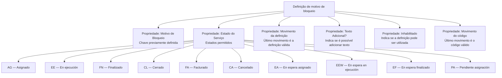

# Definição de Motivos de Bloqueio por Estado do Serviço

## 1. Metadados do Documento
- **Arquivo de Origem:** Não identificado; conteúdo bruto fornecido pelo usuário.
- **Tipo de Documento:** Especificação Técnica.
- **Domínio / Sistema:** Home Solutions APIs Documentation Zeus; definição de motivo de bloqueio de serviço.
- **Público-Alvo:** Desenvolvedores, analistas funcionais, arquitetos e operação.
- **Data/Versão Identificada:** Não identificada.

---

## 2. Resumo Executivo & Contexto de Negócio

O documento define as propriedades necessárias para configurar os motivos de bloqueio permitidos para um serviço conforme o estado operacional do serviço. O objetivo declarado é conhecer quais propriedades são requeridas para associar motivos de bloqueio aos estados de um serviço.

A especificação apresenta uma propriedade de identificação denominada **Motivo de Bloqueio**, cuja chave deve estar previamente definida. Também apresenta a propriedade **Estado do Serviço**, usada para indicar quais estados são permitidos para determinado motivo de bloqueio.

Os estados funcionais identificados abrangem o ciclo de atendimento do serviço, incluindo atribuição a fornecedor, execução, finalização, fechamento, faturamento, cancelamento e diferentes situações de espera ou pendência de atribuição.

O documento também determina mecanismos de versionamento por meio da propriedade **Movimento**. A definição válida é a associada ao último movimento registrado. Há referências separadas a movimento da definição e movimento do código.

---

## 3. Arquitetura, Componentes & Tecnologias Envolvidas

O conteúdo não descreve uma arquitetura de software detalhada, protocolos, métodos HTTP, contratos JSON, bancos de dados, ambientes ou integrações técnicas. O material identifica o contexto **Home Solutions APIs Documentation Zeus**, mas não fornece detalhamento adicional sobre componentes de software.

A relação funcional explicitamente descrita é entre uma definição de motivo de bloqueio e os estados de serviço permitidos para essa definição.



> **Nota de Análise:** O texto cita “Home Solutions APIs Documentation Zeus”, porém não detalha APIs, endpoints, métodos HTTP, formatos de payload, autenticação, tecnologias ou contratos expostos.

---

## 4. Regras de Negócio, Especificações Funcionais & Processos

### 4.1 Objetivo da definição

A finalidade declarada é identificar as propriedades necessárias para definir os motivos de bloqueio de um serviço que são permitidos conforme o estado desse serviço.

### 4.2 Regra de identificação do motivo de bloqueio

- A propriedade **Motivo de Bloqueo** contém a chave de identificação de um motivo de bloqueio de serviço.
- O motivo de bloqueio deve estar definido previamente.
- O documento não especifica o formato, o repositório de cadastro, os critérios de unicidade ou o processo de criação prévia do motivo.

### 4.3 Regra de associação entre motivo de bloqueio e estado do serviço

- A propriedade **Estado del Servicio** contém os estados permitidos para um motivo de bloqueio de serviço.
- O documento lista os seguintes códigos de estado: `AG`, `EE`, `FN`, `CL`, `FA`, `CA`, `EA`, `EEW`, `EF` e `PA`.
- Não há indicação de que todos os estados devem necessariamente ser associados ao mesmo motivo de bloqueio; o texto informa apenas que a propriedade contém os estados permitidos para o motivo.

### 4.4 Estados do serviço

1. **AG — Asignado:** o serviço está atribuído a um fornecedor.
2. **EE — En ejecución:** o serviço está sendo executado pelo fornecedor.
3. **FN — Finalizado:** o fornecedor já finalizou o serviço.
4. **CL — Cerrado:** o serviço encontra-se fechado.
5. **FA — Facturado:** o serviço já foi faturado.
6. **CA — Cancelado:** o serviço está cancelado.
7. **EA — En espera asignado:** o serviço está em espera para ser atribuído a um fornecedor.
8. **EEW — En espera en ejecución:** o serviço está aguardando que o fornecedor o execute.
9. **EF — En espera finalizado:** o serviço está sendo executado e aguardando sua finalização.
10. **PA — Pendiente asignación:** o serviço está pendente de atribuição.

### 4.5 Regra de versionamento por movimento

O documento apresenta duas referências à propriedade **Movimiento**:

- Para a definição: a propriedade informa o número de modificações sofridas pela definição. A definição válida é a correspondente ao último movimento.
- Para o código: a propriedade informa o número de modificações sofridas pelo código. A definição válida é a correspondente ao último movimento.

> **Nota de Análise:** O documento não define se os movimentos da definição e do código pertencem à mesma sequência de versionamento, nem informa o formato numérico, a regra de ordenação ou o comportamento em caso de movimentos duplicados.

### 4.6 Texto adicional

- A propriedade **Texto Adicional?** indica se é possível adicionar texto adicional.
- O documento não informa o formato, tamanho máximo, obrigatoriedade, idioma ou local de armazenamento do texto adicional.

### 4.7 Habilitação de uso

- A propriedade **Inhabilitado** informa se a definição está ou não habilitada para utilização.
- O documento não detalha os valores possíveis, como `true/false`, `sim/não` ou outro formato.
- O documento não especifica o comportamento operacional de uma definição inabilitada.

---

## 5. Tabelas de Parâmetros, Ambientes e Estruturas de Dados

| Item / Parâmetro | Descrição / Função | Tipo / Valores / Formato | Ambiente / Observações |
| :--- | :--- | :--- | :--- |
| Motivo de Bloqueo | Contém a chave de identificação do motivo de bloqueio de um serviço. | Chave de identificação; formato não informado. | O motivo deve estar definido previamente. |
| Estado del Servicio | Contém os estados permitidos para o motivo de bloqueio de serviço. | Códigos de estado: `AG`, `EE`, `FN`, `CL`, `FA`, `CA`, `EA`, `EEW`, `EF`, `PA`. | Não informa cardinalidade ou obrigatoriedade dos estados por motivo. |
| Movimiento — definição | Indica o número de modificações sofridas pela definição. | Número de modificações; formato não informado. | A definição válida é a do último movimento. |
| Texto Adicional? | Indica se é possível acrescentar texto adicional. | Valores e formato não informados. | Sem detalhamento de tamanho, validação ou persistência. |
| Inhabilitado | Indica se a definição está ou não habilitada para uso. | Valores não informados. | Sem detalhamento do efeito funcional de uma definição inabilitada. |
| Movimiento — código | Indica o número de modificações sofridas pelo código. | Número de modificações; formato não informado. | A definição válida é a do último movimento. |

### Estados de Serviço Permitidos

| Código | Nome apresentado | Descrição funcional |
| :--- | :--- | :--- |
| `AG` | Asignado | O serviço está atribuído a um fornecedor. |
| `EE` | En ejecución | O serviço está sendo executado pelo fornecedor. |
| `FN` | Finalizado | O fornecedor já finalizou o serviço. |
| `CL` | Cerrado | O serviço encontra-se fechado. |
| `FA` | Facturado | O serviço já foi faturado. |
| `CA` | Cancelado | O serviço está cancelado. |
| `EA` | En espera asignado | O serviço está em espera para ser atribuído a um fornecedor. |
| `EEW` | En espera en ejecución | O serviço está aguardando que o fornecedor o execute. |
| `EF` | En espera finalizado | O serviço está sendo executado e aguardando sua finalização. |
| `PA` | Pendiente asignación | O serviço está pendente de atribuição. |

---

## 6. Bateria de Perguntas & Respostas para RAG (FAQ Sintético)

### P1: Qual é a finalidade da definição de motivo de bloqueio por estado do serviço?
**R:** A finalidade é conhecer e utilizar as propriedades necessárias para definir os motivos de bloqueio de um serviço permitidos conforme o estado operacional desse serviço.

### P2: O que representa a propriedade “Motivo de Bloqueo”?
**R:** A propriedade “Motivo de Bloqueo” contém a chave de identificação do motivo de bloqueio de um serviço. O documento determina que esse motivo deve estar previamente definido.

### P3: Como a propriedade “Estado del Servicio” é usada na definição de bloqueio?
**R:** A propriedade “Estado del Servicio” contém os estados permitidos para um motivo de bloqueio de serviço. Os estados listados são AG, EE, FN, CL, FA, CA, EA, EEW, EF e PA.

### P4: O que significa o estado AG — Asignado?
**R:** O estado `AG`, denominado “Asignado”, indica que o serviço está atribuído a um fornecedor.

### P5: Qual é a diferença entre os estados EE, FN e CL?
**R:** O estado `EE` indica que o serviço está sendo executado pelo fornecedor. O estado `FN` indica que o fornecedor já finalizou o serviço. O estado `CL` indica que o serviço encontra-se fechado.

### P6: Quais estados representam espera ou pendência de atribuição?
**R:** Os estados relacionados a espera ou pendência são `EA` — “En espera asignado”, quando o serviço está em espera para ser atribuído a um fornecedor; `EEW` — “En espera en ejecución”, quando o serviço aguarda execução pelo fornecedor; `EF` — “En espera finalizado”, quando o serviço está sendo executado e aguarda finalização; e `PA` — “Pendiente asignación”, quando o serviço está pendente de atribuição.

### P7: Como é determinada a definição válida quando existem modificações?
**R:** A propriedade “Movimiento” informa o número de modificações sofridas pela definição. O documento estabelece que a definição válida é a correspondente ao último movimento.

### P8: Como é determinada a versão válida de um código?
**R:** Para o código, a propriedade “Movimiento” indica o número de modificações sofridas. O código ou definição válida é a associada ao último movimento.

### P9: O que a propriedade “Texto Adicional?” informa?
**R:** A propriedade “Texto Adicional?” informa se é possível acrescentar texto adicional à definição. O documento não detalha o formato, o tamanho máximo ou as regras de validação desse texto.

### P10: Qual é a função da propriedade “Inhabilitado”?
**R:** A propriedade “Inhabilitado” informa se a definição está habilitada ou não para ser utilizada. O documento não define os valores técnicos aceitos nem descreve o comportamento de uma definição inabilitada.

### P11: O documento define APIs, endpoints ou contratos JSON para os motivos de bloqueio?
**R:** Não. Embora o texto faça referência a “Home Solutions APIs Documentation Zeus”, ele não apresenta endpoints, métodos HTTP, payloads JSON, autenticação, tecnologias ou contratos de integração.

---

## 7. Glossário de Termos, Siglas & Conceitos-Chave

- **AG:** Código do estado “Asignado”; indica que o serviço está atribuído a um fornecedor.
- **CA:** Código do estado “Cancelado”; indica que o serviço está cancelado.
- **CL:** Código do estado “Cerrado”; indica que o serviço encontra-se fechado.
- **EE:** Código do estado “En ejecución”; indica que o serviço está sendo executado pelo fornecedor.
- **EEW:** Código do estado “En espera en ejecución”; indica que o serviço aguarda execução pelo fornecedor.
- **EA:** Código do estado “En espera asignado”; indica que o serviço está em espera para ser atribuído a um fornecedor.
- **EF:** Código do estado “En espera finalizado”; indica que o serviço está sendo executado e aguarda finalização.
- **FA:** Código do estado “Facturado”; indica que o serviço já foi faturado.
- **FN:** Código do estado “Finalizado”; indica que o fornecedor já finalizou o serviço.
- **Inhabilitado:** Propriedade que indica se uma definição está habilitada para utilização.
- **Motivo de Bloqueo:** Chave de identificação de um motivo de bloqueio de serviço, previamente definido.
- **Movimiento:** Propriedade que registra o número de modificações de uma definição ou código; o último movimento determina a versão válida.
- **PA:** Código do estado “Pendiente asignación”; indica que o serviço está pendente de atribuição.
- **Proveedor:** Fornecedor ao qual o serviço pode ser atribuído ou que pode executar o serviço.
- **Texto Adicional?:** Propriedade que indica se a adição de texto adicional é possível.
- **Zeus:** Nome citado em “Home Solutions APIs Documentation Zeus”; não há definição adicional no conteúdo fornecido.
- **CF:** Sigla exibida no texto bruto após `FN`, em “/ CF”; o documento não fornece definição para `CF`.

---

## 8. Notas Críticas, Riscos & Limitações

- O documento não informa o nome do arquivo de origem, data, versão, autor, área responsável ou histórico de revisões.
- Não há detalhamento técnico de APIs, endpoints, contratos de dados, mecanismos de persistência, autenticação ou autorização.
- Não são informados formatos, tipos de dados, valores permitidos ou regras de validação para **Motivo de Bloqueo**, **Movimiento**, **Texto Adicional?** e **Inhabilitado**.
- A sigla `CF` aparece no texto bruto, mas não é definida nem descrita entre os estados apresentados.
- Não há uma máquina de estados formal, transições permitidas, estados iniciais, estados finais ou regras de bloqueio específicas por combinação entre motivo e estado.
- O documento afirma que a versão válida é a do último movimento, mas não define como identificar o último movimento em caso de concorrência, duplicidade, exclusão ou ordenação inconsistente.
- O trecho final contém “Ejemplo:” seguido de abertura de bloco de código, sem conteúdo de exemplo disponível.

---

## 9. Conteúdo Bruto Estruturado (Referência Fiel)

```text
--- [PÁGINA 1 DE 3] ---

EN CONSTRUCCIÓN
DEFINICIÓN Motivo de Bloqueo según el
Estado del Servicio
Objetivo
La finalidad de este documento es conocer qué propiedades son necesarias para definir los motivos
de bloqueos de un servicio permitidos por estado del mismo
Propiedades Generales
Propiedades Generales
Motivo de Bloqueo
Esta propiedad contiene la clave de identificación del motivo del bloqueo de un servicio. El motivo,
tiene que estar definido previamente.
Estado del Servicio
Esta propiedad contiene los estados permitidos para el motivo del bloqueo del servicio:
(AG)Asignado
(EE)En ejecución
(FN)Finalizado
 / 
 CF
Home Solutions APIs Documentation Zeus
EN


--- [PÁGINA 2 DE 3] ---

(CL)Cerrado
(FA)Facturado
(CA)Cancelado
(EA)En espera asignado
(EEW)En espera en ejecución
(EF)En espera finalizado
(PA)Pendiente asignación
Asignado
El servicio está asignado a un proveedor.
En ejecución
El servicio está siendo ejecutado por el proveedor.
Finalizado
El proveedor ya ha finalizado el servicio
Cerrado
El servicio se encuentra Cerrado.
Facturado
El servicio ya ha sido facturado.
Cancelado
El servicio está cancelado.
En espera asignado
El servicio en espera para ser asignado a un proveedor.
En espera en ejecución
El servicio está en espera de que el proveedor lo ejecute


--- [PÁGINA 3 DE 3] ---

En espera finalizado
El servicio está ejecutándose en espera de su finalización.
Pendiente asignación
El servicio está pendiente de asignación.
Movimiento
Esta propiedad indicará el número de modificaciones que ha sufrido la definición. La definición buena
será la del último movimiento.
Texto Adicional?
Esta propiedad indica si es posible añadir texto adicional
Inhabilitado
Esta propiedad indica si la definición está o no habilitada para ser utilizada.
Movimiento
Esta propiedad indicará el número de modificaciones que ha sufrido el código. La definición buena
será la del último movimiento.
Ejemplo:
```
