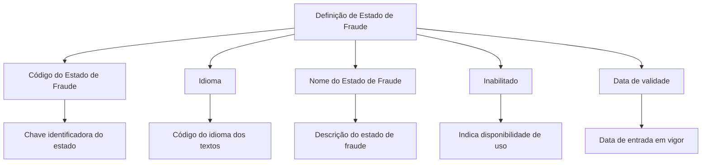

# Definição dos Estados de Fraude — Propriedades Necessárias

## 1. Metadados do Documento
- **Arquivo de Origem:** Não identificado no conteúdo fornecido
- **Tipo de Documento:** Especificação Técnica
- **Domínio / Sistema:** Estados de Fraude
- **Público-Alvo:** Não identificado no conteúdo fornecido
- **Data/Versão Identificada:** Não identificada

---

## 2. Resumo Executivo & Contexto de Negócio

O documento define as propriedades necessárias para caracterizar os diferentes estados de Fraude de uma companhia. O objetivo declarado é permitir o conhecimento dos atributos usados na definição desses estados.

A especificação identifica propriedades gerais relacionadas à identificação, idioma, descrição, habilitação e vigência de uma definição de estado de Fraude. Essas propriedades permitem representar a chave do estado, os textos associados em um idioma e a disponibilidade operacional da definição.

O conteúdo fornecido não descreve integrações, métodos HTTP, persistência de dados, regras de transição entre estados, cálculos ou fluxos operacionais de tratamento de fraude.

---

## 3. Arquitetura, Componentes & Tecnologias Envolvidas

O conteúdo menciona o domínio de **Estados de Fraude** e as propriedades gerais que compõem sua definição. Também aparecem as expressões `CF`, `Home Solutions APIs Documentation` e `Zeus`, sem explicação de seus papéis, relações ou características técnicas.



> **Nota de Análise:** O documento não detalha componentes de software, bancos de dados, APIs, contratos JSON, ambientes, protocolos ou tecnologias de implementação.

---

## 4. Regras de Negócio, Especificações Funcionais & Processos

### Propriedades gerais da definição de Estado de Fraude

1. **Código do Estado de Fraude**
   - Contém a chave que identifica o estado de Fraude.

2. **Idioma**
   - Contém o código do idioma no qual os textos estão definidos.

3. **Nome do Estado de Fraude**
   - Contém a descrição do estado de Fraude.

4. **Inabilitado**
   - Indica se a definição está habilitada ou não para utilização.

5. **Data de validade**
   - Contém a data na qual a definição entra em vigor.

> **Nota de Análise:** O conteúdo não informa valores permitidos, obrigatoriedade, formato de data, unicidade do código, regras de validação, critérios de inabilitação ou comportamento para registros fora de vigência.

---

## 5. Tabelas de Parâmetros, Ambientes e Estruturas de Dados

| Item / Parâmetro | Descrição / Função | Tipo / Valores / Formato | Ambiente / Observações |
| :--- | :--- | :--- | :--- |
| Código do Estado de Fraude | Chave que identifica o estado de Fraude | Não especificado | A definição de unicidade não é detalhada |
| Idioma | Código do idioma em que os textos são definidos | Não especificado | Não há lista de idiomas ou padrão de código |
| Nome do Estado de Fraude | Descrição do estado de Fraude | Não especificado | Não há tamanho, idioma obrigatório ou padrão de texto |
| Inabilitado | Indica se a definição pode ser utilizada | Não especificado | O documento apenas informa a condição habilitada ou não habilitada |
| Data de validade | Data de entrada em vigor da definição | Data; formato não especificado | Não há regra para fim de vigência ou retroatividade |
| CF | Termo exibido no conteúdo bruto | Não especificado | Sigla não definida |
| Home Solutions APIs Documentation | Texto exibido no conteúdo bruto | Não especificado | Relação com Estados de Fraude não detalhada |
| Zeus | Termo exibido no conteúdo bruto | Não especificado | Relação com Estados de Fraude não detalhada |

---

## 6. Bateria de Perguntas & Respostas para RAG (FAQ Sintético)

### P1: Qual é o objetivo do documento de definição dos Estados de Fraude?
**R:** O objetivo é conhecer quais propriedades são necessárias para definir os diferentes estados de Fraude para a companhia.

### P2: Qual propriedade identifica um Estado de Fraude?
**R:** O Código do Estado de Fraude contém a chave que identifica o estado de Fraude.

### P3: Para que serve a propriedade Idioma em um Estado de Fraude?
**R:** A propriedade Idioma contém o código do idioma no qual os textos da definição estão definidos.

### P4: O que representa o Nome do Estado de Fraude?
**R:** O Nome do Estado de Fraude contém a descrição do estado de Fraude.

### P5: Como a disponibilidade de uma definição de Estado de Fraude é indicada?
**R:** A disponibilidade é indicada pela propriedade Inabilitado, que informa se a definição está ou não habilitada para ser utilizada.

### P6: Qual é a finalidade da Data de validade?
**R:** A Data de validade contém a data em que a definição entra em vigor.

### P7: O documento define o formato da Data de validade?
**R:** Não. O documento afirma que a propriedade contém a data de entrada em vigor, mas não especifica formato, fuso horário, data final de vigência ou regras de validação.

### P8: O documento informa quais idiomas podem ser usados?
**R:** Não. O documento informa apenas que a propriedade Idioma contém o código do idioma em que os textos estão definidos.

### P9: Existem métodos HTTP ou contratos JSON descritos para Estados de Fraude?
**R:** Não. O conteúdo fornecido não detalha métodos HTTP, endpoints, contratos JSON, APIs ou integrações técnicas.

### P10: O documento descreve transições entre diferentes Estados de Fraude?
**R:** Não. O conteúdo identifica propriedades de definição de estados, mas não apresenta uma máquina de estados, eventos de transição ou regras de mudança entre estados.

---

## 7. Glossário de Termos, Siglas & Conceitos-Chave

- **Estado de Fraude:** Entidade ou definição identificada por uma chave, com descrição, idioma, condição de habilitação e data de entrada em vigor.
- **Código do Estado de Fraude:** Propriedade que contém a chave identificadora do estado de Fraude.
- **Idioma:** Propriedade que contém o código do idioma em que os textos são definidos.
- **Nome do Estado de Fraude:** Propriedade que contém a descrição do estado de Fraude.
- **Inabilitado:** Propriedade que indica se uma definição está habilitada ou não para uso.
- **Data de validade:** Propriedade que contém a data em que uma definição entra em vigor.
- **CF:** Sigla mencionada no conteúdo bruto, sem significado definido.
- **Zeus:** Termo mencionado no conteúdo bruto, sem explicação de significado ou função.
- **Home Solutions APIs Documentation:** Texto mencionado no conteúdo bruto, sem relação técnica explicitada.

---

## 8. Notas Críticas, Riscos & Limitações

- O documento não apresenta o nome do arquivo de origem, autor, versão ou data de publicação.
- Não há especificação de tipos de dados, formatos, tamanhos máximos ou campos obrigatórios.
- Não há definição de valores válidos para a propriedade **Inabilitado**.
- Não são descritas regras de unicidade para o Código do Estado de Fraude.
- Não há regras para encerramento de vigência, sobreposição de períodos ou alteração retroativa da Data de validade.
- O conteúdo não descreve APIs, endpoints, integrações, persistência, autenticação ou controle de acesso.
- As expressões `CF`, `Home Solutions APIs Documentation` e `Zeus` aparecem sem definição contextual.
- O texto fornecido termina em “Ejemplo:” sem apresentar o exemplo correspondente.

---

## 9. Conteúdo Bruto Estruturado (Referência Fiel)

```text
--- [PÁGINA 1 DE 2] ---

DEFINICIÓN Estados del Fraude
Objetivo
La finalidad de este documento es conocer qué propiedades son necesarias para definir los distintos
estados del Fraude para la compañía.
Propiedades Generales
Propiedades Generales
Código del Estado del Fraude
Esta propiedad contiene la clave que identifica al estado del Fraude.
Idioma
Esta propiedad contiene el código del idioma en el que están definido los textos.
Nombre del Estado del Fraude
Esta propiedad contiene la descripción del estado de fraude.
Inhabilitado
Esta propiedad indica si la definición está o no habilitada para ser utilizada.
Fecha de validez
 /
 CF
Home Solutions APIs Documentation Zeus
EN


--- [PÁGINA 2 DE 2] ---

Esta propiedad contiene fecha en la que la definición entra en vigor.
Ejemplo:
```
