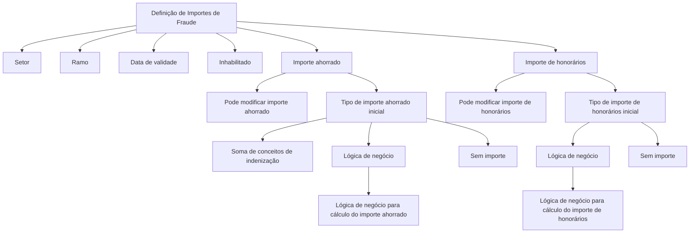

# Definição de Importes de Fraude por Ramo

## 1. Metadados do Documento
- **Arquivo de Origem:** Não identificado
- **Tipo de Documento:** Especificação Técnica
- **Domínio / Sistema:** Fraude / expedientes por setor e ramo
- **Público-Alvo:** Negócio, analistas funcionais e desenvolvedores
- **Data/Versão Identificada:** Não identificada

---

## 2. Resumo Executivo & Contexto de Negócio

O documento define propriedades para configurar o comportamento dos importes associados a operações de fraude. A finalidade explicitada é conhecer tudo o que pode ser definido em relação aos importes de fraude.

A configuração é segmentada por **Setor** e **Ramo**, permitindo aplicar definições a expedientes pertencentes a combinações específicas desses atributos. O documento também prevê o uso de valores genéricos para aplicar uma definição a todos os setores ou a todos os ramos.

A definição possui uma **data de validade**, que determina quando a configuração entra em vigor, e um indicador de habilitação denominado **Inhabilitado**, que controla se a definição pode ser utilizada.

O documento distingue dois importes configuráveis: **importe ahorrado** e **importe de honorarios**. Para ambos, são definidos mecanismos de cálculo inicial, permissões de modificação durante operações de fraude e, quando aplicável, o nome de uma lógica de negócio responsável pelo cálculo.

---

## 3. Arquitetura, Componentes & Tecnologias Envolvidas

O conteúdo não descreve arquitetura de infraestrutura, APIs, tecnologias, microsserviços, protocolos, URLs, ambientes ou contratos de integração. A estrutura funcional apresentada consiste em uma definição de importes de fraude associada a setor, ramo, vigência e regras de cálculo.



> **Nota de Análise:** O documento não detalha o modelo de persistência, a interface de configuração, os métodos HTTP, os contratos JSON, a implementação das lógicas de negócio ou a forma de resolução dos valores genéricos de setor e ramo.

---

## 4. Regras de Negócio, Especificações Funcionais & Processos

### Escopo da definição

1. A definição estabelece o comportamento dos importes relacionados a fraude.
2. A definição é aplicável a expedientes identificados por setor e ramo.
3. O setor informa a chave do setor ao qual pertencem os expedientes abrangidos pela definição.
4. O ramo informa a chave do ramo dos expedientes abrangidos pela definição.
5. Pode ser utilizado um valor genérico para aplicar a definição a todos os setores.
6. Pode ser utilizado um valor genérico para aplicar a definição a todos os ramos.
7. A data de validade determina a data em que a definição entra em vigor.
8. A propriedade **Inhabilitado** indica se a definição está habilitada ou não para utilização.

### Regras do importe ahorrado

1. A propriedade **Se puede Modificar Importe ahorrado?** informa se o importe ahorrado pode ser modificado durante operações de fraude.
2. A propriedade **Tipo Importe ahorrado Inicial** define como o importe ahorrado inicial será determinado.
3. Os valores possíveis para o tipo de importe ahorrado inicial são:
   - **(1) Suma conceptos indemnización:** o importe ahorrado é a soma de todos os conceitos de indenização da avaliação do expediente.
   - **(2) Lógica de Negocio:** o importe ahorrado inicial é calculado por uma lógica de negócio.
   - **(3) Sin importe:** nenhum importe ahorrado é indicado inicialmente.
4. A propriedade **Lógica Negocio para cálculo del Importe Ahorrado** contém o nome da lógica de negócio que devolve o importe ahorrado.
5. A lógica de negócio para cálculo do importe ahorrado só é válida quando o tipo de importe ahorrado for **Lógica de Negocio**.

### Regras do importe de honorários

1. A propriedade **Se puede Modificar el Importe de Honorarios?** informa se o importe de honorários pode ser modificado durante operações de fraude.
2. A propriedade **Tipo Importe Honorarios Inicial** define como o importe de honorários inicial será determinado.
3. Os valores possíveis para o tipo de importe de honorários inicial são:
   - **(1) Lógica de Negocio:** o importe de honorários inicial é calculado por uma lógica de negócio.
   - **(2) Sin importe:** nenhum importe é indicado inicialmente.
4. A propriedade **Lógica Negocio para cálculo del Importe Honorarios** contém o nome da lógica de negócio que devolve o procedimento/importe de honorários.
5. A lógica de negócio para cálculo do importe de honorários só é válida quando o tipo de importe de honorários for **Lógica de Negocio**.

---

## 5. Tabelas de Parâmetros, Ambientes e Estruturas de Dados

| Item / Parâmetro | Descrição / Função | Tipo / Valores / Formato | Ambiente / Observações |
| :--- | :--- | :--- | :--- |
| Setor | Indica a chave do setor ao qual pertencem os expedientes abrangidos pela definição de comportamento dos importes. | Chave de setor; valor genérico permitido. | O valor genérico pode indicar aplicação para todos os setores. |
| Ramo | Indica a chave do ramo dos expedientes abrangidos pela definição de comportamento dos importes de fraude. | Chave de ramo; valor genérico permitido. | O valor genérico pode indicar aplicação para todos os ramos. |
| Data de validade | Contém a data em que a definição entra em vigor. | Data. | Não há formato de data especificado. |
| Pode modificar importe ahorrado? | Indica se o importe ahorrado pode ser modificado nas operações de fraude. | Não especificado. | Aplicável ao importe ahorrado. |
| Tipo importe ahorrado inicial | Define o método de obtenção do importe ahorrado inicial. | (1) Suma conceptos indemnización; (2) Lógica de Negocio; (3) Sin importe. | Determina a aplicabilidade da lógica de negócio de importe ahorrado. |
| Suma conceptos indemnización | Define o importe ahorrado como a soma de todos os conceitos de indenização da avaliação do expediente. | Valor do tipo de importe ahorrado inicial. | Aplicável somente ao importe ahorrado. |
| Lógica de Negocio — importe ahorrado | Define que o importe ahorrado inicial é calculado por uma lógica de negócio. | Valor do tipo de importe ahorrado inicial. | Requer a propriedade de lógica de negócio para cálculo do importe ahorrado. |
| Sin importe — importe ahorrado | Define que não haverá importe ahorrado inicial. | Valor do tipo de importe ahorrado inicial. | Não há detalhamento sobre comportamento posterior. |
| Lógica de negócio para cálculo do importe ahorrado | Contém o nome da lógica de negócio que devolve o importe ahorrado. | Nome de lógica de negócio. | Válida somente quando o tipo de importe ahorrado é Lógica de Negocio. |
| Pode modificar importe de honorários? | Indica se o importe de honorários pode ser modificado nas operações de fraude. | Não especificado. | O texto menciona “importe de honorarios modificable”. |
| Tipo importe honorários inicial | Define o método de obtenção do importe de honorários inicial. | (1) Lógica de Negocio; (2) Sin importe. | Determina a aplicabilidade da lógica de negócio de honorários. |
| Lógica de Negocio — honorários | Define que o importe de honorários inicial é calculado por uma lógica de negócio. | Valor do tipo de importe honorários inicial. | Requer a propriedade de lógica de negócio para cálculo de honorários. |
| Sin importe — honorários | Define que não haverá importe inicial. | Valor do tipo de importe honorários inicial. | O texto original menciona “importe de negocio inicialmente”; o contexto indica a seção de honorários. |
| Lógica de negócio para cálculo do importe de honorários | Contém o nome da lógica de negócio que devolve o procedimento/importe de honorários. | Nome de lógica de negócio. | Válida somente quando o tipo de importe de honorários é Lógica de Negocio. |
| Inhabilitado | Indica se a definição está ou não habilitada para ser utilizada. | Não especificado. | Controla a disponibilidade da definição. |

---

## 6. Bateria de Perguntas & Respostas para RAG (FAQ Sintético)

### P1: Qual é a finalidade da definição de importes de fraude por ramo?
**R:** A finalidade da definição é conhecer e configurar tudo o que pode ser definido em relação aos importes de fraude.

### P2: Como a definição de importes de fraude é associada aos expedientes?
**R:** A definição é associada aos expedientes por meio das propriedades Setor e Ramo. O Setor indica a chave do setor dos expedientes, enquanto o Ramo indica a chave do ramo dos expedientes.

### P3: É possível aplicar uma definição de importes de fraude a todos os setores?
**R:** Sim. A propriedade Setor permite o uso de um valor genérico que indica aplicação da definição para todos os setores.

### P4: É possível aplicar uma definição de importes de fraude a todos os ramos?
**R:** Sim. A propriedade Ramo permite o uso de um valor genérico que indica aplicação da definição para todos os ramos.

### P5: Qual é a função da data de validade na definição?
**R:** A data de validade contém a data em que a definição entra em vigor.

### P6: Quais são os tipos possíveis para o importe ahorrado inicial?
**R:** Os tipos possíveis são: **Suma conceptos indemnización**, em que o importe é a soma dos conceitos de indenização da avaliação do expediente; **Lógica de Negocio**, em que o cálculo ocorre por lógica de negócio; e **Sin importe**, em que nenhum importe ahorrado é indicado inicialmente.

### P7: Quando a lógica de negócio para cálculo do importe ahorrado é válida?
**R:** A lógica de negócio para cálculo do importe ahorrado é válida somente quando o tipo de importe ahorrado inicial estiver configurado como **Lógica de Negocio**.

### P8: O importe ahorrado pode ser alterado em operações de fraude?
**R:** O documento possui a propriedade **Se puede Modificar Importe ahorrado?**, que informa se o importe ahorrado pode ser modificado nas operações de fraude. Os valores aceitos por essa propriedade não são detalhados.

### P9: Quais são os tipos possíveis para o importe de honorários inicial?
**R:** Os tipos possíveis são **Lógica de Negocio**, em que o importe de honorários inicial é calculado por lógica de negócio, e **Sin importe**, em que não é indicado importe inicialmente.

### P10: Quando a lógica de negócio para cálculo do importe de honorários é válida?
**R:** A lógica de negócio para cálculo do importe de honorários é válida somente quando o tipo de importe de honorários inicial estiver definido como **Lógica de Negocio**.

### P11: O importe de honorários pode ser modificado?
**R:** O documento apresenta a propriedade **Se puede Modificar el Importe de Honorarios?**, destinada a indicar se o importe de honorários pode ser modificado em operações de fraude. O documento não especifica os valores permitidos.

### P12: O que significa a propriedade Inhabilitado?
**R:** A propriedade **Inhabilitado** indica se a definição está habilitada ou não para ser utilizada.

---

## 7. Glossário de Termos, Siglas & Conceitos-Chave

- **Expediente:** Registro ao qual pertencem setor e ramo e para o qual pode ser definido o comportamento dos importes de fraude.
- **Fraude:** Contexto funcional ao qual se aplicam as definições de importes descritas.
- **Importe ahorrado:** Importe cujo valor inicial pode ser obtido pela soma de conceitos de indenização, por lógica de negócio ou permanecer sem importe.
- **Importe de honorários:** Importe cujo valor inicial pode ser calculado por lógica de negócio ou permanecer sem importe.
- **Lógica de Negocio:** Mecanismo de lógica de negócio usado para calcular um importe inicial quando o tipo correspondente estiver configurado com esse valor.
- **Ramo:** Chave que identifica o ramo dos expedientes abrangidos pela definição.
- **Setor:** Chave que identifica o setor dos expedientes abrangidos pela definição.
- **Sin importe:** Opção que determina que nenhum importe será indicado inicialmente.
- **Suma conceptos indemnización:** Opção que determina que o importe ahorrado é a soma de todos os conceitos de indenização da avaliação do expediente.

---

## 8. Notas Críticas, Riscos & Limitações

- O documento não identifica arquivo de origem, versão, data, autor ou responsável pela manutenção da definição.
- Não são especificados os formatos das chaves de Setor e Ramo, nem os valores concretos dos genéricos aplicáveis.
- Não são definidos os valores aceitos pelas propriedades de permissão de modificação de importe ahorrado e importe de honorários.
- Não são descritos os nomes, contratos, entradas, saídas ou tratamento de erros das lógicas de negócio de cálculo.
- Não há definição de precedência para cenários em que existam configurações específicas e genéricas simultaneamente para setor e ramo.
- Não há detalhamento sobre o comportamento após a data de validade, sobre coexistência de definições ou sobre critérios de seleção de uma definição habilitada.
- O texto da opção **Sin importe** para honorários menciona “importe de negocio inicialmente”, embora o contexto funcional da seção seja o importe de honorários.

---

## 9. Conteúdo Bruto Estruturado (Referência Fiel)

```text
--- [PÁGINA 1 DE 3] ---

EN CONSTRUCCIÓN
DEFINICIÓN Importes de Fraude por Ramo
Objetivo
La finalidad de este documento es conocer todo lo que se puede definir relativo a los importes del
Fraude.
Propiedades Generales
Propiedades
Sector
Esta propiedad indica la clave del Sector al que pertenecen los expedientes, a los que se les va a a
definir el comportamiento de los importes. Se puede utilizar el genérico que indica para todos los
sectores.
Ramo
Esta propiedad indica la clave del Ramo de los expedientes a los que se les va a definir el
comportamiento de los importes del Fraude. Se puede utilizar el genérico que indica para todos los
ramos.
Fecha de validez
Esta propiedad contiene fecha en la que la definición entra en vigor.
 / 
 CF
Home Solutions APIs Documentation Zeus
EN


--- [PÁGINA 2 DE 3] ---

Se puede Modificar Importe ahorrado?
En esta propiedad se indica si en las operaciones de los fraudes se puede modificar el importe
ahorrado.
Tipo Importe ahorrado Inicial
Esta propiedad contiene el tipo importe ahorrado inicial. Los valores posibles son:
(1)Suma conceptos indemnización
(2)Lógica de Negocio
(3)Sin importe
Suma conceptos indemnización
Se indica que el importe ahorrado es la suma de todos los conceptos de indemnización de la
valoración del expediente.
Lógica de Negocio
Indica que la manera de calcular el importe ahorrado inicial es mediante una lógica de Negocio.
Sin importe
No se va a indicar el importe ahorrado inicialmente.
Lógica Negocio para cálculo del Importe Ahorrado
Esta propiedad contiene el nombre de la lógica de negocio que devuelve el importe ahorrado, esta
será válida si el tipo de importe ahorrado es "Lógica de Negocio".
Se puede Modificar el Importe de Honorarios?
En esta propiedad se indica si en las operaciones de los fraudes se puede modificar el importe de
honorarios modificable
Tipo Importe Honorarios Inicial
Esta propiedad contiene el tipo importe de Honorarios inicial. Los valores posibles son:
(1)Lógica de Negocio
(2)Sin importe
Lógica de Negocio


--- [PÁGINA 3 DE 3] ---

Indica que la manera de calcular el importe de honorarios inicial es mediante una lógica de
Negocio.
Sin importe
No se va a indicar el importe de negocio inicialmente.
Lógica Negocio para cálculo del Importe Honorarios
Esta propiedad contiene el nombre de la lógica de negocio que devuelve procedimiento importe
honorarios, esta será válida si el tipo de importe de honorarios es "Lógica de Negocio".
Inhabilitado
Esta propiedad indica si la definición está o no habilitada para ser utilizada.
```
