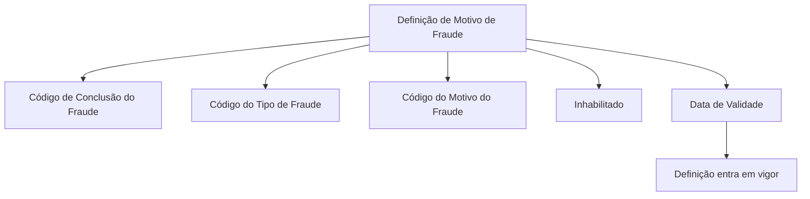

# Definição de Motivos por Tipo de Fraude e Conclusão

## 1. Metadados do Documento
- **Arquivo de Origem:** Não identificado
- **Tipo de Documento:** Especificação Técnica
- **Domínio / Sistema:** Home Solutions APIs Documentation Zeus / CF
- **Público-Alvo:** Desenvolvedores, Arquitetos e Negócio
- **Data/Versão Identificada:** Não identificada

---

## 2. Resumo Executivo & Contexto de Negócio

O documento descreve as propriedades necessárias para definir diferentes **Motivos de Fraude** para uma companhia. O objetivo declarado é identificar quais atributos devem compor essa definição, incluindo referências à conclusão, ao tipo e ao motivo de fraude.

A especificação apresenta propriedades gerais para a definição de fraude. Essas propriedades armazenam chaves de identificação para o código de conclusão do fraude, o código do tipo de fraude e o código do motivo de fraude.

O documento também define atributos operacionais da configuração: um indicador para determinar se a definição está habilitada para uso e uma data de validade que representa quando a definição entra em vigor.

O conteúdo referencia o contexto **Home Solutions APIs Documentation Zeus** e a sigla **CF**, mas não detalha contratos de API, métodos HTTP, estruturas JSON, persistência de dados, regras de validação adicionais ou fluxos de integração.

---

## 3. Arquitetura, Componentes & Tecnologias Envolvidas

Os componentes e conceitos explicitamente citados são:

- Definição de Motivos de Fraude.
- Código de Conclusão do Fraude.
- Código do Tipo de Fraude.
- Código do Motivo do Fraude.
- Indicador de habilitação da definição.
- Data de validade da definição.
- Home Solutions APIs Documentation Zeus.
- CF.



**Nota de Análise:** O documento não descreve uma arquitetura de software, serviços, bancos de dados, endpoints, protocolos ou tecnologias de implementação. O diagrama representa exclusivamente a relação conceitual entre a definição de motivo de fraude e as propriedades apresentadas.

---

## 4. Regras de Negócio, Especificações Funcionais & Processos

1. A finalidade do documento é identificar as propriedades necessárias para definir os distintos Motivos de Fraude para a companhia.
2. A definição de Motivo de Fraude possui uma propriedade denominada **Código de Conclusão do Fraude**.
   - Essa propriedade contém a chave do código de conclusão do fraude.
3. A definição de Motivo de Fraude possui uma propriedade denominada **Código do Tipo de Fraude**.
   - Essa propriedade contém a chave que identifica o tipo de fraude.
4. A definição de Motivo de Fraude possui uma propriedade denominada **Código Motivo do Fraude**.
   - Essa propriedade contém a chave que identifica o motivo de fraude.
5. A propriedade **Inhabilitado** indica se a definição está ou não habilitada para ser utilizada.
6. A propriedade **Data de validade** contém a data na qual a definição entra em vigor.

**Nota de Análise:** O documento não especifica formatos para códigos, valores permitidos para o indicador `Inhabilitado`, formato da data de validade, critérios de unicidade, precedência entre definições, comportamento para datas expiradas ou regras de validação entre os códigos.

---

## 5. Tabelas de Parâmetros, Ambientes e Estruturas de Dados

| Item / Parâmetro | Descrição / Função | Tipo / Valores / Formato | Ambiente / Observações |
| :--- | :--- | :--- | :--- |
| Código de Conclusão do Fraude | Contém a chave do código de conclusão do fraude. | Não especificado. | Propriedade geral da definição de Motivo de Fraude. |
| Código do Tipo de Fraude | Contém a chave que identifica o tipo de fraude. | Não especificado. | Propriedade geral da definição de Motivo de Fraude. |
| Código Motivo do Fraude | Contém a chave que identifica o motivo de fraude. | Não especificado. | Propriedade geral da definição de Motivo de Fraude. |
| Inhabilitado | Indica se a definição está ou não habilitada para ser utilizada. | Não especificado. | Propriedade geral da definição de Motivo de Fraude. |
| Data de validade | Contém a data em que a definição entra em vigor. | Data; formato não especificado. | Propriedade geral da definição de Motivo de Fraude. |
| CF | Sigla exibida no documento. | Não especificado. | O significado não é detalhado. |
| Home Solutions APIs Documentation Zeus | Referência exibida no documento. | Não especificado. | Não há detalhamento de integração, endpoints ou APIs. |

---

## 6. Bateria de Perguntas & Respostas para RAG (FAQ Sintético)

### P1: Qual é a finalidade do documento sobre Motivos de Fraude?
**R:** A finalidade do documento é conhecer quais propriedades são necessárias para definir os distintos Motivos de Fraude para a companhia.

### P2: Qual propriedade armazena a chave do código de conclusão do fraude?
**R:** A propriedade **Código de Conclusão do Fraude** contém a chave do código de conclusão do fraude.

### P3: Como o Tipo de Fraude é identificado na definição?
**R:** O Tipo de Fraude é identificado pela propriedade **Código do Tipo de Fraude**, que contém a chave que identifica o tipo de fraude.

### P4: Qual propriedade identifica o motivo de fraude?
**R:** A propriedade **Código Motivo do Fraude** contém a chave que identifica o motivo de fraude.

### P5: Como a definição informa se pode ser utilizada?
**R:** A propriedade **Inhabilitado** indica se a definição está ou não habilitada para ser utilizada.

### P6: O que representa a Data de validade na definição de Motivo de Fraude?
**R:** A **Data de validade** contém a data em que a definição entra em vigor.

### P7: O documento define o formato dos códigos de conclusão, tipo e motivo de fraude?
**R:** Não. O documento informa que essas propriedades contêm chaves identificadoras, mas não define formato, tamanho, domínio de valores ou regras de validação para esses códigos.

### P8: O documento detalha endpoints ou métodos HTTP para Home Solutions APIs Documentation Zeus?
**R:** Não. O documento apenas exibe a referência “Home Solutions APIs Documentation Zeus”; não apresenta endpoints, métodos HTTP, contratos JSON, autenticação ou comportamento de APIs.

### P9: Quais são as propriedades gerais listadas para a definição de Motivo de Fraude?
**R:** As propriedades gerais listadas são: Código de Conclusão do Fraude, Código do Tipo de Fraude, Código Motivo do Fraude, Inhabilitado e Data de validade.

### P10: A partir de quando uma definição de Motivo de Fraude é considerada vigente?
**R:** Segundo o documento, uma definição entra em vigor na data informada pela propriedade **Data de validade**. O documento não descreve regras adicionais para expiração ou vigência retroativa.

---

## 7. Glossário de Termos, Siglas & Conceitos-Chave

- **Código de Conclusão do Fraude:** Chave do código de conclusão do fraude.
- **Código do Tipo de Fraude:** Chave que identifica o tipo de fraude.
- **Código Motivo do Fraude:** Chave que identifica o motivo de fraude.
- **Definição de Motivo de Fraude:** Estrutura conceitual composta pelas propriedades gerais apresentadas no documento.
- **Inhabilitado:** Propriedade que informa se uma definição está ou não habilitada para uso.
- **Data de validade:** Data em que uma definição entra em vigor.
- **CF:** Sigla presente no documento sem expansão ou definição explícita.
- **Home Solutions APIs Documentation Zeus:** Referência textual presente no documento, sem detalhamento adicional.

---

## 8. Notas Críticas, Riscos & Limitações

- O arquivo de origem não foi identificado no conteúdo fornecido.
- Não há data, versão, autoria ou histórico de alterações identificáveis.
- O documento não especifica os tipos de dados, formatos ou domínios de valores das propriedades.
- O documento não define se os códigos de conclusão, tipo e motivo de fraude devem ser obrigatórios, únicos ou relacionados entre si.
- Não há detalhamento sobre persistência, integração, autenticação, autorização, APIs ou tratamento de erros.
- A semântica de `Inhabilitado` é descrita, mas seus valores permitidos não são definidos.
- A expressão “Data de validade” é associada ao momento em que a definição entra em vigor; não há informação sobre data de expiração.
- A sigla `CF` não é expandida ou explicada.
- A referência a “Home Solutions APIs Documentation Zeus” não inclui documentação técnica adicional.

---

## 9. Conteúdo Bruto Estruturado (Referência Fiel)

```text
--- [PÁGINA 1 DE 2] ---

DEFINICIÓN Motivos por Tipo de Fraude y
Conclusión
Objetivo
La finalidad de este documento es conocer qué propiedades son necesarias para definir los distintos
Motivos de Fraude para la compañía.
Propiedades Generales
Propiedades Generales
Código de Conclusión del Fraude
Esta propiedad contiene la clave del Código de conclusión del fraude.
Código del Tipo de Fraude
Esta propiedad contiene la clave que identifica el Tipo de fraude
Código Motivo del Fraude
Esta propiedad contiene la clave que identifica el motivo de fraude.
Inhabilitado
Esta propiedad indica si la definición está o no habilitada para ser utilizada.
 / 
 CF
Home Solutions APIs Documentation Zeus
EN


--- [PÁGINA 2 DE 2] ---

Fecha de validez
Esta propiedad contiene fecha en la que la definición entra en vigor.
Ejemplo:
```
