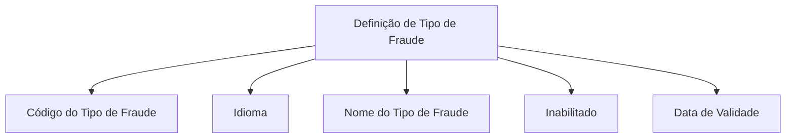

# Definição de Tipos de Fraude — Propriedades Necessárias

## 1. Metadados do Documento
- **Arquivo de Origem:** Não identificado
- **Tipo de Documento:** Especificação Técnica
- **Domínio / Sistema:** Tipos de Fraude; cabeçalho menciona “Home Solutions APIs Documentation Zeus”
- **Público-Alvo:** Não identificado
- **Data/Versão Identificada:** Não identificada

---

## 2. Resumo Executivo & Contexto de Negócio

O documento define as propriedades necessárias para caracterizar os diferentes tipos de fraude da companhia. O objetivo declarado é conhecer quais atributos são requeridos para definir cada tipo de fraude.

A especificação apresenta propriedades gerais associadas à definição de um tipo de fraude: código identificador, idioma, nome, indicador de inabilitação e data de vigência. Essas propriedades permitem identificar, descrever, localizar linguisticamente, habilitar ou inabilitar e determinar a entrada em vigor de uma definição.

O conteúdo disponível não detalha integrações, interfaces, métodos HTTP, contratos JSON, persistência, regras de validação, valores permitidos ou exemplos preenchidos. O documento também não explica a relação entre “Home Solutions APIs Documentation Zeus” e a definição de tipos de fraude.

---

## 3. Arquitetura, Componentes & Tecnologias Envolvidas

Os elementos identificados no conteúdo são:

| Componente / Elemento | Descrição identificada |
| :--- | :--- |
| Tipos de Fraude | Domínio para o qual são definidas propriedades necessárias. |
| Definição de Tipo de Fraude | Entidade conceitual que contém código, idioma, nome, estado de habilitação e data de vigência. |
| Home Solutions APIs Documentation Zeus | Texto presente no cabeçalho; o documento não detalha sua função, arquitetura ou integração. |
| EN | Texto presente no cabeçalho; o documento não explica seu significado. |
| CF | Texto presente junto de “Fecha de validez”; o documento não explica seu significado. |



**Nota de Análise:** O conteúdo não descreve arquitetura de software, microsserviços, tecnologias, ambientes, APIs, fluxos de integração ou fluxos de dados.

---

## 4. Regras de Negócio, Especificações Funcionais & Processos

### Objetivo declarado
A finalidade do documento é conhecer as propriedades necessárias para definir os distintos tipos de fraude para a companhia.

### Propriedades gerais da definição de tipo de fraude

1. **Código do Tipo de Fraude**
   - Contém a chave que identifica o tipo de fraude.

2. **Idioma**
   - Contém o código do idioma no qual os textos estão definidos.

3. **Nome do Tipo de Fraude**
   - Contém a descrição do tipo de fraude.

4. **Inabilitado**
   - Indica se a definição está habilitada ou não habilitada.

5. **Data de Validade**
   - Contém a data na qual a definição entra em vigor.

**Nota de Análise:** O documento não informa obrigatoriedade, tipo de dado, tamanho, formato, domínio de valores, unicidade, regras de preenchimento, regra de expiração ou tratamento de alterações para as propriedades listadas.

---

## 5. Tabelas de Parâmetros, Ambientes e Estruturas de Dados

| Item / Parâmetro | Descrição / Função | Tipo / Valores / Formato | Ambiente / Observações |
| :--- | :--- | :--- | :--- |
| Código do Tipo de Fraude | Chave que identifica o tipo de fraude. | Não informado. | Não informado. |
| Idioma | Código do idioma no qual os textos estão definidos. | Código de idioma; formato não informado. | Não informado. |
| Nome do Tipo de Fraude | Descrição do tipo de fraude. | Não informado. | Não informado. |
| Inabilitado | Indica se a definição está ou não habilitada. | Estado de habilitação; valores não informados. | Não informado. |
| Data de Validade | Data na qual a definição entra em vigor. | Data; formato não informado. | Não informado. |
| CF | Texto associado à seção “Fecha de validez”. | Não definido no documento. | Significado não detalhado. |
| Home Solutions APIs Documentation Zeus | Cabeçalho identificado no conteúdo bruto. | Não aplicável. | Relação com tipos de fraude não detalhada. |
| EN | Texto identificado no cabeçalho. | Não definido no documento. | Significado não detalhado. |

---

## 6. Bateria de Perguntas & Respostas para RAG (FAQ Sintético)

### P1: Qual é o objetivo da definição de tipos de fraude?
**R:** O objetivo é conhecer quais propriedades são necessárias para definir os distintos tipos de fraude para a companhia.

### P2: Qual propriedade identifica um tipo de fraude?
**R:** O **Código do Tipo de Fraude** contém a chave que identifica o tipo de fraude.

### P3: Para que serve a propriedade Idioma?
**R:** A propriedade **Idioma** contém o código do idioma no qual os textos da definição estão definidos.

### P4: O que representa o Nome do Tipo de Fraude?
**R:** O **Nome do Tipo de Fraude** contém a descrição do tipo de fraude.

### P5: Como a definição informa se um tipo de fraude está ativo?
**R:** A propriedade **Inabilitado** indica se a definição está habilitada ou não habilitada. O documento não informa os valores técnicos usados para representar esses estados.

### P6: Qual propriedade indica quando uma definição de fraude passa a vigorar?
**R:** A **Data de Validade** contém a data na qual a definição entra em vigor.

### P7: O documento define o formato da Data de Validade?
**R:** Não. O documento informa apenas que a propriedade contém a data em que a definição entra em vigor, sem especificar formato de data.

### P8: O documento informa os valores permitidos para Inabilitado?
**R:** Não. O documento informa somente que a propriedade indica se a definição está habilitada ou não habilitada.

### P9: O documento apresenta exemplos preenchidos para as propriedades de tipo de fraude?
**R:** Não. A segunda página contém o rótulo “Ejemplo:”, mas o conteúdo fornecido não apresenta nenhum exemplo preenchido.

### P10: O documento detalha APIs ou contratos JSON para tipos de fraude?
**R:** Não. Embora o cabeçalho mencione “Home Solutions APIs Documentation Zeus”, o conteúdo não apresenta métodos HTTP, endpoints, contratos JSON ou detalhes de integração.

---

## 7. Glossário de Termos, Siglas & Conceitos-Chave

- **Código do Tipo de Fraude:** Chave que identifica o tipo de fraude.
- **Data de Validade:** Data na qual a definição entra em vigor.
- **Definição de Tipo de Fraude:** Estrutura conceitual composta pelas propriedades gerais apresentadas no documento.
- **Idioma:** Código do idioma no qual os textos estão definidos.
- **Inabilitado:** Propriedade que indica se a definição está habilitada ou não habilitada.
- **Nome do Tipo de Fraude:** Descrição do tipo de fraude.
- **CF:** Termo presente no conteúdo, sem definição fornecida.
- **EN:** Termo presente no conteúdo, sem definição fornecida.
- **Home Solutions APIs Documentation Zeus:** Texto de cabeçalho presente no conteúdo, sem função ou significado detalhado.

---

## 8. Notas Críticas, Riscos & Limitações

- O arquivo de origem não foi identificado no conteúdo fornecido.
- Não há data, versão, autor, público-alvo ou classificação documental explicitamente informados.
- O documento não especifica tipos de dados, formatos, valores válidos, campos obrigatórios ou restrições de unicidade.
- Não são descritos endpoints, métodos HTTP, autenticação, contratos de payload, respostas, códigos de erro ou integrações.
- A expressão “Home Solutions APIs Documentation Zeus” aparece no cabeçalho, mas não recebe explicação adicional.
- Os termos “CF” e “EN” aparecem no conteúdo, mas não são definidos.
- A seção “Ejemplo:” não possui exemplo no trecho bruto disponibilizado.

---

## 9. Conteúdo Bruto Estruturado (Referência Fiel)

```text
--- [PÁGINA 1 DE 2] ---

DEFINICIÓN Tipos de Fraude
Objetivo
La finalidad de este documento es conocer qué propiedades son necesarias para definir los distintos
tipos de Fraude para la compañía.
Propiedades Generales
Propiedades Generales
Código del Tipo de Fraude
Esta propiedad contiene la clave que identifica el tipo de fraude
Idioma
Esta propiedad contiene el código del idioma en el que están definido los textos.
Nombre del Tipo de Fraude
Esta propiedad contiene la descripción del tipo de fraude.
Inhabilitado
Esta propiedad indica si la definición está o no habilitada para ser utilizada.
Fecha de validez
 / 
 CF
Home Solutions APIs Documentation Zeus
EN


--- [PÁGINA 2 DE 2] ---

Esta propiedad contiene fecha en la que la definición entra en vigor.
Ejemplo:
```
