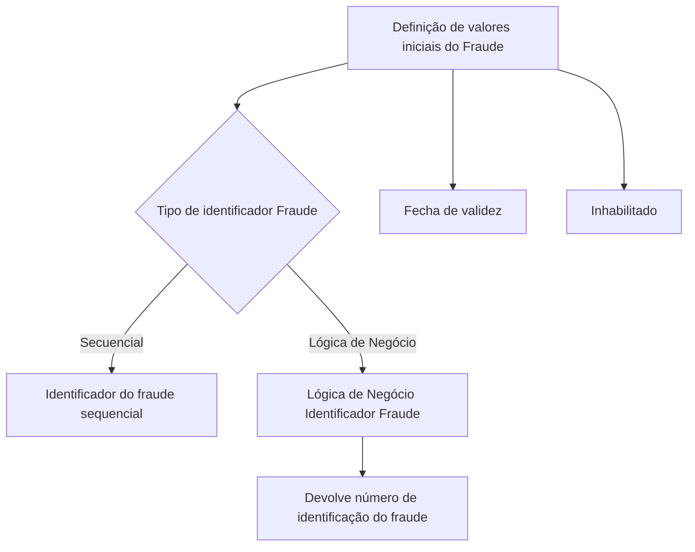

# Definição de Valores Iniciais do Fraude

## 1. Metadados do Documento
- **Arquivo de Origem:** `full_prompt.txt` — conteúdo extraído de documento não nomeado
- **Tipo de Documento:** Especificação Técnica
- **Domínio / Sistema:** Fraude; Home Solutions APIs Documentation Zeus
- **Público-Alvo:** Negócio, Operação e Desenvolvimento
- **Data/Versão Identificada:** Não identificada

---

## 2. Resumo Executivo & Contexto de Negócio

O documento define propriedades de **Fraude** que podem receber valores iniciais ou valores por defeito. O propósito declarado é tornar a operação com um fraude mais eficaz por meio da pré-configuração dessas propriedades.

A especificação descreve o tipo de identificador do fraude e estabelece duas alternativas: **Secuencial** e **Lógica de Negócio**. A alternativa escolhida determina como o identificador do fraude é produzido.

Quando o identificador precisa ser sequencial, deve-se indicar o valor **Secuencial**. Quando o identificador precisa ser personalizado, deve-se utilizar **Lógica de Negócio**; nesse caso, uma propriedade adicional informa o nome da lógica que devolve o número de identificação do fraude.

O documento também apresenta uma data de vigência da definição e um indicador de habilitação. Não detalha contratos técnicos, interfaces, tecnologias de implementação, ambientes, APIs, formatos de data ou valores codificados além da referência ao tipo de identificação igual a `2`.

---

## 3. Arquitetura, Componentes & Tecnologias Envolvidas

Os elementos citados são as propriedades de configuração de Fraude, a lógica de negócio para identificação personalizada e a referência editorial a **Home Solutions APIs Documentation Zeus**. O texto não descreve componentes de software, microsserviços, integrações, protocolos ou infraestrutura.



> **Nota de Análise:** O documento cita “Home Solutions APIs Documentation Zeus”, mas não especifica sua função na configuração de Fraude.

---

## 4. Regras de Negócio, Especificações Funcionais & Processos

1. A definição de valores iniciais do Fraude permite configurar valores iniciais ou valores por defeito para propriedades de Fraude.
2. A propriedade **Tipo de identificador Fraude** deve conter um dos valores apresentados:
   - **Secuencial**
   - **Lógica de Negócio**
3. Deve-se indicar **Secuencial** quando for necessário que o identificador do fraude seja sequencial.
4. Deve-se utilizar **Lógica de Negócio** quando for necessário gerar um identificador de fraude personalizado.
5. A propriedade **Lógica de Negócio Identificador Fraude** contém o nome da lógica de negócio que devolve o número de identificação do fraude quando o tipo de identificação é `2`.
6. A propriedade **Fecha de validez** contém a data em que a definição entra em vigor.
7. A propriedade **Inhabilitado** indica se a definição está habilitada ou não para utilização.

> **Nota de Análise:** O documento não associa explicitamente os rótulos “Secuencial” e “Lógica de Negócio” a códigos numéricos. Apenas afirma que a lógica de negócio é usada se o tipo de identificação for `2`.

---

## 5. Tabelas de Parâmetros, Ambientes e Estruturas de Dados

| Item / Parâmetro | Descrição / Função | Tipo / Valores / Formato | Ambiente / Observações |
| :--- | :--- | :--- | :--- |
| Tipo de identificador Fraude | Define o tipo de identificador utilizado pelo fraude. | `Secuencial`; `Lógica de Negócio` | Não são informados formatos técnicos ou código para cada valor. |
| Secuencial | Usado quando o identificador do fraude deve ser sequencial. | Valor de configuração | O documento não detalha a sequência, a origem ou o algoritmo de geração. |
| Lógica de Negócio | Usada quando é necessário gerar identificador de fraude personalizado. | Valor de configuração | Requer a propriedade “Lógica de Negócio Identificador Fraude”. |
| Lógica de Negócio Identificador Fraude | Contém o nome da lógica de negócio que devolve o número de identificação do fraude. | Nome da lógica de negócio | Aplicável quando o tipo de identificação é `2`. |
| Fecha de validez | Contém a data em que a definição entra em vigor. | Data; formato não informado | Não há regras sobre término de vigência. |
| Inhabilitado | Indica se a definição está ou não habilitada para uso. | Indicador de habilitação; valores não informados | Não há valor técnico explícito para habilitado ou inabilitado. |
| Home Solutions APIs Documentation Zeus | Referência exibida no conteúdo extraído. | Nome citado | Papel não detalhado no documento. |

---

## 6. Bateria de Perguntas & Respostas para RAG (FAQ Sintético)

### P1: Qual é o objetivo da definição de valores iniciais do Fraude?
**R:** O objetivo é identificar quais propriedades de Fraude podem receber valores iniciais ou valores por defeito, visando maior eficácia na operação com um fraude.

### P2: Quais valores podem ser definidos para o Tipo de identificador Fraude?
**R:** O documento apresenta dois valores para a propriedade Tipo de identificador Fraude: `Secuencial` e `Lógica de Negócio`.

### P3: Quando devo usar o tipo de identificador Secuencial?
**R:** O tipo `Secuencial` deve ser indicado quando for necessário que o identificador do fraude seja sequencial.

### P4: Quando devo usar Lógica de Negócio para identificar um fraude?
**R:** Deve-se usar `Lógica de Negócio` quando for necessário gerar um identificador de fraude personalizado.

### P5: O que contém a propriedade Lógica de Negócio Identificador Fraude?
**R:** A propriedade contém o nome da lógica de negócio que devolve o número de identificação do fraude quando o tipo de identificação é `2`.

### P6: O documento informa quais métodos ou contratos a lógica de negócio deve implementar?
**R:** Não. O documento apenas informa que a lógica de negócio devolve o número de identificação do fraude; não detalha métodos, contratos, entradas, saídas ou tecnologias.

### P7: Para que serve a propriedade Fecha de validez?
**R:** A propriedade Fecha de validez contém a data em que a definição entra em vigor.

### P8: O que a propriedade Inhabilitado controla?
**R:** A propriedade Inhabilitado indica se a definição está habilitada ou não para ser utilizada.

### P9: Qual é o valor do tipo de identificação que aciona a lógica de negócio?
**R:** O documento informa que a lógica de negócio devolve o número de identificação do fraude se o tipo de identificação for `2`.

### P10: O documento especifica o formato da data de validade?
**R:** Não. O texto apenas afirma que Fecha de validez contém a data de entrada em vigor da definição.

### P11: Existem URLs, ambientes ou servidores definidos para essa configuração?
**R:** Não. O documento não fornece URLs, servidores, ambientes, portas ou caminhos de log.

---

## 7. Glossário de Termos, Siglas & Conceitos-Chave

- **Fraude:** Entidade cujas propriedades podem receber valores iniciais ou valores por defeito.
- **Tipo de identificador Fraude:** Propriedade que define se o identificador do fraude será sequencial ou baseado em lógica de negócio.
- **Secuencial:** Valor configurável para exigir identificador sequencial do fraude.
- **Lógica de Negócio:** Valor configurável para permitir identificador personalizado do fraude.
- **Lógica de Negócio Identificador Fraude:** Propriedade que registra o nome da lógica de negócio responsável por devolver o número de identificação do fraude quando o tipo de identificação é `2`.
- **Fecha de validez:** Data na qual a definição entra em vigor.
- **Inhabilitado:** Indicador de que a definição está ou não disponível para utilização.
- **Zeus:** Termo presente na referência “Home Solutions APIs Documentation Zeus”; significado não definido no texto.

---

## 8. Notas Críticas, Riscos & Limitações

- O documento não detalha a correspondência numérica entre os tipos de identificador e os valores `Secuencial` ou `Lógica de Negócio`; apenas menciona o tipo de identificação `2` para a lógica de negócio.
- Não há especificação de formato para **Fecha de validez**.
- Não há valores técnicos explicitados para **Inhabilitado**.
- Não há contratos, métodos, interfaces, parâmetros de entrada ou retorno da lógica de negócio personalizada.
- Não há informações sobre persistência, validações, tratamento de erro, auditoria, logs, ambientes ou URLs.
- A frase “cuando se quiera general el identificador” foi preservada conforme extração; o documento não fornece esclarecimento adicional.

---

## 9. Conteúdo Bruto Estruturado (Referência Fiel)

```text
--- [PÁGINA 1 DE 2] ---

DEFINICIÓN de Valores Iniciales del Fraude
Objetivo
La finalidad de este documento es conocer a qué propiedades de Fraude se les puede definir valores
iniciales, valores por defecto, con la finalidad de ser más eficaces cuando se opera con un fraude.
Propiedades Generales
Propiedades
Tipo de identificador Fraude
Esta propiedad contendrá el tipo de identificador de fraude, con alguno de los siguientes valores:
Secuencial
Lógica de Negocio
Secuencial
Se le indicará Secuencial, cuando se necesite que el identificador del fraude sea secuencial.
Lógica de Negocio
Se utilizará la Lógica de Negocio cuando se quiera general el identificador del fraude
personalizado.
 /
CF
Home Solutions APIs Documentation Zeus
EN


--- [PÁGINA 2 DE 2] ---

Lógica de Negocio Identificador Fraude
Esta propiedad contiene el nombre de la lógica de negocio que devuelve el número de Identificación
del fraude si el tipo de identificación es 2.
Fecha de validez
Esta propiedad contiene fecha en la que la definición entra en vigor.
Inhabilitado
Esta propiedad indica si la definición está o no habilitada para ser utilizada.
```
