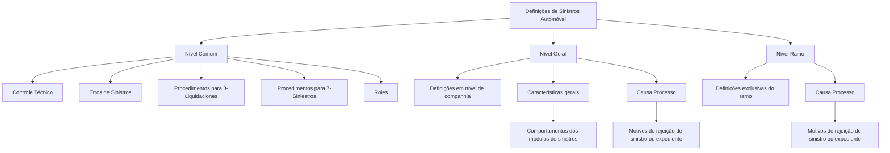

# Documentação de Definição de Sinistros (Automóvel) — Módulo de Controle Técnico

## 1. Metadados do Documento
- **Arquivo de Origem:** Não identificado
- **Tipo de Documento:** Especificação Técnica
- **Domínio / Sistema:** Sinistros (Automóvel) — Módulo Controle Técnico
- **Público-Alvo:** Desenvolvedores, Arquitetos, Operação e Negócio
- **Data/Versão Identificada:** Não identificada

---

## 2. Resumo Executivo & Contexto de Negócio

O documento apresenta definições para o domínio de **Sinistros (Automóvel)**, especificamente no contexto do **Módulo Controle Técnico**. O conteúdo organiza elementos necessários para a definição do módulo e diferencia conceitos comuns de definições exclusivas de uma companhia ou de um ramo.

No nível **Comum**, o documento indica que existem definições não exclusivas do módulo de sinistros, mas necessárias para realizar sua configuração ou definição. Entre os itens citados estão controle técnico, erros de sinistros, procedimentos para os sistemas **3-Liquidaciones** e **7-Siniestros**, além de roles.

O nível **Geral** contém definições realizadas no âmbito de companhia. Nesse nível, as características gerais do módulo de sinistros determinam comportamentos dos módulos de sinistros. Também são citadas causas de processo, utilizadas para catalogar os motivos de rejeição de um sinistro ou de um expediente.

O nível **Ramo** concentra definições exclusivas do ramo que está sendo configurado. O documento volta a citar a causa de processo como mecanismo de catalogação dos motivos pelos quais se deseja rejeitar um sinistro ou um expediente. Não há detalhamento adicional sobre regras de priorização, contratos de integração, métodos HTTP, estruturas de dados ou responsabilidades específicas dos roles.

---

## 3. Arquitetura, Componentes & Tecnologias Envolvidas

Os elementos identificados no documento são:

- **Módulo Controle Técnico:** Contexto no qual são apresentadas as definições de sinistros.
- **Sinistros (Automóvel):** Domínio funcional abordado.
- **Nível Comum:** Agrupa definições necessárias, mas não exclusivas do módulo de sinistros.
- **Nível Geral:** Agrupa definições em nível de companhia.
- **Nível Ramo:** Agrupa definições exclusivas do ramo definido.
- **3-Liquidaciones:** Sistema citado em procedimentos relacionados a sinistros.
- **7-Siniestros:** Sistema citado em procedimentos relacionados a sinistros.
- **Controle Técnico:** Item citado entre as definições comuns.
- **Erros de Sinistros:** Item citado no contexto de controle técnico.
- **Roles:** Item citado entre as definições comuns.
- **Características:** Determinam comportamentos dos módulos de sinistros.
- **Causa Processo:** Cataloga motivos para rejeição de sinistro ou expediente.



> **Nota de Análise:** O documento cita os sistemas **3-Liquidaciones** e **7-Siniestros**, mas não descreve interfaces, fluxos de integração, tecnologias, métodos HTTP, contratos JSON ou responsabilidades técnicas desses sistemas.

---

## 4. Regras de Negócio, Especificações Funcionais & Processos

### Organização das definições por nível

1. **Nível Comum**
   - Contém definições que não são exclusivas do módulo de sinistros.
   - Essas definições são necessárias para poder realizar a definição do módulo.
   - Entre as definições mencionadas estão:
     - Controle técnico.
     - Erros de sinistros.
     - Procedimentos para os sistemas 3-Liquidaciones e 7-Siniestros.
     - Roles.

2. **Nível Geral**
   - Contém definições em nível de companhia.
   - As características gerais do módulo de sinistros determinam comportamentos dos módulos de sinistros.
   - A causa de processo permite catalogar motivos para rejeitar um sinistro ou um expediente.

3. **Nível Ramo**
   - Contém definições exclusivas do ramo que está sendo definido.
   - A causa de processo permite catalogar os motivos pelos quais se deseja rejeitar um sinistro ou um expediente.

### Regra funcional identificada: causa de processo

| Regra | Condição / Aplicação | Resultado |
| :--- | :--- | :--- |
| Catalogação de causas de processo | Quando for necessário registrar o motivo de rejeição de um sinistro ou expediente | A causa de processo classifica o motivo de rejeição |
| Escopo geral | Definições em nível de companhia | A causa de processo pode ser definida no contexto da companhia |
| Escopo de ramo | Definições exclusivas do ramo definido | A causa de processo pode ser utilizada no contexto do ramo |

> **Nota de Análise:** O documento não especifica a lista de causas de processo, códigos, obrigatoriedade de preenchimento, critérios de rejeição, transições de estado, responsáveis pela aprovação ou regras de precedência entre definições de companhia e de ramo.

---

## 5. Tabelas de Parâmetros, Ambientes e Estruturas de Dados

| Item / Parâmetro | Descrição / Função | Tipo / Valores / Formato | Ambiente / Observações |
| :--- | :--- | :--- | :--- |
| Controle Técnico | Item citado entre as definições comuns necessárias para a definição do módulo de sinistros | Não especificado | Nível Comum |
| Erros de Sinistros | Erros de sinistros a serem definidos no contexto de controle técnico | Não especificado | Nível Comum |
| Procedimentos 3-Liquidaciones | Procedimentos para o sistema identificado como 3-Liquidaciones | Não especificado | Nível Comum |
| Procedimentos 7-Siniestros | Procedimentos para o sistema identificado como 7-Siniestros | Não especificado | Nível Comum |
| Roles | Item citado entre as definições comuns | Não especificado | Nível Comum |
| Características Gerais | Determinam comportamentos dos módulos de sinistros | Não especificado | Nível Geral, em nível de companhia |
| Causa Processo | Cataloga motivos para rejeitar um sinistro ou um expediente | Não especificado | Citada nos níveis Geral e Ramo |
| Ramo | Contexto de definições exclusivas do ramo em configuração | Não especificado | Nível Ramo |
| Sinistro | Entidade que pode ser rejeitada mediante uma causa de processo | Não especificado | Domínio de Sinistros (Automóvel) |
| Expediente | Entidade que pode ser rejeitada mediante uma causa de processo | Não especificado | Domínio de Sinistros (Automóvel) |

> **Nota de Análise:** O documento não apresenta URLs, ambientes, servidores, portas, variáveis de configuração, caminhos de log, esquemas de dados ou tipos técnicos dos campos.

---

## 6. Bateria de Perguntas & Respostas para RAG (FAQ Sintético)

### P1: Qual é o domínio funcional abordado pelo documento?
**R:** O documento aborda o domínio de **Sinistros (Automóvel)**, no contexto das definições do **Módulo Controle Técnico**.

### P2: O que é definido no nível Comum do módulo de sinistros?
**R:** O nível Comum contém definições que não são exclusivas do módulo de sinistros, mas são necessárias para realizar sua definição. O documento cita controle técnico, erros de sinistros, procedimentos para os sistemas 3-Liquidaciones e 7-Siniestros, além de roles.

### P3: Quais sistemas são mencionados nos procedimentos do nível Comum?
**R:** O documento menciona procedimentos para os sistemas **3-Liquidaciones** e **7-Siniestros**. Não há detalhamento adicional sobre a finalidade, integração ou contratos técnicos desses sistemas.

### P4: O que caracteriza o nível Geral das definições?
**R:** O nível Geral contém definições realizadas em nível de companhia. Nesse nível, as características gerais do módulo de sinistros determinam comportamentos dos módulos de sinistros.

### P5: Para que serve a causa de processo?
**R:** A causa de processo permite catalogar os motivos pelos quais se deseja rejeitar um sinistro ou um expediente.

### P6: Em quais níveis a causa de processo é citada?
**R:** A causa de processo é citada nos níveis **Geral** e **Ramo**. No nível Geral, está associada a definições de companhia; no nível Ramo, aparece no contexto de definições exclusivas do ramo configurado.

### P7: O que é definido no nível Ramo?
**R:** O nível Ramo contém definições exclusivas do ramo que está sendo definido. O documento menciona a causa de processo como recurso para catalogar motivos de rejeição de sinistros ou expedientes nesse contexto.

### P8: As características gerais do módulo de sinistros possuem qual efeito?
**R:** As características gerais do módulo de sinistros determinam comportamentos dos módulos de sinistros, conforme indicado no nível Geral de definições em âmbito de companhia.

### P9: O documento detalha quais são os roles do módulo de sinistros?
**R:** Não. O documento apenas cita roles entre as definições do nível Comum, sem informar nomes, permissões, responsabilidades ou matriz de acesso.

### P10: O documento informa códigos ou valores possíveis para causas de processo?
**R:** Não. O documento informa apenas que a causa de processo cataloga motivos de rejeição de sinistro ou expediente, sem apresentar códigos, descrições, valores permitidos ou regras de manutenção.

### P11: Há especificação de APIs ou métodos HTTP para 3-Liquidaciones e 7-Siniestros?
**R:** Não. O documento cita procedimentos para 3-Liquidaciones e 7-Siniestros, mas não informa APIs, métodos HTTP, URLs, payloads, autenticação ou contratos de integração.

### P12: O documento estabelece regras de prioridade entre definições gerais e definições de ramo?
**R:** Não. O conteúdo diferencia definições em nível de companhia e definições exclusivas de ramo, mas não define prioridade, herança, sobrescrita ou resolução de conflitos entre esses níveis.

---

## 7. Glossário de Termos, Siglas & Conceitos-Chave

- **Sinistros:** Domínio funcional tratado no documento, especificamente para Automóvel.
- **Automóvel:** Contexto ou ramo associado ao título do documento de definição de sinistros.
- **Controle Técnico:** Elemento citado entre as definições comuns necessárias para configurar ou definir o módulo de sinistros.
- **3-Liquidaciones:** Sistema citado em procedimentos relacionados ao nível Comum; o documento não expande a denominação.
- **7-Siniestros:** Sistema citado em procedimentos relacionados ao nível Comum; o documento não expande a denominação.
- **Roles:** Elemento citado entre as definições do nível Comum; permissões e responsabilidades não foram detalhadas.
- **Características Gerais:** Definições que determinam comportamentos dos módulos de sinistros no nível de companhia.
- **Causa Processo:** Mecanismo para catalogar motivos de rejeição de um sinistro ou de um expediente.
- **Expediente:** Entidade citada como passível de rejeição mediante uma causa de processo.
- **Ramo:** Nível que concentra definições exclusivas do ramo que está sendo definido.
- **Companhia:** Escopo organizacional usado pelo documento para as definições do nível Geral.

---

## 8. Notas Críticas, Riscos & Limitações

- O documento possui conteúdo resumido e não detalha procedimentos operacionais para os sistemas 3-Liquidaciones e 7-Siniestros.
- Não há definição dos roles, das permissões associadas ou da matriz de acesso.
- Não são apresentados códigos, listas, atributos ou critérios de manutenção das causas de processo.
- Não há regras explícitas para rejeição de sinistros ou expedientes além da indicação de que a causa de processo cataloga seus motivos.
- Não são fornecidas integrações, APIs, URLs, ambientes, versões, tecnologias, contratos de dados ou mecanismos de autenticação.
- Não é especificada a relação de precedência entre configurações de nível Geral, em nível de companhia, e configurações de nível Ramo.
- O texto não identifica data, versão, autor, arquivo de origem ou responsável pelo documento.

---

## 9. Conteúdo Bruto Estruturado (Referência Fiel)

```text
--- [PÁGINA 1 DE 2] ---

DOCUMENTACIÓN de DEFINICIÓN de
SINIESTROS (Automóvil)
DEFINICIONES - MÓDULO CONTROL TÉCNICO
COMÚN
En este nivel se encuentran definiciones que NO son exclusivas del
módulo de siniestros, pero son necesarias para poder realizar la
definición. Entre otras definiciones se encuentra:
CONTROL TÉCNICO
Definir los errores de Siniestros, los procedimientos para los sistemas 3-Liquidaciones y 7-
Siniestros, Roles...
GENERAL
 /
 CF
Home Solutions APIs Documentation Zeus
EN


--- [PÁGINA 2 DE 2] ---

En este nivel se encuentran definiciones a nivel de compañía .
CARACTERÍSTICAS
Características Generales del módulo de
siniestros, determina comportamientos de los
módulos de siniestros
CAUSA PROCESO
Permite catalogar los motivos por los que se
quiere rechazar un siniestro o un expediente
RAMO
Son exclusivas del ramo que se está definiendo.
CAUSA PROCESO
Permite catalogar los motivos por los que se quiere rechazar un siniestro o un expediente
```
